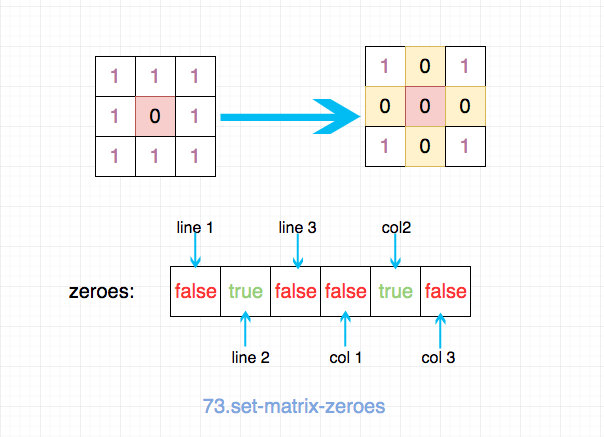
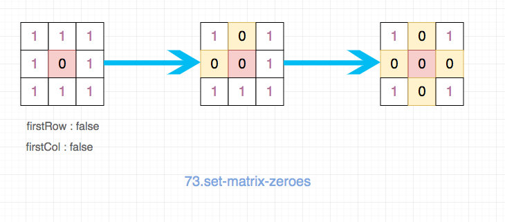

# 0073. 矩阵置零

## 题目地址(73. 矩阵置零)

<https://leetcode-cn.com/problems/set-matrix-zeroes/>

## 题目描述

```
<pre class="calibre18">```
给定一个 m x n 的矩阵，如果一个元素为 0，则将其所在行和列的所有元素都设为 0。请使用原地算法。

示例 1:

输入: 
[
  [1,1,1],
  [1,0,1],
  [1,1,1]
]
输出: 
[
  [1,0,1],
  [0,0,0],
  [1,0,1]
]
示例 2:

输入: 
[
  [0,1,2,0],
  [3,4,5,2],
  [1,3,1,5]
]
输出: 
[
  [0,0,0,0],
  [0,4,5,0],
  [0,3,1,0]
]
进阶:

一个直接的解决方案是使用  O(mn) 的额外空间，但这并不是一个好的解决方案。
一个简单的改进方案是使用 O(m + n) 的额外空间，但这仍然不是最好的解决方案。
你能想出一个常数空间的解决方案吗？

```
```

## 前置知识

- 状态压缩

## 公司

- 阿里
- 百度
- 字节

## 思路

符合直觉的想法是，使用一个 m + n 的数组来表示每一行每一列是否”全部是 0“， 先遍历一遍去构建这样的 m + n 数组，然后根据这个 m + n 数组去修改 matrix 即可。



这样的时间复杂度 O(m \* n), 空间复杂度 O(m + n).

代码如下：

```
<pre class="calibre18">```
<span class="hljs-keyword">var</span> setZeroes = <span class="hljs-function"><span class="hljs-keyword">function</span> (<span class="hljs-params">matrix</span>) </span>{
  <span class="hljs-keyword">if</span> (matrix.length === <span class="hljs-params">0</span>) <span class="hljs-keyword">return</span> matrix;
  <span class="hljs-keyword">const</span> m = matrix.length;
  <span class="hljs-keyword">const</span> n = matrix[<span class="hljs-params">0</span>].length;
  <span class="hljs-keyword">const</span> zeroes = <span class="hljs-params">Array</span>(m + n).fill(<span class="hljs-params">false</span>);

  <span class="hljs-keyword">for</span> (<span class="hljs-keyword">let</span> i = <span class="hljs-params">0</span>; i < m; i++) {
    <span class="hljs-keyword">for</span> (<span class="hljs-keyword">let</span> j = <span class="hljs-params">0</span>; j < n; j++) {
      <span class="hljs-keyword">const</span> item = matrix[i][j];

      <span class="hljs-keyword">if</span> (item === <span class="hljs-params">0</span>) {
        zeroes[i] = <span class="hljs-params">true</span>;
        zeroes[m + j] = <span class="hljs-params">true</span>;
      }
    }
  }

  <span class="hljs-keyword">for</span> (<span class="hljs-keyword">let</span> i = <span class="hljs-params">0</span>; i < m; i++) {
    <span class="hljs-keyword">if</span> (zeroes[i]) {
      matrix[i] = <span class="hljs-params">Array</span>(n).fill(<span class="hljs-params">0</span>);
    }
  }

  <span class="hljs-keyword">for</span> (<span class="hljs-keyword">let</span> i = <span class="hljs-params">0</span>; i < n; i++) {
    <span class="hljs-keyword">if</span> (zeroes[m + i]) {
      <span class="hljs-keyword">for</span> (<span class="hljs-keyword">let</span> j = <span class="hljs-params">0</span>; j < m; j++) {
        matrix[j][i] = <span class="hljs-params">0</span>;
      }
    }
  }

  <span class="hljs-keyword">return</span> matrix;
};

```
```

但是这道题目还有一个 follow up， 要求使用 O(1)的时间复杂度。因此上述的方法就不行了。 但是我们要怎么去存取这些信息（哪一行哪一列应该全部为 0）呢？

一种思路是使用第一行第一列的数据来代替上述的 zeros 数组。 这样我们就不必借助额外的存储空间，空间复杂度自然就是 O(1)了。

由于我们不能先操作第一行和第一列， 因此我们需要记录下”第一行和第一列是否全是 0“这样的一个数据，最后根据这个信息去 修改第一行和第一列。

具体步骤如下：

- 记录下”第一行和第一列是否全是 0“这样的一个数据
- 遍历除了第一行和第一列之外的所有的数据，如果是 0，那就更新第一行第一列中对应的元素为 0> 你可以把第一行第一列看成我们上面那种解法使用的 m + n 数组。
- 根据第一行第一列的数据，更新 matrix
- 最后根据我们最开始记录的”第一行和第一列是否全是 0“去更新第一行和第一列即可



## 关键点

- 使用第一行和第一列来替代我们 m + n 数组
- 先记录下”第一行和第一列是否全是 0“这样的一个数据，否则会因为后续对第一行第一列的更新造成数据丢失
- 最后更新第一行第一列

## 代码

- 语言支持：JS，Python3

```
<pre class="calibre18">```
<span class="hljs-title">/*
 * @lc app=leetcode id=73 lang=javascript
 *
 * [73] Set Matrix Zeroes
 */</span>
<span class="hljs-title">/**
 * @param {number[][]} matrix
 * @return {void} Do not return anything, modify matrix in-place instead.
 */</span>
<span class="hljs-keyword">var</span> setZeroes = <span class="hljs-function"><span class="hljs-keyword">function</span> (<span class="hljs-params">matrix</span>) </span>{
  <span class="hljs-keyword">if</span> (matrix.length === <span class="hljs-params">0</span>) <span class="hljs-keyword">return</span> matrix;
  <span class="hljs-keyword">const</span> m = matrix.length;
  <span class="hljs-keyword">const</span> n = matrix[<span class="hljs-params">0</span>].length;

  <span class="hljs-title">// 时间复杂度 O(m * n), 空间复杂度 O(1)</span>
  <span class="hljs-keyword">let</span> firstRow = <span class="hljs-params">false</span>; <span class="hljs-title">// 第一行是否应该全部为0</span>
  <span class="hljs-keyword">let</span> firstCol = <span class="hljs-params">false</span>; <span class="hljs-title">// 第一列是否应该全部为0</span>

  <span class="hljs-keyword">for</span> (<span class="hljs-keyword">let</span> i = <span class="hljs-params">0</span>; i < m; i++) {
    <span class="hljs-keyword">for</span> (<span class="hljs-keyword">let</span> j = <span class="hljs-params">0</span>; j < n; j++) {
      <span class="hljs-keyword">const</span> item = matrix[i][j];
      <span class="hljs-keyword">if</span> (item === <span class="hljs-params">0</span>) {
        <span class="hljs-keyword">if</span> (i === <span class="hljs-params">0</span>) {
          firstRow = <span class="hljs-params">true</span>;
        }
        <span class="hljs-keyword">if</span> (j === <span class="hljs-params">0</span>) {
          firstCol = <span class="hljs-params">true</span>;
        }
        matrix[<span class="hljs-params">0</span>][j] = <span class="hljs-params">0</span>;
        matrix[i][<span class="hljs-params">0</span>] = <span class="hljs-params">0</span>;
      }
    }
  }

  <span class="hljs-keyword">for</span> (<span class="hljs-keyword">let</span> i = <span class="hljs-params">1</span>; i < m; i++) {
    <span class="hljs-keyword">for</span> (<span class="hljs-keyword">let</span> j = <span class="hljs-params">1</span>; j < n; j++) {
      <span class="hljs-keyword">const</span> item = matrix[i][j];
      <span class="hljs-keyword">if</span> (matrix[<span class="hljs-params">0</span>][j] == <span class="hljs-params">0</span> || matrix[i][<span class="hljs-params">0</span>] == <span class="hljs-params">0</span>) {
        matrix[i][j] = <span class="hljs-params">0</span>;
      }
    }
  }

  <span class="hljs-title">// 最后处理第一行和第一列</span>

  <span class="hljs-keyword">if</span> (firstRow) {
    <span class="hljs-keyword">for</span> (<span class="hljs-keyword">let</span> i = <span class="hljs-params">0</span>; i < n; i++) {
      matrix[<span class="hljs-params">0</span>][i] = <span class="hljs-params">0</span>;
    }
  }

  <span class="hljs-keyword">if</span> (firstCol) {
    <span class="hljs-keyword">for</span> (<span class="hljs-keyword">let</span> i = <span class="hljs-params">0</span>; i < m; i++) {
      matrix[i][<span class="hljs-params">0</span>] = <span class="hljs-params">0</span>;
    }
  }

  <span class="hljs-keyword">return</span> matrix;
};

```
```

Python3 Code:

直接修改第一行和第一列为 0 的解法：

```
<pre class="calibre18">```
<span class="hljs-class"><span class="hljs-keyword">class</span> <span class="hljs-title">Solution</span>:</span>
    <span class="hljs-function"><span class="hljs-keyword">def</span> <span class="hljs-title">setZeroes</span><span class="hljs-params">(self, matrix: List[List[int]])</span> -> <span class="hljs-keyword">None</span>:</span>
        <span class="hljs-string">"""
        Do not return anything, modify matrix in-place instead.
        """</span>
        <span class="hljs-function"><span class="hljs-keyword">def</span> <span class="hljs-title">setRowZeros</span><span class="hljs-params">(matrix: List[List[int]], i:int)</span> -> <span class="hljs-keyword">None</span>:</span>
            C = len(matrix[<span class="hljs-params">0</span>])
            matrix[i] = [<span class="hljs-params">0</span>] * C

        <span class="hljs-function"><span class="hljs-keyword">def</span> <span class="hljs-title">setColZeros</span><span class="hljs-params">(matrix: List[List[int]], j:int)</span> -> <span class="hljs-keyword">None</span>:</span>
            R = len(matrix)
            <span class="hljs-keyword">for</span> i <span class="hljs-keyword">in</span> range(R):
                matrix[i][j] = <span class="hljs-params">0</span>

        isCol = <span class="hljs-keyword">False</span>
        R = len(matrix)
        C = len(matrix[<span class="hljs-params">0</span>])

        <span class="hljs-keyword">for</span> i <span class="hljs-keyword">in</span> range(R):
            <span class="hljs-keyword">if</span> matrix[i][<span class="hljs-params">0</span>] == <span class="hljs-params">0</span>:
                isCol = <span class="hljs-keyword">True</span>
            <span class="hljs-keyword">for</span> j <span class="hljs-keyword">in</span> range(<span class="hljs-params">1</span>, C):
                <span class="hljs-keyword">if</span> matrix[i][j] == <span class="hljs-params">0</span>:
                    matrix[i][<span class="hljs-params">0</span>] = <span class="hljs-params">0</span>
                    matrix[<span class="hljs-params">0</span>][j] = <span class="hljs-params">0</span>
        <span class="hljs-keyword">for</span> j <span class="hljs-keyword">in</span> range(<span class="hljs-params">1</span>, C):
            <span class="hljs-keyword">if</span> matrix[<span class="hljs-params">0</span>][j] == <span class="hljs-params">0</span>:
                setColZeros(matrix, j)

        <span class="hljs-keyword">for</span> i <span class="hljs-keyword">in</span> range(R):
            <span class="hljs-keyword">if</span> matrix[i][<span class="hljs-params">0</span>] == <span class="hljs-params">0</span>:
                setRowZeros(matrix, i)

        <span class="hljs-keyword">if</span> isCol:
            setColZeros(matrix, <span class="hljs-params">0</span>)

```
```

另一种方法是用一个特殊符合标记需要改变的结果，只要这个特殊标记不在我们的题目数据范围（0 和 1）即可，这里用 None。

```
<pre class="calibre18">```
<span class="hljs-class"><span class="hljs-keyword">class</span> <span class="hljs-title">Solution</span>:</span>
    <span class="hljs-function"><span class="hljs-keyword">def</span> <span class="hljs-title">setZeroes</span><span class="hljs-params">(self, matrix: List[List[int]])</span> -> <span class="hljs-keyword">None</span>:</span>
        <span class="hljs-string">"""
        这题要解决的问题是，必须有个地方记录判断结果，但又不能影响下一步的判断条件；
        直接改为0的话，会影响下一步的判断条件；
        因此，有一种思路是先改为None，最后再将None改为0；
        从条件上看，如果可以将第一行、第二行作为记录空间，那么，用None应该也不算违背题目条件；
        """</span>
        rows = len(matrix)
        cols = len(matrix[<span class="hljs-params">0</span>])
        <span class="hljs-title"># 遍历矩阵，用None记录要改的地方，注意如果是0则要保留，否则会影响下一步判断</span>
        <span class="hljs-keyword">for</span> r <span class="hljs-keyword">in</span> range(rows):
            <span class="hljs-keyword">for</span> c <span class="hljs-keyword">in</span> range(cols):
                <span class="hljs-keyword">if</span> matrix[r][c] <span class="hljs-keyword">is</span> <span class="hljs-keyword">not</span> <span class="hljs-keyword">None</span> <span class="hljs-keyword">and</span> matrix[r][c] == <span class="hljs-params">0</span>:
                    <span class="hljs-title"># 改值</span>
                    <span class="hljs-keyword">for</span> i <span class="hljs-keyword">in</span> range(rows):
                        matrix[i][c] = <span class="hljs-keyword">None</span> <span class="hljs-keyword">if</span> matrix[i][c] != <span class="hljs-params">0</span> <span class="hljs-keyword">else</span> <span class="hljs-params">0</span>
                    <span class="hljs-keyword">for</span> j <span class="hljs-keyword">in</span> range(cols):
                        matrix[r][j] = <span class="hljs-keyword">None</span> <span class="hljs-keyword">if</span> matrix[r][j] != <span class="hljs-params">0</span> <span class="hljs-keyword">else</span> <span class="hljs-params">0</span>
        <span class="hljs-title"># 再次遍历，将None改为0</span>
        <span class="hljs-keyword">for</span> r <span class="hljs-keyword">in</span> range(rows):
            <span class="hljs-keyword">for</span> c <span class="hljs-keyword">in</span> range(cols):
                <span class="hljs-keyword">if</span> matrix[r][c] <span class="hljs-keyword">is</span> <span class="hljs-keyword">None</span>:
                    matrix[r][c] = <span class="hljs-params">0</span>

```
```

**复杂度分析**

- 时间复杂度：O(M∗N)O(M \* N)O(M∗N)
- 空间复杂度：O(1)O(1)O(1)

大家对此有何看法，欢迎给我留言，我有时间都会一一查看回答。更多算法套路可以访问我的 LeetCode 题解仓库：<https://github.com/azl397985856/leetcode> 。 目前已经 37K star 啦。 大家也可以关注我的公众号《力扣加加》带你啃下算法这块硬骨头。 

## 扩展

为什么选择第一行第一列，选择其他行和列可以么？为什么？