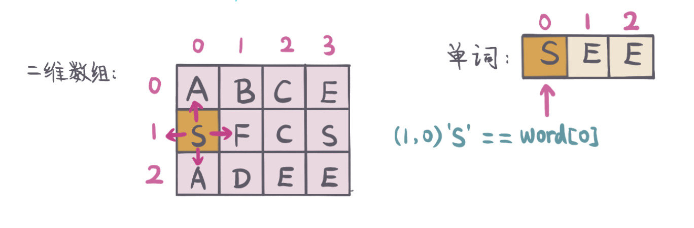
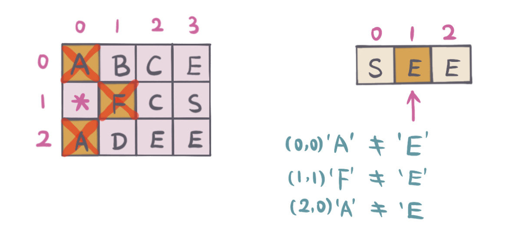
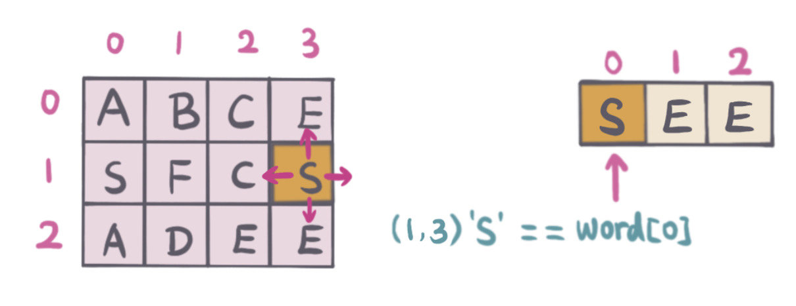
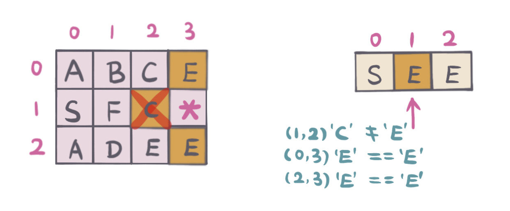
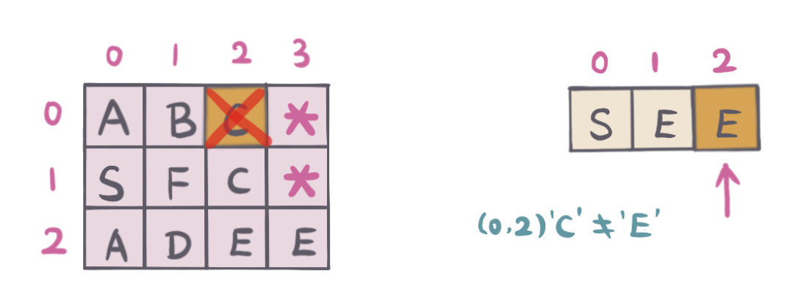
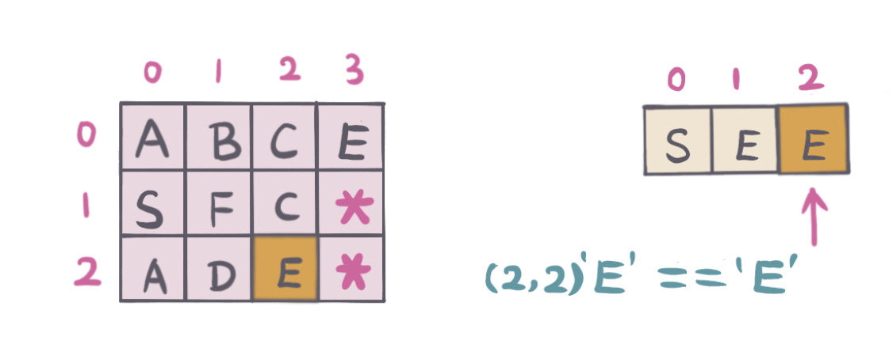
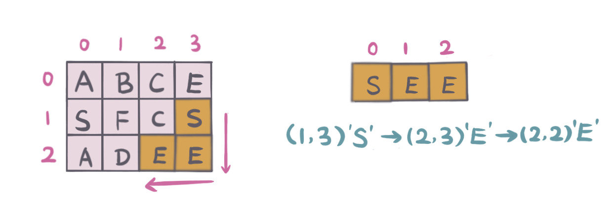

# 0079. 单词搜索

## 题目地址(79. 单词搜索)

<https://leetcode-cn.com/problems/word-search/>

## 题目描述

```
<pre class="calibre18">```
给定一个二维网格和一个单词，找出该单词是否存在于网格中。

单词必须按照字母顺序，通过相邻的单元格内的字母构成，其中“相邻”单元格是那些水平相邻或垂直相邻的单元格。同一个单元格内的字母不允许被重复使用。


示例:

board =
[
  ['A','B','C','E'],
  ['S','F','C','S'],
  ['A','D','E','E']
]

给定 word = "ABCCED", 返回 true
给定 word = "SEE", 返回 true
给定 word = "ABCB", 返回 false


提示：

board 和 word 中只包含大写和小写英文字母。
1 <= board.length <= 200
1 <= board[i].length <= 200
1 <= word.length <= 10^3

```
```

## 前置知识

- 回溯

## 公司

- 阿里
- 腾讯
- 百度
- 字节

## 思路

在 2D 表中搜索是否有满足给定单词的字符组合，要求所有字符都是相邻的（方向不限). 题中也没有要求字符的起始和结束位置。

在起始位置不确定的情况下，扫描二维数组，找到字符跟给定单词的第一个字符相同的，四个方向（上，下，左，右）分别 DFS 搜索， 如果任意方向满足条件，则返回结果。不满足，回溯，重新搜索。

举例说明：如图二维数组，单词："SEE"

```
<pre class="calibre18">```
1. 扫描二维数组，找到board[1,0] = word[0]，匹配单词首字母。
2. 做DFS（上，下，左，右 四个方向）

如下图：

```
```



起始位置（1，0），判断相邻的字符是否匹配单词下一个字符 `E`.

```
<pre class="calibre18">```
1. 标记当前字符（1，0）为已经访问过，board[1][0] = '*'
2. 上（0，0）字符为 'A' 不匹配,
3. 下（2，0）字符为 'A'，不匹配,
4. 左（-1，0）超越边界，不匹配,
5. 右（1，1）字符 'F'，不匹配

如下图：

```
```



由于从起始位置 DFS 都不满足条件，所以

```
<pre class="calibre18">```
1. 回溯，标记起始位置（1，0）为未访问。board[1][0] = 'S'.
2. 然后继续扫描二维数组，找到下一个起始位置（1，3）

如下图：

```
```



起始位置（1，3），判断相邻的字符是否匹配单词下一个字符 `E`.

```
<pre class="calibre18">```
1. 标记当前字符（1, 3）为已经访问过，board[1][3] = '*'
2. 上（0，3）字符为 'E', 匹配, 继续DFS搜索（参考位置为（0，3）位置DFS搜索步骤描述）
3. 下（2，3）字符为 'E'，匹配, #2匹配，先进行#2 DFS搜索，由于#2 DFS搜索没有找到与单词匹配，继续DFS搜索（参考位置为（2，3）DFS搜索步骤描述）
4. 左（1，2）字符为 'C'，不匹配,
5. 右（1，4）超越边界，不匹配

如下图：

```
```



位置（0，3）满足条件，继续 DFS，判断相邻的字符是否匹配单词下一个字符 `E`

```
<pre class="calibre18">```
1. 标记当前字符（0，3）为已经访问过，board[0][3] = '*'
2. 上 （-1，3）超越边界，不匹配
3. 下（1，3）已经访问过，
4. 左（0，2）字符为 'C'，不匹配
5. 右（1，4）超越边界，不匹配

如下图

```
```



从位置（0，3）DFS 不满足条件，继续位置（2，3）DFS 搜索

```
<pre class="calibre18">```
1. 回溯，标记起始位置（0，3）为未访问。board[0][3] = 'E'.
2. 回到满足条件的位置（2，3），继续DFS搜索，判断相邻的字符是否匹配单词下一个字符 'E'
3. 上 (1，3）已访问过
4. 下（3，3）超越边界，不匹配
5. 左（2，2）字符为 'E'，匹配
6. 右（2，4）超越边界，不匹配

如下图：

```
```



单词匹配完成，满足条件，返回 `True`. 

#### 复杂度分析

- *时间复杂度：*`O(m*n) - m 是二维数组行数， n 是二维数组列数`
- *空间复杂度：*`O(1) - 这里在原数组中标记当前访问过，没有用到额外空间`

> **注意**：如果用 Set 或者是 boolean\[\]\[\]来标记字符位置是否已经访问过，需要额外的空间 `O(m*n)`.

## 关键点分析

- 遍历二维数组的每一个点，找到起始点相同的字符，做 DFS
- DFS 过程中，要记录已经访问过的节点，防止重复遍历，这里（Java Code 中）用 `*` 表示当前已经访问过，也可以用 Set 或者是 boolean\[\]\[\]数组记录访问过的节点位置。
- 是否匹配当前单词中的字符，不符合回溯，这里记得把当前 `*` 重新设为当前字符。如果用 Set 或者是 boolean\[\]\[\]数组，记得把当前位置重设为没有访问过。

## 代码 (`Java/Javascript/Python3`)

*Java Code*

```
<pre class="calibre18">```
<span class="hljs-keyword">public</span> <span class="hljs-class"><span class="hljs-keyword">class</span> <span class="hljs-title">LC79WordSearch</span> </span>{
  <span class="hljs-function"><span class="hljs-keyword">public</span> <span class="hljs-keyword">boolean</span> <span class="hljs-title">exist</span><span class="hljs-params">(<span class="hljs-keyword">char</span>[][] board, String word)</span> </span>{
    <span class="hljs-keyword">if</span> (board == <span class="hljs-keyword">null</span> || word == <span class="hljs-keyword">null</span>) <span class="hljs-keyword">return</span> <span class="hljs-keyword">false</span>;
    <span class="hljs-keyword">if</span> (word.length() == <span class="hljs-params">0</span>) <span class="hljs-keyword">return</span> <span class="hljs-keyword">true</span>;
    <span class="hljs-keyword">if</span> (board.length == <span class="hljs-params">0</span>) <span class="hljs-keyword">return</span> <span class="hljs-keyword">false</span>;
    <span class="hljs-keyword">int</span> rows = board.length;
    <span class="hljs-keyword">int</span> cols = board[<span class="hljs-params">0</span>].length;
    <span class="hljs-keyword">for</span> (<span class="hljs-keyword">int</span> r = <span class="hljs-params">0</span>; r < rows; r++) {
      <span class="hljs-keyword">for</span> (<span class="hljs-keyword">int</span> c = <span class="hljs-params">0</span>; c < cols; c++) {
        <span class="hljs-title">// scan board, start with word first character</span>
        <span class="hljs-keyword">if</span> (board[r][c] == word.charAt(<span class="hljs-params">0</span>)) {
          <span class="hljs-keyword">if</span> (helper(board, word, r, c, <span class="hljs-params">0</span>)) {
            <span class="hljs-keyword">return</span> <span class="hljs-keyword">true</span>;
          }
        }
      }
    }
    <span class="hljs-keyword">return</span> <span class="hljs-keyword">false</span>;
  }

  <span class="hljs-function"><span class="hljs-keyword">private</span> <span class="hljs-keyword">boolean</span> <span class="hljs-title">helper</span><span class="hljs-params">(<span class="hljs-keyword">char</span>[][] board, String word, <span class="hljs-keyword">int</span> r, <span class="hljs-keyword">int</span> c, <span class="hljs-keyword">int</span> start)</span> </span>{
    <span class="hljs-title">// already match word all characters, return true</span>
    <span class="hljs-keyword">if</span> (start == word.length()) <span class="hljs-keyword">return</span> <span class="hljs-keyword">true</span>;
    <span class="hljs-keyword">if</span> (!isValid(board, r, c) ||
        board[r][c] != word.charAt(start)) <span class="hljs-keyword">return</span> <span class="hljs-keyword">false</span>;
    <span class="hljs-title">// mark visited</span>
    board[r][c] = <span class="hljs-string">'*'</span>;
    <span class="hljs-keyword">boolean</span> res = helper(board, word, r - <span class="hljs-params">1</span>, c, start + <span class="hljs-params">1</span>) <span class="hljs-title">// 上</span>
        ||  helper(board, word, r + <span class="hljs-params">1</span>, c, start + <span class="hljs-params">1</span>)       <span class="hljs-title">// 下</span>
        ||  helper(board, word, r, c - <span class="hljs-params">1</span>, start + <span class="hljs-params">1</span>)       <span class="hljs-title">// 左</span>
        ||  helper(board, word, r, c + <span class="hljs-params">1</span>, start + <span class="hljs-params">1</span>);      <span class="hljs-title">// 右</span>
    <span class="hljs-title">// backtracking to start position</span>
    board[r][c] = word.charAt(start);
    <span class="hljs-keyword">return</span> res;
  }

  <span class="hljs-function"><span class="hljs-keyword">private</span> <span class="hljs-keyword">boolean</span> <span class="hljs-title">isValid</span><span class="hljs-params">(<span class="hljs-keyword">char</span>[][] board, <span class="hljs-keyword">int</span> r, <span class="hljs-keyword">int</span> c)</span> </span>{
    <span class="hljs-keyword">return</span> r >= <span class="hljs-params">0</span> && r < board.length && c >= <span class="hljs-params">0</span> && c < board[<span class="hljs-params">0</span>].length;
  }
}

```
```

*Python3 Code*

```
<pre class="calibre18">```
<span class="hljs-class"><span class="hljs-keyword">class</span> <span class="hljs-title">Solution</span>:</span>
    <span class="hljs-function"><span class="hljs-keyword">def</span> <span class="hljs-title">exist</span><span class="hljs-params">(self, board: List[List[str]], word: str)</span> -> bool:</span>
        m = len(board)
        n = len(board[<span class="hljs-params">0</span>])

        <span class="hljs-function"><span class="hljs-keyword">def</span> <span class="hljs-title">dfs</span><span class="hljs-params">(board, r, c, word, index)</span>:</span>
            <span class="hljs-keyword">if</span> index == len(word):
                <span class="hljs-keyword">return</span> <span class="hljs-keyword">True</span>
            <span class="hljs-keyword">if</span> r < <span class="hljs-params">0</span> <span class="hljs-keyword">or</span> r >= m <span class="hljs-keyword">or</span> c < <span class="hljs-params">0</span> <span class="hljs-keyword">or</span> c >= n <span class="hljs-keyword">or</span> board[r][c] != word[index]:
                <span class="hljs-keyword">return</span> <span class="hljs-keyword">False</span>
            board[r][c] = <span class="hljs-string">'*'</span>
            res = dfs(board, r - <span class="hljs-params">1</span>, c, word, index + <span class="hljs-params">1</span>) <span class="hljs-keyword">or</span> dfs(board, r + <span class="hljs-params">1</span>, c, word, index + <span class="hljs-params">1</span>) <span class="hljs-keyword">or</span> dfs(board, r, c - <span class="hljs-params">1</span>, word, index + <span class="hljs-params">1</span>) <span class="hljs-keyword">or</span> dfs(board, r, c + <span class="hljs-params">1</span>, word, index + <span class="hljs-params">1</span>)
            board[r][c] = word[index]
            <span class="hljs-keyword">return</span> res

        <span class="hljs-keyword">for</span> r <span class="hljs-keyword">in</span> range(m):
            <span class="hljs-keyword">for</span> c <span class="hljs-keyword">in</span> range(n):
                <span class="hljs-keyword">if</span> board[r][c] == word[<span class="hljs-params">0</span>]:
                    <span class="hljs-keyword">if</span> dfs(board, r, c, word, <span class="hljs-params">0</span>):
                        <span class="hljs-keyword">return</span> <span class="hljs-keyword">True</span>

```
```

*Javascript Code* from [**@lucifer**](https://github.com/azl397985856)

```
<pre class="calibre18">```
<span class="hljs-title">/*
 * @lc app=leetcode id=79 lang=javascript
 *
 * [79] Word Search
 */</span>
<span class="hljs-function"><span class="hljs-keyword">function</span> <span class="hljs-title">DFS</span>(<span class="hljs-params">board, row, col, rows, cols, word, cur</span>) </span>{
  <span class="hljs-title">// 边界检查</span>
  <span class="hljs-keyword">if</span> (row >= rows || row < <span class="hljs-params">0</span>) <span class="hljs-keyword">return</span> <span class="hljs-params">false</span>;
  <span class="hljs-keyword">if</span> (col >= cols || col < <span class="hljs-params">0</span>) <span class="hljs-keyword">return</span> <span class="hljs-params">false</span>;

  <span class="hljs-keyword">const</span> item = board[row][col];

  <span class="hljs-keyword">if</span> (item !== word[cur]) <span class="hljs-keyword">return</span> <span class="hljs-params">false</span>;

  <span class="hljs-keyword">if</span> (cur + <span class="hljs-params">1</span> === word.length) <span class="hljs-keyword">return</span> <span class="hljs-params">true</span>;

  <span class="hljs-title">// 如果你用hashmap记录访问的字母， 那么你需要每次backtrack的时候手动清除hashmap，并且需要额外的空间</span>
  <span class="hljs-title">// 这里我们使用一个little trick</span>

  board[row][col] = <span class="hljs-params">null</span>;

  <span class="hljs-title">// 上下左右</span>
  <span class="hljs-keyword">const</span> res =
    DFS(board, row + <span class="hljs-params">1</span>, col, rows, cols, word, cur + <span class="hljs-params">1</span>) ||
    DFS(board, row - <span class="hljs-params">1</span>, col, rows, cols, word, cur + <span class="hljs-params">1</span>) ||
    DFS(board, row, col - <span class="hljs-params">1</span>, rows, cols, word, cur + <span class="hljs-params">1</span>) ||
    DFS(board, row, col + <span class="hljs-params">1</span>, rows, cols, word, cur + <span class="hljs-params">1</span>);

  board[row][col] = item;

  <span class="hljs-keyword">return</span> res;
}
<span class="hljs-title">/**
 * @param {character[][]} board
 * @param {string} word
 * @return {boolean}
 */</span>
<span class="hljs-keyword">var</span> exist = <span class="hljs-function"><span class="hljs-keyword">function</span> (<span class="hljs-params">board, word</span>) </span>{
  <span class="hljs-keyword">if</span> (word.length === <span class="hljs-params">0</span>) <span class="hljs-keyword">return</span> <span class="hljs-params">true</span>;
  <span class="hljs-keyword">if</span> (board.length === <span class="hljs-params">0</span>) <span class="hljs-keyword">return</span> <span class="hljs-params">false</span>;

  <span class="hljs-keyword">const</span> rows = board.length;
  <span class="hljs-keyword">const</span> cols = board[<span class="hljs-params">0</span>].length;

  <span class="hljs-keyword">for</span> (<span class="hljs-keyword">let</span> i = <span class="hljs-params">0</span>; i < rows; i++) {
    <span class="hljs-keyword">for</span> (<span class="hljs-keyword">let</span> j = <span class="hljs-params">0</span>; j < cols; j++) {
      <span class="hljs-keyword">const</span> hit = DFS(board, i, j, rows, cols, word, <span class="hljs-params">0</span>);
      <span class="hljs-keyword">if</span> (hit) <span class="hljs-keyword">return</span> <span class="hljs-params">true</span>;
    }
  }
  <span class="hljs-keyword">return</span> <span class="hljs-params">false</span>;
};

```
```

## 参考（References）

1. [回溯法 Wiki](https://www.wikiwand.com/zh/%E5%9B%9E%E6%BA%AF%E6%B3%95)