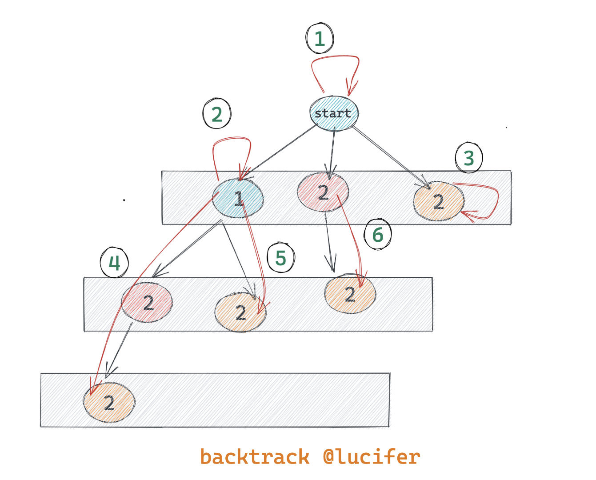

# 0090. 子集 II

## 题目地址(90. 子集 II)

<https://leetcode-cn.com/problems/subsets-ii/>

## 题目描述

```
<pre class="calibre18">```
给定一个可能包含重复元素的整数数组 nums，返回该数组所有可能的子集（幂集）。

说明：解集不能包含重复的子集。

示例:

输入: [1,2,2]
输出:
[
  [2],
  [1],
  [1,2,2],
  [2,2],
  [1,2],
  []
]

```
```

## 前置知识

- 回溯

## 公司

- 阿里
- 腾讯
- 百度
- 字节

## 思路

这道题目是求集合，并不是`求极值`，因此动态规划不是特别切合，因此我们需要考虑别的方法。

这种题目其实有一个通用的解法，就是回溯法。 网上也有大神给出了这种回溯法解题的 [通用写法](https://leetcode.com/problems/combination-sum/discuss/16502/A-general-approach-to-backtracking-questions-in-Java-(Subsets-Permutations-Combination-Sum-Palindrome-Partitioning)>)，这里的所有的解法使用通用方法解答。 除了这道题目还有很多其他题目可以用这种通用解法，具体的题目见后方相关题目部分。

我们先来看下通用解法的解题思路，我画了一张图：



> 图是 [78.subsets](https://github.com/azl397985856/leetcode/blob/master/problems/78.subsets.md)，都差不多，仅做参考。

通用写法的具体代码见下方代码区。

## 关键点解析

- 回溯法
- backtrack 解题公式

## 代码

- 语言支持：JS，C++，Python3

JavaScript Code：

```
<pre class="calibre18">```
<span class="hljs-function"><span class="hljs-keyword">function</span> <span class="hljs-title">backtrack</span>(<span class="hljs-params">list, tempList, nums, start</span>) </span>{
  list.push([...tempList]);
  <span class="hljs-keyword">for</span> (<span class="hljs-keyword">let</span> i = start; i < nums.length; i++) {
    <span class="hljs-title">// 和78.subsets的区别在于这道题nums可以有重复</span>
    <span class="hljs-title">// 因此需要过滤这种情况</span>
    <span class="hljs-keyword">if</span> (i > start && nums[i] === nums[i - <span class="hljs-params">1</span>]) <span class="hljs-keyword">continue</span>;
    tempList.push(nums[i]);
    backtrack(list, tempList, nums, i + <span class="hljs-params">1</span>);
    tempList.pop();
  }
}
<span class="hljs-title">/**
 * @param {number[]} nums
 * @return {number[][]}
 */</span>
<span class="hljs-keyword">var</span> subsetsWithDup = <span class="hljs-function"><span class="hljs-keyword">function</span> (<span class="hljs-params">nums</span>) </span>{
  <span class="hljs-keyword">const</span> list = [];
  backtrack(
    list,
    [],
    nums.sort((a, b) => a - b),
    <span class="hljs-params">0</span>,
    []
  );
  <span class="hljs-keyword">return</span> list;
};

```
```

C++ Code：

```
<pre class="calibre18">```
<span class="hljs-keyword">class</span> Solution {
<span class="hljs-keyword">private</span>:
    <span class="hljs-function"><span class="hljs-keyword">void</span> <span class="hljs-title">subsetsWithDup</span><span class="hljs-params">(<span class="hljs-params">vector</span><<span class="hljs-keyword">int</span>>& nums, size_t start, <span class="hljs-params">vector</span><<span class="hljs-keyword">int</span>>& tmp, <span class="hljs-params">vector</span><<span class="hljs-params">vector</span><<span class="hljs-keyword">int</span>>>& res)</span> </span>{
        res.push_back(tmp);
        <span class="hljs-keyword">for</span> (<span class="hljs-keyword">auto</span> i = start; i < nums.size(); ++i) {
            <span class="hljs-keyword">if</span> (i > start && nums[i] == nums[i - <span class="hljs-params">1</span>]) <span class="hljs-keyword">continue</span>;
            tmp.push_back(nums[i]);
            subsetsWithDup(nums, i + <span class="hljs-params">1</span>, tmp, res);
            tmp.pop_back();
        }
    }
<span class="hljs-keyword">public</span>:
    <span class="hljs-params">vector</span><<span class="hljs-params">vector</span><<span class="hljs-keyword">int</span>>> subsetsWithDup(<span class="hljs-params">vector</span><<span class="hljs-keyword">int</span>>& nums) {
        <span class="hljs-keyword">auto</span> tmp = <span class="hljs-params">vector</span><<span class="hljs-keyword">int</span>>();
        <span class="hljs-keyword">auto</span> res = <span class="hljs-params">vector</span><<span class="hljs-params">vector</span><<span class="hljs-keyword">int</span>>>();
        sort(nums.begin(), nums.end());
        subsetsWithDup(nums, <span class="hljs-params">0</span>, tmp, res);
        <span class="hljs-keyword">return</span> res;
    }
};

```
```

Python Code:

```
<pre class="calibre18">```
<span class="hljs-class"><span class="hljs-keyword">class</span> <span class="hljs-title">Solution</span>:</span>
    <span class="hljs-function"><span class="hljs-keyword">def</span> <span class="hljs-title">subsetsWithDup</span><span class="hljs-params">(self, nums: List[int], sorted: bool=False)</span> -> List[List[int]]:</span>
        <span class="hljs-string">"""回溯法，通过排序参数避免重复排序"""</span>
        <span class="hljs-keyword">if</span> <span class="hljs-keyword">not</span> nums:
            <span class="hljs-keyword">return</span> [[]]
        <span class="hljs-keyword">elif</span> len(nums) == <span class="hljs-params">1</span>:
            <span class="hljs-keyword">return</span> [[], nums]
        <span class="hljs-keyword">else</span>:
            <span class="hljs-title"># 先排序，以便去重</span>
            <span class="hljs-title"># 注意，这道题排序花的时间比较多</span>
            <span class="hljs-title"># 因此，增加一个参数，使后续过程不用重复排序，可以大幅提高时间效率</span>
            <span class="hljs-keyword">if</span> <span class="hljs-keyword">not</span> sorted:
                nums.sort()
            <span class="hljs-title"># 回溯法</span>
            pre_lists = self.subsetsWithDup(nums[:<span class="hljs-params">-1</span>], sorted=<span class="hljs-keyword">True</span>)
            all_lists = [i+[nums[<span class="hljs-params">-1</span>]] <span class="hljs-keyword">for</span> i <span class="hljs-keyword">in</span> pre_lists] + pre_lists
            <span class="hljs-title"># 去重</span>
            result = []
            <span class="hljs-keyword">for</span> i <span class="hljs-keyword">in</span> all_lists:
                <span class="hljs-keyword">if</span> i <span class="hljs-keyword">not</span> <span class="hljs-keyword">in</span> result:
                    result.append(i)
            <span class="hljs-keyword">return</span> result

```
```

## 相关题目

- [39.combination-sum](39.combination-sum.html)
- [40.combination-sum-ii](40.combination-sum-ii.html)
- [46.permutations](46.permutations.html)
- [47.permutations-ii](47.permutations-ii.html)
- [78.subsets](78.subsets.html)
- [113.path-sum-ii](113.path-sum-ii.html)
- [131.palindrome-partitioning](131.palindrome-partitioning.html)