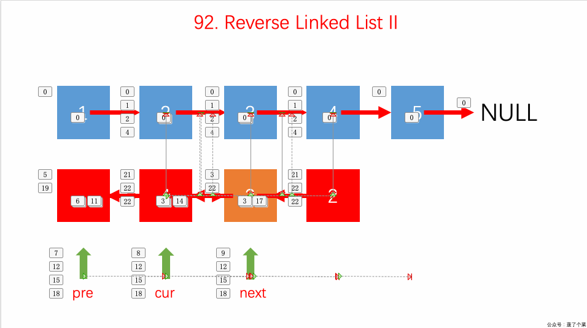

# 0092. 反转链表 II

## 题目地址(92. 反转链表 II)

<https://leetcode-cn.com/problems/reverse-linked-list-ii/>

## 题目描述

```
<pre class="calibre18">```
反转从位置 m 到 n 的链表。请使用一趟扫描完成反转。

说明:
1 ≤ m ≤ n ≤ 链表长度。

示例:

输入: 1->2->3->4->5->NULL, m = 2, n = 4
输出: 1->4->3->2->5->NULL

```
```

## 前置知识

- 链表

## 公司

- 阿里
- 腾讯
- 百度
- 字节

## 思路（四点法）

这道题和[206.reverse-linked-list](https://github.com/azl397985856/leetcode/blob/master/problems/206.reverse-linked-list.md) 有点类似，并且这道题是 206 的升级版。 让我们反转某一个区间，而不是整个链表，我们可以将 206 看作本题的特殊情况（special case）。

核心在于**取出需要反转的这一小段链表，反转完后再插入到原先的链表中。**

以本题为例：

反转的是 2,3,4 这三个点，那么我们可以先取出 2，用 cur 指针指向 2，然后当取出 3 的时候，我们将 3 指向 2 的，把 cur 指针前移到 3，依次类推，到 4 后停止，这样我们得到一个新链表 4->3->2, cur 指针指向 4。

对于原链表来说，有两个点的位置很重要，需要用指针记录下来，分别是 1 和 5，把新链表插入的时候需要这两个点的位置。用 pre 指针记录 1 的位置当 4 结点被取走后，5 的位置需要记下来

这样我们就可以把反转后的那一小段链表加入到原链表中



(图片来自网络)

- 首先我们直接返回 head 是不行的。 当 m 不等于 1 的时候是没有问题的，但只要 m 为 1，就会有问题。
- 其次如果链表商都小于 4 的时候，p1，p2，p3，p4 就有可能为空。为了防止 NPE，我们也要充分地判空。

```
<pre class="calibre18">```
<span class="hljs-class"><span class="hljs-keyword">class</span> <span class="hljs-title">Solution</span>:</span>
    <span class="hljs-function"><span class="hljs-keyword">def</span> <span class="hljs-title">reverseBetween</span><span class="hljs-params">(self, head: ListNode, m: int, n: int)</span> -> ListNode:</span>
        pre = <span class="hljs-keyword">None</span>
        cur = head
        i = <span class="hljs-params">0</span>
        p1 = p2 = p3 = p4 = <span class="hljs-keyword">None</span>
        <span class="hljs-title"># 一坨逻辑</span>
        <span class="hljs-keyword">if</span> p1:
            p1.next = p3
        <span class="hljs-keyword">else</span>:
            dummy.next = p3
        <span class="hljs-keyword">if</span> p2:
            p2.next = p4
        <span class="hljs-keyword">return</span> head

```
```

如上代码是不可以的，我们考虑使用 dummy 节点。

```
<pre class="calibre18">```
<span class="hljs-class"><span class="hljs-keyword">class</span> <span class="hljs-title">Solution</span>:</span>
   <span class="hljs-function"><span class="hljs-keyword">def</span> <span class="hljs-title">reverseBetween</span><span class="hljs-params">(self, head: ListNode, m: int, n: int)</span> -> ListNode:</span>
       pre = <span class="hljs-keyword">None</span>
       cur = head
       i = <span class="hljs-params">0</span>
       p1 = p2 = p3 = p4 = <span class="hljs-keyword">None</span>
       dummy = ListNode(<span class="hljs-params">0</span>)
       dummy.next = head
       <span class="hljs-title"># 一坨逻辑</span>
       <span class="hljs-keyword">if</span> p1:
           p1.next = p3
       <span class="hljs-keyword">else</span>:
           dummy.next = p3
       <span class="hljs-keyword">if</span> p2:
           p2.next = p4

       <span class="hljs-keyword">return</span> dummy.next

```
```

关于链表反转部分, 顺序比较重要，我们需要：

- 先 cur.next = pre
- 再 更新 p2 和 p2.next(其中要设置 p2.next = None，否则会互相应用，造成无限循环)
- 最后更新 pre 和 cur

上述的顺序不能错，不然会有问题。原因就在于`p2.next = None`，如果这个放在最后，那么我们的 cur 会提前断开。

```
<pre class="calibre18">```
    <span class="hljs-keyword">while</span> cur:
           i += <span class="hljs-params">1</span>
           <span class="hljs-keyword">if</span> i == m - <span class="hljs-params">1</span>:
               p1 = cur
           next = cur.next
           <span class="hljs-keyword">if</span> m < i <= n:
               cur.next = pre

           <span class="hljs-keyword">if</span> i == m:
               p2 = cur
               p2.next = <span class="hljs-keyword">None</span>

           <span class="hljs-keyword">if</span> i == n:
               p3 = cur

           <span class="hljs-keyword">if</span> i == n + <span class="hljs-params">1</span>:
               p4 = cur

           pre = cur
           cur = next

```
```

## 关键点解析

- 四点法
- 链表的基本操作
- 考虑特殊情况 m 是 1 或者 n 是链表长度的情况，我们可以采用虚拟节点 dummy 简化操作
- 用四个变量记录特殊节点， 然后操作这四个节点使之按照一定方式连接即可。
- 注意更新 current 和 pre 的位置， 否则有可能出现溢出

## 代码

我把这个方法称为 `四点法`

语言支持：JS, Python3

JavaScript Code:

```
<pre class="calibre18">```
<span class="hljs-title">/*
 * @lc app=leetcode id=92 lang=javascript
 *
 * [92] Reverse Linked List II
 *
 * https://leetcode.com/problems/reverse-linked-list-ii/description/
 */</span>
<span class="hljs-title">/**
 * Definition for singly-linked list.
 * function ListNode(val) {
 *     this.val = val;
 *     this.next = null;
 * }
 */</span>
<span class="hljs-title">/**
 * @param {ListNode} head
 * @param {number} m
 * @param {number} n
 * @return {ListNode}
 */</span>
<span class="hljs-keyword">var</span> reverseBetween = <span class="hljs-function"><span class="hljs-keyword">function</span> (<span class="hljs-params">head, m, n</span>) </span>{
  <span class="hljs-title">// 虚拟节点，简化操作</span>
  <span class="hljs-keyword">const</span> dummyHead = {
    next: head,
  };

  <span class="hljs-keyword">let</span> cur = dummyHead.next; <span class="hljs-title">// 当前遍历的节点</span>
  <span class="hljs-keyword">let</span> pre = cur; <span class="hljs-title">// 因为要反转，因此我们需要记住前一个节点</span>
  <span class="hljs-keyword">let</span> index = <span class="hljs-params">0</span>; <span class="hljs-title">// 链表索引，用来判断是否是特殊位置（头尾位置）</span>

  <span class="hljs-title">// 上面提到的四个特殊节点</span>
  <span class="hljs-keyword">let</span> p1 = (p2 = p3 = p4 = <span class="hljs-params">null</span>);

  <span class="hljs-keyword">while</span> (cur) {
    <span class="hljs-keyword">const</span> next = cur.next;
    index++;

    <span class="hljs-title">// 对 (m - n) 范围内的节点进行反转</span>
    <span class="hljs-keyword">if</span> (index > m && index <= n) {
      cur.next = pre;
    }

    <span class="hljs-title">// 下面四个if都是边界, 用于更新四个特殊节点的值</span>
    <span class="hljs-keyword">if</span> (index === m - <span class="hljs-params">1</span>) {
      p1 = cur;
    }
    <span class="hljs-keyword">if</span> (index === m) {
      p2 = cur;
    }

    <span class="hljs-keyword">if</span> (index === n) {
      p3 = cur;
    }

    <span class="hljs-keyword">if</span> (index === n + <span class="hljs-params">1</span>) {
      p4 = cur;
    }

    pre = cur;

    cur = next;
  }

  <span class="hljs-title">// 两个链表合并起来</span>
  (p1 || dummyHead).next = p3; <span class="hljs-title">// 特殊情况需要考虑</span>
  p2.next = p4;

  <span class="hljs-keyword">return</span> dummyHead.next;
};

```
```

Python Code:

```
<pre class="calibre18">```

<span class="hljs-class"><span class="hljs-keyword">class</span> <span class="hljs-title">Solution</span>:</span>
    <span class="hljs-function"><span class="hljs-keyword">def</span> <span class="hljs-title">reverseBetween</span><span class="hljs-params">(self, head: ListNode, m: int, n: int)</span> -> ListNode:</span>
        <span class="hljs-keyword">if</span> <span class="hljs-keyword">not</span> head.next <span class="hljs-keyword">or</span> n == <span class="hljs-params">1</span>:
            <span class="hljs-keyword">return</span> head
        dummy = ListNode()
        dummy.next = head
        pre = <span class="hljs-keyword">None</span>
        cur = head
        i = <span class="hljs-params">0</span>
        p1 = p2 = p3 = p4 = <span class="hljs-keyword">None</span>
        <span class="hljs-keyword">while</span> cur:
            i += <span class="hljs-params">1</span>
            next = cur.next
            <span class="hljs-keyword">if</span> m < i <= n:
                cur.next = pre
            <span class="hljs-keyword">if</span> i == m - <span class="hljs-params">1</span>:
                p1 = cur
            <span class="hljs-keyword">if</span> i == m:
                p2 = cur
            <span class="hljs-keyword">if</span> i == n:
                p3 = cur
            <span class="hljs-keyword">if</span> i == n + <span class="hljs-params">1</span>:
                p4 = cur
            pre = cur
            cur = next
        <span class="hljs-keyword">if</span> <span class="hljs-keyword">not</span> p1:
            dummy.next = p3
        <span class="hljs-keyword">else</span>:
            p1.next = p3
        p2.next = p4
        <span class="hljs-keyword">return</span> dummy.next

```
```

**复杂度分析**

- 时间复杂度：O(N)O(N)O(N)
- 空间复杂度：O(1)O(1)O(1)

## 相关题目

- [25.reverse-nodes-in-k-groups](25.reverse-nodes-in-k-groups-cn.md)
- [206.reverse-linked-list](206.reverse-linked-list.html)

更多题解可以访问我的 LeetCode 题解仓库：<https://github.com/azl397985856/leetcode> 。 目前已经 37K star 啦。

关注公众号力扣加加，努力用清晰直白的语言还原解题思路，并且有大量图解，手把手教你识别套路，高效刷题。

