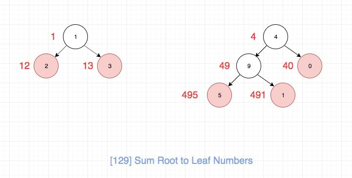
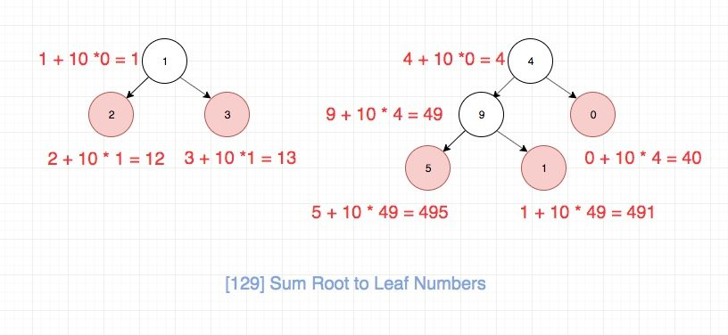

# 0129. 求根到叶子节点数字之和

## 题目地址(129. 求根到叶子节点数字之和)

<https://leetcode-cn.com/problems/sum-root-to-leaf-numbers/>

## 题目描述

```
<pre class="calibre18">```
给定一个二叉树，它的每个结点都存放一个 0-9 的数字，每条从根到叶子节点的路径都代表一个数字。

例如，从根到叶子节点路径 1->2->3 代表数字 123。

计算从根到叶子节点生成的所有数字之和。

说明: 叶子节点是指没有子节点的节点。

示例 1:

输入: [1,2,3]
    1
   / \
  2   3
输出: 25
解释:
从根到叶子节点路径 1->2 代表数字 12.
从根到叶子节点路径 1->3 代表数字 13.
因此，数字总和 = 12 + 13 = 25.
示例 2:

输入: [4,9,0,5,1]
    4
   / \
  9   0
 / \
5   1
输出: 1026
解释:
从根到叶子节点路径 4->9->5 代表数字 495.
从根到叶子节点路径 4->9->1 代表数字 491.
从根到叶子节点路径 4->0 代表数字 40.
因此，数字总和 = 495 + 491 + 40 = 1026.

```
```

## 前置知识

- 递归

## 公司

- 阿里
- 百度
- 字节

## 思路

这是一道非常适合训练递归的题目。虽然题目不难，但是要想一次写正确，并且代码要足够优雅却不是很容易。

这里我们的思路是定一个递归的helper函数，用来帮助我们完成递归操作。 递归函数的功能是将它的左右子树相加，注意这里不包括这个节点本身，否则会多加， 我们其实关注的就是叶子节点的值，然后通过层层回溯到root，返回即可。

整个过程如图所示：



那么数字具体的计算逻辑，如图所示，相信大家通过这个不难发现规律：



## 关键点解析

- 递归分析

## 代码

- 语言支持：JS，C++，Python

JavaScipt Code：

```
<pre class="calibre18">```
<span class="hljs-title">/*
 * @lc app=leetcode id=129 lang=javascript
 *
 * [129] Sum Root to Leaf Numbers
 */</span>
<span class="hljs-function"><span class="hljs-keyword">function</span> <span class="hljs-title">helper</span>(<span class="hljs-params">node, cur</span>) </span>{
  <span class="hljs-keyword">if</span> (node === <span class="hljs-params">null</span>) <span class="hljs-keyword">return</span> <span class="hljs-params">0</span>;
  <span class="hljs-keyword">const</span> next = node.val + cur * <span class="hljs-params">10</span>;

  <span class="hljs-keyword">if</span> (node.left === <span class="hljs-params">null</span> && node.right === <span class="hljs-params">null</span>) <span class="hljs-keyword">return</span> next;

  <span class="hljs-keyword">const</span> l = helper(node.left, next);
  <span class="hljs-keyword">const</span> r = helper(node.right, next);

  <span class="hljs-keyword">return</span> l + r;
}
<span class="hljs-title">/**
 * Definition for a binary tree node.
 * function TreeNode(val) {
 *     this.val = val;
 *     this.left = this.right = null;
 * }
 */</span>
<span class="hljs-title">/**
 * @param {TreeNode} root
 * @return {number}
 */</span>
<span class="hljs-keyword">var</span> sumNumbers = <span class="hljs-function"><span class="hljs-keyword">function</span>(<span class="hljs-params">root</span>) </span>{
  <span class="hljs-title">// tag: `tree` `dfs` `math`</span>
  <span class="hljs-keyword">return</span> helper(root, <span class="hljs-params">0</span>);
};

```
```

C++ Code：

```
<pre class="calibre18">```
<span class="hljs-title">/**
 * Definition for a binary tree node.
 * struct TreeNode {
 *     int val;
 *     TreeNode *left;
 *     TreeNode *right;
 *     TreeNode(int x) : val(x), left(NULL), right(NULL) {}
 * };
 */</span>
<span class="hljs-keyword">class</span> Solution {
<span class="hljs-keyword">public</span>:
    <span class="hljs-function"><span class="hljs-keyword">int</span> <span class="hljs-title">sumNumbers</span><span class="hljs-params">(TreeNode* root)</span> </span>{
        <span class="hljs-keyword">return</span> helper(root, <span class="hljs-params">0</span>);
    }
<span class="hljs-keyword">private</span>:
    <span class="hljs-function"><span class="hljs-keyword">int</span> <span class="hljs-title">helper</span><span class="hljs-params">(<span class="hljs-keyword">const</span> TreeNode* root, <span class="hljs-keyword">int</span> val)</span> </span>{
        <span class="hljs-keyword">if</span> (root == <span class="hljs-params">nullptr</span>) <span class="hljs-keyword">return</span> <span class="hljs-params">0</span>;
        <span class="hljs-keyword">auto</span> ret = root->val + val * <span class="hljs-params">10</span>;
        <span class="hljs-keyword">if</span> (root->left == <span class="hljs-params">nullptr</span> && root->right == <span class="hljs-params">nullptr</span>)
            <span class="hljs-keyword">return</span> ret;
        <span class="hljs-keyword">auto</span> l = helper(root->left, ret);
        <span class="hljs-keyword">auto</span> r = helper(root->right, ret);
        <span class="hljs-keyword">return</span> l + r;
    }
};

```
```

Python Code:

```
<pre class="calibre18">```
<span class="hljs-title"># class TreeNode:</span>
<span class="hljs-title">#     def __init__(self, x):</span>
<span class="hljs-title">#         self.val = x</span>
<span class="hljs-title">#         self.left = None</span>
<span class="hljs-title">#         self.right = None</span>

<span class="hljs-class"><span class="hljs-keyword">class</span> <span class="hljs-title">Solution</span>:</span>
    <span class="hljs-function"><span class="hljs-keyword">def</span> <span class="hljs-title">sumNumbers</span><span class="hljs-params">(self, root: TreeNode)</span> -> int:</span>

        <span class="hljs-function"><span class="hljs-keyword">def</span> <span class="hljs-title">helper</span><span class="hljs-params">(node, cur_val)</span>:</span>
            <span class="hljs-keyword">if</span> <span class="hljs-keyword">not</span> node: <span class="hljs-keyword">return</span> <span class="hljs-params">0</span>
            next_val = cur_val * <span class="hljs-params">10</span> + node.val

            <span class="hljs-keyword">if</span> <span class="hljs-keyword">not</span> (node.left <span class="hljs-keyword">or</span> node.right):
                <span class="hljs-keyword">return</span> next_val

            left_val = helper(node.left, next_val)
            right_val = helper(node.right, next_val)

            <span class="hljs-keyword">return</span> left_val + right_val

        <span class="hljs-keyword">return</span> helper(root, <span class="hljs-params">0</span>)

```
```

**复杂度分析**

- 时间复杂度：O(N)O(N)O(N)
- 空间复杂度：O(N)O(N)O(N)

## 拓展

通常来说，可以利用队列、栈等数据结构将递归算法转为递推算法。

### 描述

使用两个队列：

1. 当前和队列：保存上一层每个结点的当前和（比如49和40）
2. 结点队列：保存当前层所有的非空结点

每次循环按层处理结点队列。处理步骤：

1. 从结点队列取出一个结点
2. 从当前和队列将上一层对应的当前和取出来
3. 若左子树非空，则将该值乘以10加上左子树的值，并添加到当前和队列中
4. 若右子树非空，则将该值乘以10加上右子树的值，并添加到当前和队列中
5. 若左右子树均为空时，将该节点的当前和加到返回值中

## 实现

- 语言支持：C++，Python

C++ Code：

```
<pre class="calibre18">```
<span class="hljs-keyword">class</span> Solution {
<span class="hljs-keyword">public</span>:
    <span class="hljs-function"><span class="hljs-keyword">int</span> <span class="hljs-title">sumNumbers</span><span class="hljs-params">(TreeNode* root)</span> </span>{
        <span class="hljs-keyword">if</span> (root == <span class="hljs-params">nullptr</span>) <span class="hljs-keyword">return</span> <span class="hljs-params">0</span>;
        <span class="hljs-keyword">auto</span> ret = <span class="hljs-params">0</span>;
        <span class="hljs-keyword">auto</span> runningSum = <span class="hljs-params">vector</span><<span class="hljs-keyword">int</span>>{root->val};
        <span class="hljs-keyword">auto</span> <span class="hljs-params">queue</span> = <span class="hljs-params">vector</span><<span class="hljs-keyword">const</span> TreeNode*>{root};
        <span class="hljs-keyword">while</span> (!<span class="hljs-params">queue</span>.empty()) {
            <span class="hljs-keyword">auto</span> sz = <span class="hljs-params">queue</span>.size();
            <span class="hljs-keyword">for</span> (<span class="hljs-keyword">auto</span> i = <span class="hljs-params">0</span>; i < sz; ++i) {
                <span class="hljs-keyword">auto</span> n = <span class="hljs-params">queue</span>.front();
                <span class="hljs-params">queue</span>.erase(<span class="hljs-params">queue</span>.begin());
                <span class="hljs-keyword">auto</span> tmp = runningSum.front();
                runningSum.erase(runningSum.begin());
                <span class="hljs-keyword">if</span> (n->left != <span class="hljs-params">nullptr</span>) {
                    runningSum.push_back(tmp * <span class="hljs-params">10</span> + n->left->val);
                    <span class="hljs-params">queue</span>.push_back(n->left);
                }
                <span class="hljs-keyword">if</span> (n->right != <span class="hljs-params">nullptr</span>) {
                    runningSum.push_back(tmp * <span class="hljs-params">10</span> + n->right->val);
                    <span class="hljs-params">queue</span>.push_back(n->right);
                }
                <span class="hljs-keyword">if</span> (n->left == <span class="hljs-params">nullptr</span> && n->right == <span class="hljs-params">nullptr</span>) {
                    ret += tmp;
                }
            }
        }
        <span class="hljs-keyword">return</span> ret;
    }
};

```
```

Python Code:

```
<pre class="calibre18">```
<span class="hljs-class"><span class="hljs-keyword">class</span> <span class="hljs-title">Solution</span>:</span>
    <span class="hljs-function"><span class="hljs-keyword">def</span> <span class="hljs-title">sumNumbers</span><span class="hljs-params">(self, root: TreeNode)</span> -> int:</span>
        <span class="hljs-keyword">if</span> <span class="hljs-keyword">not</span> root: <span class="hljs-keyword">return</span> <span class="hljs-params">0</span>
        result = <span class="hljs-params">0</span>
        node_queue, sum_queue = [root], [root.val]
        <span class="hljs-keyword">while</span> node_queue:
            <span class="hljs-keyword">for</span> i <span class="hljs-keyword">in</span> node_queue:
                cur_node = node_queue.pop(<span class="hljs-params">0</span>)
                cur_val = sum_queue.pop(<span class="hljs-params">0</span>)
                <span class="hljs-keyword">if</span> cur_node.left:
                    node_queue.append(cur_node.left)
                    sum_queue.append(cur_val * <span class="hljs-params">10</span> + cur_node.left.val)
                <span class="hljs-keyword">if</span> cur_node.right:
                    node_queue.append(cur_node.right)
                    sum_queue.append(cur_val * <span class="hljs-params">10</span> + cur_node.right.val)
                <span class="hljs-keyword">if</span> <span class="hljs-keyword">not</span> (cur_node.left <span class="hljs-keyword">or</span> cur_node.right):
                    result += cur_val
        <span class="hljs-keyword">return</span> result

```
```

## 相关题目

- [sum-of-root-to-leaf-binary-numbers](https://leetcode.com/problems/sum-of-root-to-leaf-binary-numbers/)

> 这道题和本题太像了，跟一道题没啥区别

大家对此有何看法，欢迎给我留言，我有时间都会一一查看回答。更多算法套路可以访问我的 LeetCode 题解仓库：<https://github.com/azl397985856/leetcode> 。 目前已经 37K star 啦。 大家也可以关注我的公众号《力扣加加》带你啃下算法这块硬骨头。 