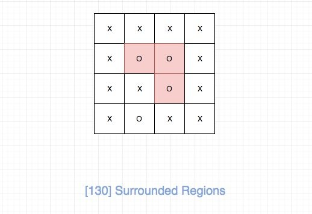
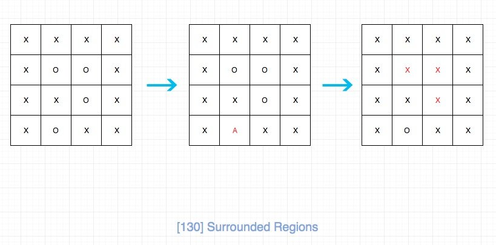

# 0130. 被围绕的区域

## 题目地址(130. 被围绕的区域)

<https://leetcode-cn.com/problems/surrounded-regions/>

## 题目描述

```
<pre class="calibre18">```
给定一个二维的矩阵，包含 'X' 和 'O'（字母 O）。

找到所有被 'X' 围绕的区域，并将这些区域里所有的 'O' 用 'X' 填充。

示例:

X X X X
X O O X
X X O X
X O X X
运行你的函数后，矩阵变为：

X X X X
X X X X
X X X X
X O X X
解释:

被围绕的区间不会存在于边界上，换句话说，任何边界上的 'O' 都不会被填充为 'X'。 任何不在边界上，或不与边界上的 'O' 相连的 'O' 最终都会被填充为 'X'。如果两个元素在水平或垂直方向相邻，则称它们是“相连”的。

```
```

## 前置知识

- DFS

## 公司

- 阿里
- 腾讯
- 百度
- 字节

## 思路

我们需要将所有被X包围的O变成X，并且题目明确说了边缘的所有O都是不可以变成X的。



其实我们观察会发现，我们除了边缘的O以及和边缘O连通的O是不需要变成X的，其他都要变成X。

经过上面的思考，问题转化为连通区域问题。 这里我们需要标记一下`边缘的O以及和边缘O连通的O`。 我们当然可以用额外的空间去存，但是对于这道题目而言，我们完全可以mutate。这样就空间复杂度会好一点。

整个过程如图所示：

> 我将`边缘的O以及和边缘O连通的O` 标记为了 "A"



## 关键点解析

- 二维数组DFS解题模板
- 转化问题为`连通区域问题`
- 直接mutate原数组，节省空间

## 代码

- 语言支持：JS，Python3

```
<pre class="calibre18">```


<span class="hljs-title">/*
 * @lc app=leetcode id=130 lang=javascript
 *
 * [130] Surrounded Regions
 */</span>
<span class="hljs-title">// 将O以及周边的O转化为A</span>
<span class="hljs-function"><span class="hljs-keyword">function</span> <span class="hljs-title">mark</span>(<span class="hljs-params">board, i, j, rows, cols</span>) </span>{
  <span class="hljs-keyword">if</span> (i < <span class="hljs-params">0</span> || i > rows - <span class="hljs-params">1</span> || j < <span class="hljs-params">0</span> || j > cols - <span class="hljs-params">1</span> || board[i][j] !== <span class="hljs-string">"O"</span>)
    <span class="hljs-keyword">return</span>;

  board[i][j] = <span class="hljs-string">"A"</span>;
  mark(board, i + <span class="hljs-params">1</span>, j, rows, cols);
  mark(board, i - <span class="hljs-params">1</span>, j, rows, cols);
  mark(board, i, j + <span class="hljs-params">1</span>, rows, cols);
  mark(board, i, j - <span class="hljs-params">1</span>, rows, cols);
}
<span class="hljs-title">/**
 * @param {character[][]} board
 * @return {void} Do not return anything, modify board in-place instead.
 */</span>
<span class="hljs-keyword">var</span> solve = <span class="hljs-function"><span class="hljs-keyword">function</span>(<span class="hljs-params">board</span>) </span>{
  <span class="hljs-keyword">const</span> rows = board.length;
  <span class="hljs-keyword">if</span> (rows === <span class="hljs-params">0</span>) <span class="hljs-keyword">return</span> [];
  <span class="hljs-keyword">const</span> cols = board[<span class="hljs-params">0</span>].length;

  <span class="hljs-keyword">for</span> (<span class="hljs-keyword">let</span> i = <span class="hljs-params">0</span>; i < rows; i++) {
    <span class="hljs-keyword">for</span> (<span class="hljs-keyword">let</span> j = <span class="hljs-params">0</span>; j < cols; j++) {
      <span class="hljs-keyword">if</span> (i === <span class="hljs-params">0</span> || i == rows - <span class="hljs-params">1</span> || j === <span class="hljs-params">0</span> || j === cols - <span class="hljs-params">1</span>) {
        mark(board, i, j, rows, cols);
      }
    }
  }

  <span class="hljs-keyword">for</span> (<span class="hljs-keyword">let</span> i = <span class="hljs-params">0</span>; i < rows; i++) {
    <span class="hljs-keyword">for</span> (<span class="hljs-keyword">let</span> j = <span class="hljs-params">0</span>; j < cols; j++) {
      <span class="hljs-keyword">if</span> (board[i][j] === <span class="hljs-string">"O"</span>) {
        board[i][j] = <span class="hljs-string">"X"</span>;
      } <span class="hljs-keyword">else</span> <span class="hljs-keyword">if</span> (board[i][j] === <span class="hljs-string">"A"</span>) {
        board[i][j] = <span class="hljs-string">"O"</span>;
      }
    }
  }

  <span class="hljs-keyword">return</span> board;
};

```
```

Python Code：

```
<pre class="calibre18">```
<span class="hljs-class"><span class="hljs-keyword">class</span> <span class="hljs-title">Solution</span>:</span>
    <span class="hljs-function"><span class="hljs-keyword">def</span> <span class="hljs-title">solve</span><span class="hljs-params">(self, board: List[List[str]])</span> -> <span class="hljs-keyword">None</span>:</span>
        <span class="hljs-string">"""
        Do not return anything, modify board in-place instead.
        """</span>
        <span class="hljs-title"># 如果数组长或宽小于等于2，则不需要替换</span>
        <span class="hljs-keyword">if</span> len(board) <= <span class="hljs-params">2</span> <span class="hljs-keyword">or</span> len(board[<span class="hljs-params">0</span>]) <= <span class="hljs-params">2</span>:
            <span class="hljs-keyword">return</span>

        row, col = len(board), len(board[<span class="hljs-params">0</span>])

        <span class="hljs-function"><span class="hljs-keyword">def</span> <span class="hljs-title">dfs</span><span class="hljs-params">(i, j)</span>:</span>
            <span class="hljs-string">"""
            深度优先算法，如果符合条件，替换为A并进一步测试，否则停止
            """</span>
            <span class="hljs-keyword">if</span> i < <span class="hljs-params">0</span> <span class="hljs-keyword">or</span> j < <span class="hljs-params">0</span> <span class="hljs-keyword">or</span> i >= row <span class="hljs-keyword">or</span> j >= col <span class="hljs-keyword">or</span> board[i][j] != <span class="hljs-string">'O'</span>:
                <span class="hljs-keyword">return</span>
            board[i][j] = <span class="hljs-string">'A'</span>

            dfs(i - <span class="hljs-params">1</span>, j)
            dfs(i + <span class="hljs-params">1</span>, j)
            dfs(i, j - <span class="hljs-params">1</span>)
            dfs(i, j + <span class="hljs-params">1</span>)

        <span class="hljs-title"># 从外围开始</span>
        <span class="hljs-keyword">for</span> i <span class="hljs-keyword">in</span> range(row):
            dfs(i, <span class="hljs-params">0</span>)
            dfs(i, col<span class="hljs-params">-1</span>)

        <span class="hljs-keyword">for</span> j <span class="hljs-keyword">in</span> range(col):
            dfs(<span class="hljs-params">0</span>, j)
            dfs(row<span class="hljs-params">-1</span>, j)

        <span class="hljs-title"># 最后完成替换</span>
        <span class="hljs-keyword">for</span> i <span class="hljs-keyword">in</span> range(row):
            <span class="hljs-keyword">for</span> j <span class="hljs-keyword">in</span> range(col):
                <span class="hljs-keyword">if</span> board[i][j] == <span class="hljs-string">'O'</span>:
                    board[i][j] = <span class="hljs-string">'X'</span>
                <span class="hljs-keyword">elif</span> board[i][j] == <span class="hljs-string">'A'</span>:
                    board[i][j] = <span class="hljs-string">'O'</span>

```
```

## 相关题目

- [200.number-of-islands](200.number-of-islands.html)

> 解题模板是一样的

**复杂度分析**

- 时间复杂度：O(row∗col)O(row \* col)O(row∗col)
- 空间复杂度：O(row∗col)O(row \* col)O(row∗col)

更多题解可以访问我的LeetCode题解仓库：<https://github.com/azl397985856/leetcode> 。 目前已经37K star啦。

关注公众号力扣加加，努力用清晰直白的语言还原解题思路，并且有大量图解，手把手教你识别套路，高效刷题。

