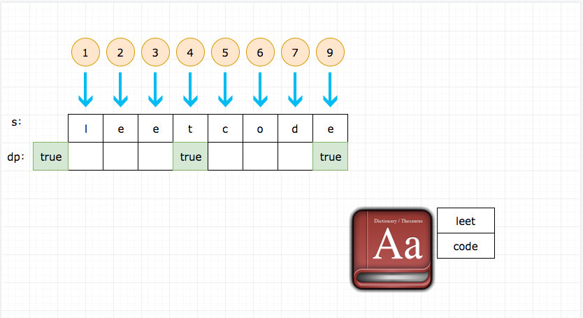
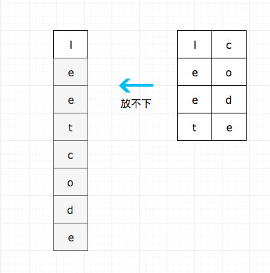
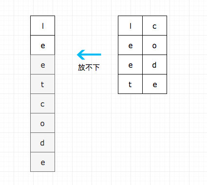
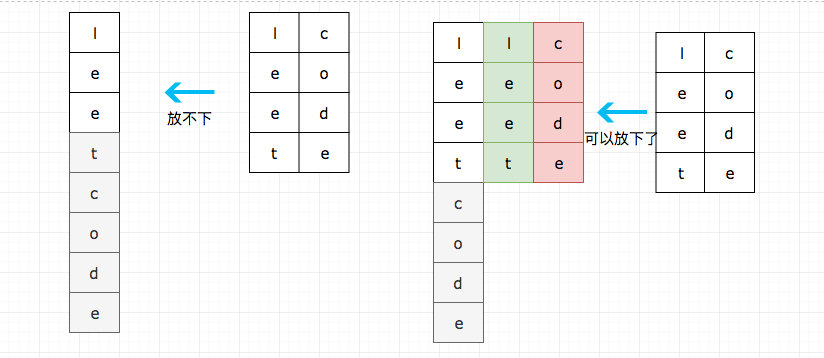
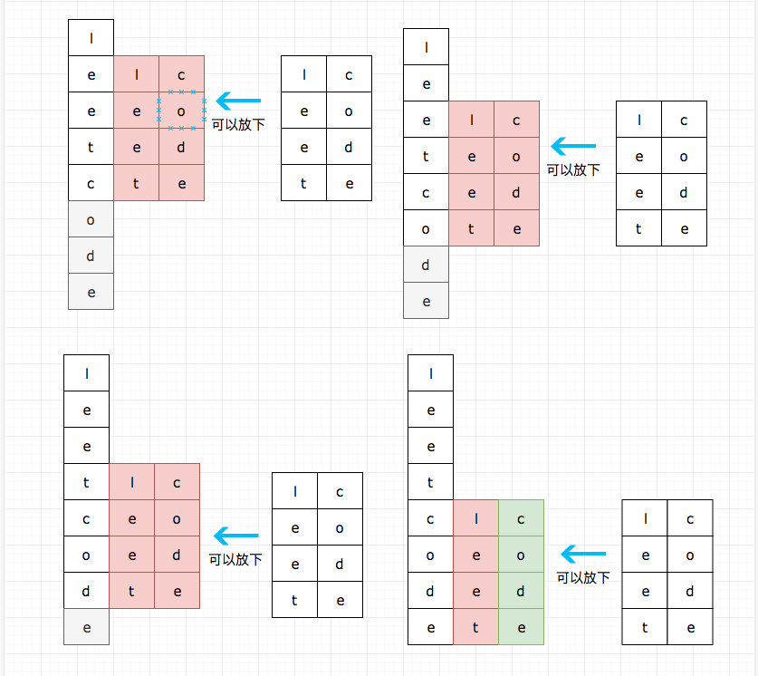
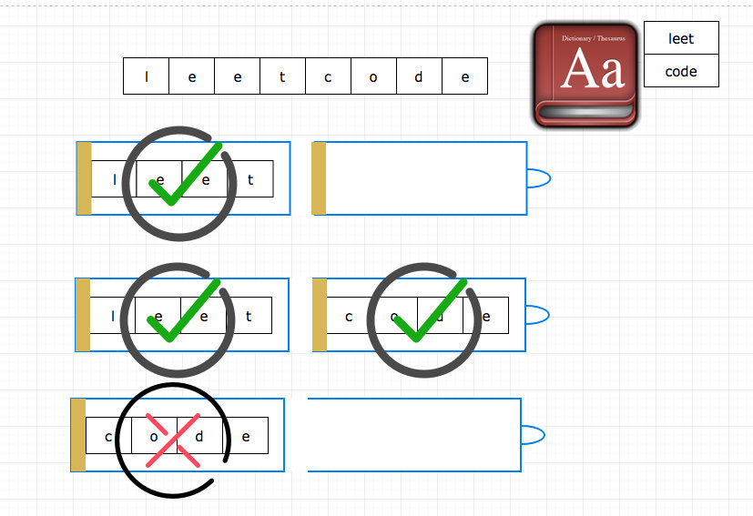

# 0139. 单词拆分

## 题目地址(139. 单词拆分)

<https://leetcode-cn.com/problems/word-break/>

## 题目描述

```
<pre class="calibre18">```
给定一个非空字符串 s 和一个包含非空单词的列表 wordDict，判定 s 是否可以被空格拆分为一个或多个在字典中出现的单词。

说明：

拆分时可以重复使用字典中的单词。
你可以假设字典中没有重复的单词。
示例 1：

输入: s = "leetcode", wordDict = ["leet", "code"]
输出: true
解释: 返回 true 因为 "leetcode" 可以被拆分成 "leet code"。
示例 2：

输入: s = "applepenapple", wordDict = ["apple", "pen"]
输出: true
解释: 返回 true 因为 "applepenapple" 可以被拆分成 "apple pen apple"。
     注意你可以重复使用字典中的单词。
示例 3：

输入: s = "catsandog", wordDict = ["cats", "dog", "sand", "and", "cat"]
输出: false

```
```

## 前置知识

- [动态规划](https://github.com/azl397985856/leetcode/blob/master/thinkings/dynamic-programming.md)

## 公司

- 阿里
- 腾讯
- 百度
- 字节

## 思路

这道题是给定一个字典和一个句子，判断该句子是否可以由字典里面的单词组出来，一个单词可以用多次。

暴力的方法是无解的，复杂度极其高。 我们考虑其是否可以拆分为小问题来解决。 对于问题`(s, wordDict)` 我们是否可以用(s', wordDict) 来解决。 其中 s' 是 s 的子序列， 当 s'变成寻常(长度为 0)的时候问题就解决了。 我们状态转移方程变成了这道题的难点。

我们可以建立一个数组 dp, dp\[i\]代表 字符串 s.substring(0, i) 能否由字典里面的单词组成， 值得注意的是，这里我们无法建立 dp\[i\] 和 dp\[i - 1\] 的关系， 我们可以建立的是 dp\[i - word.length\] 和 dp\[i\] 的关系。

我们用图来感受一下：



没有明白也没有关系，我们分步骤解读一下：

（以下的图左边都代表 s，右边都是 dict，灰色代表没有处理的字符，绿色代表匹配成功，红色代表匹配失败）









上面分步解释了算法的基本过程，下面我们感性认识下这道题，我把它比喻为 你正在`往一个老式手电筒🔦中装电池`



## 代码

```
<pre class="calibre18">```
<span class="hljs-title">/**
 * @param {string} s
 * @param {string[]} wordDict
 * @return {boolean}
 */</span>
<span class="hljs-keyword">var</span> wordBreak = <span class="hljs-function"><span class="hljs-keyword">function</span> (<span class="hljs-params">s, wordDict</span>) </span>{
  <span class="hljs-keyword">const</span> dp = <span class="hljs-params">Array</span>(s.length + <span class="hljs-params">1</span>);
  dp[<span class="hljs-params">0</span>] = <span class="hljs-params">true</span>;
  <span class="hljs-keyword">for</span> (<span class="hljs-keyword">let</span> i = <span class="hljs-params">0</span>; i < s.length + <span class="hljs-params">1</span>; i++) {
    <span class="hljs-keyword">for</span> (<span class="hljs-keyword">let</span> word <span class="hljs-keyword">of</span> wordDict) {
      <span class="hljs-keyword">if</span> (word.length <= i && dp[i - word.length]) {
        <span class="hljs-keyword">if</span> (s.substring(i - word.length, i) === word) {
          dp[i] = <span class="hljs-params">true</span>;
        }
      }
    }
  }

  <span class="hljs-keyword">return</span> dp[s.length] || <span class="hljs-params">false</span>;
};

```
```

**复杂度分析**

- 时间复杂度：O(N2)O(N ^ 2)O(N2)
- 空间复杂度：O(N)O(N)O(N)

大家对此有何看法，欢迎给我留言，我有时间都会一一查看回答。更多算法套路可以访问我的 LeetCode 题解仓库：<https://github.com/azl397985856/leetcode> 。 目前已经 37K star 啦。 大家也可以关注我的公众号《力扣加加》带你啃下算法这块硬骨头。 