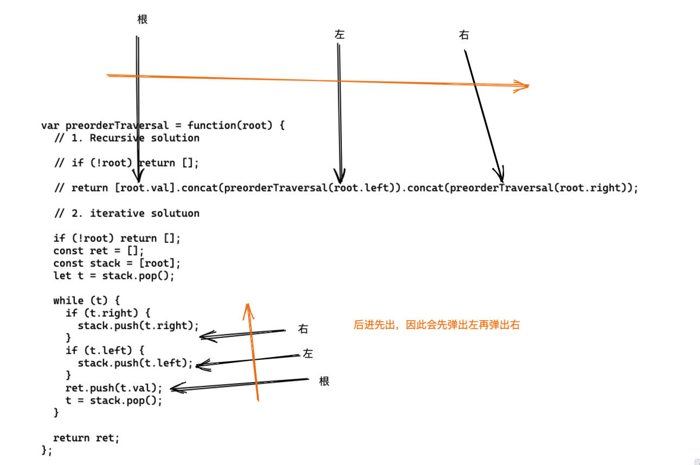

# 0144. 二叉树的前序遍历

## 题目地址(144. 二叉树的前序遍历)

<https://leetcode-cn.com/problems/binary-tree-preorder-traversal/>

## 题目描述

```
<pre class="calibre18">```
给定一个二叉树，返回它的 前序 遍历。

 示例:

输入: [1,null,2,3]  
   1
    \
     2
    /
   3 

输出: [1,2,3]
进阶: 递归算法很简单，你可以通过迭代算法完成吗？

```
```

## 前置知识

- 递归
- 栈

## 公司

- 阿里
- 腾讯
- 百度
- 字节

## 思路

这道题目是前序遍历，这个和之前的`leetcode 94 号问题 - 中序遍历`完全不一回事。

前序遍历是`根左右`的顺序，注意是`根`开始，那么就很简单。直接先将根节点入栈，然后 看有没有右节点，有则入栈，再看有没有左节点，有则入栈。 然后出栈一个元素，重复即可。

> 其他树的非递归遍历可没这么简单



（迭代 VS 递归）

## 关键点解析

- 二叉树的基本操作（遍历）> 不同的遍历算法差异还是蛮大的
- 如果非递归的话利用栈来简化操作
- 如果数据规模不大的话，建议使用递归
- 递归的问题需要注意两点，一个是终止条件，一个如何缩小规模
- 终止条件，自然是当前这个元素是 null（链表也是一样）
- 由于二叉树本身就是一个递归结构， 每次处理一个子树其实就是缩小了规模， 难点在于如何合并结果，这里的合并结果其实就是`mid.concat(left).concat(right)`, mid 是一个具体的节点，left 和 right`递归求出即可`

## 代码

- 语言支持：JS，C++

JavaScript Code:

```
<pre class="calibre18">```
<span class="hljs-title">/**
 * @param {TreeNode} root
 * @return {number[]}
 */</span>
<span class="hljs-keyword">var</span> preorderTraversal = <span class="hljs-function"><span class="hljs-keyword">function</span>(<span class="hljs-params">root</span>) </span>{
  <span class="hljs-title">// 1. Recursive solution</span>

  <span class="hljs-title">// if (!root) return [];</span>

  <span class="hljs-title">// return [root.val].concat(preorderTraversal(root.left)).concat(preorderTraversal(root.right));</span>

  <span class="hljs-title">// 2. iterative solutuon</span>

  <span class="hljs-keyword">if</span> (!root) <span class="hljs-keyword">return</span> [];
  <span class="hljs-keyword">const</span> ret = [];
  <span class="hljs-keyword">const</span> stack = [root];
  <span class="hljs-keyword">let</span> t = stack.pop();

  <span class="hljs-keyword">while</span> (t) {
    <span class="hljs-keyword">if</span> (t.right) {
      stack.push(t.right);
    }
    <span class="hljs-keyword">if</span> (t.left) {
      stack.push(t.left);
    }
    ret.push(t.val);
    t = stack.pop();
  }

  <span class="hljs-keyword">return</span> ret;
};

```
```

C++ Code:

```
<pre class="calibre18">```
<span class="hljs-title">/**
 * Definition for a binary tree node.
 * struct TreeNode {
 *     int val;
 *     TreeNode *left;
 *     TreeNode *right;
 *     TreeNode(int x) : val(x), left(NULL), right(NULL) {}
 * };
 */</span>
<span class="hljs-keyword">class</span> Solution {
<span class="hljs-keyword">public</span>:
    <span class="hljs-params">vector</span><<span class="hljs-keyword">int</span>> preorderTraversal(TreeNode* root) {
        <span class="hljs-params">vector</span><<span class="hljs-keyword">int</span>> v;
        <span class="hljs-params">vector</span><TreeNode*> s;
        <span class="hljs-keyword">while</span> (root != <span class="hljs-params">NULL</span> || !s.empty()) {
            <span class="hljs-keyword">while</span> (root != <span class="hljs-params">NULL</span>) {
                v.push_back(root->val);
                s.push_back(root);
                root = root->left;
            }
            root = s.back()->right;
            s.pop_back();
        }
        <span class="hljs-keyword">return</span> v;
    }
};

```
```

**复杂度分析**

- 时间复杂度：O(N)O(N)O(N)
- 空间复杂度：O(N)O(N)O(N)

## 相关专题

- [二叉树的遍历](https://github.com/azl397985856/leetcode/blob/master/thinkings/binary-tree-traversal.md)

大家对此有何看法，欢迎给我留言，我有时间都会一一查看回答。更多算法套路可以访问我的 LeetCode 题解仓库：<https://github.com/azl397985856/leetcode> 。 目前已经 37K star 啦。 大家也可以关注我的公众号《力扣加加》带你啃下算法这块硬骨头。 