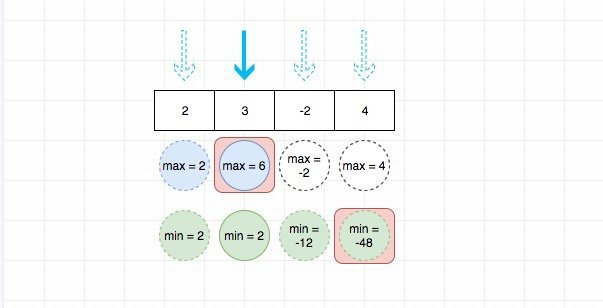

# 0152. 乘积最大子数组

## 题目地址(152. 乘积最大子数组)

<https://leetcode-cn.com/problems/maximum-product-subarray/>

## 题目描述

```
<pre class="calibre18">```
给你一个整数数组 nums ，请你找出数组中乘积最大的连续子数组（该子数组中至少包含一个数字），并返回该子数组所对应的乘积。


示例 1:

输入: [2,3,-2,4]
输出: 6
解释: 子数组 [2,3] 有最大乘积 6。
示例 2:

输入: [-2,0,-1]
输出: 0
解释: 结果不能为 2, 因为 [-2,-1] 不是子数组。

```
```

## 前置知识

- 滑动窗口

## 公司

- 阿里
- 腾讯
- 百度
- 字节

## 思路

这道题目要我们求解连续的 n 个数中乘积最大的积是多少。这里提到了连续，笔者首先想到的就是滑动窗口，但是这里比较特殊，我们不能仅仅维护一个最大值，因此最小值（比如-20）乘以一个比较小的数（比如-10） 可能就会很大。 因此这种思路并不方便。

首先来暴力求解,我们使用两层循环来枚举所有可能项，这种解法的时间复杂度是O(n^2), 代码如下：

```
<pre class="calibre18">```
<span class="hljs-keyword">var</span> maxProduct = <span class="hljs-function"><span class="hljs-keyword">function</span>(<span class="hljs-params">nums</span>) </span>{
  <span class="hljs-keyword">let</span> max = nums[<span class="hljs-params">0</span>];
  <span class="hljs-keyword">let</span> temp = <span class="hljs-params">null</span>;
  <span class="hljs-keyword">for</span> (<span class="hljs-keyword">let</span> i = <span class="hljs-params">0</span>; i < nums.length; i++) {
    temp = nums[i];
    <span class="hljs-keyword">for</span> (<span class="hljs-keyword">let</span> j = i + <span class="hljs-params">1</span>; j < nums.length; j++) {
      temp *= nums[j];
      max = <span class="hljs-params">Math</span>.max(temp, max);
    }
  }

  <span class="hljs-keyword">return</span> max;
};

```
```

前面说了`最小值（比如-20）乘以一个比较小的数（比如-10）可能就会很大` 。因此我们需要同时记录乘积最大值和乘积最小值，然后比较元素和这两个的乘积，去不断更新最大值。当然，我们也可以选择只取当前元素。因此实际上我们的选择有三种，而如何选择就取决于哪个选择带来的价值最大（乘积最大或者最小）。



这种思路的解法由于只需要遍历一次，其时间复杂度是O(n)，代码见下方代码区。

## 关键点

- 同时记录乘积最大值和乘积最小值## 代码

代码支持：Python3，JavaScript

Python3 Code:

```
<pre class="calibre18">```


<span class="hljs-class"><span class="hljs-keyword">class</span> <span class="hljs-title">Solution</span>:</span>
    <span class="hljs-function"><span class="hljs-keyword">def</span> <span class="hljs-title">maxProduct</span><span class="hljs-params">(self, nums: List[int])</span> -> int:</span>
        n = len(nums)
        max__dp = [<span class="hljs-params">1</span>] * (n + <span class="hljs-params">1</span>)
        min_dp = [<span class="hljs-params">1</span>] * (n + <span class="hljs-params">1</span>)
        ans = float(<span class="hljs-string">'-inf'</span>)

        <span class="hljs-keyword">for</span> i <span class="hljs-keyword">in</span> range(<span class="hljs-params">1</span>, n + <span class="hljs-params">1</span>):
            max__dp[i] = max(max__dp[i - <span class="hljs-params">1</span>] * nums[i - <span class="hljs-params">1</span>],
                             min_dp[i - <span class="hljs-params">1</span>] * nums[i - <span class="hljs-params">1</span>], nums[i - <span class="hljs-params">1</span>])
            min_dp[i] = min(max__dp[i - <span class="hljs-params">1</span>] * nums[i - <span class="hljs-params">1</span>],
                            min_dp[i - <span class="hljs-params">1</span>] * nums[i - <span class="hljs-params">1</span>], nums[i - <span class="hljs-params">1</span>])
            ans = max(ans, max__dp[i])
        <span class="hljs-keyword">return</span> ans

```
```

**复杂度分析**

- 时间复杂度：O(N)O(N)O(N)
- 空间复杂度：O(N)O(N)O(N)

当我们知道动态转移方程的时候，其实应该发现了。我们的dp\[i\] 只和 dp\[i - 1\]有关，这是一个空间优化的信号，告诉我们`可以借助两个额外变量记录即可`。

Python3 Code:

```
<pre class="calibre18">```

<span class="hljs-class"><span class="hljs-keyword">class</span> <span class="hljs-title">Solution</span>:</span>
    <span class="hljs-function"><span class="hljs-keyword">def</span> <span class="hljs-title">maxProduct</span><span class="hljs-params">(self, nums: List[int])</span> -> int:</span>
        n = len(nums)
        a = b = <span class="hljs-params">1</span>
        ans = float(<span class="hljs-string">'-inf'</span>)

        <span class="hljs-keyword">for</span> i <span class="hljs-keyword">in</span> range(<span class="hljs-params">1</span>, n + <span class="hljs-params">1</span>):
            temp = a
            a = max(a * nums[i - <span class="hljs-params">1</span>],
                    b * nums[i - <span class="hljs-params">1</span>], nums[i - <span class="hljs-params">1</span>])
            b = min(temp * nums[i - <span class="hljs-params">1</span>],
                    b * nums[i - <span class="hljs-params">1</span>], nums[i - <span class="hljs-params">1</span>])
            ans = max(ans, a)
        <span class="hljs-keyword">return</span> ans

```
```

JavaScript Code:

```
<pre class="calibre18">```
<span class="hljs-keyword">var</span> maxProduct = <span class="hljs-function"><span class="hljs-keyword">function</span>(<span class="hljs-params">nums</span>) </span>{
  <span class="hljs-keyword">let</span> max = nums[<span class="hljs-params">0</span>];
  <span class="hljs-keyword">let</span> min = nums[<span class="hljs-params">0</span>];
  <span class="hljs-keyword">let</span> res = nums[<span class="hljs-params">0</span>];

  <span class="hljs-keyword">for</span> (<span class="hljs-keyword">let</span> i = <span class="hljs-params">1</span>; i < nums.length; i++) {
    <span class="hljs-keyword">let</span> tmp = min;
    min = <span class="hljs-params">Math</span>.min(nums[i], <span class="hljs-params">Math</span>.min(max * nums[i], min * nums[i])); <span class="hljs-title">// 取最小</span>
    max = <span class="hljs-params">Math</span>.max(nums[i], <span class="hljs-params">Math</span>.max(max * nums[i], tmp * nums[i])); <span class="hljs-title">/// 取最大</span>
    res = <span class="hljs-params">Math</span>.max(res, max);
  }
  <span class="hljs-keyword">return</span> res;
};

```
```

**复杂度分析**

- 时间复杂度：O(N)O(N)O(N)
- 空间复杂度：O(1)O(1)O(1)

更多题解可以访问我的LeetCode题解仓库：<https://github.com/azl397985856/leetcode> 。 目前已经30K star啦。

大家也可以关注我的公众号《脑洞前端》获取更多更新鲜的LeetCode题解