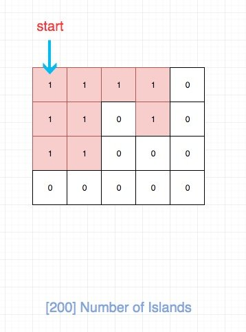

# 0200. 岛屿数量

## 题目地址(200. 岛屿数量)

<https://leetcode-cn.com/problems/number-of-islands/>

## 题目描述

```
<pre class="calibre18">```
给你一个由 '1'（陆地）和 '0'（水）组成的的二维网格，请你计算网格中岛屿的数量。

岛屿总是被水包围，并且每座岛屿只能由水平方向和/或竖直方向上相邻的陆地连接形成。

此外，你可以假设该网格的四条边均被水包围。


示例 1：

输入：grid = [
  ["1","1","1","1","0"],
  ["1","1","0","1","0"],
  ["1","1","0","0","0"],
  ["0","0","0","0","0"]
]
输出：1
示例 2：

输入：grid = [
  ["1","1","0","0","0"],
  ["1","1","0","0","0"],
  ["0","0","1","0","0"],
  ["0","0","0","1","1"]
]
输出：3


提示：

m == grid.length
n == grid[i].length
1 <= m, n <= 300
grid[i][j] 的值为 '0' 或 '1'

```
```

## 前置知识

- DFS

## 公司

- 阿里
- 腾讯
- 百度
- 字节

## 思路

如图，我们其实就是要求红色区域的个数，换句话说就是求连续区域的个数。



符合直觉的做法是用DFS来解：

- 我们需要建立一个 visited 数组用来记录某个位置是否被访问过。
- 对于一个为 `1` 且未被访问过的位置，我们递归进入其上下左右位置上为 `1` 的数，将其 visited 变成 true。
- 重复上述过程
- 找完相邻区域后，我们将结果 res 自增1，然后我们在继续找下一个为 `1` 且未被访问过的位置，直至遍历完.

但是这道题目只是让我们求连通区域的个数，因此我们其实不需要额外的空间去存储visited信息。 注意到上面的过程，我们对于数字为0的其实不会进行操作的，也就是对我们“没用”。 因此对于已经访问的元素， 我们可以将其置为0即可。

## 关键点解析

- 二维数组DFS解题模板
- 将已经访问的元素置为0，省去visited的空间开销

## 代码

- 语言支持：C++, Java, JS, python3

C++ Code：

```
<pre class="calibre18">```
<span class="hljs-keyword">class</span> Solution {
<span class="hljs-keyword">public</span>:
    <span class="hljs-function"><span class="hljs-keyword">int</span> <span class="hljs-title">numIslands</span><span class="hljs-params">(<span class="hljs-params">vector</span><<span class="hljs-params">vector</span><<span class="hljs-keyword">char</span>>>& grid)</span> </span>{
        <span class="hljs-keyword">int</span> res = <span class="hljs-params">0</span>;
        <span class="hljs-keyword">for</span>(<span class="hljs-keyword">int</span> i=<span class="hljs-params">0</span>;i<grid.size();i++)
        {
            <span class="hljs-keyword">for</span>(<span class="hljs-keyword">int</span> j=<span class="hljs-params">0</span>;j<grid[<span class="hljs-params">0</span>].size();j++)
            {
                <span class="hljs-keyword">if</span>(grid[i][j] == <span class="hljs-string">'1'</span>)
                {
                    dfs(grid, i, j);
                    res += <span class="hljs-params">1</span>;
                }
            }
        }
        <span class="hljs-keyword">return</span> res;

    }
    <span class="hljs-function"><span class="hljs-keyword">void</span> <span class="hljs-title">dfs</span><span class="hljs-params">(<span class="hljs-params">vector</span><<span class="hljs-params">vector</span><<span class="hljs-keyword">char</span>>>& grid, <span class="hljs-keyword">int</span> i, <span class="hljs-keyword">int</span> j)</span>
    </span>{
        <span class="hljs-title">// edge</span>
        <span class="hljs-keyword">if</span>(i<<span class="hljs-params">0</span> || i>= grid.size() || j<<span class="hljs-params">0</span> || j>= grid[<span class="hljs-params">0</span>].size() || grid[i][j] != <span class="hljs-string">'1'</span>)
        {
            <span class="hljs-keyword">return</span>;
        }
        grid[i][j] = <span class="hljs-string">'0'</span>;
        dfs(grid, i+<span class="hljs-params">1</span>, j);
        dfs(grid, i<span class="hljs-params">-1</span>, j);
        dfs(grid, i, j+<span class="hljs-params">1</span>);
        dfs(grid, i, j<span class="hljs-params">-1</span>);
    }
};

```
```

Java Code：

```
<pre class="calibre18">```
   <span class="hljs-function"><span class="hljs-keyword">public</span> <span class="hljs-keyword">int</span> <span class="hljs-title">numIslands</span><span class="hljs-params">(<span class="hljs-keyword">char</span>[][] grid)</span> </span>{
        <span class="hljs-keyword">if</span> (grid == <span class="hljs-keyword">null</span> || grid.length == <span class="hljs-params">0</span> || grid[<span class="hljs-params">0</span>].length == <span class="hljs-params">0</span>) <span class="hljs-keyword">return</span> <span class="hljs-params">0</span>;

        <span class="hljs-keyword">int</span> count = <span class="hljs-params">0</span>;
        <span class="hljs-keyword">for</span> (<span class="hljs-keyword">int</span> row = <span class="hljs-params">0</span>; row < grid.length; row++) {
            <span class="hljs-keyword">for</span> (<span class="hljs-keyword">int</span> col = <span class="hljs-params">0</span>; col < grid[<span class="hljs-params">0</span>].length; col++) {
                <span class="hljs-keyword">if</span> (grid[row][col] == <span class="hljs-string">'1'</span>) {
                    dfs(grid, row, col);
                    count++;
                }
            }
        }
        <span class="hljs-keyword">return</span> count;
    }

    <span class="hljs-function"><span class="hljs-keyword">private</span> <span class="hljs-keyword">void</span> <span class="hljs-title">dfs</span><span class="hljs-params">(<span class="hljs-keyword">char</span>[][] grid,<span class="hljs-keyword">int</span> row,<span class="hljs-keyword">int</span> col)</span> </span>{
        <span class="hljs-keyword">if</span> (row<<span class="hljs-params">0</span>||row== grid.length||col<<span class="hljs-params">0</span>||col==grid[<span class="hljs-params">0</span>].length||grid[row][col]!=<span class="hljs-string">'1'</span>) {
            <span class="hljs-keyword">return</span>;
        }
        grid[row][col] = <span class="hljs-string">'0'</span>;
        dfs(grid, row-<span class="hljs-params">1</span>, col);
        dfs(grid, row+<span class="hljs-params">1</span>, col);
        dfs(grid, row, col+<span class="hljs-params">1</span>);
        dfs(grid, row, col-<span class="hljs-params">1</span>);
    }

```
```

Javascript Code:

```
<pre class="calibre18">```
<span class="hljs-title">/*
 * @lc app=leetcode id=200 lang=javascript
 *
 * [200] Number of Islands
 */</span>
<span class="hljs-function"><span class="hljs-keyword">function</span> <span class="hljs-title">helper</span>(<span class="hljs-params">grid, i, j, rows, cols</span>) </span>{
  <span class="hljs-keyword">if</span> (i < <span class="hljs-params">0</span> || j < <span class="hljs-params">0</span> || i > rows - <span class="hljs-params">1</span> || j > cols - <span class="hljs-params">1</span> || grid[i][j] === <span class="hljs-string">"0"</span>)
    <span class="hljs-keyword">return</span>;

  grid[i][j] = <span class="hljs-string">"0"</span>;

  helper(grid, i + <span class="hljs-params">1</span>, j, rows, cols);
  helper(grid, i, j + <span class="hljs-params">1</span>, rows, cols);
  helper(grid, i - <span class="hljs-params">1</span>, j, rows, cols);
  helper(grid, i, j - <span class="hljs-params">1</span>, rows, cols);
}
<span class="hljs-title">/**
 * @param {character[][]} grid
 * @return {number}
 */</span>
<span class="hljs-keyword">var</span> numIslands = <span class="hljs-function"><span class="hljs-keyword">function</span>(<span class="hljs-params">grid</span>) </span>{
  <span class="hljs-keyword">let</span> res = <span class="hljs-params">0</span>;
  <span class="hljs-keyword">const</span> rows = grid.length;
  <span class="hljs-keyword">if</span> (rows === <span class="hljs-params">0</span>) <span class="hljs-keyword">return</span> <span class="hljs-params">0</span>;
  <span class="hljs-keyword">const</span> cols = grid[<span class="hljs-params">0</span>].length;
  <span class="hljs-keyword">for</span> (<span class="hljs-keyword">let</span> i = <span class="hljs-params">0</span>; i < rows; i++) {
    <span class="hljs-keyword">for</span> (<span class="hljs-keyword">let</span> j = <span class="hljs-params">0</span>; j < cols; j++) {
      <span class="hljs-keyword">if</span> (grid[i][j] === <span class="hljs-string">"1"</span>) {
        helper(grid, i, j, rows, cols);
        res++;
      }
    }
  }
  <span class="hljs-keyword">return</span> res;
};

```
```

python code:

```
<pre class="calibre18">```
<span class="hljs-class"><span class="hljs-keyword">class</span> <span class="hljs-title">Solution</span>:</span>
    <span class="hljs-function"><span class="hljs-keyword">def</span> <span class="hljs-title">numIslands</span><span class="hljs-params">(self, grid: List[List[str]])</span> -> int:</span>
        <span class="hljs-keyword">if</span> <span class="hljs-keyword">not</span> grid: <span class="hljs-keyword">return</span> <span class="hljs-params">0</span>

        count = <span class="hljs-params">0</span>
        <span class="hljs-keyword">for</span> i <span class="hljs-keyword">in</span> range(len(grid)):
            <span class="hljs-keyword">for</span> j <span class="hljs-keyword">in</span> range(len(grid[<span class="hljs-params">0</span>])):
                <span class="hljs-keyword">if</span> grid[i][j] == <span class="hljs-string">'1'</span>:
                    self.dfs(grid, i, j)
                    count += <span class="hljs-params">1</span>

        <span class="hljs-keyword">return</span> count

    <span class="hljs-function"><span class="hljs-keyword">def</span> <span class="hljs-title">dfs</span><span class="hljs-params">(self, grid, i, j)</span>:</span>
        <span class="hljs-keyword">if</span> i < <span class="hljs-params">0</span> <span class="hljs-keyword">or</span> j < <span class="hljs-params">0</span> <span class="hljs-keyword">or</span> i >= len(grid) <span class="hljs-keyword">or</span> j >= len(grid[<span class="hljs-params">0</span>]) <span class="hljs-keyword">or</span> grid[i][j] != <span class="hljs-string">'1'</span>:
            <span class="hljs-keyword">return</span> 
        grid[i][j] = <span class="hljs-string">'0'</span>
        self.dfs(grid, i + <span class="hljs-params">1</span>, j)
        self.dfs(grid, i - <span class="hljs-params">1</span>, j)
        self.dfs(grid, i, j + <span class="hljs-params">1</span>)
        self.dfs(grid, i, j - <span class="hljs-params">1</span>)

```
```

**复杂度分析**

- 时间复杂度：O(m∗n)O(m \* n)O(m∗n)
- 空间复杂度：O(m∗n)O(m \* n)O(m∗n)

欢迎关注我的公众号《脑洞前端》获取更多更新鲜的LeetCode题解


## 相关题目

- [695. 岛屿的最大面积](https://leetcode-cn.com/problems/max-area-of-island/solution/695-dao-yu-de-zui-da-mian-ji-dfspython3-by-fe-luci/)