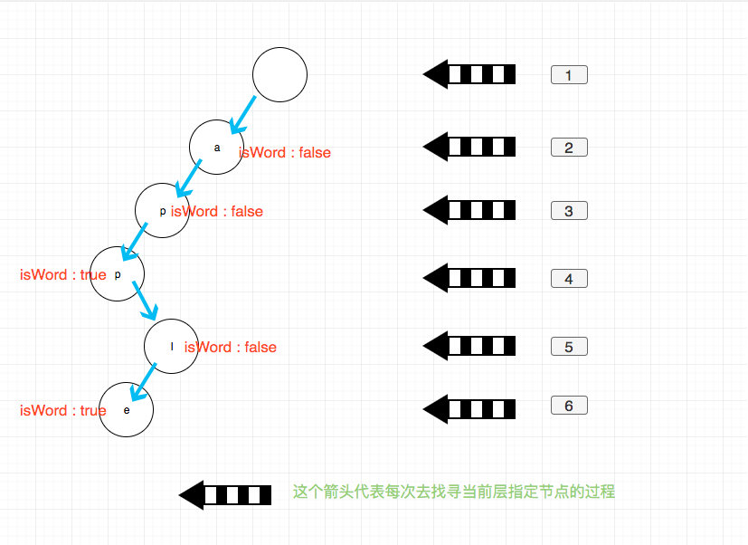

# 0208. 实现 Trie (前缀树)

## 题目地址(208. 实现 Trie (前缀树))

<https://leetcode-cn.com/problems/implement-trie-prefix-tree/>

## 题目描述

```
<pre class="calibre18">```
实现一个 Trie (前缀树)，包含 insert, search, 和 startsWith 这三个操作。

示例:

Trie trie = new Trie();

trie.insert("apple");
trie.search("apple");   // 返回 true
trie.search("app");     // 返回 false
trie.startsWith("app"); // 返回 true
trie.insert("app");   
trie.search("app");     // 返回 true
说明:

你可以假设所有的输入都是由小写字母 a-z 构成的。
保证所有输入均为非空字符串。

```
```

## 前置知识

- 前缀树

## 公司

- 阿里
- 腾讯
- 百度
- 字节

## 思路

这是一道很直接的题目，上来就让你实现`前缀树（字典树）`。这算是基础数据结构中的 知识了，不清楚什么是字典树的可以查阅相关资料。

我们看到题目给出的使用方法`new Trie`, `insert`,`search`和`startWith`.

为了区分`search`和`startWith`我们需要增加一个标示来区分当前节点是否是某个单词的结尾。 因此节点的数据结构应该是:

```
<pre class="calibre18">```
<span class="hljs-function"><span class="hljs-keyword">function</span> <span class="hljs-title">TrieNode</span>(<span class="hljs-params">val</span>) </span>{
  <span class="hljs-keyword">this</span>.val = val; <span class="hljs-title">// 当前的字母</span>
  <span class="hljs-keyword">this</span>.children = []; <span class="hljs-title">// 题目要求字典仅有a-z，那么其长度最大为26（26个字母）</span>
  <span class="hljs-keyword">this</span>.isWord = <span class="hljs-params">false</span>;
}

```
```

每次 insert 我们其实都是从根节点出发，一个一个找到我们需要添加的节点，修改 children 的值.

我们应该修改哪一个 child 呢？ 我们需要一个函数来计算索引

```
<pre class="calibre18">```
<span class="hljs-function"><span class="hljs-keyword">function</span> <span class="hljs-title">computeIndex</span>(<span class="hljs-params">c</span>) </span>{
  <span class="hljs-keyword">return</span> c.charCodeAt(<span class="hljs-params">0</span>) - <span class="hljs-string">"a"</span>.charCodeAt(<span class="hljs-params">0</span>);
}

```
```

其实不管 insert， search 和 startWith 的逻辑都是差不多的，都是从 root 出发， 找到我们需要操作的 child， 然后进行相应操作（添加，修改，返回）。



## 关键点解析

- 前缀树

## 代码

```
<pre class="calibre18">```
<span class="hljs-title">/*
 * @lc app=leetcode id=208 lang=javascript
 *
 * [208] Implement Trie (Prefix Tree)
 *
 * https://leetcode.com/problems/implement-trie-prefix-tree/description/
 *
 * algorithms
 * Medium (36.93%)
 * Total Accepted:    172K
 * Total Submissions: 455.5K
 * Testcase Example:  '["Trie","insert","search","search","startsWith","insert","search"]\n[[],["apple"],["apple"],["app"],["app"],["app"],["app"]]'
 *
 * Implement a trie with insert, search, and startsWith methods.
 *
 * Example:
 *
 *
 * Trie trie = new Trie();
 *
 * trie.insert("apple");
 * trie.search("apple");   // returns true
 * trie.search("app");     // returns false
 * trie.startsWith("app"); // returns true
 * trie.insert("app");
 * trie.search("app");     // returns true
 *
 *
 * Note:
 *
 *
 * You may assume that all inputs are consist of lowercase letters a-z.
 * All inputs are guaranteed to be non-empty strings.
 *
 *
 */</span>
<span class="hljs-function"><span class="hljs-keyword">function</span> <span class="hljs-title">TrieNode</span>(<span class="hljs-params">val</span>) </span>{
  <span class="hljs-keyword">this</span>.val = val;
  <span class="hljs-keyword">this</span>.children = [];
  <span class="hljs-keyword">this</span>.isWord = <span class="hljs-params">false</span>;
}

<span class="hljs-function"><span class="hljs-keyword">function</span> <span class="hljs-title">computeIndex</span>(<span class="hljs-params">c</span>) </span>{
  <span class="hljs-keyword">return</span> c.charCodeAt(<span class="hljs-params">0</span>) - <span class="hljs-string">"a"</span>.charCodeAt(<span class="hljs-params">0</span>);
}
<span class="hljs-title">/**
 * Initialize your data structure here.
 */</span>
<span class="hljs-keyword">var</span> Trie = <span class="hljs-function"><span class="hljs-keyword">function</span> (<span class="hljs-params"></span>) </span>{
  <span class="hljs-keyword">this</span>.root = <span class="hljs-keyword">new</span> TrieNode(<span class="hljs-params">null</span>);
};

<span class="hljs-title">/**
 * Inserts a word into the trie.
 * @param {string} word
 * @return {void}
 */</span>
Trie.prototype.insert = <span class="hljs-function"><span class="hljs-keyword">function</span> (<span class="hljs-params">word</span>) </span>{
  <span class="hljs-keyword">let</span> ws = <span class="hljs-keyword">this</span>.root;
  <span class="hljs-keyword">for</span> (<span class="hljs-keyword">let</span> i = <span class="hljs-params">0</span>; i < word.length; i++) {
    <span class="hljs-keyword">const</span> c = word[i];
    <span class="hljs-keyword">const</span> current = computeIndex(c);
    <span class="hljs-keyword">if</span> (!ws.children[current]) {
      ws.children[current] = <span class="hljs-keyword">new</span> TrieNode(c);
    }
    ws = ws.children[current];
  }
  ws.isWord = <span class="hljs-params">true</span>;
};

<span class="hljs-title">/**
 * Returns if the word is in the trie.
 * @param {string} word
 * @return {boolean}
 */</span>
Trie.prototype.search = <span class="hljs-function"><span class="hljs-keyword">function</span> (<span class="hljs-params">word</span>) </span>{
  <span class="hljs-keyword">let</span> ws = <span class="hljs-keyword">this</span>.root;
  <span class="hljs-keyword">for</span> (<span class="hljs-keyword">let</span> i = <span class="hljs-params">0</span>; i < word.length; i++) {
    <span class="hljs-keyword">const</span> c = word[i];
    <span class="hljs-keyword">const</span> current = computeIndex(c);
    <span class="hljs-keyword">if</span> (!ws.children[current]) <span class="hljs-keyword">return</span> <span class="hljs-params">false</span>;
    ws = ws.children[current];
  }
  <span class="hljs-keyword">return</span> ws.isWord;
};

<span class="hljs-title">/**
 * Returns if there is any word in the trie that starts with the given prefix.
 * @param {string} prefix
 * @return {boolean}
 */</span>
Trie.prototype.startsWith = <span class="hljs-function"><span class="hljs-keyword">function</span> (<span class="hljs-params">prefix</span>) </span>{
  <span class="hljs-keyword">let</span> ws = <span class="hljs-keyword">this</span>.root;
  <span class="hljs-keyword">for</span> (<span class="hljs-keyword">let</span> i = <span class="hljs-params">0</span>; i < prefix.length; i++) {
    <span class="hljs-keyword">const</span> c = prefix[i];
    <span class="hljs-keyword">const</span> current = computeIndex(c);
    <span class="hljs-keyword">if</span> (!ws.children[current]) <span class="hljs-keyword">return</span> <span class="hljs-params">false</span>;
    ws = ws.children[current];
  }
  <span class="hljs-keyword">return</span> <span class="hljs-params">true</span>;
};

<span class="hljs-title">/**
 * Your Trie object will be instantiated and called as such:
 * var obj = new Trie()
 * obj.insert(word)
 * var param_2 = obj.search(word)
 * var param_3 = obj.startsWith(prefix)
 */</span>

```
```

## 相关题目

- [0211.add-and-search-word-data-structure-design](211.add-and-search-word-data-structure-design.html)
- [0212.word-search-ii](212.word-search-ii.html)
- [0472.concatenated-words](problems/472.concatenated-words.md)
- [0820.short-encoding-of-words](https://github.com/azl397985856/leetcode/blob/master/problems/820.short-encoding-of-words.md)
- [1032.stream-of-characters](https://github.com/azl397985856/leetcode/blob/master/problems/1032.stream-of-characters.md)