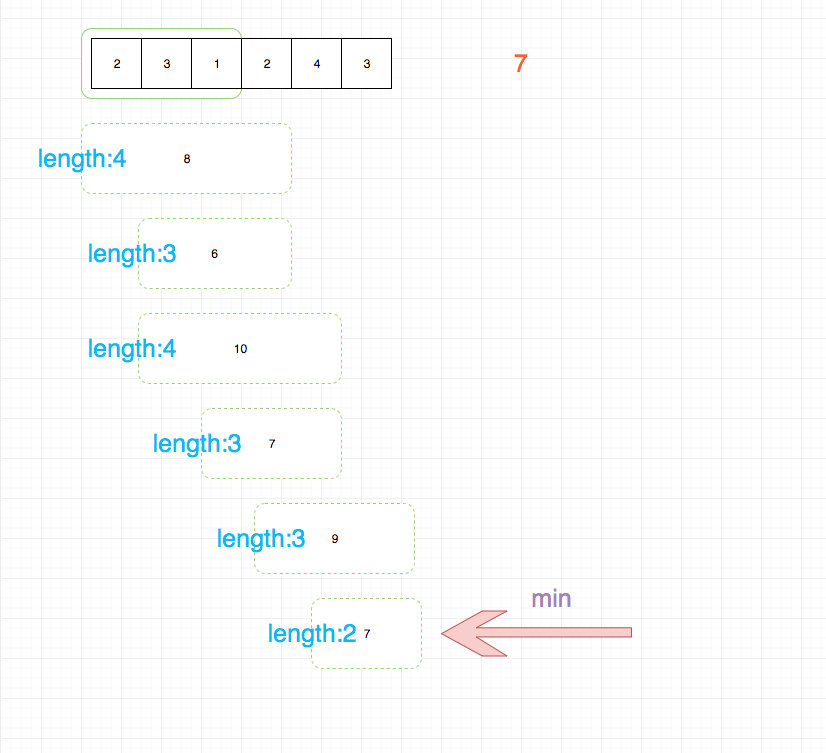

# 0209. 长度最小的子数组

## 题目地址(209. 长度最小的子数组)

<https://leetcode-cn.com/problems/minimum-size-subarray-sum/>

## 题目描述

```
<pre class="calibre18">```
给定一个含有 n 个正整数的数组和一个正整数 s ，找出该数组中满足其和 ≥ s 的长度最小的 连续 子数组，并返回其长度。如果不存在符合条件的子数组，返回 0。


示例：

输入：s = 7, nums = [2,3,1,2,4,3]
输出：2
解释：子数组 [4,3] 是该条件下的长度最小的子数组。


进阶：

如果你已经完成了 O(n) 时间复杂度的解法, 请尝试 O(n log n) 时间复杂度的解法。

```
```

## 前置知识

- 滑动窗口

## 公司

- 阿里
- 腾讯
- 百度
- 字节

## 思路

用滑动窗口来记录序列， 每当滑动窗口中的 sum 超过 s， 就去更新最小值，并根据先进先出的原则更新滑动窗口，直至 sum 刚好小于 s



> 这道题目和 leetcode 3 号题目有点像，都可以用滑动窗口的思路来解决

## 关键点

- 滑动窗口简化操作(滑窗口适合用于求解这种要求`连续`的题目)

## 代码

- 语言支持：JS，C++，Python

Python Code：

```
<pre class="calibre18">```

<span class="hljs-class"><span class="hljs-keyword">class</span> <span class="hljs-title">Solution</span>:</span>
    <span class="hljs-function"><span class="hljs-keyword">def</span> <span class="hljs-title">minSubArrayLen</span><span class="hljs-params">(self, s: int, nums: List[int])</span> -> int:</span>
        l = total = <span class="hljs-params">0</span>
        ans = len(nums) + <span class="hljs-params">1</span>
        <span class="hljs-keyword">for</span> r <span class="hljs-keyword">in</span> range(len(nums)):
            total += nums[r]
            <span class="hljs-keyword">while</span> total >= s:
                ans = min(ans, r - l + <span class="hljs-params">1</span>)
                total -= nums[l]
                l += <span class="hljs-params">1</span>
        <span class="hljs-keyword">return</span>  <span class="hljs-params">0</span> <span class="hljs-keyword">if</span> ans == len(nums) + <span class="hljs-params">1</span> <span class="hljs-keyword">else</span> ans

```
```

JavaScript Code：

```
<pre class="calibre18">```
<span class="hljs-title">/*
 * @lc app=leetcode id=209 lang=javascript
 *
 * [209] Minimum Size Subarray Sum
 *
 */</span>
<span class="hljs-title">/**
 * @param {number} s
 * @param {number[]} nums
 * @return {number}
 */</span>
<span class="hljs-keyword">var</span> minSubArrayLen = <span class="hljs-function"><span class="hljs-keyword">function</span>(<span class="hljs-params">s, nums</span>) </span>{
  <span class="hljs-keyword">if</span> (nums.length === <span class="hljs-params">0</span>) <span class="hljs-keyword">return</span> <span class="hljs-params">0</span>;
  <span class="hljs-keyword">const</span> slideWindow = [];
  <span class="hljs-keyword">let</span> acc = <span class="hljs-params">0</span>;
  <span class="hljs-keyword">let</span> min = <span class="hljs-params">null</span>;

  <span class="hljs-keyword">for</span> (<span class="hljs-keyword">let</span> i = <span class="hljs-params">0</span>; i < nums.length + <span class="hljs-params">1</span>; i++) {
    <span class="hljs-keyword">const</span> num = nums[i];

    <span class="hljs-keyword">while</span> (acc >= s) {
      <span class="hljs-keyword">if</span> (min === <span class="hljs-params">null</span> || slideWindow.length < min) {
        min = slideWindow.length;
      }
      acc = acc - slideWindow.shift();
    }

    slideWindow.push(num);

    acc = slideWindow.reduce((a, b) => a + b, <span class="hljs-params">0</span>);
  }

  <span class="hljs-keyword">return</span> min || <span class="hljs-params">0</span>;
};

```
```

C++ Code：

```
<pre class="calibre18">```
<span class="hljs-keyword">class</span> Solution {
<span class="hljs-keyword">public</span>:
    <span class="hljs-function"><span class="hljs-keyword">int</span> <span class="hljs-title">minSubArrayLen</span><span class="hljs-params">(<span class="hljs-keyword">int</span> s, <span class="hljs-params">vector</span><<span class="hljs-keyword">int</span>>& nums)</span> </span>{
        <span class="hljs-keyword">int</span> num_len= nums.size();
        <span class="hljs-keyword">int</span> left=<span class="hljs-params">0</span>, right=<span class="hljs-params">0</span>, total=<span class="hljs-params">0</span>, min_len= num_len+<span class="hljs-params">1</span>;
        <span class="hljs-keyword">while</span> (right < num_len) {
            <span class="hljs-keyword">do</span> {
                total += nums[right++];
            } <span class="hljs-keyword">while</span> (right < num_len && total < s);
            <span class="hljs-keyword">while</span> (left < right && total - nums[left] >= s) total -= nums[left++];
            <span class="hljs-keyword">if</span> (total >=s && min_len > right - left)
                min_len = right- left;
        }
        <span class="hljs-keyword">return</span> min_len <= num_len ? min_len: <span class="hljs-params">0</span>;
    }
};

```
```

**复杂度分析**

- 时间复杂度：O(N)O(N)O(N)，其中 N 为数组大小。
- 空间复杂度：O(1)O(1)O(1)

欢迎关注我的公众号《脑洞前端》获取更多更新鲜的LeetCode题解


## 扩展

如果题目要求是 sum = s, 而不是 sum >= s 呢？

eg:

```
<pre class="calibre18">```
<span class="hljs-keyword">var</span> minSubArrayLen = <span class="hljs-function"><span class="hljs-keyword">function</span>(<span class="hljs-params">s, nums</span>) </span>{
  <span class="hljs-keyword">if</span> (nums.length === <span class="hljs-params">0</span>) <span class="hljs-keyword">return</span> <span class="hljs-params">0</span>;
  <span class="hljs-keyword">const</span> slideWindow = [];
  <span class="hljs-keyword">let</span> acc = <span class="hljs-params">0</span>;
  <span class="hljs-keyword">let</span> min = <span class="hljs-params">null</span>;

  <span class="hljs-keyword">for</span> (<span class="hljs-keyword">let</span> i = <span class="hljs-params">0</span>; i < nums.length + <span class="hljs-params">1</span>; i++) {
    <span class="hljs-keyword">const</span> num = nums[i];

    <span class="hljs-keyword">while</span> (acc > s) {
      acc = acc - slideWindow.shift();
    }
    <span class="hljs-keyword">if</span> (acc === s) {
      <span class="hljs-keyword">if</span> (min === <span class="hljs-params">null</span> || slideWindow.length < min) {
        min = slideWindow.length;
      }
      slideWindow.shift();
    }

    slideWindow.push(num);

    acc = slideWindow.reduce((a, b) => a + b, <span class="hljs-params">0</span>);
  }

  <span class="hljs-keyword">return</span> min || <span class="hljs-params">0</span>;
};

```
```

大家对此有何看法，欢迎给我留言，我有时间都会一一查看回答。更多算法套路可以访问我的 LeetCode 题解仓库：<https://github.com/azl397985856/leetcode> 。 目前已经 37K star 啦。 大家也可以关注我的公众号《力扣加加》带你啃下算法这块硬骨头。 