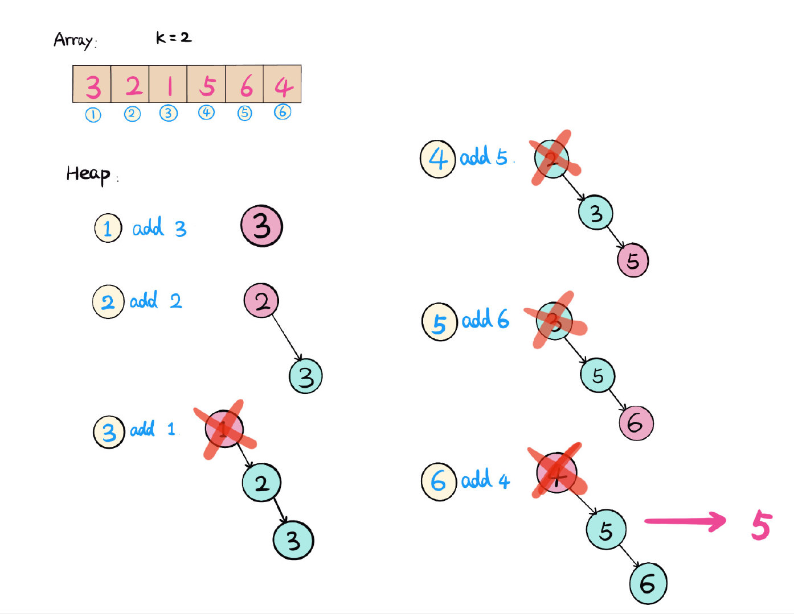
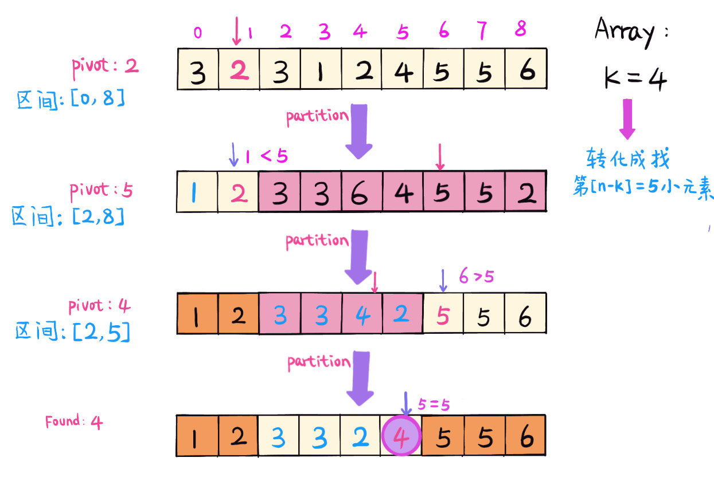

# 0215. 数组中的第K个最大元素

## 题目地址(215. 数组中的第K个最大元素)

<https://leetcode-cn.com/problems/kth-largest-element-in-an-array/>

## 题目描述

```
<pre class="calibre18">```

在未排序的数组中找到第 k 个最大的元素。请注意，你需要找的是数组排序后的第 k 个最大的元素，而不是第 k 个不同的元素。

示例 1:

输入: [3,2,1,5,6,4] 和 k = 2
输出: 5
示例 2:

输入: [3,2,3,1,2,4,5,5,6] 和 k = 4
输出: 4
说明:

你可以假设 k 总是有效的，且 1 ≤ k ≤ 数组的长度。

```
```

## 前置知识

- 堆
- Quick Select

## 公司

- 阿里
- 腾讯
- 百度
- 字节

## 思路

这道题要求在一个无序的数组中，返回第K大的数。根据时间复杂度不同，这题有3种不同的解法。

#### 解法一 （排序）

很直观的解法就是给数组排序，这样求解第`K`大的数，就等于是从小到大排好序的数组的第`(n-K)`小的数 (n 是数组的长度）。

例如：

```
<pre class="calibre18">```
[3,2,1,5,6,4], k = 2
1. 数组排序：
 [1,2,3,4,5,6]，
2. 找第（n-k）小的数
 n-k=4, nums[4]=5 (第2大的数）

```
```

*时间复杂度:*`O(nlogn) - n 是数组长度。`

#### 解法二 - 小顶堆（Heap）

可以维护一个大小为`K`的小顶堆，堆顶是最小元素，当堆的`size > K` 的时候，删除堆顶元素. 扫描一遍数组，最后堆顶就是第`K`大的元素。 直接返回。

例如： 

*时间复杂度*：`O(n * logk) ,  n is array length`*空间复杂度*：`O(k)`

跟排序相比，以空间换时间。

#### 解法三 - Quick Select

Quick Select 类似快排，选取pivot，把小于pivot的元素都移到pivot之前，这样pivot所在位置就是第pivot index 小的元素。 但是不需要完全给数组排序，只要找到当前pivot的位置是否是在第(n-k)小的位置，如果是，找到第k大的数直接返回。

具体步骤：

```
<pre class="calibre18">```
1. 在数组区间随机取`pivot index = left + random[right-left]`. 
2. 根据pivot 做 partition，在数组区间，把小于pivot的数都移到pivot左边。
3. 得到pivot的位置 index，`compare(index, (n-k))`.
    a. index == n-k -> 找到第`k`大元素，直接返回结果。
    b. index < n-k -> 说明在`index`右边，继续找数组区间`[index+1, right]`
    c. index > n-k -> 那么第`k`大数在`index`左边，继续查找数组区间`[left, index-1]`.

例子，【3,2,3,1,2,4,5,5,6]， k = 4

如下图：

```
```



*时间复杂度*：

- 平均是：`O(n)`
- 最坏的情况是：`O(n * n)`

## 关键点分析

1. 直接排序很简单
2. 堆（Heap）主要是要维护一个K大小的小顶堆，扫描一遍数组，最后堆顶元素即是所求。
3. Quick Select, 关键是是取pivot，对数组区间做partition，比较pivot的位置，类似二分，取pivot左边或右边继续递归查找。

## 代码（Java code）

*解法一 - 排序*

```
<pre class="calibre18">```
<span class="hljs-class"><span class="hljs-keyword">class</span> <span class="hljs-title">KthLargestElementSort</span> </span>{
 <span class="hljs-function"><span class="hljs-keyword">public</span> <span class="hljs-keyword">int</span> <span class="hljs-title">findKthlargest2</span><span class="hljs-params">(<span class="hljs-keyword">int</span>[] nums, <span class="hljs-keyword">int</span> k)</span> </span>{
    Arrays.sort(nums);
    <span class="hljs-keyword">return</span> nums[nums.length - k];
  }
}

```
```

*解法二 - Heap （PriorityQueue）*

```
<pre class="calibre18">```
<span class="hljs-class"><span class="hljs-keyword">class</span> <span class="hljs-title">KthLargestElementHeap</span> </span>{
  <span class="hljs-function"><span class="hljs-keyword">public</span> <span class="hljs-keyword">int</span> <span class="hljs-title">findKthLargest</span><span class="hljs-params">(<span class="hljs-keyword">int</span>[] nums, <span class="hljs-keyword">int</span> k)</span> </span>{
      PriorityQueue<Integer> pq = <span class="hljs-keyword">new</span> PriorityQueue<>();
      <span class="hljs-keyword">for</span> (<span class="hljs-keyword">int</span> num : nums) {
        pq.offer(num);
        <span class="hljs-keyword">if</span> (pq.size() > k) {
          pq.poll();
        }
      }
      <span class="hljs-keyword">return</span> pq.poll();
  }
}

```
```

*解法三 - Quick Select*

```
<pre class="calibre18">```
<span class="hljs-class"><span class="hljs-keyword">class</span> <span class="hljs-title">KthLargestElementQuickSelect</span> </span>{
    <span class="hljs-keyword">static</span> Random random = <span class="hljs-keyword">new</span> Random();
    <span class="hljs-function"><span class="hljs-keyword">public</span> <span class="hljs-keyword">int</span> <span class="hljs-title">findKthLargest3</span><span class="hljs-params">(<span class="hljs-keyword">int</span>[] nums, <span class="hljs-keyword">int</span> k)</span> </span>{
      <span class="hljs-keyword">int</span> len = nums.length;
      <span class="hljs-keyword">return</span> select(nums, <span class="hljs-params">0</span>, len - <span class="hljs-params">1</span>, len - k);
    }

    <span class="hljs-function"><span class="hljs-keyword">private</span> <span class="hljs-keyword">int</span> <span class="hljs-title">select</span><span class="hljs-params">(<span class="hljs-keyword">int</span>[] nums, <span class="hljs-keyword">int</span> left, <span class="hljs-keyword">int</span> right, <span class="hljs-keyword">int</span> k)</span> </span>{
      <span class="hljs-keyword">if</span> (left == right) <span class="hljs-keyword">return</span> nums[left];
      <span class="hljs-title">// random select pivotIndex between left and right</span>
      <span class="hljs-keyword">int</span> pivotIndex = left + random.nextInt(right - left);
      <span class="hljs-title">// do partition, move smaller than pivot number into pivot left</span>
      <span class="hljs-keyword">int</span> pos = partition(nums, left, right, pivotIndex);
      <span class="hljs-keyword">if</span> (pos == k) {
        <span class="hljs-keyword">return</span> nums[pos];
      } <span class="hljs-keyword">else</span> <span class="hljs-keyword">if</span> (pos > k) {
        <span class="hljs-keyword">return</span> select(nums, left, pos - <span class="hljs-params">1</span>, k);
      } <span class="hljs-keyword">else</span> {
        <span class="hljs-keyword">return</span> select(nums, pos + <span class="hljs-params">1</span>, right, k);
      }
    }

    <span class="hljs-function"><span class="hljs-keyword">private</span> <span class="hljs-keyword">int</span> <span class="hljs-title">partition</span><span class="hljs-params">(<span class="hljs-keyword">int</span>[] nums, <span class="hljs-keyword">int</span> left, <span class="hljs-keyword">int</span> right, <span class="hljs-keyword">int</span> pivotIndex)</span> </span>{
      <span class="hljs-keyword">int</span> pivot = nums[pivotIndex];
      <span class="hljs-title">// move pivot to end</span>
      swap(nums, right, pivotIndex);
      <span class="hljs-keyword">int</span> pos = left;
      <span class="hljs-title">// move smaller num to pivot left</span>
      <span class="hljs-keyword">for</span> (<span class="hljs-keyword">int</span> i = left; i <= right; i++) {
        <span class="hljs-keyword">if</span> (nums[i] < pivot) {
          swap(nums, pos++, i);
        }
      }
      <span class="hljs-title">// move pivot to original place</span>
      swap(nums, right, pos);
      <span class="hljs-keyword">return</span> pos;
    }

    <span class="hljs-function"><span class="hljs-keyword">private</span> <span class="hljs-keyword">void</span> <span class="hljs-title">swap</span><span class="hljs-params">(<span class="hljs-keyword">int</span>[] nums, <span class="hljs-keyword">int</span> i, <span class="hljs-keyword">int</span> j)</span> </span>{
      <span class="hljs-keyword">int</span> tmp = nums[i];
      nums[i] = nums[j];
      nums[j] = tmp;
    }
}

```
```

## 参考（References）

1. [Quick Select Wiki](https://en.wikipedia.org/wiki/Quickselect)