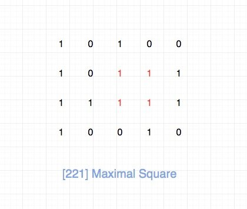
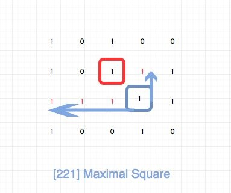
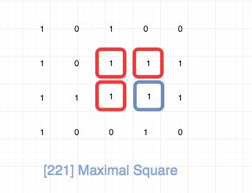

# 0221. 最大正方形

## 题目地址(221. 最大正方形)

<https://leetcode-cn.com/problems/maximal-square/>

## 题目描述

```
<pre class="calibre18">```
在一个由 0 和 1 组成的二维矩阵内，找到只包含 1 的最大正方形，并返回其面积。

示例:

输入: 

1 0 1 0 0
1 0 1 1 1
1 1 1 1 1
1 0 0 1 0

输出: 4

```
```

## 前置知识

- 动态规划
- 递归

## 公司

- 阿里
- 腾讯
- 百度
- 字节

## 思路



符合直觉的做法是暴力求解处所有的正方形，逐一计算面积，然后记录最大的。这种时间复杂度很高。

我们考虑使用动态规划，我们使用dp\[i\]\[j\]表示以matrix\[i\]\[j\]为右下角的顶点的可以组成的最大正方形的边长。 那么我们只需要计算所有的i，j组合，然后求出最大值即可。

我们来看下dp\[i\]\[j\] 怎么推导。 首先我们要看matrix\[i\]\[j\], 如果matrix\[i\]\[j\]等于0，那么就不用看了，直接等于0。 如果matrix\[i\]\[j\]等于1，那么我们将matrix\[\[i\]\[j\]分别往上和往左进行延伸，直到碰到一个0为止。

如图 dp\[3\]\[3\] 的计算。 matrix\[3\]\[3\]等于1，我们分别往上和往左进行延伸，直到碰到一个0为止，上面长度为1，左边为3。 dp\[2\]\[2\]等于1（之前已经计算好了），那么其实这里的瓶颈在于三者的最小值, 即`Min(1, 1, 3)`, 也就是`1`。 那么dp\[3\]\[3\] 就等于 `Min(1, 1, 3) + 1`。



dp\[i - 1\]\[j - 1\]我们直接拿到，关键是`往上和往左进行延伸`, 最直观的做法是我们内层加一个循环去做就好了。 但是我们仔细观察一下，其实我们根本不需要这样算。 我们可以直接用dp\[i - 1\]\[j\]和dp\[i\]\[j -1\]。 具体就是`Min(dp[i - 1][j - 1], dp[i][j - 1], dp[i - 1][j]) + 1`。



事实上，这道题还有空间复杂度O(N)的解法，其中N指的是列数。 大家可以去这个[leetcode讨论](https://leetcode.com/problems/maximal-square/discuss/61803/C%2B%2B-space-optimized-DP)看一下。

## 关键点解析

- DP
- 递归公式可以利用dp\[i - 1\]\[j\]和dp\[i\]\[j -1\]的计算结果，而不用重新计算
- 空间复杂度可以降低到O(n), n为列数

## 代码

代码支持：Python，JavaScript：

Python Code：

```
<pre class="calibre18">```
<span class="hljs-class"><span class="hljs-keyword">class</span> <span class="hljs-title">Solution</span>:</span>
    <span class="hljs-function"><span class="hljs-keyword">def</span> <span class="hljs-title">maximalSquare</span><span class="hljs-params">(self, matrix: List[List[str]])</span> -> int:</span>
        res = <span class="hljs-params">0</span>
        m = len(matrix)
        <span class="hljs-keyword">if</span> m == <span class="hljs-params">0</span>:
            <span class="hljs-keyword">return</span> <span class="hljs-params">0</span>
        n = len(matrix[<span class="hljs-params">0</span>])
        dp = [[<span class="hljs-params">0</span>] * (n + <span class="hljs-params">1</span>) <span class="hljs-keyword">for</span> _ <span class="hljs-keyword">in</span> range(m + <span class="hljs-params">1</span>)]

        <span class="hljs-keyword">for</span> i <span class="hljs-keyword">in</span> range(<span class="hljs-params">1</span>, m + <span class="hljs-params">1</span>):
            <span class="hljs-keyword">for</span> j <span class="hljs-keyword">in</span> range(<span class="hljs-params">1</span>, n + <span class="hljs-params">1</span>):
                dp[i][j] = min(dp[i - <span class="hljs-params">1</span>][j], dp[i][j - <span class="hljs-params">1</span>], dp[i - <span class="hljs-params">1</span>][j - <span class="hljs-params">1</span>]) + <span class="hljs-params">1</span> <span class="hljs-keyword">if</span> matrix[i - <span class="hljs-params">1</span>][j - <span class="hljs-params">1</span>] == <span class="hljs-string">"1"</span> <span class="hljs-keyword">else</span> <span class="hljs-params">0</span>
                res = max(res, dp[i][j])
        <span class="hljs-keyword">return</span> res ** <span class="hljs-params">2</span>

```
```

JavaScript Code：

```
<pre class="calibre18">```

<span class="hljs-title">/*
 * @lc app=leetcode id=221 lang=javascript
 *
 * [221] Maximal Square
 */</span>
<span class="hljs-title">/**
 * @param {character[][]} matrix
 * @return {number}
 */</span>
<span class="hljs-keyword">var</span> maximalSquare = <span class="hljs-function"><span class="hljs-keyword">function</span>(<span class="hljs-params">matrix</span>) </span>{
  <span class="hljs-keyword">if</span> (matrix.length === <span class="hljs-params">0</span>) <span class="hljs-keyword">return</span> <span class="hljs-params">0</span>;
  <span class="hljs-keyword">const</span> dp = [];
  <span class="hljs-keyword">const</span> rows = matrix.length;
  <span class="hljs-keyword">const</span> cols = matrix[<span class="hljs-params">0</span>].length;
  <span class="hljs-keyword">let</span> max = <span class="hljs-params">Number</span>.MIN_VALUE;

  <span class="hljs-keyword">for</span> (<span class="hljs-keyword">let</span> i = <span class="hljs-params">0</span>; i < rows + <span class="hljs-params">1</span>; i++) {
    <span class="hljs-keyword">if</span> (i === <span class="hljs-params">0</span>) {
      dp[i] = <span class="hljs-params">Array</span>(cols + <span class="hljs-params">1</span>).fill(<span class="hljs-params">0</span>);
    } <span class="hljs-keyword">else</span> {
      dp[i] = [<span class="hljs-params">0</span>];
    }
  }

  <span class="hljs-keyword">for</span> (<span class="hljs-keyword">let</span> i = <span class="hljs-params">1</span>; i < rows + <span class="hljs-params">1</span>; i++) {
    <span class="hljs-keyword">for</span> (<span class="hljs-keyword">let</span> j = <span class="hljs-params">1</span>; j < cols + <span class="hljs-params">1</span>; j++) {
      <span class="hljs-keyword">if</span> (matrix[i - <span class="hljs-params">1</span>][j - <span class="hljs-params">1</span>] === <span class="hljs-string">"1"</span>) {
        dp[i][j] = <span class="hljs-params">Math</span>.min(dp[i - <span class="hljs-params">1</span>][j - <span class="hljs-params">1</span>], dp[i - <span class="hljs-params">1</span>][j], dp[i][j - <span class="hljs-params">1</span>]) + <span class="hljs-params">1</span>;
        max = <span class="hljs-params">Math</span>.max(max, dp[i][j]);
      } <span class="hljs-keyword">else</span> {
        dp[i][j] = <span class="hljs-params">0</span>;
      }
    }
  }

  <span class="hljs-keyword">return</span> max * max;
};

```
```

***复杂度分析***

- 时间复杂度：O(M∗N)O(M \* N)O(M∗N)，其中M为行数，N为列数。
- 空间复杂度：O(M∗N)O(M \* N)O(M∗N)，其中M为行数，N为列数。