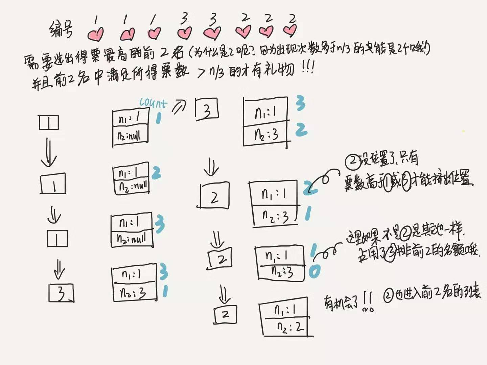

# 0229. 求众数 II

## 题目地址(229. 求众数 II)

<https://leetcode-cn.com/problems/majority-element-ii/>

## 题目描述

```
<pre class="calibre18">```
给定一个大小为 n 的数组，找出其中所有出现超过 ⌊ n/3 ⌋ 次的元素。

进阶：尝试设计时间复杂度为 O(n)、空间复杂度为 O(1)的算法解决此问题。


示例 1：

输入：[3,2,3]
输出：[3]
示例 2：

输入：nums = [1]
输出：[1]
示例 3：

输入：[1,1,1,3,3,2,2,2]
输出：[1,2]


提示：

1 <= nums.length <= 5 * 104
-109 <= nums[i] <= 109

```
```

## 前置知识

- 摩尔投票法

## 公司

- 阿里
- 腾讯
- 百度
- 字节

## 思路

这道题目和[169.majority-element](169.majority-element.html) 很像。

我们仍然可以采取同样的方法 - “摩尔投票法”， 具体的思路可以参考上面的题目。

但是这里有一个不同的是这里的众数不再是超过`1 / 2`,而是超过`1 / 3`。 题目也说明了，超过三分之一的有可能有多个（实际上就是0，1，2三种可能）。

因此我们不能只用一个counter来解决了。 我们的思路是同时使用两个counter，其他思路和上一道题目一样。

最后需要注意的是两个counter不一定都满足条件，这两个counter只是出现次数最多的两个数字。 有可能不满足出现次数大于1/3， 因此最后我们需要进行过滤筛选。

这里画了一个图，大家可以感受一下：




## 关键点解析

- 摩尔投票法
- 两个counter
- 最后得到的只是出现次数最多的两个数字，有可能不满足出现次数大于1/3

## 代码

JavaScript代码：

```
<pre class="calibre18">```
<span class="hljs-title">/*
 * @lc app=leetcode id=229 lang=javascript
 *
 * [229] Majority Element II
 */</span>
<span class="hljs-title">/**
 * @param {number[]} nums
 * @return {number[]}
 */</span>
<span class="hljs-keyword">var</span> majorityElement = <span class="hljs-function"><span class="hljs-keyword">function</span>(<span class="hljs-params">nums</span>) </span>{
  <span class="hljs-keyword">const</span> res = [];
  <span class="hljs-keyword">const</span> len = nums.length;
  <span class="hljs-keyword">let</span> n1 = <span class="hljs-params">null</span>,
    n2 = <span class="hljs-params">null</span>,
    cnt1 = <span class="hljs-params">0</span>,
    cnt2 = <span class="hljs-params">0</span>;

  <span class="hljs-keyword">for</span> (<span class="hljs-keyword">let</span> i = <span class="hljs-params">0</span>; i < len; i++) {
    <span class="hljs-keyword">if</span> (n1 === nums[i]) {
      cnt1++;
    } <span class="hljs-keyword">else</span> <span class="hljs-keyword">if</span> (n2 === nums[i]) {
      cnt2++;
    } <span class="hljs-keyword">else</span> <span class="hljs-keyword">if</span> (cnt1 === <span class="hljs-params">0</span>) {
      n1 = nums[i];
      cnt1++;
    } <span class="hljs-keyword">else</span> <span class="hljs-keyword">if</span> (cnt2 === <span class="hljs-params">0</span>) {
      n2 = nums[i];
      cnt2++;
    } <span class="hljs-keyword">else</span> {
      cnt1--;
      cnt2--;
    }
  }

  cnt1 = <span class="hljs-params">0</span>;
  cnt2 = <span class="hljs-params">0</span>;

  <span class="hljs-keyword">for</span> (<span class="hljs-keyword">let</span> i = <span class="hljs-params">0</span>; i < len; i++) {
    <span class="hljs-keyword">if</span> (n1 === nums[i]) {
      cnt1++;
    } <span class="hljs-keyword">else</span> <span class="hljs-keyword">if</span> (n2 === nums[i]) {
      cnt2++;
    }
  }

  <span class="hljs-keyword">if</span> (cnt1 > (len / <span class="hljs-params">3</span>) >>> <span class="hljs-params">0</span>) {
    res.push(n1);
  }
  <span class="hljs-keyword">if</span> (cnt2 > (len / <span class="hljs-params">3</span>) >>> <span class="hljs-params">0</span>) {
    res.push(n2);
  }

  <span class="hljs-keyword">return</span> res;
};

```
```

Java代码：

```
<pre class="calibre18">```
<span class="hljs-title">/*
 * @lc app=leetcode id=229 lang=java
 *
 * [229] Majority Element II
 */</span>
<span class="hljs-class"><span class="hljs-keyword">class</span> <span class="hljs-title">Solution</span> </span>{
    <span class="hljs-function"><span class="hljs-keyword">public</span> List<Integer> <span class="hljs-title">majorityElement</span><span class="hljs-params">(<span class="hljs-keyword">int</span>[] nums)</span> </span>{
        List<Integer> res = <span class="hljs-keyword">new</span> ArrayList<Integer>();
        <span class="hljs-keyword">if</span> (nums == <span class="hljs-keyword">null</span> || nums.length == <span class="hljs-params">0</span>)
            <span class="hljs-keyword">return</span> res;
        <span class="hljs-keyword">int</span> n1 = nums[<span class="hljs-params">0</span>], n2 = nums[<span class="hljs-params">0</span>], cnt1 = <span class="hljs-params">0</span>, cnt2 = <span class="hljs-params">0</span>, len = nums.length;
        <span class="hljs-keyword">for</span> (<span class="hljs-keyword">int</span> i = <span class="hljs-params">0</span>; i < len; i++) {
            <span class="hljs-keyword">if</span> (nums[i] == n1)
                cnt1++;
            <span class="hljs-keyword">else</span> <span class="hljs-keyword">if</span> (nums[i] == n2)
                cnt2++;
            <span class="hljs-keyword">else</span> <span class="hljs-keyword">if</span> (cnt1 == <span class="hljs-params">0</span>) {
                n1 = nums[i];
                cnt1 = <span class="hljs-params">1</span>;
            } <span class="hljs-keyword">else</span> <span class="hljs-keyword">if</span> (cnt2 == <span class="hljs-params">0</span>) {
                n2 = nums[i];
                cnt2 = <span class="hljs-params">1</span>;
            } <span class="hljs-keyword">else</span> {
                cnt1--;
                cnt2--;
            }
        }
        cnt1 = <span class="hljs-params">0</span>;
        cnt2 = <span class="hljs-params">0</span>;
        <span class="hljs-keyword">for</span> (<span class="hljs-keyword">int</span> i = <span class="hljs-params">0</span>; i < len; i++) {
            <span class="hljs-keyword">if</span> (nums[i] == n1)
                cnt1++;
            <span class="hljs-keyword">else</span> <span class="hljs-keyword">if</span> (nums[i] == n2)
                cnt2++;
        }
        <span class="hljs-keyword">if</span> (cnt1 > len / <span class="hljs-params">3</span>)
            res.add(n1);
        <span class="hljs-keyword">if</span> (cnt2 > len / <span class="hljs-params">3</span> && n1 != n2)
            res.add(n2);
        <span class="hljs-keyword">return</span> res;
    }
}

```
```

**复杂度分析**

- 时间复杂度：O(N)O(N)O(N)
- 空间复杂度：O(1)O(1)O(1)

## 扩展

如果题目中3变成了k，怎么解决？

大家可以自己思考一下，我这里给一个参考链接：<https://leetcode.com/problems/majority-element-ii/discuss/63500/JAVA-Easy-Version-To-Understand!!!!!!!!!!!!/64925>

这个实现说实话不是很好，大家可以优化一下。

大家对此有何看法，欢迎给我留言，我有时间都会一一查看回答。更多算法套路可以访问我的 LeetCode 题解仓库：<https://github.com/azl397985856/leetcode> 。 目前已经 37K star 啦。 大家也可以关注我的公众号《力扣加加》带你啃下算法这块硬骨头。 