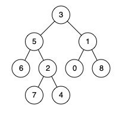
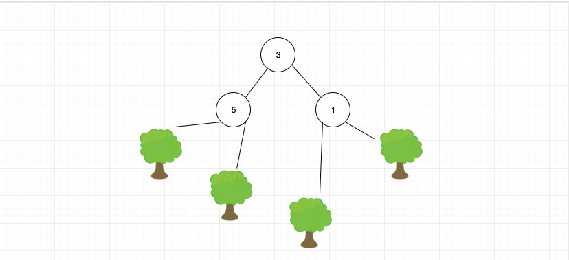

# 0236. 二叉树的最近公共祖先

## 题目地址(236. 二叉树的最近公共祖先)

<https://leetcode-cn.com/problems/lowest-common-ancestor-of-a-binary-tree/>

## 题目描述

```
<pre class="calibre18">```
给定一个二叉树, 找到该树中两个指定节点的最近公共祖先。

百度百科中最近公共祖先的定义为：“对于有根树 T 的两个结点 p、q，最近公共祖先表示为一个结点 x，满足 x 是 p、q 的祖先且 x 的深度尽可能大（一个节点也可以是它自己的祖先）。”

例如，给定如下二叉树:  root = [3,5,1,6,2,0,8,null,null,7,4]

```
```



```
<pre class="calibre18">```
示例 1:

输入: root = [3,5,1,6,2,0,8,null,null,7,4], p = 5, q = 1
输出: 3
解释: 节点 5 和节点 1 的最近公共祖先是节点 3。
示例 2:

输入: root = [3,5,1,6,2,0,8,null,null,7,4], p = 5, q = 4
输出: 5
解释: 节点 5 和节点 4 的最近公共祖先是节点 5。因为根据定义最近公共祖先节点可以为节点本身。


说明:

所有节点的值都是唯一的。
p、q 为不同节点且均存在于给定的二叉树中。

```
```

## 前置知识

- 递归

## 公司

- 阿里
- 腾讯
- 百度
- 字节

## 思路

这道题目是求解二叉树中，两个给定节点的最近的公共祖先。是一道非常经典的二叉树题目。

我们之前说过树是一种递归的数据结构，因此使用递归方法解决二叉树问题从写法上来看是最简单的，这道题目也不例外。

用递归的思路去思考树是一种非常重要的能力。

如果大家这样去思考的话，问题就会得到简化，我们的目标就是分别在左右子树进行查找p和q。 如果p没有在左子树，那么它一定在右子树（题目限定p一定在树中）， 反之亦然。

对于具体的代码而言就是，我们假设这个树就一个结构，然后尝试去解决，然后在适当地方去递归自身即可。 如下图所示：



我们来看下核心代码：

```
<pre class="calibre18">```
  <span class="hljs-title">// 如果我们找到了p，直接进行返回，那如果下面就是q呢？ 其实这没有影响，但是还是要多考虑一下</span>
  <span class="hljs-keyword">if</span> (!root || root === p || root === q) <span class="hljs-keyword">return</span> root;
  <span class="hljs-keyword">const</span> left = lowestCommonAncestor(root.left, p, q); <span class="hljs-title">// 去左边找，我们期望返回找到的节点</span>
  <span class="hljs-keyword">const</span> right = lowestCommonAncestor(root.right, p, q);<span class="hljs-title">// 去右边找，我们期望返回找到的节点</span>
  <span class="hljs-keyword">if</span> (!left) <span class="hljs-keyword">return</span> right; <span class="hljs-title">// 左子树找不到，返回右子树</span>
  <span class="hljs-keyword">if</span> (!right) <span class="hljs-keyword">return</span> left; <span class="hljs-title">// 右子树找不到，返回左子树</span>
  <span class="hljs-keyword">return</span> root; <span class="hljs-title">// 左右子树分别有一个，则返回root</span>

```
```

> 如果没有明白的话，请多花时间消化一下

## 关键点解析

- 用递归的思路去思考树

## 代码

代码支持： JavaScript， Python3

- JavaScript Code:

```
<pre class="calibre18">```
<span class="hljs-title">/**
 * Definition for a binary tree node.
 * function TreeNode(val) {
 *     this.val = val;
 *     this.left = this.right = null;
 * }
 */</span>
<span class="hljs-title">/**
 * @param {TreeNode} root
 * @param {TreeNode} p
 * @param {TreeNode} q
 * @return {TreeNode}
 */</span>
<span class="hljs-keyword">var</span> lowestCommonAncestor = <span class="hljs-function"><span class="hljs-keyword">function</span>(<span class="hljs-params">root, p, q</span>) </span>{
  <span class="hljs-keyword">if</span> (!root || root === p || root === q) <span class="hljs-keyword">return</span> root;
  <span class="hljs-keyword">const</span> left = lowestCommonAncestor(root.left, p, q);
  <span class="hljs-keyword">const</span> right = lowestCommonAncestor(root.right, p, q);
  <span class="hljs-keyword">if</span> (!left) <span class="hljs-keyword">return</span> right; <span class="hljs-title">// 左子树找不到，返回右子树</span>
  <span class="hljs-keyword">if</span> (!right) <span class="hljs-keyword">return</span> left; <span class="hljs-title">// 右子树找不到，返回左子树</span>
  <span class="hljs-keyword">return</span> root; <span class="hljs-title">// 左右子树分别有一个，则返回root</span>
};

```
```

- Python Code:

```
<pre class="calibre18">```
<span class="hljs-title"># Definition for a binary tree node.</span>
<span class="hljs-title"># class TreeNode:</span>
<span class="hljs-title">#     def __init__(self, x):</span>
<span class="hljs-title">#         self.val = x</span>
<span class="hljs-title">#         self.left = None</span>
<span class="hljs-title">#         self.right = None</span>

<span class="hljs-class"><span class="hljs-keyword">class</span> <span class="hljs-title">Solution</span>:</span>
    <span class="hljs-function"><span class="hljs-keyword">def</span> <span class="hljs-title">lowestCommonAncestor</span><span class="hljs-params">(self, root: <span class="hljs-string">'TreeNode'</span>, p: <span class="hljs-string">'TreeNode'</span>, q: <span class="hljs-string">'TreeNode'</span>)</span> -> 'TreeNode':</span>
        <span class="hljs-keyword">if</span> <span class="hljs-keyword">not</span> root <span class="hljs-keyword">or</span> root == p <span class="hljs-keyword">or</span> root == q:
            <span class="hljs-keyword">return</span> root
        left = self.lowestCommonAncestor(root.left, p, q)
        right = self.lowestCommonAncestor(root.right, p, q)

        <span class="hljs-keyword">if</span> <span class="hljs-keyword">not</span> left:
            <span class="hljs-keyword">return</span> right
        <span class="hljs-keyword">if</span> <span class="hljs-keyword">not</span> right:
            <span class="hljs-keyword">return</span> left
        <span class="hljs-keyword">else</span>:
            <span class="hljs-keyword">return</span> root

```
```

**复杂度分析**

- 时间复杂度：O(N)O(N)O(N)
- 空间复杂度：O(N)O(N)O(N)

## 扩展

如果递归的结束条件改为`if (!root || root.left === p || root.right === q) return root;` 代表的是什么意思，对结果有什么样的影响？

大家对此有何看法，欢迎给我留言，我有时间都会一一查看回答。更多算法套路可以访问我的 LeetCode 题解仓库：<https://github.com/azl397985856/leetcode> 。 目前已经 37K star 啦。 大家也可以关注我的公众号《力扣加加》带你啃下算法这块硬骨头。 