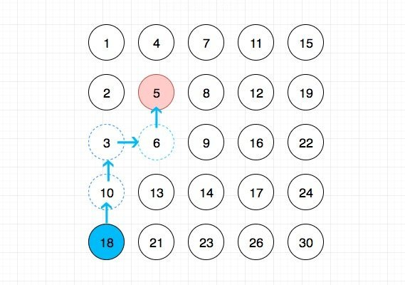

# 0240. 搜索二维矩阵 II

## 题目地址(240. 搜索二维矩阵 II)

<https://leetcode-cn.com/problems/search-a-2d-matrix-ii/>

## 题目描述

```
<pre class="calibre18">```

编写一个高效的算法来搜索 m x n 矩阵 matrix 中的一个目标值 target。该矩阵具有以下特性：

每行的元素从左到右升序排列。
每列的元素从上到下升序排列。
示例:

现有矩阵 matrix 如下：

[
  [1,   4,  7, 11, 15],
  [2,   5,  8, 12, 19],
  [3,   6,  9, 16, 22],
  [10, 13, 14, 17, 24],
  [18, 21, 23, 26, 30]
]
给定 target = 5，返回 true。

给定 target = 20，返回 false。

```
```

## 前置知识

- 数组

## 公司

- 阿里
- 腾讯
- 百度
- 字节

## 思路

符合直觉的做法是两层循环遍历，时间复杂度是O(m \* n), 有没有时间复杂度更好的做法呢？ 答案是有，那就是充分运用矩阵的特性（横向纵向都递增）， 我们可以从角落（左下或者右上）开始遍历，这样时间复杂度是O(m + n).



其中蓝色代表我们选择的起点元素， 红色代表目标元素。

## 关键点解析

- 从角落开始遍历，利用递增的特性简化时间复杂

## 代码

代码支持：JavaScript, Python3

JavaScript Code:

```
<pre class="calibre18">```

<span class="hljs-title">/*
 * @lc app=leetcode id=240 lang=javascript
 *
 * [240] Search a 2D Matrix II
 *
 * https://leetcode.com/problems/search-a-2d-matrix-ii/description/
 *
 * 
 */</span>
<span class="hljs-title">/**
 * @param {number[][]} matrix
 * @param {number} target
 * @return {boolean}
 */</span>
<span class="hljs-keyword">var</span> searchMatrix = <span class="hljs-function"><span class="hljs-keyword">function</span>(<span class="hljs-params">matrix, target</span>) </span>{
    <span class="hljs-keyword">if</span> (!matrix || matrix.length === <span class="hljs-params">0</span>) <span class="hljs-keyword">return</span> <span class="hljs-params">false</span>;

    <span class="hljs-keyword">let</span> colIndex = <span class="hljs-params">0</span>;
    <span class="hljs-keyword">let</span> rowIndex = matrix.length - <span class="hljs-params">1</span>;
    <span class="hljs-keyword">while</span>(rowIndex > <span class="hljs-params">0</span> && target < matrix[rowIndex][colIndex]) {
        rowIndex --;
    }

    <span class="hljs-keyword">while</span>(colIndex < matrix[<span class="hljs-params">0</span>].length) {
        <span class="hljs-keyword">if</span> (target === matrix[rowIndex][colIndex]) <span class="hljs-keyword">return</span> <span class="hljs-params">true</span>;
        <span class="hljs-keyword">if</span> (target > matrix[rowIndex][colIndex]) {
            colIndex ++;
        } <span class="hljs-keyword">else</span> <span class="hljs-keyword">if</span> (rowIndex > <span class="hljs-params">0</span>){
            rowIndex --;
        } <span class="hljs-keyword">else</span> {
            <span class="hljs-keyword">return</span> <span class="hljs-params">false</span>;
        }
    }

    <span class="hljs-keyword">return</span>  <span class="hljs-params">false</span>;
};

```
```

Python Code:

```
<pre class="calibre18">```
<span class="hljs-class"><span class="hljs-keyword">class</span> <span class="hljs-title">Solution</span>:</span>
    <span class="hljs-function"><span class="hljs-keyword">def</span> <span class="hljs-title">searchMatrix</span><span class="hljs-params">(self, matrix, target)</span>:</span>
        m = len(matrix)
        <span class="hljs-keyword">if</span> m == <span class="hljs-params">0</span>:
            <span class="hljs-keyword">return</span> <span class="hljs-keyword">False</span>
        n = len(matrix[<span class="hljs-params">0</span>])
        i = m - <span class="hljs-params">1</span>
        j = <span class="hljs-params">0</span>

        <span class="hljs-keyword">while</span> i >= <span class="hljs-params">0</span> <span class="hljs-keyword">and</span> j < n:
            <span class="hljs-keyword">if</span> matrix[i][j] == target:
                <span class="hljs-keyword">return</span> <span class="hljs-keyword">True</span>
            <span class="hljs-keyword">if</span> matrix[i][j] > target:
                i -= <span class="hljs-params">1</span>
            <span class="hljs-keyword">else</span>:
                j += <span class="hljs-params">1</span>
        <span class="hljs-keyword">return</span> <span class="hljs-keyword">False</span>

```
```

**复杂度分析**

- 时间复杂度：O(M+N)O(M + N)O(M+N)
- 空间复杂度：O(1)O(1)O(1)

大家对此有何看法，欢迎给我留言，我有时间都会一一查看回答。更多算法套路可以访问我的 LeetCode 题解仓库：<https://github.com/azl397985856/leetcode> 。 目前已经 37K star 啦。 大家也可以关注我的公众号《力扣加加》带你啃下算法这块硬骨头。 