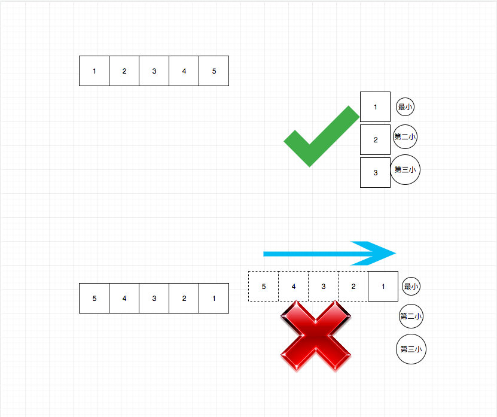

# 0334. 递增的三元子序列

## 题目地址(334. 递增的三元子序列)

<https://leetcode-cn.com/problems/increasing-triplet-subsequence/>

## 题目描述

```
<pre class="calibre18">```
给定一个未排序的数组，判断这个数组中是否存在长度为 3 的递增子序列。

数学表达式如下:

如果存在这样的 i, j, k,  且满足 0 ≤ i < j < k ≤ n-1，
使得 arr[i] < arr[j] < arr[k] ，返回 true ; 否则返回 false 。
说明: 要求算法的时间复杂度为 O(n)，空间复杂度为 O(1) 。

示例 1:

输入: [1,2,3,4,5]
输出: true
示例 2:

输入: [5,4,3,2,1]
输出: false

```
```

## 前置知识

- 双指针

## 公司

- 百度
- 字节

## 思路

这道题是求解顺序数字是否有三个递增的排列， 注意这里没有要求连续的，因此诸如滑动窗口的思路是不可以的。 题目要求O(n)的时间复杂度和O(1)的空间复杂度，因此暴力的做法就不用考虑了。

我们的目标就是`依次`找到三个数字，其顺序是递增的。因此我们的做法可以是依次遍历， 然后维护三个变量，分别记录最小值，第二小值，第三小值。只要我们能够填满这三个变量就返回true，否则返回false。



## 关键点解析

- 维护三个变量，分别记录最小值，第二小值，第三小值。只要我们能够填满这三个变量就返回true，否则返回false

## 代码

```
<pre class="calibre18">```


<span class="hljs-title">/*
 * @lc app=leetcode id=334 lang=javascript
 *
 * [334] Increasing Triplet Subsequence
 *
 * https://leetcode.com/problems/increasing-triplet-subsequence/description/
 *
 * algorithms
 * Medium (39.47%)
 * Total Accepted:    89.6K
 * Total Submissions: 226.6K
 * Testcase Example:  '[1,2,3,4,5]'
 *
 * Given an unsorted array return whether an increasing subsequence of length 3
 * exists or not in the array.
 * 
 * Formally the function should:
 * 
 * Return true if there exists i, j, k 
 * such that arr[i] < arr[j] < arr[k] given 0 ≤ i < j < k ≤ n-1 else return
 * false.
 * 
 * Note: Your algorithm should run in O(n) time complexity and O(1) space
 * complexity.
 * 
 * 
 * Example 1:
 * 
 * 
 * Input: [1,2,3,4,5]
 * Output: true
 * 
 * 
 *
 * Example 2:
 * 
 * 
 * Input: [5,4,3,2,1]
 * Output: false
 * 
 * 
 * 
 */</span>
<span class="hljs-title">/**
 * @param {number[]} nums
 * @return {boolean}
 */</span>
<span class="hljs-keyword">var</span> increasingTriplet = <span class="hljs-function"><span class="hljs-keyword">function</span>(<span class="hljs-params">nums</span>) </span>{
    <span class="hljs-keyword">if</span> (nums.length < <span class="hljs-params">3</span>) <span class="hljs-keyword">return</span> <span class="hljs-params">false</span>;
    <span class="hljs-keyword">let</span> n1 = <span class="hljs-params">Number</span>.MAX_VALUE;
    <span class="hljs-keyword">let</span> n2 = <span class="hljs-params">Number</span>.MAX_VALUE;

    <span class="hljs-keyword">for</span>(<span class="hljs-keyword">let</span> i = <span class="hljs-params">0</span>; i < nums.length; i++) {
        <span class="hljs-keyword">if</span> (nums[i] <= n1) {
            n1 = nums[i]
        } <span class="hljs-keyword">else</span> <span class="hljs-keyword">if</span> (nums[i] <= n2) {
            n2 = nums[i]
        } <span class="hljs-keyword">else</span> {
            <span class="hljs-keyword">return</span> <span class="hljs-params">true</span>;
        }
    }

    <span class="hljs-keyword">return</span> <span class="hljs-params">false</span>;
};

```
```

**复杂度分析**

- 时间复杂度：O(N)O(N)O(N)
- 空间复杂度：O(1)O(1)O(1)

大家对此有何看法，欢迎给我留言，我有时间都会一一查看回答。更多算法套路可以访问我的 LeetCode 题解仓库：<https://github.com/azl397985856/leetcode> 。 目前已经 37K star 啦。 大家也可以关注我的公众号《力扣加加》带你啃下算法这块硬骨头。 