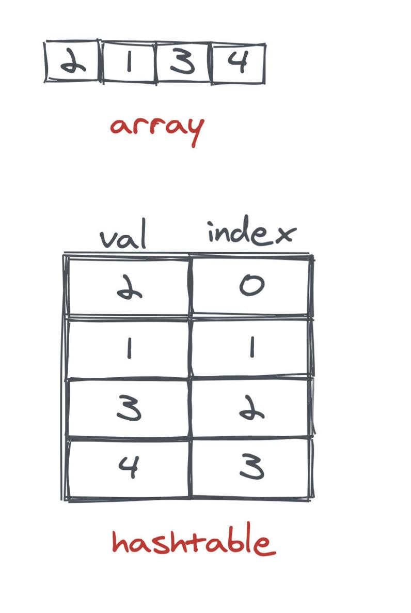
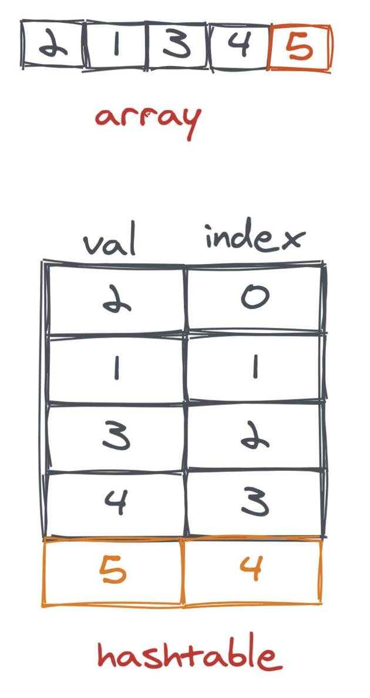
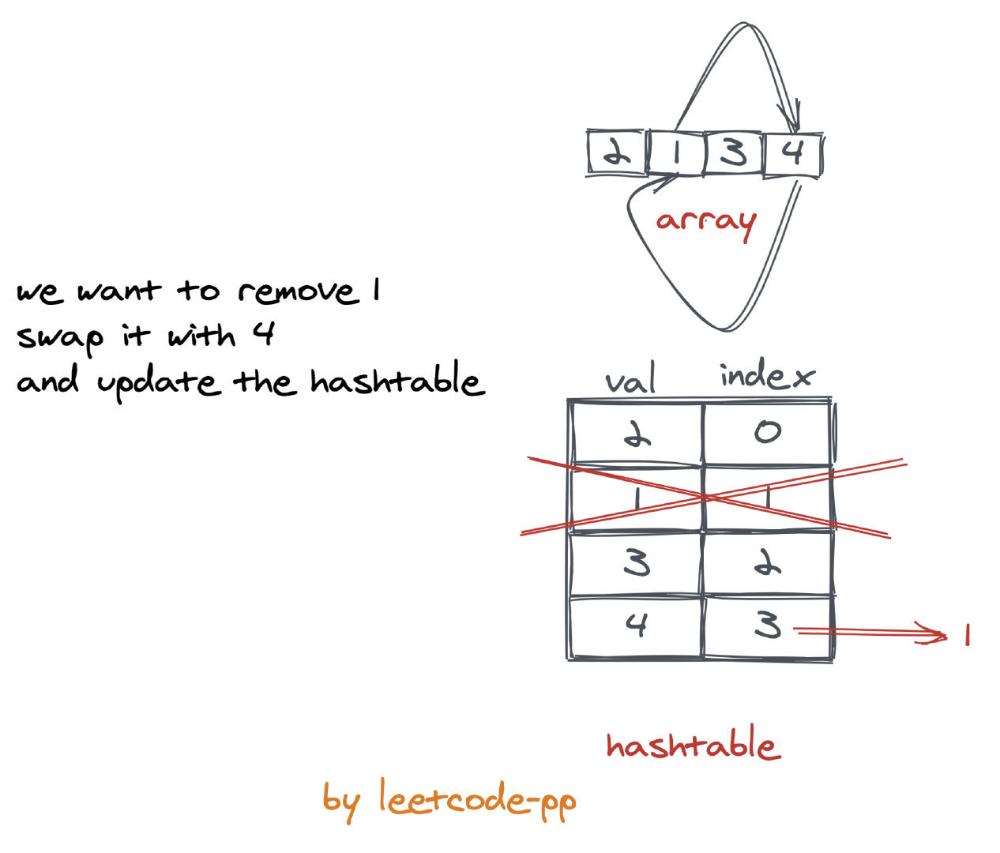

# 0380. 常数时间插入、删除和获取随机元素

## 题目地址（380. 常数时间插入、删除和获取随机元素）

<https://leetcode-cn.com/problems/insert-delete-getrandom-o1/>

## 题目描述

```
<pre class="calibre18">```
设计一个支持在平均 时间复杂度 O(1) 下，执行以下操作的数据结构。

insert(val)：当元素 val 不存在时，向集合中插入该项。
remove(val)：元素 val 存在时，从集合中移除该项。
getRandom：随机返回现有集合中的一项。每个元素应该有相同的概率被返回。
示例 :

// 初始化一个空的集合。
RandomizedSet randomSet = new RandomizedSet();

// 向集合中插入 1 。返回 true 表示 1 被成功地插入。
randomSet.insert(1);

// 返回 false ，表示集合中不存在 2 。
randomSet.remove(2);

// 向集合中插入 2 。返回 true 。集合现在包含 [1,2] 。
randomSet.insert(2);

// getRandom 应随机返回 1 或 2 。
randomSet.getRandom();

// 从集合中移除 1 ，返回 true 。集合现在包含 [2] 。
randomSet.remove(1);

// 2 已在集合中，所以返回 false 。
randomSet.insert(2);

// 由于 2 是集合中唯一的数字，getRandom 总是返回 2 。
randomSet.getRandom();

```
```

## 前置知识

- 数组
- 哈希表

## 公司

- 阿里
- 腾讯
- 百度
- 字节

## 思路

这是一个设计题。这道题的核心就是考察基本数据结构和算法的操作以及复杂度。

我们来回顾一下基础知识：

- 数组支持随机访问，其按照索引查询的时间复杂度为O(1)O(1)O(1),按值查询的时间复杂度为O(N)O(N)O(N)， 而插入和删除的时间复杂度为O(N)O(N)O(N)。
- 链表不支持随机访问，其查询的时间复杂度为O(N)O(N)O(N),但是对于插入和删除的复杂度为O(1)O(1)O(1)（不考虑找到选要处理的节点花费的时间）。
- 对于哈希表，正常情况下其查询复杂度平均为O(N)O(N)O(N)，插入和删除的复杂度为O(1)O(1)O(1)。

由于题目要求 getRandom 返回要随机并且要在O(1)O(1)O(1)复杂度内，那么如果单纯使用链表或者哈希表肯定是不行的。

而又由于对于插入和删除也需要复杂度为O(1)O(1)O(1)，因此单纯使用数组也是不行的，因此考虑多种使用数据结构来实现。

> 实际上 LeetCode 设计题，几乎没有单纯一个数据结构搞定的，基本都需要多种数据结构结合，这个时候需要你对各种数据结构以及其基本算法的复杂度有着清晰的认知。

对于 getRandom 用数组很简单。对于判断是否已经有了存在的元素，我们使用哈希表也很容易做到。因此我们可以将数组随机访问，以及哈希表O(1)O(1)O(1)按检索值的特性结合起来，即同时使用这两种数据结构。

对于删除和插入，我们需要一些技巧。

对于插入：

- 我们直接往 append，并将其插入哈希表即可。
- 对于删除，我们需要做到 O(1)。删除哈希表很明显可以，但是对于数组，平均时间复杂度为 O(1)。

因此如何应付删除的这种性能开销呢？ 我们知道对于数据删除，我们的时间复杂度来源于

1. `查找到要删除的元素`
2. 以及`重新排列被删除元素后面的元素`。

对于 1，我们可以通过哈希表来实现。 key 是插入的数字，value 是数组对应的索引。删除的时候我们根据 key 反查出索引就可以快速找到。

> 题目说明了不会存在重复元素，所以我们可以这么做。思考一下，如果没有这个限制会怎么样？

对于 2，我们可以通过和数组最后一项进行交换的方式来实现，这样就避免了数据移动。同时数组其他项的索引仍然保持不变，非常好！

> 相应地，我们插入的时候，需要维护哈希表

图解：

以依次【1，2，3，4】之后为初始状态，那么此时状态是这样的：



而当要插入一个新的5的时候， 我们只需要分别向数组末尾和哈希表中插入这条记录即可。



而删除的时候稍微有一点复杂：



## 关键点解析

- 数组
- 哈希表
- 数组 + 哈希表
- 基本算法时间复杂度分析

## 代码

```
<pre class="calibre18">```
<span class="hljs-keyword">from</span> random <span class="hljs-keyword">import</span> random


<span class="hljs-class"><span class="hljs-keyword">class</span> <span class="hljs-title">RandomizedSet</span>:</span>

    <span class="hljs-function"><span class="hljs-keyword">def</span> <span class="hljs-title">__init__</span><span class="hljs-params">(self)</span>:</span>
        <span class="hljs-string">"""
        Initialize your data structure here.
        """</span>
        self.data = dict()
        self.arr = []
        self.n = <span class="hljs-params">0</span>

    <span class="hljs-function"><span class="hljs-keyword">def</span> <span class="hljs-title">insert</span><span class="hljs-params">(self, val: int)</span> -> bool:</span>
        <span class="hljs-string">"""
        Inserts a value to the set. Returns true if the set did not already contain the specified element.
        """</span>
        <span class="hljs-keyword">if</span> val <span class="hljs-keyword">in</span> self.data:
            <span class="hljs-keyword">return</span> <span class="hljs-keyword">False</span>
        self.data[val] = self.n
        self.arr.append(val)
        self.n += <span class="hljs-params">1</span>

        <span class="hljs-keyword">return</span> <span class="hljs-keyword">True</span>

    <span class="hljs-function"><span class="hljs-keyword">def</span> <span class="hljs-title">remove</span><span class="hljs-params">(self, val: int)</span> -> bool:</span>
        <span class="hljs-string">"""
        Removes a value from the set. Returns true if the set contained the specified element.
        """</span>
        <span class="hljs-keyword">if</span> val <span class="hljs-keyword">not</span> <span class="hljs-keyword">in</span> self.data:
            <span class="hljs-keyword">return</span> <span class="hljs-keyword">False</span>
        i = self.data[val]
        <span class="hljs-title"># 更新data</span>
        self.data[self.arr[<span class="hljs-params">-1</span>]] = i
        self.data.pop(val)
        <span class="hljs-title"># 更新arr</span>
        self.arr[i] = self.arr[<span class="hljs-params">-1</span>]
        <span class="hljs-title"># 删除最后一项</span>
        self.arr.pop()
        self.n -= <span class="hljs-params">1</span>

        <span class="hljs-keyword">return</span> <span class="hljs-keyword">True</span>

    <span class="hljs-function"><span class="hljs-keyword">def</span> <span class="hljs-title">getRandom</span><span class="hljs-params">(self)</span> -> int:</span>
        <span class="hljs-string">"""
        Get a random element from the set.
        """</span>

        <span class="hljs-keyword">return</span> self.arr[int(random() * self.n)]


<span class="hljs-title"># Your RandomizedSet object will be instantiated and called as such:</span>
<span class="hljs-title"># obj = RandomizedSet()</span>
<span class="hljs-title"># param_1 = obj.insert(val)</span>
<span class="hljs-title"># param_2 = obj.remove(val)</span>
<span class="hljs-title"># param_3 = obj.getRandom()</span>

```
```

***复杂度分析***

- 时间复杂度：O(1)O(1)O(1)
- 空间复杂度：O(1)O(1)O(1)

更多题解可以访问我的LeetCode题解仓库：<https://github.com/azl397985856/leetcode> 。 目前已经30K star啦。

大家也可以关注我的公众号《力扣加加》获取更多更新鲜的LeetCode题解

