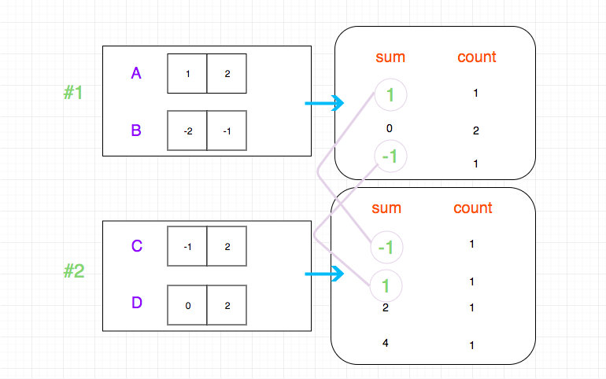

# 0454. 四数相加 II

## 题目地址(454. 四数相加 II)

<https://leetcode-cn.com/problems/4sum-ii/>

## 题目描述

```
<pre class="calibre18">```
给定四个包含整数的数组列表 A , B , C , D ,计算有多少个元组 (i, j, k, l) ，使得 A[i] + B[j] + C[k] + D[l] = 0。

为了使问题简单化，所有的 A, B, C, D 具有相同的长度 N，且 0 ≤ N ≤ 500 。所有整数的范围在 -228 到 228 - 1 之间，最终结果不会超过 231 - 1 。

例如:

输入:
A = [ 1, 2]
B = [-2,-1]
C = [-1, 2]
D = [ 0, 2]

输出:
2

解释:
两个元组如下:
1. (0, 0, 0, 1) -> A[0] + B[0] + C[0] + D[1] = 1 + (-2) + (-1) + 2 = 0
2. (1, 1, 0, 0) -> A[1] + B[1] + C[0] + D[0] = 2 + (-1) + (-1) + 0 = 0

```
```

## 前置知识

- hashTable

## 公司

- 阿里
- 字节

## 思路

如果按照常规思路去完成查找需要四层遍历，时间复杂是O(n^4), 显然是行不通的。 因此我们有必要想一种更加高效的算法。

我一个思路就是我们将四个数组分成两组，两两结合。 然后我们分别计算`两两结合能够算出的和有哪些，以及其对应的个数`。

如图：



这个时候我们得到了两个`hashTable`， 我们只需要进行简单的数学运算就可以得到结果。

## 关键点解析

- 空间换时间
- 两两分组，求出两两结合能够得出的可能数，然后合并即可。

## 代码

语言支持： `JavaScript`，`Python3`

`JavaScript`:

```
<pre class="calibre18">```

<span class="hljs-title">/*
 * @lc app=leetcode id=454 lang=javascript
 *
 * [454] 4Sum II
 *
 * https://leetcode.com/problems/4sum-ii/description/
<span class="hljs-title">/**
 * @param {number[]} A
 * @param {number[]} B
 * @param {number[]} C
 * @param {number[]} D
 * @return {number}
 */</span>
var fourSumCount = function(A, B, C, D) {
  const sumMapper = {};
  let res = 0;
  for (let i = 0; i < A.length; i++) {
    for (let j = 0; j < B.length; j++) {
        sumMapper[A[i] + B[j]] = (sumMapper[A[i] + B[j]] || 0) + 1;
    }
  }

  for (let i = 0; i < C.length; i++) {
    for (let j = 0; j < D.length; j++) {
        res += sumMapper[- (C[i] + D[j])] || 0;
    }
  }

  return res;
};
</span>
```
```

`Python3`:

```
<pre class="calibre18">```
<span class="hljs-class"><span class="hljs-keyword">class</span> <span class="hljs-title">Solution</span>:</span>
    <span class="hljs-function"><span class="hljs-keyword">def</span> <span class="hljs-title">fourSumCount</span><span class="hljs-params">(self, A: List[int], B: List[int], C: List[int], D: List[int])</span> -> int:</span>
        mapper = {}
        res = <span class="hljs-params">0</span>
        <span class="hljs-keyword">for</span> i <span class="hljs-keyword">in</span> A:
            <span class="hljs-keyword">for</span> j <span class="hljs-keyword">in</span> B:
                mapper[i + j] = mapper.get(i + j, <span class="hljs-params">0</span>) + <span class="hljs-params">1</span>

        <span class="hljs-keyword">for</span> i <span class="hljs-keyword">in</span> C:
            <span class="hljs-keyword">for</span> j <span class="hljs-keyword">in</span> D:
                res += mapper.get(<span class="hljs-params">-1</span> * (i + j), <span class="hljs-params">0</span>)
        <span class="hljs-keyword">return</span> res

```
```

 **复杂度分析**

- 时间复杂度：O(N2)O(N^2)O(N2)
- 空间复杂度：O(N2)O(N^2)O(N2)

大家对此有何看法，欢迎给我留言，我有时间都会一一查看回答。更多算法套路可以访问我的 LeetCode 题解仓库：<https://github.com/azl397985856/leetcode> 。 目前已经 37K star 啦。 大家也可以关注我的公众号《力扣加加》带你啃下算法这块硬骨头。 