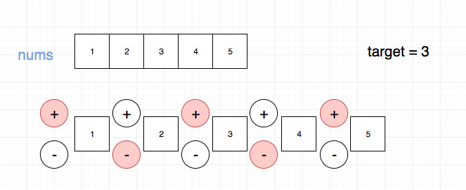
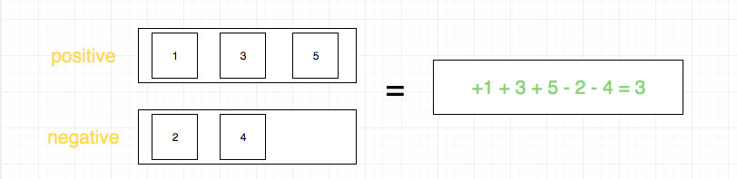
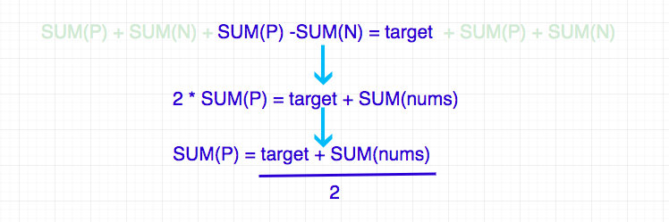

# 0494. 目标和

## 题目地址(494. 目标和)

<https://leetcode-cn.com/problems/target-sum/>

## 题目描述

```
<pre class="calibre18">```
给定一个非负整数数组，a1, a2, ..., an, 和一个目标数，S。现在你有两个符号 + 和 -。对于数组中的任意一个整数，你都可以从 + 或 -中选择一个符号添加在前面。

返回可以使最终数组和为目标数 S 的所有添加符号的方法数。


示例：

输入：nums: [1, 1, 1, 1, 1], S: 3
输出：5
解释：

-1+1+1+1+1 = 3
+1-1+1+1+1 = 3
+1+1-1+1+1 = 3
+1+1+1-1+1 = 3
+1+1+1+1-1 = 3

一共有5种方法让最终目标和为3。


提示：

数组非空，且长度不会超过 20 。
初始的数组的和不会超过 1000 。
保证返回的最终结果能被 32 位整数存下。

```
```

## 前置知识

- 动态规划

## 公司

- 阿里
- 腾讯
- 百度
- 字节

## 思路

题目是给定一个数组，让你在数字前面添加 `+`或者`-`，使其和等于 target.



暴力法的时间复杂度是指数级别的，因此我们不予考虑。我们需要换种思路.

我们将最终的结果分成两组，一组是我们添加了`+`的，一组是我们添加了`-`的。



如上图，问题转化为如何求其中一组，我们不妨求前面标`+`的一组

> 如果求出一组，另一组实际就已知了，即总集和这一组的差集。

通过进一步分析，我们得到了这样的关系：



因此问题转化为，求解`sumCount(nums, target)`,即 nums 数组中能够组成 target 的总数一共有多少种，这是一道我们之前做过的题目，使用动态规划可以解决。

## 关键点解析

- 对元素进行分组，分组的依据是符号， 是`+` 或者 `-`
- 通过数学公式推导可以简化我们的求解过程，这需要一点`数学知识和数学意识`

## 代码

```
<pre class="calibre18">```
<span class="hljs-title">/*
 * @lc app=leetcode id=494 lang=javascript
 *
 * [494] Target Sum
 *
 */</span>
<span class="hljs-title">// 这个是我们熟悉的问题了</span>
<span class="hljs-title">// 我们这里需要求解的是nums里面有多少种可以组成target的方式</span>
<span class="hljs-keyword">var</span> sumCount = <span class="hljs-function"><span class="hljs-keyword">function</span>(<span class="hljs-params">nums, target</span>) </span>{
  <span class="hljs-title">// 这里通过观察，我们没必要使用二维数组去存储这些计算结果</span>
  <span class="hljs-title">// 使用一维数组可以有效节省空间</span>
  <span class="hljs-keyword">const</span> dp = <span class="hljs-params">Array</span>(target + <span class="hljs-params">1</span>).fill(<span class="hljs-params">0</span>);
  dp[<span class="hljs-params">0</span>] = <span class="hljs-params">1</span>;
  <span class="hljs-keyword">for</span> (<span class="hljs-keyword">let</span> i = <span class="hljs-params">0</span>; i < nums.length; i++) {
    <span class="hljs-keyword">for</span> (<span class="hljs-keyword">let</span> j = target; j >= nums[i]; j--) {
      dp[j] += dp[j - nums[i]];
    }
  }
  <span class="hljs-keyword">return</span> dp[target];
};
<span class="hljs-keyword">const</span> add = nums => nums.reduce((a, b) => (a += b), <span class="hljs-params">0</span>);
<span class="hljs-title">/**
 * @param {number[]} nums
 * @param {number} S
 * @return {number}
 */</span>
<span class="hljs-keyword">var</span> findTargetSumWays = <span class="hljs-function"><span class="hljs-keyword">function</span>(<span class="hljs-params">nums, S</span>) </span>{
  <span class="hljs-keyword">const</span> sum = add(nums);
  <span class="hljs-keyword">if</span> (sum < S) <span class="hljs-keyword">return</span> <span class="hljs-params">0</span>;
  <span class="hljs-keyword">if</span> ((S + sum) % <span class="hljs-params">2</span> === <span class="hljs-params">1</span>) <span class="hljs-keyword">return</span> <span class="hljs-params">0</span>;
  <span class="hljs-keyword">return</span> sumCount(nums, (S + sum) >> <span class="hljs-params">1</span>);
};

```
```

**复杂度分析**

- 时间复杂度：O(N∗target)O(N \* target)O(N∗target)
- 空间复杂度：O(target)O(target)O(target)

大家对此有何看法，欢迎给我留言，我有时间都会一一查看回答。更多算法套路可以访问我的 LeetCode 题解仓库：<https://github.com/azl397985856/leetcode> 。 目前已经 37K star 啦。 大家也可以关注我的公众号《力扣加加》带你啃下算法这块硬骨头。 

## 扩展

如果这道题目并没有限定所有的元素以及 target 都是正数怎么办？