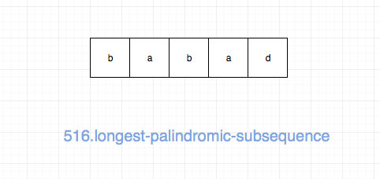
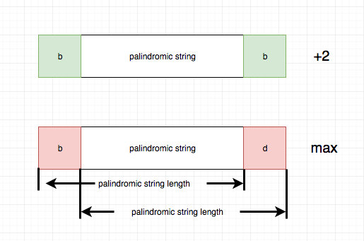
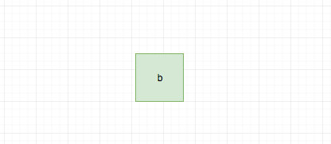

# 0516. 最长回文子序列

## 题目地址(516. 最长回文子序列)

<https://leetcode-cn.com/problems/longest-palindromic-subsequence/>

## 题目描述

```
<pre class="calibre18">```

给定一个字符串 s ，找到其中最长的回文子序列，并返回该序列的长度。可以假设 s 的最大长度为 1000 。


示例 1:
输入:

"bbbab"
输出:

4
一个可能的最长回文子序列为 "bbbb"。

示例 2:
输入:

"cbbd"
输出:

2
一个可能的最长回文子序列为 "bb"。


提示：

1 <= s.length <= 1000
s 只包含小写英文字母

```
```

## 前置知识

- 动态规划

## 公司

- 阿里
- 腾讯
- 百度
- 字节

## 思路

这是一道最长回文的题目，要我们求出给定字符串的最大回文子序列。



解决这类问题的核心思想就是两个字“延伸”，具体来说

- 如果一个字符串是回文串，那么在它左右分别加上一个相同的字符，那么它一定还是一个回文串，因此`回文长度增加2`
- 如果一个字符串不是回文串，或者在回文串左右分别加不同的字符，得到的一定不是回文串,因此`回文长度不变，我们取[i][j-1]和[i+1][j]的较大值`



事实上，上面的分析已经建立了大问题和小问题之间的关联， 基于此，我们可以建立动态规划模型。

我们可以用 dp\[i\]\[j\] 表示 s 中从 i 到 j（包括 i 和 j）的回文序列长度， 状态转移方程只是将上面的描述转化为代码即可：

```
<pre class="calibre18">```
<span class="hljs-keyword">if</span> (s[i] === s[j]) {
  dp[i][j] = dp[i + <span class="hljs-params">1</span>][j - <span class="hljs-params">1</span>] + <span class="hljs-params">2</span>;
} <span class="hljs-keyword">else</span> {
  dp[i][j] = <span class="hljs-params">Math</span>.max(dp[i][j - <span class="hljs-params">1</span>], dp[i + <span class="hljs-params">1</span>][j]);
}

```
```

base case 就是一个字符（轴对称点是本身）



## 关键点

- ”延伸“（extend）

## 代码

```
<pre class="calibre18">```
<span class="hljs-title">/*
 * @lc app=leetcode id=516 lang=javascript
 *
 * [516] Longest Palindromic Subsequence
 */</span>
<span class="hljs-title">/**
 * @param {string} s
 * @return {number}
 */</span>
<span class="hljs-keyword">var</span> longestPalindromeSubseq = <span class="hljs-function"><span class="hljs-keyword">function</span>(<span class="hljs-params">s</span>) </span>{
  <span class="hljs-title">// bbbab 返回4</span>
  <span class="hljs-title">// tag : dp</span>
  <span class="hljs-keyword">const</span> dp = [];

  <span class="hljs-keyword">for</span> (<span class="hljs-keyword">let</span> i = s.length - <span class="hljs-params">1</span>; i >= <span class="hljs-params">0</span>; i--) {
    dp[i] = <span class="hljs-params">Array</span>(s.length).fill(<span class="hljs-params">0</span>);
    <span class="hljs-keyword">for</span> (<span class="hljs-keyword">let</span> j = i; j < s.length; j++) {
      <span class="hljs-keyword">if</span> (i - j === <span class="hljs-params">0</span>) dp[i][j] = <span class="hljs-params">1</span>;
      <span class="hljs-keyword">else</span> <span class="hljs-keyword">if</span> (s[i] === s[j]) {
        dp[i][j] = dp[i + <span class="hljs-params">1</span>][j - <span class="hljs-params">1</span>] + <span class="hljs-params">2</span>;
      } <span class="hljs-keyword">else</span> {
        dp[i][j] = <span class="hljs-params">Math</span>.max(dp[i][j - <span class="hljs-params">1</span>], dp[i + <span class="hljs-params">1</span>][j]);
      }
    }
  }

  <span class="hljs-keyword">return</span> dp[<span class="hljs-params">0</span>][s.length - <span class="hljs-params">1</span>];
};

```
```

**复杂度分析**

- 时间复杂度：O(N2)O(N^2)O(N2)
- 空间复杂度：O(N2)O(N^2)O(N2)

## 相关题目

- [5.longest-palindromic-substring](5.longest-palindromic-substring.html)

大家对此有何看法，欢迎给我留言，我有时间都会一一查看回答。更多算法套路可以访问我的 LeetCode 题解仓库：<https://github.com/azl397985856/leetcode> 。 目前已经 37K star 啦。 大家也可以关注我的公众号《力扣加加》带你啃下算法这块硬骨头。 