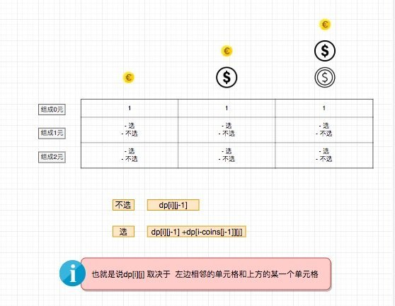

# 0518. 零钱兑换 II

## 题目地址（518. 零钱兑换 II）

<https://leetcode-cn.com/problems/coin-change-2/>

## 题目描述

```
<pre class="calibre18">```
给定不同面额的硬币和一个总金额。写出函数来计算可以凑成总金额的硬币组合数。假设每一种面额的硬币有无限个。

示例 1:

输入: amount = 5, coins = [1, 2, 5]
输出: 4
解释: 有四种方式可以凑成总金额:
5=5
5=2+2+1
5=2+1+1+1
5=1+1+1+1+1
示例 2:

输入: amount = 3, coins = [2]
输出: 0
解释: 只用面额 2 的硬币不能凑成总金额 3。
示例 3:

输入: amount = 10, coins = [10]
输出: 1

注意:

你可以假设：

0 <= amount (总金额) <= 5000
1 <= coin (硬币面额) <= 5000
硬币种类不超过 500 种
结果符合 32 位符号整数

```
```

## 前置知识

- [动态规划](https://github.com/azl397985856/leetcode/blob/master/thinkings/dynamic-programming.md)
- 背包问题

## 公司

- 阿里
- 百度
- 字节

## 思路

这个题目和 coin-change 的思路比较类似。

我们还是按照 coin-change 的思路来， 如果将问题画出来大概是这样：



进一步我们可以对问题进行空间复杂度上的优化（这种写法比较难以理解，但是相对更省空间）


> 这里用动图会更好理解， 有时间的话我会做一个动图出来， 现在大家脑补一下吧

## 关键点解析

- 动态规划
- 子问题

用 dp\[i\] 来表示组成 i 块钱，需要最少的硬币数，那么

1. 第 j 个硬币我可以选择不拿 这个时候， 组成数 = dp\[i\]
2. 第 j 个硬币我可以选择拿 这个时候， 组成数 = dp\[i - coins\[j\]\] + dp\[i\]
3. 和 01 背包问题不同， 硬币是可以拿任意个，属于完全背包问题
4. 对于每一个 dp\[i\] 我们都选择遍历一遍 coin， 不断更新 dp\[i\]

eg:

```
<pre class="calibre18">```
<span class="hljs-keyword">if</span> (amount === <span class="hljs-params">0</span>) <span class="hljs-keyword">return</span> <span class="hljs-params">1</span>;

<span class="hljs-keyword">const</span> dp = [<span class="hljs-params">Array</span>(amount + <span class="hljs-params">1</span>).fill(<span class="hljs-params">1</span>)];

<span class="hljs-keyword">for</span> (<span class="hljs-keyword">let</span> i = <span class="hljs-params">1</span>; i < amount + <span class="hljs-params">1</span>; i++) {
  dp[i] = <span class="hljs-params">Array</span>(coins.length + <span class="hljs-params">1</span>).fill(<span class="hljs-params">0</span>);
  <span class="hljs-keyword">for</span> (<span class="hljs-keyword">let</span> j = <span class="hljs-params">1</span>; j < coins.length + <span class="hljs-params">1</span>; j++) {
    <span class="hljs-title">// 从1开始可以简化运算</span>
    <span class="hljs-keyword">if</span> (i - coins[j - <span class="hljs-params">1</span>] >= <span class="hljs-params">0</span>) {
      <span class="hljs-title">// 注意这里是coins[j -1]而不是coins[j]</span>
      dp[i][j] = dp[i][j - <span class="hljs-params">1</span>] + dp[i - coins[j - <span class="hljs-params">1</span>]][j]; <span class="hljs-title">// 由于可以重复使用硬币所以这里是j不是j-1</span>
    } <span class="hljs-keyword">else</span> {
      dp[i][j] = dp[i][j - <span class="hljs-params">1</span>];
    }
  }
}

<span class="hljs-keyword">return</span> dp[dp.length - <span class="hljs-params">1</span>][coins.length];

```
```

- 当我们选择一维数组去解的时候，内外循环将会对结果造成影响


eg:

```
<pre class="calibre18">```
<span class="hljs-title">// 这种答案是不对的。</span>
<span class="hljs-title">// 原因在于比如amount = 5, coins = [1,2,5]</span>
<span class="hljs-title">// 这种算法会将[1,2,2] [2,1,2] [2, 2, 1] 算成不同的</span>

<span class="hljs-keyword">if</span> (amount === <span class="hljs-params">0</span>) <span class="hljs-keyword">return</span> <span class="hljs-params">1</span>;

<span class="hljs-keyword">const</span> dp = [<span class="hljs-params">1</span>].concat(<span class="hljs-params">Array</span>(amount).fill(<span class="hljs-params">0</span>));

<span class="hljs-keyword">for</span> (<span class="hljs-keyword">let</span> i = <span class="hljs-params">1</span>; i < amount + <span class="hljs-params">1</span>; i++) {
  <span class="hljs-keyword">for</span> (<span class="hljs-keyword">let</span> j = <span class="hljs-params">0</span>; j < coins.length; j++) {
    <span class="hljs-keyword">if</span> (i - coins[j] >= <span class="hljs-params">0</span>) {
      dp[i] = dp[i] + dp[i - coins[j]];
    }
  }
}

<span class="hljs-keyword">return</span> dp[dp.length - <span class="hljs-params">1</span>];

<span class="hljs-title">// 正确的写法应该是内外循环调换一下, 具体可以看下方代码区</span>

```
```

## 代码

代码支持：Python3，JavaScript：

JavaSCript Code:

```
<pre class="calibre18">```
<span class="hljs-title">/*
 * @lc app=leetcode id=518 lang=javascript
 *
 * [518] Coin Change 2
 *
 */</span>
<span class="hljs-title">/**
 * @param {number} amount
 * @param {number[]} coins
 * @return {number}
 */</span>
<span class="hljs-keyword">var</span> change = <span class="hljs-function"><span class="hljs-keyword">function</span> (<span class="hljs-params">amount, coins</span>) </span>{
  <span class="hljs-keyword">if</span> (amount === <span class="hljs-params">0</span>) <span class="hljs-keyword">return</span> <span class="hljs-params">1</span>;

  <span class="hljs-keyword">const</span> dp = [<span class="hljs-params">1</span>].concat(<span class="hljs-params">Array</span>(amount).fill(<span class="hljs-params">0</span>));

  <span class="hljs-keyword">for</span> (<span class="hljs-keyword">let</span> j = <span class="hljs-params">0</span>; j < coins.length; j++) {
    <span class="hljs-keyword">for</span> (<span class="hljs-keyword">let</span> i = <span class="hljs-params">1</span>; i < amount + <span class="hljs-params">1</span>; i++) {
      <span class="hljs-keyword">if</span> (i - coins[j] >= <span class="hljs-params">0</span>) {
        dp[i] = dp[i] + dp[i - coins[j]];
      }
    }
  }

  <span class="hljs-keyword">return</span> dp[dp.length - <span class="hljs-params">1</span>];
};

```
```

Python Code:

```
<pre class="calibre18">```
<span class="hljs-class"><span class="hljs-keyword">class</span> <span class="hljs-title">Solution</span>:</span>
    <span class="hljs-function"><span class="hljs-keyword">def</span> <span class="hljs-title">change</span><span class="hljs-params">(self, amount: int, coins: List[int])</span> -> int:</span>
        dp = [<span class="hljs-params">0</span>] * (amount + <span class="hljs-params">1</span>)
        dp[<span class="hljs-params">0</span>] = <span class="hljs-params">1</span>

        <span class="hljs-keyword">for</span> j <span class="hljs-keyword">in</span> range(len(coins)):
            <span class="hljs-keyword">for</span> i <span class="hljs-keyword">in</span> range(<span class="hljs-params">1</span>, amount + <span class="hljs-params">1</span>):
                <span class="hljs-keyword">if</span> i >= coins[j]:
                    dp[i] += dp[i - coins[j]]

        <span class="hljs-keyword">return</span> dp[<span class="hljs-params">-1</span>]

```
```

**复杂度分析**

- 时间复杂度：O(amount)O(amount)O(amount)
- 空间复杂度：O(amount∗len(coins))O(amount \* len(coins))O(amount∗len(coins))

## 扩展

这是一道很简单描述的题目， 因此很多时候会被用到大公司的电面中。

相似问题:

[322.coin-change](322.coin-change.html)

## 附录

Python 二维解法（不推荐，但是可以帮助理解）：

```
<pre class="calibre18">```
<span class="hljs-class"><span class="hljs-keyword">class</span> <span class="hljs-title">Solution</span>:</span>
    <span class="hljs-function"><span class="hljs-keyword">def</span> <span class="hljs-title">change</span><span class="hljs-params">(self, amount: int, coins: List[int])</span> -> int:</span>
        dp = [[<span class="hljs-params">0</span> <span class="hljs-keyword">for</span> _ <span class="hljs-keyword">in</span> range(len(coins) + <span class="hljs-params">1</span>)] <span class="hljs-keyword">for</span> _ <span class="hljs-keyword">in</span> range(amount + <span class="hljs-params">1</span>)]
        <span class="hljs-keyword">for</span> j <span class="hljs-keyword">in</span> range(len(coins) + <span class="hljs-params">1</span>):
            dp[<span class="hljs-params">0</span>][j] = <span class="hljs-params">1</span>

        <span class="hljs-keyword">for</span> i <span class="hljs-keyword">in</span> range(amount + <span class="hljs-params">1</span>):
            <span class="hljs-keyword">for</span> j <span class="hljs-keyword">in</span> range(<span class="hljs-params">1</span>, len(coins) + <span class="hljs-params">1</span>):
                <span class="hljs-keyword">if</span> i >= coins[j - <span class="hljs-params">1</span>]:
                    dp[i][j] = dp[i - coins[j - <span class="hljs-params">1</span>]][j] + dp[i][j - <span class="hljs-params">1</span>]
                <span class="hljs-keyword">else</span>:
                    dp[i][j] = dp[i][j - <span class="hljs-params">1</span>]
        <span class="hljs-keyword">return</span> dp[<span class="hljs-params">-1</span>][<span class="hljs-params">-1</span>]

```
```

**复杂度分析**

- 时间复杂度：O(amount∗len(coins))O(amount \* len(coins))O(amount∗len(coins))
- 空间复杂度：O(amount∗len(coins))O(amount \* len(coins))O(amount∗len(coins))

大家对此有何看法，欢迎给我留言，我有时间都会一一查看回答。更多算法套路可以访问我的 LeetCode 题解仓库：<https://github.com/azl397985856/leetcode> 。 目前已经 37K star 啦。

大家也可以关注我的公众号《力扣加加》带你啃下算法这块硬骨头。 