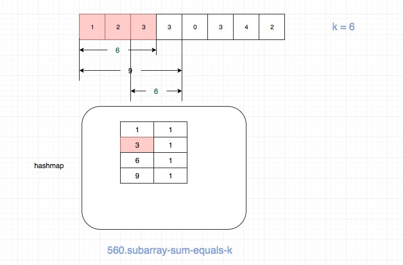

# 0560. 和为K的子数组

## 题目地址(560. 和为K的子数组)

<https://leetcode-cn.com/problems/subarray-sum-equals-k/>

## 题目描述

```
<pre class="calibre18">```
给定一个整数数组和一个整数 k，你需要找到该数组中和为 k 的连续的子数组的个数。

示例 1 :

输入:nums = [1,1,1], k = 2
输出: 2 , [1,1] 与 [1,1] 为两种不同的情况。
说明 :

数组的长度为 [1, 20,000]。
数组中元素的范围是 [-1000, 1000] ，且整数 k 的范围是 [-1e7, 1e7]。

```
```

## 前置知识

- 哈希表
- 前缀和

## 公司

- 阿里
- 腾讯
- 字节

## 思路

符合直觉的做法是暴力求解所有的子数组，然后分别计算和，如果等于 k,count 就+1.这种做法的时间复杂度为 O(n^2)，代码如下：

```
<pre class="calibre18">```
<span class="hljs-class"><span class="hljs-keyword">class</span> <span class="hljs-title">Solution</span>:</span>
    <span class="hljs-function"><span class="hljs-keyword">def</span> <span class="hljs-title">subarraySum</span><span class="hljs-params">(self, nums: List[int], k: int)</span> -> int:</span>
        cnt, n =  <span class="hljs-params">0</span>, len(nums)
        <span class="hljs-keyword">for</span> i <span class="hljs-keyword">in</span> range(n):
            sum = <span class="hljs-params">0</span>
            <span class="hljs-keyword">for</span> j <span class="hljs-keyword">in</span> range(i, n):
                sum += nums[j]
                <span class="hljs-keyword">if</span> (sum == k): cnt += <span class="hljs-params">1</span>
        <span class="hljs-keyword">return</span> cnt

```
```

实际上刚开始看到这题目的时候，我想“是否可以用滑动窗口解决？”。但是很快我就放弃了，因为看了下数组中项的取值范围有负数，这样我们扩张或者收缩窗口就比较复杂。第二个想法是前缀和，保存一个数组的前缀和，然后利用差分法得出任意区间段的和，这种想法是可行的，代码如下：

```
<pre class="calibre18">```
<span class="hljs-class"><span class="hljs-keyword">class</span> <span class="hljs-title">Solution</span>:</span>
    <span class="hljs-function"><span class="hljs-keyword">def</span> <span class="hljs-title">subarraySum</span><span class="hljs-params">(self, nums: List[int], k: int)</span> -> int:</span>
      cnt, n =  <span class="hljs-params">0</span>, len(nums)
      pre = [<span class="hljs-params">0</span>] * (n + <span class="hljs-params">1</span>)
      <span class="hljs-keyword">for</span> i <span class="hljs-keyword">in</span> range(<span class="hljs-params">1</span>, n + <span class="hljs-params">1</span>):
          pre[i] = pre[i - <span class="hljs-params">1</span>] + nums[i - <span class="hljs-params">1</span>]
      <span class="hljs-keyword">for</span> i <span class="hljs-keyword">in</span> range(<span class="hljs-params">1</span>, n + <span class="hljs-params">1</span>):
          <span class="hljs-keyword">for</span> j <span class="hljs-keyword">in</span> range(i, n + <span class="hljs-params">1</span>):
              <span class="hljs-keyword">if</span> (pre[j] - pre[i - <span class="hljs-params">1</span>] == k): cnt += <span class="hljs-params">1</span>
      <span class="hljs-keyword">return</span> cnt

```
```

这里有一种更加巧妙的方法，可以不使用前缀和数组，而是使用 hashmap 来简化时间复杂度，这种算法的时间复杂度可以达到 O(n).

具体算法：

- 维护一个 hashmap，hashmap 的 key 为累加值 acc，value 为累加值 acc 出现的次数。
- 迭代数组，然后不断更新 acc 和 hashmap，如果 acc 等于 k，那么很明显应该+1. 如果 hashmap\[acc - k\] 存在，我们就把它加到结果中去即可。

语言比较难以解释，我画了一个图来演示 nums = \[1,2,3,3,0,3,4,2\], k = 6 的情况。



如图，当访问到 nums\[3\]的时候，hashmap 如图所示，这个时候 count 为 2. 其中之一是\[1,2,3\],这个好理解。还有一个是\[3,3\].

这个\[3,3\]正是我们通过 hashmap\[acc - k\]即 hashmap\[9 - 6\]得到的。

## 关键点解析

- 前缀和
- 可以利用 hashmap 记录和的累加值来避免重复计算

## 代码

- 语言支持：JS, Python

Javascript Code:

```
<pre class="calibre18">```
<span class="hljs-title">/*
 * @lc app=leetcode id=560 lang=javascript
 *
 * [560] Subarray Sum Equals K
 */</span>
<span class="hljs-title">/**
 * @param {number[]} nums
 * @param {number} k
 * @return {number}
 */</span>
<span class="hljs-keyword">var</span> subarraySum = <span class="hljs-function"><span class="hljs-keyword">function</span> (<span class="hljs-params">nums, k</span>) </span>{
  <span class="hljs-keyword">const</span> hashmap = {};
  <span class="hljs-keyword">let</span> acc = <span class="hljs-params">0</span>;
  <span class="hljs-keyword">let</span> count = <span class="hljs-params">0</span>;

  <span class="hljs-keyword">for</span> (<span class="hljs-keyword">let</span> i = <span class="hljs-params">0</span>; i < nums.length; i++) {
    acc += nums[i];

    <span class="hljs-keyword">if</span> (acc === k) count++;

    <span class="hljs-keyword">if</span> (hashmap[acc - k] !== <span class="hljs-keyword">void</span> <span class="hljs-params">0</span>) {
      count += hashmap[acc - k];
    }

    <span class="hljs-keyword">if</span> (hashmap[acc] === <span class="hljs-keyword">void</span> <span class="hljs-params">0</span>) {
      hashmap[acc] = <span class="hljs-params">1</span>;
    } <span class="hljs-keyword">else</span> {
      hashmap[acc] += <span class="hljs-params">1</span>;
    }
  }

  <span class="hljs-keyword">return</span> count;
};

```
```

Python Code:

```
<pre class="calibre18">```
<span class="hljs-class"><span class="hljs-keyword">class</span> <span class="hljs-title">Solution</span>:</span>
    <span class="hljs-function"><span class="hljs-keyword">def</span> <span class="hljs-title">subarraySum</span><span class="hljs-params">(self, nums: List[int], k: int)</span> -> int:</span>
        d = {}
        acc = count = <span class="hljs-params">0</span>
        <span class="hljs-keyword">for</span> num <span class="hljs-keyword">in</span> nums:
            acc += num
            <span class="hljs-keyword">if</span> acc == k:
                count += <span class="hljs-params">1</span>
            <span class="hljs-keyword">if</span> acc - k <span class="hljs-keyword">in</span> d:
                count += d[acc-k]
            <span class="hljs-keyword">if</span> acc <span class="hljs-keyword">in</span> d:
                d[acc] += <span class="hljs-params">1</span>
            <span class="hljs-keyword">else</span>:
                d[acc] = <span class="hljs-params">1</span>
        <span class="hljs-keyword">return</span> count

```
```

## 扩展

这是一道类似的题目，但是会稍微复杂一点, 题目地址: [437.path-sum-iii](437.path-sum-iii.html)