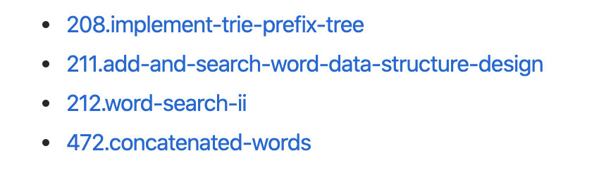
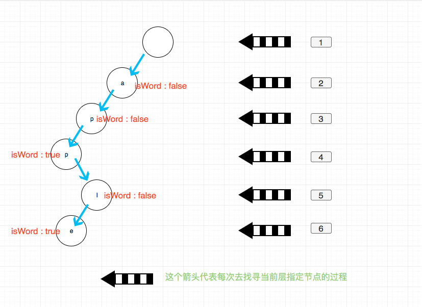

# 0820. 单词的压缩编码

## 题目地址（820. 单词的压缩编码）

<https://leetcode-cn.com/problems/short-encoding-of-words/>

## 题目描述

```
<pre class="calibre18">```
给定一个单词列表，我们将这个列表编码成一个索引字符串 S 与一个索引列表 A。

例如，如果这个列表是 ["time", "me", "bell"]，我们就可以将其表示为 S = "time#bell#" 和 indexes = [0, 2, 5]。

对于每一个索引，我们可以通过从字符串 S 中索引的位置开始读取字符串，直到 "#" 结束，来恢复我们之前的单词列表。

那么成功对给定单词列表进行编码的最小字符串长度是多少呢？


示例：

输入: words = ["time", "me", "bell"]
输出: 10
说明: S = "time#bell#" ， indexes = [0, 2, 5] 。


提示：

1 <= words.length <= 2000
1 <= words[i].length <= 7
每个单词都是小写字母 。

```
```

## 前置知识

- 前缀树

## 公司

- 阿里
- 字节

## 思路

读完题目之后就发现如果将列表中每一个单词分别倒序就是一个后缀树问题。比如 `["time", "me", "bell"]` 倒序之后就是 \["emit", "em", "lleb"\]，我们要求的结果无非就是 "emit" 的长度 + "llem"的长度 + "##"的长度（em 和 emit 有公共前缀，计算一个就好了）。

因此符合直觉的想法是使用前缀树 + 倒序插入的形式来模拟后缀树。

下面的代码看起来复杂，但是很多题目我都是用这个模板，稍微调整下细节就能 AC。我这里总结了一套[前缀树专题](https://github.com/azl397985856/leetcode/blob/master/thinkings/trie.md)



前缀树的 api 主要有以下几个：

- `insert(word)`: 插入一个单词
- `search(word)`：查找一个单词是否存在
- `startWith(word)`： 查找是否存在以 word 为前缀的单词

其中 startWith 是前缀树最核心的用法，其名称前缀树就从这里而来。大家可以先拿 208 题开始，熟悉一下前缀树，然后再尝试别的题目。

一个前缀树大概是这个样子：



如图每一个节点存储一个字符，然后外加一个控制信息表示是否是单词结尾，实际使用过程可能会有细微差别，不过变化不大。

这道题需要考虑 edge case， 比如这个列表是 \["time", "time", "me", "bell"\] 这种包含重复元素的情况，这里我使用 hashset 来去重。

## 关键点

- 前缀树
- 去重

## 代码

```
<pre class="calibre18">```
<span class="hljs-class"><span class="hljs-keyword">class</span> <span class="hljs-title">Trie</span>:</span>

    <span class="hljs-function"><span class="hljs-keyword">def</span> <span class="hljs-title">__init__</span><span class="hljs-params">(self)</span>:</span>
        <span class="hljs-string">"""
        Initialize your data structure here.
        """</span>
        self.Trie = {}

    <span class="hljs-function"><span class="hljs-keyword">def</span> <span class="hljs-title">insert</span><span class="hljs-params">(self, word)</span>:</span>
        <span class="hljs-string">"""
        Inserts a word into the trie.
        :type word: str
        :rtype: void
        """</span>
        curr = self.Trie
        <span class="hljs-keyword">for</span> w <span class="hljs-keyword">in</span> word:
            <span class="hljs-keyword">if</span> w <span class="hljs-keyword">not</span> <span class="hljs-keyword">in</span> curr:
                curr[w] = {}
            curr = curr[w]
        curr[<span class="hljs-string">'#'</span>] = <span class="hljs-params">1</span>

    <span class="hljs-function"><span class="hljs-keyword">def</span> <span class="hljs-title">search</span><span class="hljs-params">(self, word)</span>:</span>
        <span class="hljs-string">"""
        Returns if the word is in the trie.
        :type word: str
        :rtype: bool
        """</span>
        curr = self.Trie
        <span class="hljs-keyword">for</span> w <span class="hljs-keyword">in</span> word:
            curr = curr[w]
        <span class="hljs-title"># len(curr) == 1 means we meet '#'</span>
        <span class="hljs-title"># when we search 'em'(which reversed from 'me')</span>
        <span class="hljs-title"># the result is len(curr) > 1</span>
        <span class="hljs-title"># cause the curr look like { '#': 1, i: {...}}</span>
        <span class="hljs-keyword">return</span> len(curr) == <span class="hljs-params">1</span>
<span class="hljs-class"><span class="hljs-keyword">class</span> <span class="hljs-title">Solution</span>:</span>
    <span class="hljs-function"><span class="hljs-keyword">def</span> <span class="hljs-title">minimumLengthEncoding</span><span class="hljs-params">(self, words: List[str])</span> -> int:</span>
        trie = Trie()
        cnt = <span class="hljs-params">0</span>
        words = set(words)
        <span class="hljs-keyword">for</span> word <span class="hljs-keyword">in</span> words:
            trie.insert(word[::<span class="hljs-params">-1</span>])
        <span class="hljs-keyword">for</span> word <span class="hljs-keyword">in</span> words:
            <span class="hljs-keyword">if</span> trie.search(word[::<span class="hljs-params">-1</span>]):
                cnt += len(word) + <span class="hljs-params">1</span>
        <span class="hljs-keyword">return</span> cnt

```
```

***复杂度分析***

- 时间复杂度：O(N)O(N)O(N)，其中 N 为单词长度列表中的总字符数，比如\["time", "me"\]，就是 4 + 2 = 6。
- 空间复杂度：O(N)O(N)O(N)，其中 N 为单词长度列表中的总字符数，比如\["time", "me"\]，就是 4 + 2 = 6。

大家也可以关注我的公众号《力扣加加》获取更多更新鲜的 LeetCode 题解


## 相关题目

- [0208.implement-trie-prefix-tree](208.implement-trie-prefix-tree.html)
- [0211.add-and-search-word-data-structure-design](211.add-and-search-word-data-structure-design.html)
- [0212.word-search-ii](212.word-search-ii.html)
- [0472.concatenated-words](472.concatenated-words.html)
- [0820.short-encoding-of-words](https://github.com/azl397985856/leetcode/blob/master/problems/820.short-encoding-of-words.md)
- [1032.stream-of-characters](https://github.com/azl397985856/leetcode/blob/master/problems/1032.stream-of-characters.md)