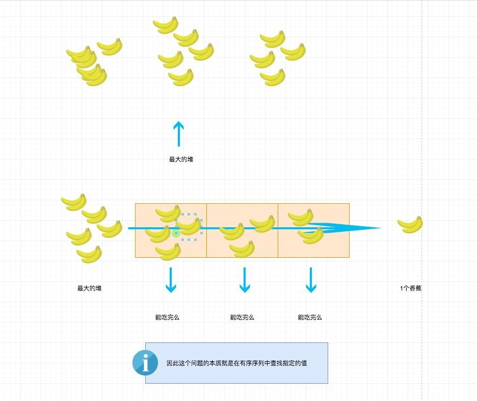

# 0875. 爱吃香蕉的珂珂

## 题目地址（875. 爱吃香蕉的珂珂）

<https://leetcode-cn.com/problems/koko-eating-bananas/description/>

## 题目描述

```
<pre class="calibre18">```
珂珂喜欢吃香蕉。这里有 N 堆香蕉，第 i 堆中有 piles[i] 根香蕉。警卫已经离开了，将在 H 小时后回来。

珂珂可以决定她吃香蕉的速度 K （单位：根/小时）。每个小时，她将会选择一堆香蕉，从中吃掉 K 根。如果这堆香蕉少于 K 根，她将吃掉这堆的所有香蕉，然后这一小时内不会再吃更多的香蕉。  

珂珂喜欢慢慢吃，但仍然想在警卫回来前吃掉所有的香蕉。

返回她可以在 H 小时内吃掉所有香蕉的最小速度 K（K 为整数）。


示例 1：

输入: piles = [3,6,7,11], H = 8
输出: 4
示例 2：

输入: piles = [30,11,23,4,20], H = 5
输出: 30
示例 3：

输入: piles = [30,11,23,4,20], H = 6
输出: 23


提示：

1 <= piles.length <= 10^4
piles.length <= H <= 10^9
1 <= piles[i] <= 10^9

```
```

## 前置知识

- 二分查找

## 公司

- 字节

## 思路

符合直觉的做法是，选择最大的堆的香蕉数，然后试一下能不能行，如果不行则直接返回上次计算的结果，如果行，我们减少 1 个香蕉，试试行不行，依次类推。计算出刚好不行的即可。这种解法的时间复杂度比较高，为 O(N∗M)O(N \* M)O(N∗M)，其中 N 为 piles 长度， M 为 Piles 中最大的数。。

这道题如果能看出来是二分法解决，那么其实很简单。为什么它是二分问题呢？我这里画了个图，我相信你看了就明白了。



> 香蕉堆的香蕉个数上限是 10^9， 珂珂这也太能吃了吧？

## 关键点解析

- 二分查找

## 代码

代码支持：Python，JavaScript

Python Code:

```
<pre class="calibre18">```
<span class="hljs-class"><span class="hljs-keyword">class</span> <span class="hljs-title">Solution</span>:</span>
    <span class="hljs-function"><span class="hljs-keyword">def</span> <span class="hljs-title">canEatAllBananas</span><span class="hljs-params">(self, piles, H, K)</span>:</span>
        t = <span class="hljs-params">0</span>
        <span class="hljs-keyword">for</span> pile <span class="hljs-keyword">in</span> piles:
            t += math.ceil(pile / K)
        <span class="hljs-keyword">return</span> t <= H
    <span class="hljs-function"><span class="hljs-keyword">def</span> <span class="hljs-title">minEatingSpeed</span><span class="hljs-params">(self, piles: List[int], H: int)</span> -> int:</span>
        l, r = <span class="hljs-params">1</span>, max(piles)
        <span class="hljs-title"># [l, r) ， 左闭右开的好处是如果能找到，那么返回 l 和 r 都是一样的，因为最终 l 等于 r。</span>
        <span class="hljs-keyword">while</span> l < r:
            mid = (l + r) >> <span class="hljs-params">1</span>
            <span class="hljs-keyword">if</span> self.canEatAllBananas(piles, H, mid):
                r = mid
            <span class="hljs-keyword">else</span>:
                l = mid + <span class="hljs-params">1</span>
        <span class="hljs-keyword">return</span> l

```
```

JavaScript Code:

```
<pre class="calibre18">```
<span class="hljs-function"><span class="hljs-keyword">function</span> <span class="hljs-title">canEatAllBananas</span>(<span class="hljs-params">piles, H, mid</span>) </span>{
  <span class="hljs-keyword">let</span> h = <span class="hljs-params">0</span>;
  <span class="hljs-keyword">for</span> (<span class="hljs-keyword">let</span> pile <span class="hljs-keyword">of</span> piles) {
    h += <span class="hljs-params">Math</span>.ceil(pile / mid);
  }

  <span class="hljs-keyword">return</span> h <= H;
}
<span class="hljs-title">/**
 * @param {number[]} piles
 * @param {number} H
 * @return {number}
 */</span>
<span class="hljs-keyword">var</span> minEatingSpeed = <span class="hljs-function"><span class="hljs-keyword">function</span> (<span class="hljs-params">piles, H</span>) </span>{
  <span class="hljs-keyword">let</span> lo = <span class="hljs-params">1</span>,
    hi = <span class="hljs-params">Math</span>.max(...piles);
  <span class="hljs-title">// [l, r) ， 左闭右开的好处是如果能找到，那么返回 l 和 r 都是一样的，因为最终 l 等于 r。</span>
  <span class="hljs-keyword">while</span> (lo <= hi) {
    <span class="hljs-keyword">let</span> mid = lo + ((hi - lo) >> <span class="hljs-params">1</span>);
    <span class="hljs-keyword">if</span> (canEatAllBananas(piles, H, mid)) {
      hi = mid - <span class="hljs-params">1</span>;
    } <span class="hljs-keyword">else</span> {
      lo = mid + <span class="hljs-params">1</span>;
    }
  }

  <span class="hljs-keyword">return</span> lo; <span class="hljs-title">//  不能选择hi</span>
};

```
```

**复杂度分析**

- 时间复杂度：O(max(N,N∗logM))O(max(N, N \* logM))O(max(N,N∗logM))，其中 N 为 piles 长度， M 为 Piles 中最大的数。
- 空间复杂度：O(1)O(1)O(1)

## 模板

分享几个常用的的二分法模板。

### 查找一个数

```
<pre class="calibre18">```
<span class="hljs-function"><span class="hljs-keyword">public</span> <span class="hljs-keyword">int</span> <span class="hljs-title">binarySearch</span><span class="hljs-params">(<span class="hljs-keyword">int</span>[] nums, <span class="hljs-keyword">int</span> target)</span> </span>{
    <span class="hljs-title">// 左右都闭合的区间 [l, r]</span>
    <span class="hljs-keyword">int</span> left = <span class="hljs-params">0</span>;
    <span class="hljs-keyword">int</span> right = nums.length - <span class="hljs-params">1</span>;

    <span class="hljs-keyword">while</span>(left <= right) {
        <span class="hljs-keyword">int</span> mid = left + (right - left) / <span class="hljs-params">2</span>;
        <span class="hljs-keyword">if</span>(nums[mid] == target)
            <span class="hljs-keyword">return</span> mid;
        <span class="hljs-keyword">else</span> <span class="hljs-keyword">if</span> (nums[mid] < target)
            <span class="hljs-title">// 搜索区间变为 [mid+1, right]</span>
            left = mid + <span class="hljs-params">1</span>;
        <span class="hljs-keyword">else</span> <span class="hljs-keyword">if</span> (nums[mid] > target)
            <span class="hljs-title">// 搜索区间变为 [left, mid - 1]</span>
            right = mid - <span class="hljs-params">1</span>;
    }
    <span class="hljs-keyword">return</span> -<span class="hljs-params">1</span>;
}

```
```

### 寻找最左边的满足条件的值

```
<pre class="calibre18">```
<span class="hljs-function"><span class="hljs-keyword">public</span> <span class="hljs-keyword">int</span> <span class="hljs-title">binarySearchLeft</span><span class="hljs-params">(<span class="hljs-keyword">int</span>[] nums, <span class="hljs-keyword">int</span> target)</span> </span>{
    <span class="hljs-title">// 搜索区间为 [left, right]</span>
    <span class="hljs-keyword">int</span> left = <span class="hljs-params">0</span>;
    <span class="hljs-keyword">int</span> right = nums.length - <span class="hljs-params">1</span>;
    <span class="hljs-keyword">while</span> (left <= right) {
        <span class="hljs-keyword">int</span> mid = left + (right - left) / <span class="hljs-params">2</span>;
        <span class="hljs-keyword">if</span> (nums[mid] < target) {
            <span class="hljs-title">// 搜索区间变为 [mid+1, right]</span>
            left = mid + <span class="hljs-params">1</span>;
        } <span class="hljs-keyword">else</span> <span class="hljs-keyword">if</span> (nums[mid] > target) {
            <span class="hljs-title">// 搜索区间变为 [left, mid-1]</span>
            right = mid - <span class="hljs-params">1</span>;
        } <span class="hljs-keyword">else</span> <span class="hljs-keyword">if</span> (nums[mid] == target) {
            <span class="hljs-title">// 收缩右边界</span>
            right = mid - <span class="hljs-params">1</span>;
        }
    }
    <span class="hljs-title">// 检查是否越界</span>
    <span class="hljs-keyword">if</span> (left >= nums.length || nums[left] != target)
        <span class="hljs-keyword">return</span> -<span class="hljs-params">1</span>;
    <span class="hljs-keyword">return</span> left;
}

```
```

### 寻找最右边的满足条件的值

```
<pre class="calibre18">```
<span class="hljs-function"><span class="hljs-keyword">public</span> <span class="hljs-keyword">int</span> <span class="hljs-title">binarySearchRight</span><span class="hljs-params">(<span class="hljs-keyword">int</span>[] nums, <span class="hljs-keyword">int</span> target)</span> </span>{
    <span class="hljs-title">// 搜索区间为 [left, right]</span>
    <span class="hljs-keyword">int</span> left = <span class="hljs-params">0</span>
    <span class="hljs-keyword">int</span> right = nums.length - <span class="hljs-params">1</span>;
    <span class="hljs-keyword">while</span> (left <= right) {
        <span class="hljs-keyword">int</span> mid = left + (right - left) / <span class="hljs-params">2</span>;
        <span class="hljs-keyword">if</span> (nums[mid] < target) {
            <span class="hljs-title">// 搜索区间变为 [mid+1, right]</span>
            left = mid + <span class="hljs-params">1</span>;
        } <span class="hljs-keyword">else</span> <span class="hljs-keyword">if</span> (nums[mid] > target) {
            <span class="hljs-title">// 搜索区间变为 [left, mid-1]</span>
            right = mid - <span class="hljs-params">1</span>;
        } <span class="hljs-keyword">else</span> <span class="hljs-keyword">if</span> (nums[mid] == target) {
            <span class="hljs-title">// 收缩左边界</span>
            left = mid + <span class="hljs-params">1</span>;
        }
    }
    <span class="hljs-title">// 检查是否越界</span>
    <span class="hljs-keyword">if</span> (right < <span class="hljs-params">0</span> || nums[right] != target)
        <span class="hljs-keyword">return</span> -<span class="hljs-params">1</span>;
    <span class="hljs-keyword">return</span> right;
}

```
```

> 如果题目重点不是二分，也就是说二分只是众多步骤中的一步，大家也可以直接调用语言的 API，比如 Python 的 bisect 模块。

更多题解可以访问我的 LeetCode 题解仓库：<https://github.com/azl397985856/leetcode> 。 目前已经 37K star 啦。

关注公众号力扣加加，努力用清晰直白的语言还原解题思路，并且有大量图解，手把手教你识别套路，高效刷题。

