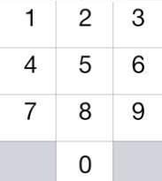

# 0935. 骑士拨号器

## 题目地址 (935. 骑士拨号器）

<https://leetcode-cn.com/problems/knight-dialer/>

## 题目描述

```
<pre class="calibre18">```
国际象棋中的骑士可以按下图所示进行移动：

```
```



```
<pre class="calibre18">```

这一次，我们将 “骑士” 放在电话拨号盘的任意数字键（如上图所示）上，接下来，骑士将会跳 N-1 步。每一步必须是从一个数字键跳到另一个数字键。

每当它落在一个键上（包括骑士的初始位置），都会拨出键所对应的数字，总共按下 N 位数字。

你能用这种方式拨出多少个不同的号码？

因为答案可能很大，所以输出答案模 10^9 + 7。


示例 1：

输入：1
输出：10
示例 2：

输入：2
输出：20
示例 3：

输入：3
输出：46


提示：

1 <= N <= 5000

```
```

## 前置知识

- DFS
- 记忆化搜索

## 深度优先遍历（DFS）

## 公司

- 暂无

### 思路

这道题要求解一个数字。并且每一个格子能够跳的状态是确定的。 因此我们的思路就是“状态机”（动态规划），暴力遍历（BFS or DFS），这里我们使用 DFS。（注意这几种思路并无本质不同）

对于每一个号码键盘，我们可以转移的状态是确定的，我们做一个”预处理“，将这些状态转移记录到一个数组 jump，其中 jump\[i\] 表示 i 位置可以跳的点（用一个数组来表示）。问题转化为：

- 从 0 开始所有的路径
- 从 1 开始所有的路径
- 从 2 开始所有的路径
- ...
- 从 9 开始所有的路径

不管从几开始思路都是一样的。 我们使用一个函数 f(i, n) 表示`骑士在 i 的位置，还剩下 N 步可以走`的时候可以拨出的总的号码数。那么问题就是求解 `f(0, N) + f(1, N) + f(2, N) + ... + f(9, N)`。对于 f(i, n)，我们初始化 cnt 为 0，由于 i 能跳的格子是 jump\[i\]，我们将其 `cnt += f(j, n - 1)`，其中 j 属于 jump\[i\]，最终返回 cnt 即可。

不难看出，这种算法有大量重复计算，我们使用记忆化递归形式来减少重复计算。 这种算法勉强通过。

### 代码

```
<pre class="calibre18">```
<span class="hljs-class"><span class="hljs-keyword">class</span> <span class="hljs-title">Solution</span>:</span>
    <span class="hljs-function"><span class="hljs-keyword">def</span> <span class="hljs-title">knightDialer</span><span class="hljs-params">(self, N: int)</span> -> int:</span>
        cnt = <span class="hljs-params">0</span>
        jump = [[<span class="hljs-params">4</span>, <span class="hljs-params">6</span>], [<span class="hljs-params">6</span>, <span class="hljs-params">8</span>], [<span class="hljs-params">7</span>, <span class="hljs-params">9</span>], [<span class="hljs-params">4</span>, <span class="hljs-params">8</span>], [
            <span class="hljs-params">0</span>, <span class="hljs-params">3</span>, <span class="hljs-params">9</span>], [], [<span class="hljs-params">0</span>, <span class="hljs-params">1</span>, <span class="hljs-params">7</span>], [<span class="hljs-params">2</span>, <span class="hljs-params">6</span>], [<span class="hljs-params">1</span>, <span class="hljs-params">3</span>], [<span class="hljs-params">2</span>, <span class="hljs-params">4</span>]]
        visited = dict()

        <span class="hljs-function"><span class="hljs-keyword">def</span> <span class="hljs-title">helper</span><span class="hljs-params">(i, n)</span>:</span>
            <span class="hljs-keyword">if</span> (i, n) <span class="hljs-keyword">in</span> visited: <span class="hljs-keyword">return</span> visited[(i, n)]
            <span class="hljs-keyword">if</span> n == <span class="hljs-params">1</span>:
                <span class="hljs-keyword">return</span> <span class="hljs-params">1</span>
            cnt = <span class="hljs-params">0</span>
            <span class="hljs-keyword">for</span> j <span class="hljs-keyword">in</span> jump[i]:
                cnt += helper(j, n - <span class="hljs-params">1</span>)
            visited[(i, n)] = cnt
            <span class="hljs-keyword">return</span> cnt
        <span class="hljs-keyword">for</span> i <span class="hljs-keyword">in</span> range(<span class="hljs-params">10</span>):
            cnt += helper(i, N)
        <span class="hljs-keyword">return</span> cnt % (<span class="hljs-params">10</span>**<span class="hljs-params">9</span> + <span class="hljs-params">7</span>)

```
```

**复杂度分析**

- 时间复杂度：O(N)O(N)O(N)
- 空间复杂度：O(N)O(N)O(N)

## 朴素遍历

### 思路

我们使用迭代的形式来优化上述过程。我们初始化十个变量分别表示键盘不同位置能够拨出的号码数，并且初始化为 1。接下来我们只要循环 N - 1 次，不断更新状态即可。不过这种算法和上述算法并无本质不同。

### 代码

```
<pre class="calibre18">```
<span class="hljs-class"><span class="hljs-keyword">class</span> <span class="hljs-title">Solution</span>:</span>
    <span class="hljs-function"><span class="hljs-keyword">def</span> <span class="hljs-title">knightDialer</span><span class="hljs-params">(self, N: int)</span> -> int:</span>
        a0 = a1 = a2 = a3 = a4 = a5 = a6 = a7 = a8 = a9 = <span class="hljs-params">1</span>
        <span class="hljs-keyword">for</span> _ <span class="hljs-keyword">in</span> range(N - <span class="hljs-params">1</span>):
            a0, a1, a2, a3, a4, a5, a6, a7, a8, a9 = a4 + a6, a6 + a8, a7 + \
                a9, a4 + a8, a0 + a3 + a9, <span class="hljs-params">0</span>, a0 + a1 + a7, a2 + a6, a1 + a3, a2 + a4
        <span class="hljs-keyword">return</span> (a0 + a1 + a2 + a3 + a4 + a5 + a6 + a7 + a8 + a9) % (<span class="hljs-params">10</span>**<span class="hljs-params">9</span> + <span class="hljs-params">7</span>)

```
```

**复杂度分析**

- 时间复杂度：O(N)O(N)O(N)
- 空间复杂度：O(1)O(1)O(1)

欢迎关注我的公众号《脑洞前端》获取更多更新鲜的 LeetCode 题解

