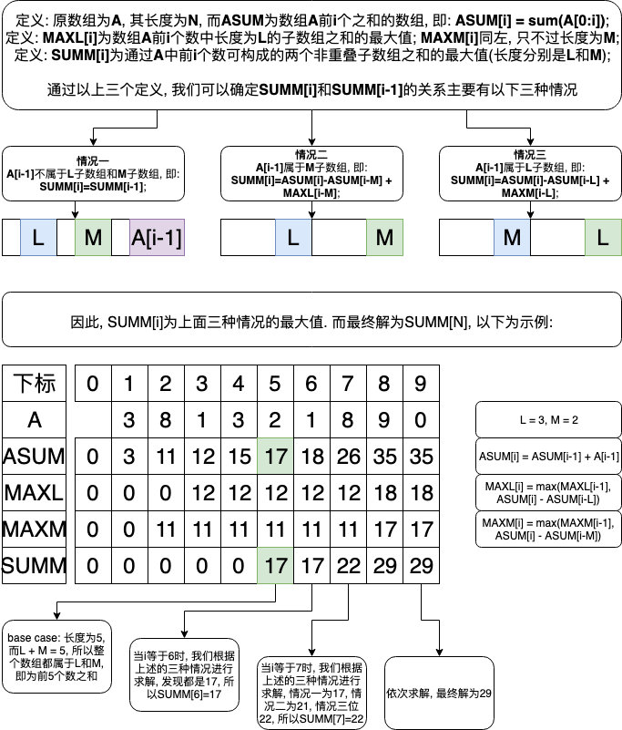

# 1031. 两个非重叠子数组的最大和

## 题目地址(1031. 两个非重叠子数组的最大和)

<https://leetcode-cn.com/problems/maximum-sum-of-two-non-overlapping-subarrays/>

## 题目描述

```
<pre class="calibre18">```
给出非负整数数组 A ，返回两个非重叠（连续）子数组中元素的最大和，子数组的长度分别为 L 和 M。（这里需要澄清的是，长为 L 的子数组可以出现在长为 M 的子数组之前或之后。）

从形式上看，返回最大的 V，而 V = (A[i] + A[i+1] + ... + A[i+L-1]) + (A[j] + A[j+1] + ... + A[j+M-1]) 并满足下列条件之一：


0 <= i < i + L - 1 < j < j + M - 1 < A.length, 或
0 <= j < j + M - 1 < i < i + L - 1 < A.length.


示例 1：

输入：A = [0,6,5,2,2,5,1,9,4], L = 1, M = 2
输出：20
解释：子数组的一种选择中，[9] 长度为 1，[6,5] 长度为 2。
示例 2：

输入：A = [3,8,1,3,2,1,8,9,0], L = 3, M = 2
输出：29
解释：子数组的一种选择中，[3,8,1] 长度为 3，[8,9] 长度为 2。
示例 3：

输入：A = [2,1,5,6,0,9,5,0,3,8], L = 4, M = 3
输出：31
解释：子数组的一种选择中，[5,6,0,9] 长度为 4，[0,3,8] 长度为 3。


提示：

L >= 1
M >= 1
L + M <= A.length <= 1000
0 <= A[i] <= 1000

```
```

## 前置知识

- 数组

## 公司

- 字节

## 思路(动态规划)

题目中要求在前N(数组长度)个数中找出长度分别为L和M的非重叠子数组之和的最大值, 因此, 我们可以定义数组A中前i个数可构成的非重叠子数组L和M的最大值为SUMM\[i\], 并找到SUMM\[i\]和SUMM\[i-1\]的关系, 那么最终解就是SUMM\[N\]. 以下为图解:



## 关键点解析

1. 注意图中描述的都是A\[i-1\], 而不是A\[i\], 因为base case为空数组, 而不是A\[0\];
2. 求解图中ASUM数组的时候, 注意定义的是ASUM\[i\] = sum(A\[0:i\]), 因此当i等于0时, A\[0:0\]为空数组, 即: ASUM\[0\]为0, 而ASUM\[1\]才等于A\[0\];
3. 求解图中MAXL数组时, 注意i < L时, 没有意义, 因为长度不够, 所以从i = L时才开始求解;
4. 求解图中MAXM数组时, 也一样, 要从i = M时才开始求解;
5. 求解图中SUMM数组时, 因为我们需要一个L子数组和一个M子数组, 因此长度要大于等于L+M才有意义, 所以要从i = L + M时开始求解.

## 代码

- 语言支持: Python

Python Code:

```
<pre class="calibre18">```
<span class="hljs-class"><span class="hljs-keyword">class</span> <span class="hljs-title">Solution</span>:</span>
    <span class="hljs-function"><span class="hljs-keyword">def</span> <span class="hljs-title">maxSumTwoNoOverlap</span><span class="hljs-params">(self, a: List[int], l: int, m: int)</span> -> int:</span>
        <span class="hljs-string">"""

        define asum[i] as the sum of subarray, a[0:i]
        define maxl[i] as the maximum sum of l-length subarray in a[0:i]
        define maxm[i] as the maximum sum of m-length subarray in a[0:i]
        define msum[i] as the maximum sum of non-overlap l-length subarray and m-length subarray

        case 1: a[i] is both not in l-length subarray and m-length subarray, then msum[i] = msum[i - 1]
        case 2: a[i] is in l-length subarray, then msum[i] = asum[i] - asum[i-l] + maxm[i-l]
        case 3: a[i] is in m-length subarray, then msum[i] = asum[i] - asum[i-m] + maxl[i-m]

        so, msum[i] = max(msum[i - 1], asum[i] - asum[i-l] + maxl[i-l], asum[i] - asum[i-m] + maxm[i-m])
        """</span>

        alen, tlen = len(a), l + m
        asum = [<span class="hljs-params">0</span>] * (alen + <span class="hljs-params">1</span>)
        maxl = [<span class="hljs-params">0</span>] * (alen + <span class="hljs-params">1</span>)
        maxm = [<span class="hljs-params">0</span>] * (alen + <span class="hljs-params">1</span>)
        msum = [<span class="hljs-params">0</span>] * (alen + <span class="hljs-params">1</span>)

        <span class="hljs-keyword">for</span> i <span class="hljs-keyword">in</span> range(tlen):
            <span class="hljs-keyword">if</span> i == <span class="hljs-params">1</span>:
                asum[i] = a[i - <span class="hljs-params">1</span>]
            <span class="hljs-keyword">elif</span> i > <span class="hljs-params">1</span>:
                asum[i] = asum[i - <span class="hljs-params">1</span>] + a[i - <span class="hljs-params">1</span>]
            <span class="hljs-keyword">if</span> i >= l:
                maxl[i] = max(maxl[i - <span class="hljs-params">1</span>], asum[i] - asum[i - l])
            <span class="hljs-keyword">if</span> i >= m:
                maxm[i] = max(maxm[i - <span class="hljs-params">1</span>], asum[i] - asum[i - m])

        <span class="hljs-keyword">for</span> i <span class="hljs-keyword">in</span> range(tlen, alen + <span class="hljs-params">1</span>):
            asum[i] = asum[i - <span class="hljs-params">1</span>] + a[i - <span class="hljs-params">1</span>]
            suml = asum[i] - asum[i - l]
            summ = asum[i] - asum[i - m]
            maxl[i] = max(maxl[i - <span class="hljs-params">1</span>], suml)
            maxm[i] = max(maxm[i - <span class="hljs-params">1</span>], summ)
            msum[i] = max(msum[i - <span class="hljs-params">1</span>], suml + maxm[i - l], summ + maxl[i - m])

        <span class="hljs-keyword">return</span> msum[<span class="hljs-params">-1</span>]

```
```

## 扩展

1. 代码中, 求解了4个动态规划数组来求解最终值, 有没有可能只用两个数组来求解该题, 可以的话, 需要保留的又是哪两个数组?
2. 代码中, 求解的4动态规划数组的顺序能否改变, 哪些能改, 哪些不能改?

如果采用前缀和数组的话，可以只使用O(n)的空间来存储前缀和，O(1)的动态规划状态空间来完成。C++代码如下:

```
<pre class="calibre18">```
<span class="hljs-keyword">class</span> Solution {
<span class="hljs-keyword">public</span>:
    <span class="hljs-function"><span class="hljs-keyword">int</span> <span class="hljs-title">maxSumTwoNoOverlap</span><span class="hljs-params">(<span class="hljs-params">vector</span><<span class="hljs-keyword">int</span>>& A, <span class="hljs-keyword">int</span> L, <span class="hljs-keyword">int</span> M)</span> </span>{
        <span class="hljs-keyword">auto</span> tmp = <span class="hljs-params">vector</span><<span class="hljs-keyword">int</span>>{A[<span class="hljs-params">0</span>]};
        <span class="hljs-keyword">for</span> (<span class="hljs-keyword">auto</span> i = <span class="hljs-params">1</span>; i < A.size(); ++i) {
            tmp.push_back(A[i] + tmp[i - <span class="hljs-params">1</span>]);
        }
        <span class="hljs-keyword">auto</span> res = tmp[L + M - <span class="hljs-params">1</span>], lMax = tmp[L - <span class="hljs-params">1</span>], mMax = tmp[M - <span class="hljs-params">1</span>];
        <span class="hljs-keyword">for</span> (<span class="hljs-keyword">auto</span> i = L + M; i < tmp.size(); ++i) {
            lMax = max(lMax, tmp[i - M] - tmp[i - M - L]);
            mMax = max(mMax, tmp[i - L] - tmp[i - L - M]);
            res = max(res, max(lMax + tmp[i] - tmp[i - M], mMax + tmp[i] - tmp[i - L]));
        }
        <span class="hljs-keyword">return</span> res;
    }
};

```
```