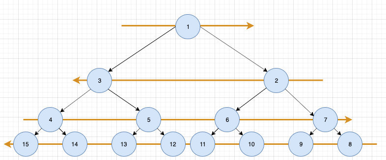
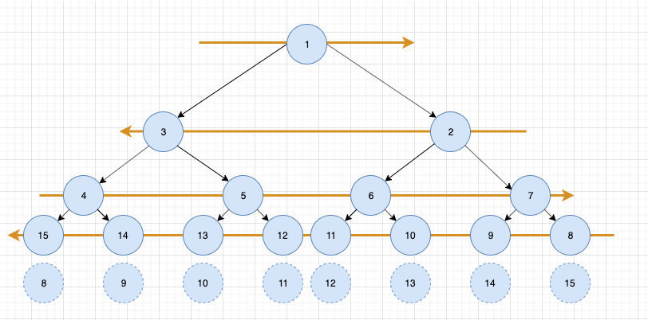
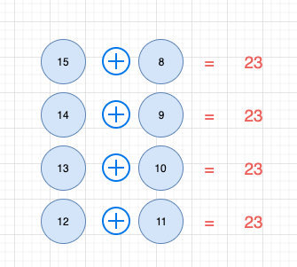

# 1104. 二叉树寻路

## 题目地址(1104. 二叉树寻路)

<https://leetcode-cn.com/problems/path-in-zigzag-labelled-binary-tree/>

## 题目描述

```
<pre class="calibre18">```

在一棵无限的二叉树上，每个节点都有两个子节点，树中的节点 逐行 依次按 “之” 字形进行标记。

如下图所示，在奇数行（即，第一行、第三行、第五行……）中，按从左到右的顺序进行标记；

而偶数行（即，第二行、第四行、第六行……）中，按从右到左的顺序进行标记。


给你树上某一个节点的标号 label，请你返回从根节点到该标号为 label 节点的路径，该路径是由途经的节点标号所组成的。

示例 1：

输入：label = 14
输出：[1,3,4,14]
示例 2：

输入：label = 26
输出：[1,2,6,10,26]

提示：

1 <= label <= 10^6

```
```

## 前置知识

- 二叉树

## 公司

- 暂无

## 思路

假如这道题不是之字形，那么就会非常简单。 我们可以根据子节点的 label 轻松地求出父节点的 label，公示是 label // 2（其中 label 为子节点的 label）。

如果是这样的话，这道题应该是 easy 难度，代码也不难写出。我们继续考虑之字形。我们不妨先观察一下，找下规律。



以上图最后一行为例，对于 15 节点，之字变换之前对应的应该是 8 节点。14 节点对应的是 9 节点。。。

全部列举出来是这样的：



我们发现之字变换前后的 label 相加是一个定值。



因此实际上只需要求解出每一层的这个定值，然后减去当前值就好了。（注意我们不需要区分偶数行和奇数行） 问题的关键转化为求解这个定值，这个定值其实很好求，因为每一层的最大值和最小值我们很容易求，而最大值和最小值的和正是我们要求的这个数字。

最大值和最小值这么求呢？由满二叉树的性质，我们知道每一层的最小值就是`2 ** (level - 1)`，而最大值是`2 ** level - 1`。 因此我们只要知道 level 即可，level 非常容易求出，具体可以看下面代码。

## 关键点

- 满二叉树的性质：
- 最小值是`2 ** (level - 1)`，最大值是`2 ** level - 1`，其中 level 是树的深度。
- 假如父节点的索引为 i，那么左子节点就是 2\*i， 右边子节点就是 2\*i + 1。
- 假如子节点的索引是 i，那么父节点的索引就是 i // 2。
- 先思考一般情况（不是之字形）， 然后通过观察找出规律

## 代码

```
<pre class="calibre18">```
<span class="hljs-class"><span class="hljs-keyword">class</span> <span class="hljs-title">Solution</span>:</span>
    <span class="hljs-function"><span class="hljs-keyword">def</span> <span class="hljs-title">pathInZigZagTree</span><span class="hljs-params">(self, label: int)</span> -> List[int]:</span>
        level = <span class="hljs-params">0</span>
        res = []
        <span class="hljs-keyword">while</span> <span class="hljs-params">2</span> ** level - <span class="hljs-params">1</span> < label:
            level += <span class="hljs-params">1</span>

        <span class="hljs-keyword">while</span> level > <span class="hljs-params">0</span>:
            res.insert(<span class="hljs-params">0</span>, label)
            label = <span class="hljs-params">2</span> ** (level - <span class="hljs-params">1</span>) + <span class="hljs-params">2</span> ** level - <span class="hljs-params">1</span> - label
            label //= <span class="hljs-params">2</span>
            level -= <span class="hljs-params">1</span>
        <span class="hljs-keyword">return</span> res

```
```

**复杂度分析**

- 时间复杂度：由于每次都在头部插入 res，因此时间复杂度为 O(logLabel)O(log\_Label)O(logLabel)， 一共插入了 O(logLabel)O(log\_Label)O(logLabel) 次， 因此总的时间复杂度为 O(logLabel∗logLabel)O(logLabel \* logLabel)O(logLabel∗logLabel)。
- 空间复杂度：O(1)O(1)O(1)

大家对此有何看法，欢迎给我留言，我有时间都会一一查看回答。更多算法套路可以访问我的 LeetCode 题解仓库：<https://github.com/azl397985856/leetcode> 。 目前已经 37K star 啦。 大家也可以关注我的公众号《力扣加加》带你啃下算法这块硬骨头。 