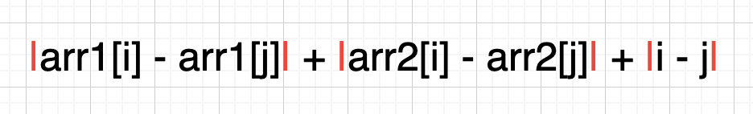
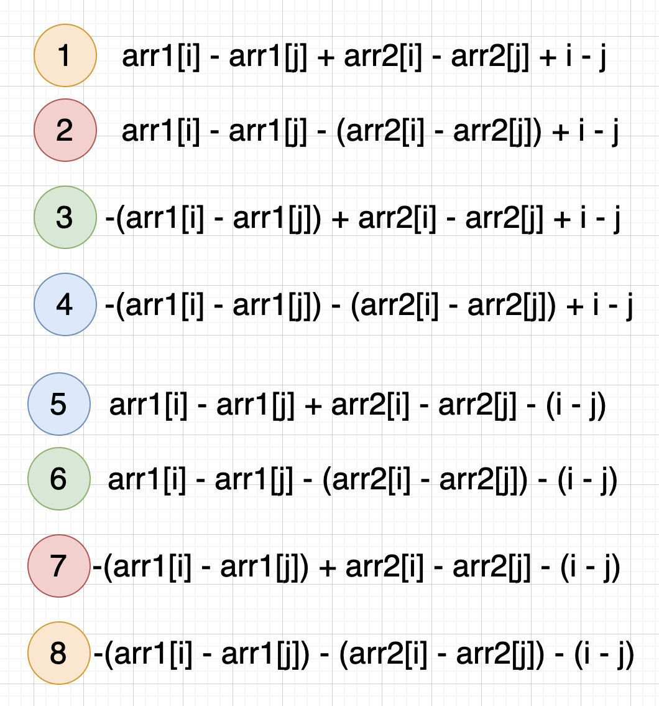
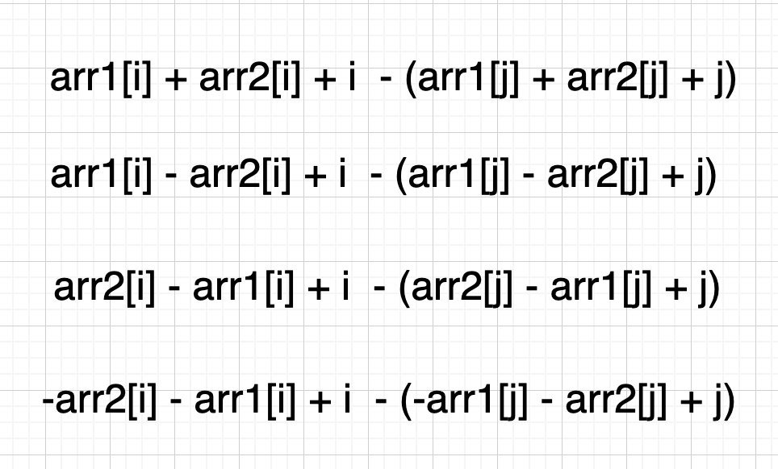
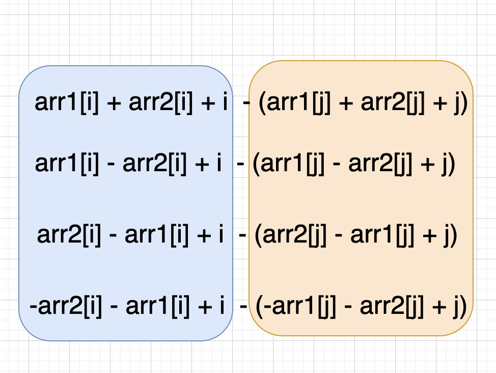
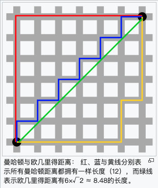
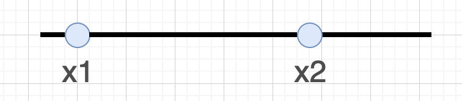
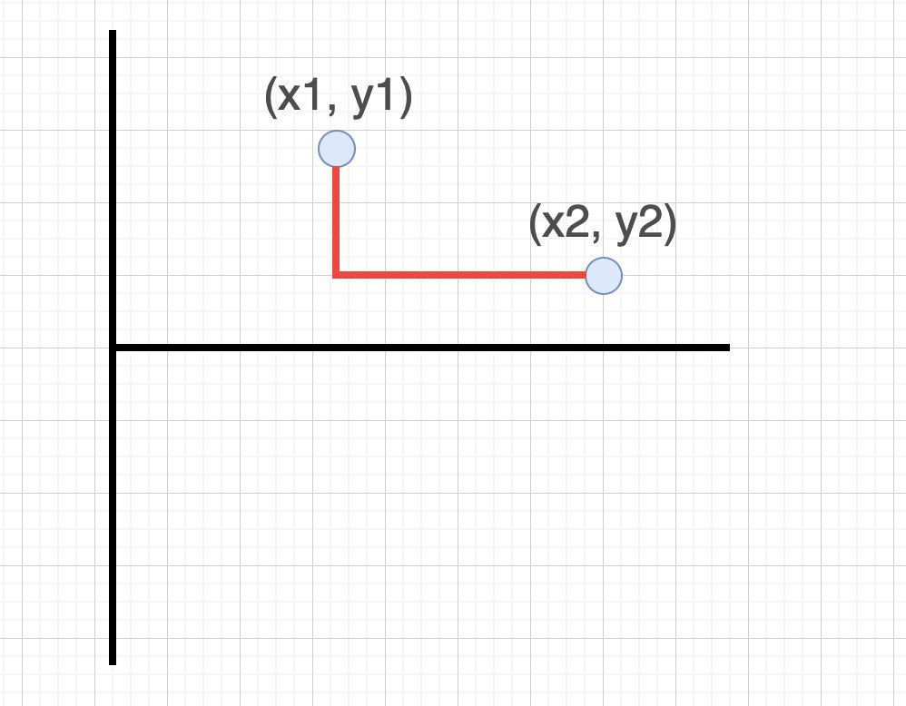
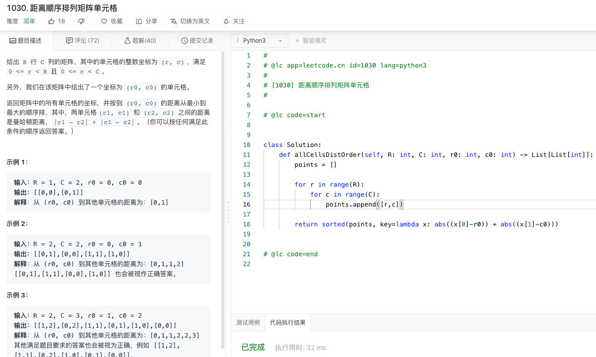

# 1131.绝对值表达式的最大值

## 题目地址（1131. 绝对值表达式的最大值）

<https://leetcode-cn.com/problems/maximum-of-absolute-value-expression/>

## 题目描述

```
<pre class="calibre18">```

给你两个长度相等的整数数组，返回下面表达式的最大值：

|arr1[i] - arr1[j]| + |arr2[i] - arr2[j]| + |i - j|

其中下标 i，j 满足 0 <= i, j < arr1.length。

示例 1：

输入：arr1 = [1,2,3,4], arr2 = [-1,4,5,6]
输出：13
示例 2：

输入：arr1 = [1,-2,-5,0,10], arr2 = [0,-2,-1,-7,-4]
输出：20

提示：

2 <= arr1.length == arr2.length <= 40000
-10^6 <= arr1[i], arr2[i] <= 10^6

```
```

## 前置知识

- 数组

## 解法一（数学分析）

## 公司

- 阿里
- 腾讯
- 字节

### 思路

如图我们要求的是这样一个表达式的最大值。arr1 和 arr2 为两个不同的数组，且二者长度相同。i 和 j 是两个合法的索引。

> 红色竖线表示的是绝对值的符号



我们对其进行分类讨论，有如下八种情况：

> |arr1\[i\] -arr1\[j\]| 两种情况 |arr2\[i\] -arr2\[j\]| 两种情况 |i - j| 两种情况 因此一共是 2 \* 2 \* 2 = 8 种



由于 i 和 j 之前没有大小关系，也就说二者可以相互替代。因此：

- 1 等价于 8
- 2 等价于 7
- 3 等价于 6
- 4 等价于 5

也就是说我们只需要计算 1，2，3，4 的最大值就可以了。（当然你可以选择其他组合，只要完备就行）

为了方便，我们将 i 和 j 都提取到一起：



容易看出等式的最大值就是前面的最大值，和后面最小值的差值。如图：



再仔细观察，会发现前面部分和后面部分是一样的，原因还是上面所说的 i 和 j 可以互换。因此我们要做的就是：

- 遍历一遍数组，然后计算四个表达式， arr1\[i\] + arr2\[i\] + i，arr1\[i\] - arr2\[i\] + i，arr2\[i\] - arr1\[i\] + i 和 -1 \* arr2\[i\] - arr1\[i\] + i 的 最大值和最小值。
- 然后分别取出四个表达式最大值和最小值的差值（就是这个表达式的最大值）
- 四个表达式最大值再取出最大值

### 关键点

- 数学分析

### 代码

```
<pre class="calibre18">```
<span class="hljs-class"><span class="hljs-keyword">class</span> <span class="hljs-title">Solution</span>:</span>
    <span class="hljs-function"><span class="hljs-keyword">def</span> <span class="hljs-title">maxAbsValExpr</span><span class="hljs-params">(self, arr1: List[int], arr2: List[int])</span> -> int:</span>
        A = []
        B = []
        C = []
        D = []
        <span class="hljs-keyword">for</span> i <span class="hljs-keyword">in</span> range(len(arr1)):
            a, b, c, d = arr1[i] + arr2[i] + i, arr1[i] - arr2[i] + \
                i, arr2[i] - arr1[i] + i, <span class="hljs-params">-1</span> * arr2[i] - arr1[i] + i
            A.append(a)
            B.append(b)
            C.append(c)
            D.append(d)
        <span class="hljs-keyword">return</span> max(max(A) - min(A), max(B) - min(B), max(C) - min(C), max(D) - min(D))

```
```

## 解法二（曼哈顿距离）

### 思路



（图来自： [https://zh.wikipedia.org/wiki/%E6%9B%BC%E5%93%88%E9%A0%93%E8%B7%9D%E9%9B%A2）](https://zh.wikipedia.org/wiki/%E6%9B%BC%E5%93%88%E9%A0%93%E8%B7%9D%E9%9B%A2%EF%BC%89)

一维曼哈顿距离可以理解为一条线上两点之间的距离: |x1 - x2|，其值为 max(x1 - x2, x2 - x1)



在平面上，坐标（x1, y1）的点 P1 与坐标（x2, y2）的点 P2 的曼哈顿距离为：|x1-x2| + |y1 - y2|,其值为 max(x1 - x2 + y1 - y2, x2 - x1 + y1 - y2, x1 - x2 + y2 - y1, x2 -x1 + y2 - y1)



然后这道题目是更复杂的三维曼哈顿距离，其中(i, arr\[i\], arr\[j\])可以看作三位空间中的一个点，问题转化为曼哈顿距离最远的两个点的距离。 延续上面的思路，|x1-x2| + |y1 - y2| + |z1 - z2|,其值为 :

max(

x1 - x2 + y1 - y2 + z1 - z2,

x1 - x2 + y1 - y2 + z2 - z1,

x2 - x1 + y1 - y2 + z1 - z2,

x2 - x1 + y1 - y2 + z2 - z1,

x1 - x2 + y2 - y1 + z1 - z2,

x1 - x2 + y2 - y1 + z2- z1,

x2 -x1 + y2 - y1 + z1 - z2，

x2 -x1 + y2 - y1 + z2 - z1

)

我们可以将 1 和 2 放在一起方便计算：

max(

x1 + y1 + z1 - (x2 + y2 + z2)，

x1 + y1 - z1 - (x2 + y2 - z2)

...

)

我们甚至可以扩展到 n 维，具体代码见下方。

### 关键点

- 曼哈顿距离
- 曼哈顿距离代码模板

> 解题模板可以帮助你快速并且更少错误的解题，更多解题模板请期待我的[新书](https://lucifer.ren/blog/2019/12/11/draft/)(未完成)

### 代码

```
<pre class="calibre18">```
<span class="hljs-class"><span class="hljs-keyword">class</span> <span class="hljs-title">Solution</span>:</span>
    <span class="hljs-function"><span class="hljs-keyword">def</span> <span class="hljs-title">maxAbsValExpr</span><span class="hljs-params">(self, arr1: List[int], arr2: List[int])</span> -> int:</span>
        <span class="hljs-title"># 曼哈顿距离模板代码</span>
        sign = [<span class="hljs-params">1</span>, <span class="hljs-params">-1</span>]
        n = len(arr1)
        dists = []
        <span class="hljs-title"># 三维模板</span>
        <span class="hljs-keyword">for</span> a <span class="hljs-keyword">in</span> sign:
            <span class="hljs-keyword">for</span> b <span class="hljs-keyword">in</span> sign:
                <span class="hljs-keyword">for</span> c <span class="hljs-keyword">in</span> sign:
                    maxDist = float(<span class="hljs-string">'-inf'</span>)
                    minDist = float(<span class="hljs-string">'inf'</span>)
                    <span class="hljs-title"># 分别计算所有点的曼哈顿距离</span>
                    <span class="hljs-keyword">for</span> i <span class="hljs-keyword">in</span> range(n):
                        dist = arr1[i] * a + arr2[i] * b + i * c
                        maxDist = max(maxDist, dist)
                        minDist = min(minDist, dist)
                    <span class="hljs-title"># 将所有的点的曼哈顿距离放到dists中</span>
                    dists.append(maxDist - minDist)
        <span class="hljs-keyword">return</span> max(dists)

```
```

**复杂度分析**

- 时间复杂度：O(N3)O(N^3)O(N3)
- 空间复杂度：O(N)O(N)O(N)

## 总结

可以看出其实两种解法都是一样的，只是思考角度不一样。

## 相关题目

- [1030. 距离顺序排列矩阵单元格](https://leetcode-cn.com/problems/matrix-cells-in-distance-order/)



- [1162. 地图分析](https://leetcode-cn.com/problems/as-far-from-land-as-possible/)

大家对此有何看法，欢迎给我留言，我有时间都会一一查看回答。更多算法套路可以访问我的 LeetCode 题解仓库：<https://github.com/azl397985856/leetcode> 。 目前已经 37K star 啦。 大家也可以关注我的公众号《力扣加加》带你啃下算法这块硬骨头。 