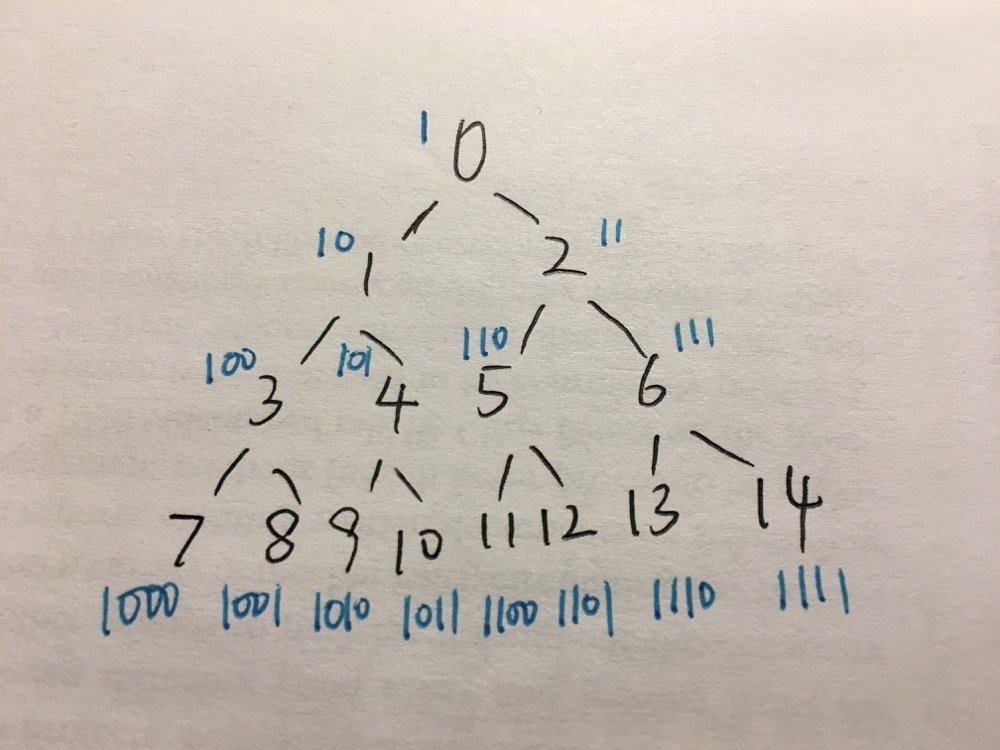
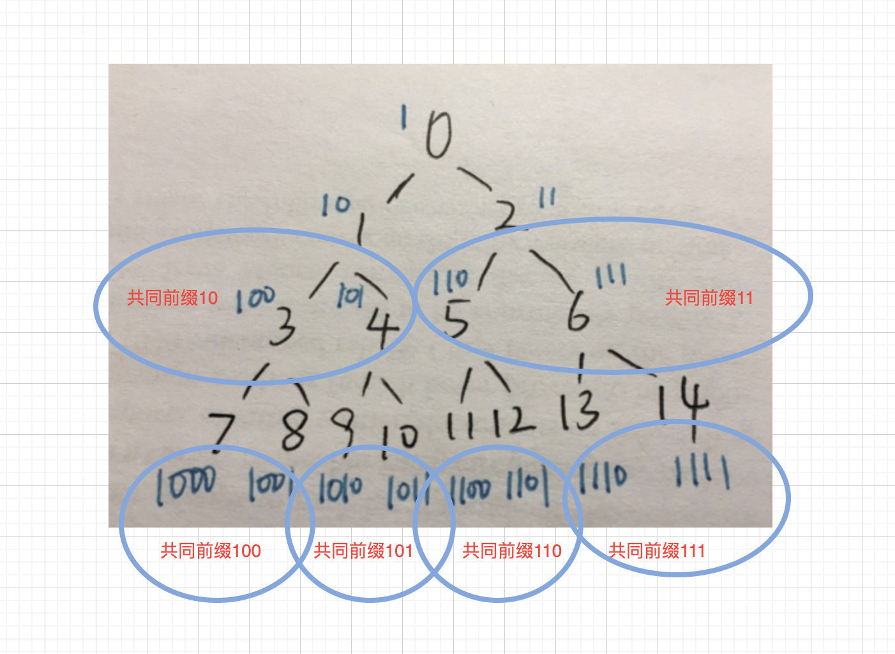

# 1261. 在受污染的二叉树中查找元素

# 题目地址（1261. 在受污染的二叉树中查找元素）

<https://leetcode-cn.com/problems/find-elements-in-a-contaminated-binary-tree/>

## 题目描述

```
<pre class="calibre18">```
给出一个满足下述规则的二叉树：

root.val == 0
如果 treeNode.val == x 且 treeNode.left != null，那么 treeNode.left.val == 2 * x + 1
如果 treeNode.val == x 且 treeNode.right != null，那么 treeNode.right.val == 2 * x + 2
现在这个二叉树受到「污染」，所有的 treeNode.val 都变成了 -1。

请你先还原二叉树，然后实现 FindElements 类：

FindElements(TreeNode* root) 用受污染的二叉树初始化对象，你需要先把它还原。
bool find(int target) 判断目标值 target 是否存在于还原后的二叉树中并返回结果。


示例 1：


输入：
["FindElements","find","find"]
[[[-1,null,-1]],[1],[2]]
输出：
[null,false,true]
解释：
FindElements findElements = new FindElements([-1,null,-1]);
findElements.find(1); // return False
findElements.find(2); // return True
示例 2：


输入：
["FindElements","find","find","find"]
[[[-1,-1,-1,-1,-1]],[1],[3],[5]]
输出：
[null,true,true,false]
解释：
FindElements findElements = new FindElements([-1,-1,-1,-1,-1]);
findElements.find(1); // return True
findElements.find(3); // return True
findElements.find(5); // return False
示例 3：


输入：
["FindElements","find","find","find","find"]
[[[-1,null,-1,-1,null,-1]],[2],[3],[4],[5]]
输出：
[null,true,false,false,true]
解释：
FindElements findElements = new FindElements([-1,null,-1,-1,null,-1]);
findElements.find(2); // return True
findElements.find(3); // return False
findElements.find(4); // return False
findElements.find(5); // return True


提示：

TreeNode.val == -1
二叉树的高度不超过 20
节点的总数在 [1, 10^4] 之间
调用 find() 的总次数在 [1, 10^4] 之间
0 <= target <= 10^6

```
```

## 前置知识

- 二进制

## 暴力法

## 公司

- 暂无

### 思路

最简单想法就是递归建立树，然后 find 的时候递归查找即可，代码也很简单。

### 代码

Pythpn Code:

```
<pre class="calibre18">```
<span class="hljs-title"># Definition for a binary tree node.</span>
<span class="hljs-title"># class TreeNode:</span>
<span class="hljs-title">#     def __init__(self, x):</span>
<span class="hljs-title">#         self.val = x</span>
<span class="hljs-title">#         self.left = None</span>
<span class="hljs-title">#         self.right = None</span>

<span class="hljs-class"><span class="hljs-keyword">class</span> <span class="hljs-title">FindElements</span>:</span>
    node = <span class="hljs-keyword">None</span>
    <span class="hljs-function"><span class="hljs-keyword">def</span> <span class="hljs-title">__init__</span><span class="hljs-params">(self, root: TreeNode)</span>:</span>
        <span class="hljs-function"><span class="hljs-keyword">def</span> <span class="hljs-title">recover</span><span class="hljs-params">(node)</span>:</span>
            <span class="hljs-keyword">if</span> <span class="hljs-keyword">not</span> node:
                <span class="hljs-keyword">return</span> node;
            <span class="hljs-keyword">if</span> node.left:
                node.left.val =  <span class="hljs-params">2</span> * node.val + <span class="hljs-params">1</span>
            <span class="hljs-keyword">if</span> node.right:
                 node.right.val = <span class="hljs-params">2</span> * node.val + <span class="hljs-params">2</span>
            recover(node.left)
            recover(node.right)
            <span class="hljs-keyword">return</span> node
        root.val = <span class="hljs-params">0</span>
        self.node = recover(root)


    <span class="hljs-function"><span class="hljs-keyword">def</span> <span class="hljs-title">find</span><span class="hljs-params">(self, target: int)</span> -> bool:</span>
        <span class="hljs-function"><span class="hljs-keyword">def</span> <span class="hljs-title">findInTree</span><span class="hljs-params">(node, target)</span>:</span>
            <span class="hljs-keyword">if</span> <span class="hljs-keyword">not</span> node:
                <span class="hljs-keyword">return</span> <span class="hljs-keyword">False</span>
            <span class="hljs-keyword">if</span> node.val == target:
                <span class="hljs-keyword">return</span> <span class="hljs-keyword">True</span>
            <span class="hljs-keyword">return</span> findInTree(node.left, target) <span class="hljs-keyword">or</span> findInTree(node.right, target)
        <span class="hljs-keyword">return</span> findInTree(self.node, target)


<span class="hljs-title"># Your FindElements object will be instantiated and called as such:</span>
<span class="hljs-title"># obj = FindElements(root)</span>
<span class="hljs-title"># param_1 = obj.find(target)</span>

```
```

上述代码会超时，我们来考虑优化。

## 空间换时间

### 思路

上述代码会超时，我们考虑使用空间换时间。 建立树的时候，我们将所有值存到一个集合中去。当需要 find 的时候，我们直接查找 set 即可，时间复杂度 O(1)。

### 代码

```
<pre class="calibre18">```
<span class="hljs-title"># Definition for a binary tree node.</span>
<span class="hljs-title"># class TreeNode:</span>
<span class="hljs-title">#     def __init__(self, x):</span>
<span class="hljs-title">#         self.val = x</span>
<span class="hljs-title">#         self.left = None</span>
<span class="hljs-title">#         self.right = None</span>

<span class="hljs-class"><span class="hljs-keyword">class</span> <span class="hljs-title">FindElements</span>:</span>
    <span class="hljs-function"><span class="hljs-keyword">def</span> <span class="hljs-title">__init__</span><span class="hljs-params">(self, root: TreeNode)</span>:</span>
        <span class="hljs-title"># set 不能放在init外侧。 因为测试用例之间不会销毁FindElements的变量</span>
        self.seen = set()
        <span class="hljs-function"><span class="hljs-keyword">def</span> <span class="hljs-title">recover</span><span class="hljs-params">(node)</span>:</span>
            <span class="hljs-keyword">if</span> <span class="hljs-keyword">not</span> node:
                <span class="hljs-keyword">return</span> node;
            <span class="hljs-keyword">if</span> node.left:
                node.left.val =  <span class="hljs-params">2</span> * node.val + <span class="hljs-params">1</span>
                self.seen.add(node.left.val)
            <span class="hljs-keyword">if</span> node.right:
                 node.right.val = <span class="hljs-params">2</span> * node.val + <span class="hljs-params">2</span>
                 self.seen.add(node.right.val)
            recover(node.left)
            recover(node.right)
            <span class="hljs-keyword">return</span> node
        root.val = <span class="hljs-params">0</span>
        self.seen.add(<span class="hljs-params">0</span>)
        self.node = recover(root)


    <span class="hljs-function"><span class="hljs-keyword">def</span> <span class="hljs-title">find</span><span class="hljs-params">(self, target: int)</span> -> bool:</span>
        <span class="hljs-keyword">return</span> target <span class="hljs-keyword">in</span> self.seen


<span class="hljs-title"># Your FindElements object will be instantiated and called as such:</span>
<span class="hljs-title"># obj = FindElements(root)</span>
<span class="hljs-title"># param_1 = obj.find(target)</span>

```
```

这种解法可以 AC，但是在数据量非常大的时候，可能 MLE，我们继续考虑优化。

## 二进制法

### 思路

这是一种非常巧妙的做法。

如果我们把树中的数全部加 1 会怎么样？

（图参考 [https://leetcode.com/problems/find-elements-in-a-contaminated-binary-tree/discuss/431229/Python-Special-Way-for-find()-without-HashSet-O(1)-Space-O(logn)-Time）](https://leetcode.com/problems/find-elements-in-a-contaminated-binary-tree/discuss/431229/Python-Special-Way-for-find()-without-HashSet-O(1)-Space-O(logn)-Time%EF%BC%89)

仔细观察发现，每一行的左右子树分别有不同的前缀：



Ok，那么算法就来了。为了便于理解，我们来举个具体的例子，比如 target 是 9，我们首先将其加 1，二进制表示就是 1010。不考虑第一位，就是 010，我们只要：

- 0 向左 👈
- 1 向右 👉
- - 0 向左 👈

就可以找到 9 了。

> 0 表示向左 ， 1 表示向右

### 代码

```
<pre class="calibre18">```
<span class="hljs-title"># Definition for a binary tree node.</span>
<span class="hljs-title"># class TreeNode:</span>
<span class="hljs-title">#     def __init__(self, x):</span>
<span class="hljs-title">#         self.val = x</span>
<span class="hljs-title">#         self.left = None</span>
<span class="hljs-title">#         self.right = None</span>

<span class="hljs-class"><span class="hljs-keyword">class</span> <span class="hljs-title">FindElements</span>:</span>
    node = <span class="hljs-keyword">None</span>
    <span class="hljs-function"><span class="hljs-keyword">def</span> <span class="hljs-title">__init__</span><span class="hljs-params">(self, root: TreeNode)</span>:</span>
        <span class="hljs-function"><span class="hljs-keyword">def</span> <span class="hljs-title">recover</span><span class="hljs-params">(node)</span>:</span>
            <span class="hljs-keyword">if</span> <span class="hljs-keyword">not</span> node:
                <span class="hljs-keyword">return</span> node;
            <span class="hljs-keyword">if</span> node.left:
                node.left.val =  <span class="hljs-params">2</span> * node.val + <span class="hljs-params">1</span>
            <span class="hljs-keyword">if</span> node.right:
                 node.right.val = <span class="hljs-params">2</span> * node.val + <span class="hljs-params">2</span>
            recover(node.left)
            recover(node.right)
            <span class="hljs-keyword">return</span> node
        root.val = <span class="hljs-params">0</span>
        self.node = recover(root)


    <span class="hljs-function"><span class="hljs-keyword">def</span> <span class="hljs-title">find</span><span class="hljs-params">(self, target: int)</span> -> bool:</span>
        node = self.node
        <span class="hljs-keyword">for</span> bit <span class="hljs-keyword">in</span> bin(target+<span class="hljs-params">1</span>)[<span class="hljs-params">3</span>:]:
            node = node <span class="hljs-keyword">and</span> (node.left, node.right)[int(bit)]
        <span class="hljs-keyword">return</span> bool(node)


<span class="hljs-title"># Your FindElements object will be instantiated and called as such:</span>
<span class="hljs-title"># obj = FindElements(root)</span>
<span class="hljs-title"># param_1 = obj.find(target)</span>

```
```

## 关键点解析

- 空间换时间
- 二进制思维
- 将 target + 1