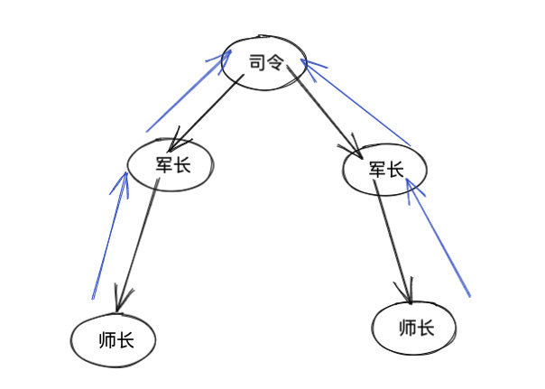

# 并查集

# 并查集

关于并查集的题目不少，官方给的数据是 30 道（截止 2020-02-20），但是有一些题目虽然官方没有贴`并查集`标签，但是使用并查集来说确非常简单。这类题目如果掌握模板，那么刷这种题会非常快，并且犯错的概率会大大降低，这就是模板的好处。

我这里总结了几道并查集的题目：

- [547. 朋友圈](547.friend-circles.html)
- [721. 账户合并](https://leetcode-cn.com/problems/accounts-merge/solution/mo-ban-ti-bing-cha-ji-python3-by-fe-lucifer-3/)
- [990. 等式方程的可满足性](https://github.com/azl397985856/leetcode/issues/304)
- [1202. 交换字符串中的元素](https://leetcode-cn.com/problems/smallest-string-with-swaps/)

看完这里的内容，建议拿上面的题目练下手，检测一下学习成果。

## 概述

并查集是一种树型的数据结构，用于处理一些不交集（Disjoint Sets）的合并及查询问题。有一个联合-查找算法（Union-find Algorithm）定义了两个用于此数据结构的操作：

- Find：确定元素属于哪一个子集。它可以被用来确定两个元素是否属于同一子集。
- Union：将两个子集合并成同一个集合。

由于支持这两种操作，一个不相交集也常被称为联合-查找数据结构（Union-find Data Structure）或合并-查找集合（Merge-find Set）。为了更加精确的定义这些方法，需要定义如何表示集合。一种常用的策略是为每个集合选定一个固定的元素，称为代表，以表示整个集合。接着，Find(x) 返回 x 所属集合的代表，而 Union 使用两个集合的代表作为参数。

## 形象解释

比如有两个司令。 司令下有若干军长，军长下有若干师长。。。

我们如何判断某两个师长是否属于同一个司令呢（连通性）？



很简单，我们顺着师长，往上找，找到司令。 如果两个师长找到的是同一个司令，那么就属于同一个司令。我们用 parent\[x\] = y 表示 x 的 parent 是 y，通过不断沿着搜索 parent 搜索找到 root，然后比较 root 是否相同即可得出结论。

以上过程涉及了两个基本操作`find`和`connnected`。 并查集除了这两个基本操作，还有一个是`union`。即将两个集合合并为同一个。

如图有两个司令：


我们将其合并为一个联通域，最简单的方式就是直接将其中一个司令指向另外一个即可：


以上就是三个核心 API `find`，`connnected` 和 `union`， 的形象化解释，下面我们来看下代码实现。

## 核心 API

### find

```
<pre class="calibre18">```
<span class="hljs-function"><span class="hljs-keyword">def</span> <span class="hljs-title">find</span><span class="hljs-params">(self, x)</span>:</span>
    <span class="hljs-keyword">while</span> x != self.parent[x]:
        x = self.parent[x]
    <span class="hljs-keyword">return</span> x

```
```

### connected

```
<pre class="calibre18">```
<span class="hljs-function"><span class="hljs-keyword">def</span> <span class="hljs-title">connected</span><span class="hljs-params">(self, p, q)</span>:</span>
    <span class="hljs-keyword">return</span> self.find(p) == self.find(q)

```
```

### union

```
<pre class="calibre18">```
<span class="hljs-function"><span class="hljs-keyword">def</span> <span class="hljs-title">union</span><span class="hljs-params">(self, p, q)</span>:</span>
    <span class="hljs-keyword">if</span> self.connected(p, q): <span class="hljs-keyword">return</span>
    self.parent[self.find(p)] = self.find(q)

```
```

## 完整代码模板

```
<pre class="calibre18">```
<span class="hljs-class"><span class="hljs-keyword">class</span> <span class="hljs-title">UF</span>:</span>
    parent = {}
    cnt = <span class="hljs-params">0</span>
    <span class="hljs-function"><span class="hljs-keyword">def</span> <span class="hljs-title">__init__</span><span class="hljs-params">(self, M)</span>:</span>
        <span class="hljs-title"># 初始化 parent 和 cnt</span>

    <span class="hljs-function"><span class="hljs-keyword">def</span> <span class="hljs-title">find</span><span class="hljs-params">(self, x)</span>:</span>
        <span class="hljs-keyword">while</span> x != self.parent[x]:
            x = self.parent[x]
        <span class="hljs-keyword">return</span> x
    <span class="hljs-function"><span class="hljs-keyword">def</span> <span class="hljs-title">union</span><span class="hljs-params">(self, p, q)</span>:</span>
        <span class="hljs-keyword">if</span> self.connected(p, q): <span class="hljs-keyword">return</span>
        self.parent[self.find(p)] = self.find(q)
        self.cnt -= <span class="hljs-params">1</span>
    <span class="hljs-function"><span class="hljs-keyword">def</span> <span class="hljs-title">connected</span><span class="hljs-params">(self, p, q)</span>:</span>
        <span class="hljs-keyword">return</span> self.find(p) == self.find(q)

```
```

## 带路径压缩的代码模板

```
<pre class="calibre18">```
<span class="hljs-class"><span class="hljs-keyword">class</span> <span class="hljs-title">UF</span>:</span>
    parent = {}
    size = {}
    cnt = <span class="hljs-params">0</span>
    <span class="hljs-function"><span class="hljs-keyword">def</span> <span class="hljs-title">__init__</span><span class="hljs-params">(self, M)</span>:</span>
        <span class="hljs-title"># 初始化 parent，size 和 cnt</span>

    <span class="hljs-function"><span class="hljs-keyword">def</span> <span class="hljs-title">find</span><span class="hljs-params">(self, x)</span>:</span>
        <span class="hljs-keyword">while</span> x != self.parent[x]:
            x = self.parent[x]
            <span class="hljs-title"># 路径压缩</span>
            self.parent[x] = self.parent[self.parent[x]];
        <span class="hljs-keyword">return</span> x
    <span class="hljs-function"><span class="hljs-keyword">def</span> <span class="hljs-title">union</span><span class="hljs-params">(self, p, q)</span>:</span>
        <span class="hljs-keyword">if</span> self.connected(p, q): <span class="hljs-keyword">return</span>
        <span class="hljs-title"># 小的树挂到大的树上， 使树尽量平衡</span>
        leader_p = self.find(p)
        leader_q = self.find(q)
        <span class="hljs-keyword">if</span> self.size[leader_p] < self.size[leader_q]:
            self.parent[leader_p] = leader_q
            self.size[leader_p] += self.size[leader_q]
        <span class="hljs-keyword">else</span>:
            self.parent[leader_q] = leader_p
            self.size[leader_q] += self.size[leader_p]
        self.cnt -= <span class="hljs-params">1</span>
    <span class="hljs-function"><span class="hljs-keyword">def</span> <span class="hljs-title">connected</span><span class="hljs-params">(self, p, q)</span>:</span>
        <span class="hljs-keyword">return</span> self.find(p) == self.find(q)

```
```

上面是递归的方式进行路径压缩，写起来比较简单。但是有栈溢出的风险。 接下来我们看下迭代的写法：

```
<pre class="calibre18">```
<span class="hljs-class"><span class="hljs-keyword">class</span> <span class="hljs-title">UF</span>:</span>
    parent = {}
    <span class="hljs-function"><span class="hljs-keyword">def</span> <span class="hljs-title">__init__</span><span class="hljs-params">(self, equations)</span>:</span>
        <span class="hljs-title"># 做一些初始化操作</span>

    <span class="hljs-function"><span class="hljs-keyword">def</span> <span class="hljs-title">find</span><span class="hljs-params">(self, x)</span>:</span>
        <span class="hljs-title"># 根节点</span>
        r = x
        <span class="hljs-keyword">while</span> r != parent[r]:
            r = parent[r]
        k = x
        <span class="hljs-keyword">while</span> k != r:
            <span class="hljs-title"># 暂存parent[k]的父节点</span>
            j = parent[k]
            parent[k] = r
            k = j
        <span class="hljs-keyword">return</span> r
    <span class="hljs-function"><span class="hljs-keyword">def</span> <span class="hljs-title">union</span><span class="hljs-params">(self, p, q)</span>:</span>
        <span class="hljs-keyword">if</span> self.connected(p, q): <span class="hljs-keyword">return</span>
        self.parent[self.find(p)] = self.find(q)
    <span class="hljs-function"><span class="hljs-keyword">def</span> <span class="hljs-title">connected</span><span class="hljs-params">(self, p, q)</span>:</span>
        <span class="hljs-keyword">return</span> self.find(p) == self.find(q)

```
```