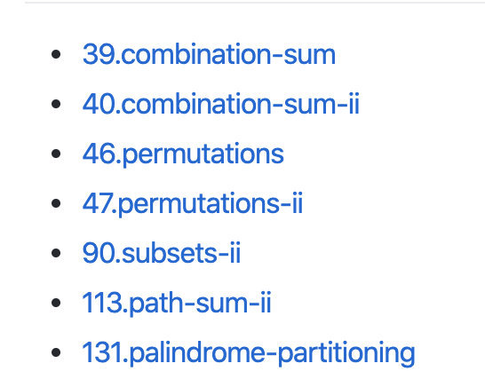
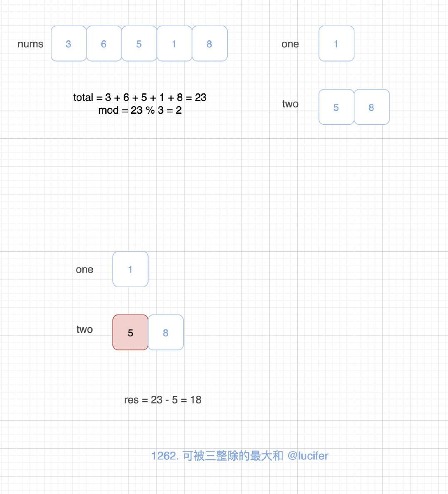
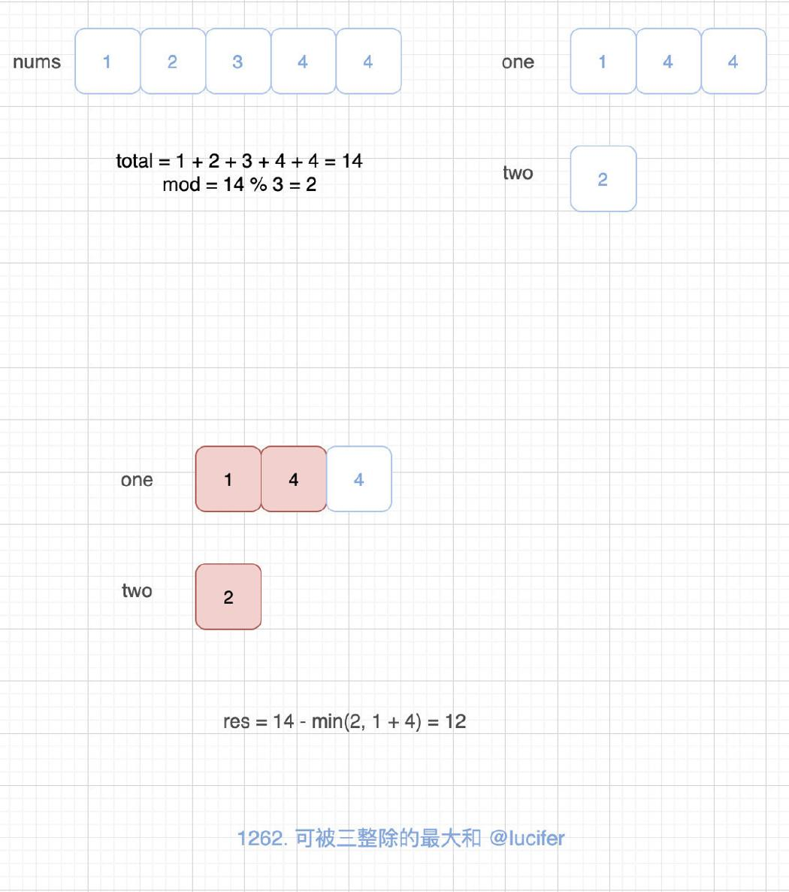
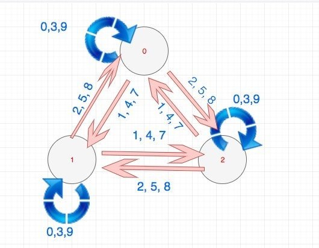

# 1262. 可被三整除的最大和

# 题目地址（1262. 可被三整除的最大和）

<https://leetcode-cn.com/problems/greatest-sum-divisible-by-three/>

## 题目描述

```
<pre class="calibre18">```
给你一个整数数组 nums，请你找出并返回能被三整除的元素最大和。


示例 1：

输入：nums = [3,6,5,1,8]
输出：18
解释：选出数字 3, 6, 1 和 8，它们的和是 18（可被 3 整除的最大和）。
示例 2：

输入：nums = [4]
输出：0
解释：4 不能被 3 整除，所以无法选出数字，返回 0。
示例 3：

输入：nums = [1,2,3,4,4]
输出：12
解释：选出数字 1, 3, 4 以及 4，它们的和是 12（可被 3 整除的最大和）。


提示：

1 <= nums.length <= 4 * 10^4
1 <= nums[i] <= 10^4

```
```

## 前置知识

- 数组
- 回溯法
- 排序

## 暴力法

## 公司

- 字节
- 网易有道

### 思路

一种方式是找出所有的能够被 3 整除的子集，然后挑选出和最大的。由于我们选出了所有的子集，那么时间复杂度就是 O(2N)O(2^N)O(2N) ， 毫无疑问会超时。这里我们使用回溯法找子集，如果不清楚回溯法，可以参考我之前的题解，很多题目都用到了，比如[78.subsets](https://github.com/azl397985856/leetcode/blob/master/problems/78.subsets.md)。

更多回溯题目，可以访问上方链接查看（可以使用一套模板搞定）：



### 代码

```
<pre class="calibre18">```
<span class="hljs-class"><span class="hljs-keyword">class</span> <span class="hljs-title">Solution</span>:</span>
    <span class="hljs-function"><span class="hljs-keyword">def</span> <span class="hljs-title">maxSumDivThree</span><span class="hljs-params">(self, nums: List[int])</span> -> int:</span>
        self.res = <span class="hljs-params">0</span>
        <span class="hljs-function"><span class="hljs-keyword">def</span> <span class="hljs-title">backtrack</span><span class="hljs-params">(temp, start)</span>:</span>
            total = sum(temp)
            <span class="hljs-keyword">if</span> total % <span class="hljs-params">3</span> == <span class="hljs-params">0</span>:
                self.res = max(self.res, total)
            <span class="hljs-keyword">for</span> i <span class="hljs-keyword">in</span> range(start, len(nums)):
                temp.append(nums[i])
                backtrack(temp, i + <span class="hljs-params">1</span>)
                temp.pop(<span class="hljs-params">-1</span>)


        backtrack([], <span class="hljs-params">0</span>)

        <span class="hljs-keyword">return</span> self.res

```
```

## 减法 + 排序

减法的核心思想是，我们求出总和。如果总和不满足题意，我们尝试减去最小的数，使之满足题意。

### 思路

这种算法的思想，具体来说就是：

- 我们将所有的数字加起来，我们不妨设为 total
- total 除以 3，得到一个余数 mod， mod 可能值有 0，1，2.
- 同时我们建立两个数组，一个是余数为 1 的数组 one，一个是余数为 2 的数组 two
- 如果 mod 为 0，我们直接返回即可。
- 如果 mod 为 1，我们可以减去 one 数组中最小的一个（如果有的话），或者减去两个 two 数组中最小的（如果有的话），究竟减去谁取决谁更小。
- 如果 mod 为 2，我们可以减去 two 数组中最小的一个（如果有的话），或者减去两个 one 数组中最小的（如果有的话），究竟减去谁取决谁更小。

由于我们需要取 one 和 two 中最小的一个或者两个，因此对数组 one 和 two 进行排序是可行的，如果基于排序的话，时间复杂度大致为 O(NlogN)O(NlogN)O(NlogN)，这种算法可以通过。

以题目中的例 1 为例：



以题目中的例 2 为例：



### 代码

```
<pre class="calibre18">```
<span class="hljs-class"><span class="hljs-keyword">class</span> <span class="hljs-title">Solution</span>:</span>
    <span class="hljs-function"><span class="hljs-keyword">def</span> <span class="hljs-title">maxSumDivThree</span><span class="hljs-params">(self, nums: List[int])</span> -> int:</span>
        one = []
        two = []
        total = <span class="hljs-params">0</span>

        <span class="hljs-keyword">for</span> num <span class="hljs-keyword">in</span> nums:
            total += num
            <span class="hljs-keyword">if</span> num % <span class="hljs-params">3</span> == <span class="hljs-params">1</span>:
                one.append(num)
            <span class="hljs-keyword">if</span> num % <span class="hljs-params">3</span> == <span class="hljs-params">2</span>:
                two.append(num)
        one.sort()
        two.sort()
        <span class="hljs-keyword">if</span> total % <span class="hljs-params">3</span> == <span class="hljs-params">0</span>:
            <span class="hljs-keyword">return</span> total
        <span class="hljs-keyword">elif</span> total % <span class="hljs-params">3</span> == <span class="hljs-params">1</span> <span class="hljs-keyword">and</span> one:
            <span class="hljs-keyword">if</span> len(two) >= <span class="hljs-params">2</span> <span class="hljs-keyword">and</span> one[<span class="hljs-params">0</span>] > two[<span class="hljs-params">0</span>] + two[<span class="hljs-params">1</span>]:
                <span class="hljs-keyword">return</span> total - two[<span class="hljs-params">0</span>] - two[<span class="hljs-params">1</span>]
            <span class="hljs-keyword">return</span> total - one[<span class="hljs-params">0</span>]
        <span class="hljs-keyword">elif</span> total % <span class="hljs-params">3</span> == <span class="hljs-params">2</span> <span class="hljs-keyword">and</span> two:
            <span class="hljs-keyword">if</span> len(one) >= <span class="hljs-params">2</span> <span class="hljs-keyword">and</span> two[<span class="hljs-params">0</span>] > one[<span class="hljs-params">0</span>] + one[<span class="hljs-params">1</span>]:
                <span class="hljs-keyword">return</span> total - one[<span class="hljs-params">0</span>] - one[<span class="hljs-params">1</span>]
            <span class="hljs-keyword">return</span> total - two[<span class="hljs-params">0</span>]
        <span class="hljs-keyword">return</span> <span class="hljs-params">0</span>

```
```

## 减法 + 非排序

### 思路

上面的解法使用到了排序。 我们其实观察发现，我们只是用到了 one 和 two 的最小的两个数。因此我们完全可以在线形的时间和常数的空间完成这个算法。我们只需要分别记录 one 和 two 的最小值和次小值即可，在这里，我使用了两个长度为 2 的数组来表示，第一项是最小值，第二项是次小值。

### 代码

```
<pre class="calibre18">```
<span class="hljs-class"><span class="hljs-keyword">class</span> <span class="hljs-title">Solution</span>:</span>
    <span class="hljs-function"><span class="hljs-keyword">def</span> <span class="hljs-title">maxSumDivThree</span><span class="hljs-params">(self, nums: List[int])</span> -> int:</span>
        one = [float(<span class="hljs-string">'inf'</span>)] * <span class="hljs-params">2</span>
        two = [float(<span class="hljs-string">'inf'</span>)] * <span class="hljs-params">2</span>
        total = <span class="hljs-params">0</span>

        <span class="hljs-keyword">for</span> num <span class="hljs-keyword">in</span> nums:
            total += num
            <span class="hljs-keyword">if</span> num % <span class="hljs-params">3</span> == <span class="hljs-params">1</span>:
                <span class="hljs-keyword">if</span> num < one[<span class="hljs-params">0</span>]:
                    t = one[<span class="hljs-params">0</span>]
                    one[<span class="hljs-params">0</span>] = num
                    one[<span class="hljs-params">1</span>] = t
                <span class="hljs-keyword">elif</span> num < one[<span class="hljs-params">1</span>]:
                    one[<span class="hljs-params">1</span>] = num
            <span class="hljs-keyword">if</span> num % <span class="hljs-params">3</span> == <span class="hljs-params">2</span>:
                <span class="hljs-keyword">if</span> num < two[<span class="hljs-params">0</span>]:
                    t = two[<span class="hljs-params">0</span>]
                    two[<span class="hljs-params">0</span>] = num
                    two[<span class="hljs-params">1</span>] = t
                <span class="hljs-keyword">elif</span> num < two[<span class="hljs-params">1</span>]:
                    two[<span class="hljs-params">1</span>] = num
        <span class="hljs-keyword">if</span> total % <span class="hljs-params">3</span> == <span class="hljs-params">0</span>:
            <span class="hljs-keyword">return</span> total
        <span class="hljs-keyword">elif</span> total % <span class="hljs-params">3</span> == <span class="hljs-params">1</span> <span class="hljs-keyword">and</span> one:
            <span class="hljs-keyword">if</span> len(two) >= <span class="hljs-params">2</span> <span class="hljs-keyword">and</span> one[<span class="hljs-params">0</span>] > two[<span class="hljs-params">0</span>] + two[<span class="hljs-params">1</span>]:
                <span class="hljs-keyword">return</span> total - two[<span class="hljs-params">0</span>] - two[<span class="hljs-params">1</span>]
            <span class="hljs-keyword">return</span> total - one[<span class="hljs-params">0</span>]
        <span class="hljs-keyword">elif</span> total % <span class="hljs-params">3</span> == <span class="hljs-params">2</span> <span class="hljs-keyword">and</span> two:
            <span class="hljs-keyword">if</span> len(one) >= <span class="hljs-params">2</span> <span class="hljs-keyword">and</span> two[<span class="hljs-params">0</span>] > one[<span class="hljs-params">0</span>] + one[<span class="hljs-params">1</span>]:
                <span class="hljs-keyword">return</span> total - one[<span class="hljs-params">0</span>] - one[<span class="hljs-params">1</span>]
            <span class="hljs-keyword">return</span> total - two[<span class="hljs-params">0</span>]
        <span class="hljs-keyword">return</span> <span class="hljs-params">0</span>

```
```

## 有限状态机

### 思路

我在[数据结构与算法在前端领域的应用 - 第二篇](https://lucifer.ren/blog/2019/09/19/algorthimn-fe-2/) 中讲到了有限状态机。



状态机表示若干个状态以及在这些状态之间的转移和动作等行为的数学模型。通俗的描述状态机就是定义了一套状态変更的流程：状态机包含一个状态集合，定义当状态机处于某一个状态的时候它所能接收的事件以及可执行的行为，执行完成后，状态机所处的状态。

状态机使用非常广泛，比如正则表达式的引擎，编译器的词法和语法分析，网络协议，企业应用等很多领域都会用到。

拿本题中来说，我们从左到右扫描数组的过程，将会不断改变状态机的状态。

我们使用 state 数组来表示本题的状态：

- state\[0\] 表示 mod 为 0 的 最大和
- state\[1\] 表示 mod 为 1 的 最大和
- state\[2\] 表示 mod 为 1 的 最大和

我们的状态转移方程就会很容易。说到状态转移方程，你可能会想到动态规划。没错！这种思路可以直接翻译成动态规划，算法完全一样。如果你看过我上面提到的文章，那么状态转移方程对你来说就会很容易。如果你不清楚，那么请往下看：

- 我们从左往右不断读取数字，我们不妨设这个数字为 num。
- 如果 num % 3 为 0。 那么我们的 state\[0\], state\[1\], state\[2\] 可以直接加上 num（题目限定了 num 为非负）， 因为任何数字加上 3 的倍数之后，mod 3 的值是不变的。
- 如果 num % 3 为 1。 我们知道 state\[2\] + num 会变成一个能被三整除的数，但是这个数字不一定比当前的 state\[0\]大。 代码表示就是`max(state[2] + num, state[0])`。同理 state\[1\] 和 state\[2\] 的转移逻辑类似。
- 同理 num % 3 为 2 也是类似的逻辑。
- 最后我们返回 state\[0\]即可。

### 代码

```
<pre class="calibre18">```
<span class="hljs-class"><span class="hljs-keyword">class</span> <span class="hljs-title">Solution</span>:</span>
    <span class="hljs-function"><span class="hljs-keyword">def</span> <span class="hljs-title">maxSumDivThree</span><span class="hljs-params">(self, nums: List[int])</span> -> int:</span>
        state = [<span class="hljs-params">0</span>, float(<span class="hljs-string">'-inf'</span>), float(<span class="hljs-string">'-inf'</span>)]

        <span class="hljs-keyword">for</span> num <span class="hljs-keyword">in</span> nums:
            <span class="hljs-keyword">if</span> num % <span class="hljs-params">3</span> == <span class="hljs-params">0</span>:
                state = [state[<span class="hljs-params">0</span>] + num, state[<span class="hljs-params">1</span>] + num, state[<span class="hljs-params">2</span>] + num]
            <span class="hljs-keyword">if</span> num % <span class="hljs-params">3</span> == <span class="hljs-params">1</span>:
                a = max(state[<span class="hljs-params">2</span>] + num, state[<span class="hljs-params">0</span>])
                b = max(state[<span class="hljs-params">0</span>] + num, state[<span class="hljs-params">1</span>])
                c = max(state[<span class="hljs-params">1</span>] + num, state[<span class="hljs-params">2</span>])
                state = [a, b, c]
            <span class="hljs-keyword">if</span> num % <span class="hljs-params">3</span> == <span class="hljs-params">2</span>:
                a = max(state[<span class="hljs-params">1</span>] + num, state[<span class="hljs-params">0</span>])
                b = max(state[<span class="hljs-params">2</span>] + num, state[<span class="hljs-params">1</span>])
                c = max(state[<span class="hljs-params">0</span>] + num, state[<span class="hljs-params">2</span>])
                state = [a, b, c]
        <span class="hljs-keyword">return</span> state[<span class="hljs-params">0</span>]

```
```

当然这个代码还可以简化：

```
<pre class="calibre18">```
<span class="hljs-class"><span class="hljs-keyword">class</span> <span class="hljs-title">Solution</span>:</span>
    <span class="hljs-function"><span class="hljs-keyword">def</span> <span class="hljs-title">maxSumDivThree</span><span class="hljs-params">(self, nums: List[int])</span> -> int:</span>
        state = [<span class="hljs-params">0</span>, float(<span class="hljs-string">'-inf'</span>), float(<span class="hljs-string">'-inf'</span>)]

        <span class="hljs-keyword">for</span> num <span class="hljs-keyword">in</span> nums:
            temp = [<span class="hljs-params">0</span>] * <span class="hljs-params">3</span>
            <span class="hljs-keyword">for</span> i <span class="hljs-keyword">in</span> range(<span class="hljs-params">3</span>):
                temp[(i + num) % <span class="hljs-params">3</span>] = max(state[(i + num) % <span class="hljs-params">3</span>], state[i] + num)
            state = temp

        <span class="hljs-keyword">return</span> state[<span class="hljs-params">0</span>]

```
```

**复杂度分析**

- 时间复杂度：O(N)O(N)O(N)
- 空间复杂度：O(1)O(1)O(1)

## 关键点解析

- 贪婪法
- 状态机
- 数学分析

## 扩展

实际上，我们可以采取加法（贪婪策略），感兴趣的可以试一下。

另外如果题目改成了`请你找出并返回能被x整除的元素最大和`，你只需要将我的解法中的 3 改成 x 即可。

大家对此有何看法，欢迎给我留言，我有时间都会一一查看回答。更多算法套路可以访问我的 LeetCode 题解仓库：<https://github.com/azl397985856/leetcode> 。 目前已经 37K star 啦。 大家也可以关注我的公众号《力扣加加》带你啃下算法这块硬骨头。 