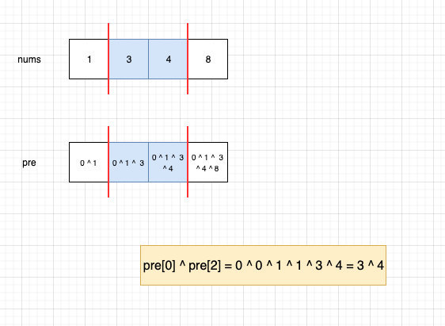
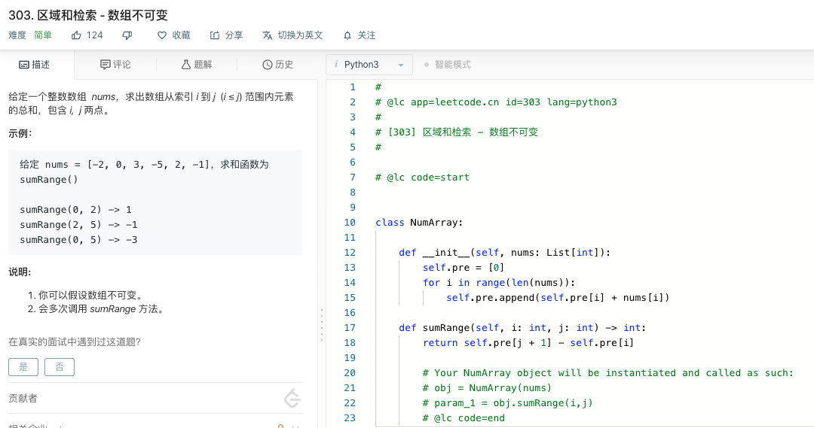

# 1310. 子数组异或查询

# 题目地址（1310. 子数组异或查询）

<https://leetcode-cn.com/problems/xor-queries-of-a-subarray/>

## 题目描述

```
<pre class="calibre18">```
有一个正整数数组 arr，现给你一个对应的查询数组 queries，其中 queries[i] = [Li, Ri]。

对于每个查询 i，请你计算从 Li 到 Ri 的 XOR 值（即 arr[Li] xor arr[Li+1] xor ... xor arr[Ri]）作为本次查询的结果。

并返回一个包含给定查询 queries 所有结果的数组。


示例 1：

输入：arr = [1,3,4,8], queries = [[0,1],[1,2],[0,3],[3,3]]
输出：[2,7,14,8]
解释：
数组中元素的二进制表示形式是：
1 = 0001
3 = 0011
4 = 0100
8 = 1000
查询的 XOR 值为：
[0,1] = 1 xor 3 = 2
[1,2] = 3 xor 4 = 7
[0,3] = 1 xor 3 xor 4 xor 8 = 14
[3,3] = 8
示例 2：

输入：arr = [4,8,2,10], queries = [[2,3],[1,3],[0,0],[0,3]]
输出：[8,0,4,4]


提示：

1 <= arr.length <= 3 * 10^4
1 <= arr[i] <= 10^9
1 <= queries.length <= 3 * 10^4
queries[i].length == 2
0 <= queries[i][0] <= queries[i][1] < arr.length

```
```

## 前置知识

- 前缀和

## 暴力法

### 思路

最直观的思路是双层循环即可，果不其然超时了。

### 代码

```
<pre class="calibre18">```

<span class="hljs-class"><span class="hljs-keyword">class</span> <span class="hljs-title">Solution</span>:</span>
    <span class="hljs-function"><span class="hljs-keyword">def</span> <span class="hljs-title">xorQueries</span><span class="hljs-params">(self, arr: List[int], queries: List[List[int]])</span> -> List[int]:</span>
         res = []
        <span class="hljs-keyword">for</span> (L, R) <span class="hljs-keyword">in</span> queries:
            i = L
            xor = <span class="hljs-params">0</span>
            <span class="hljs-keyword">while</span> i <= R:
                xor ^= arr[i]
                i += <span class="hljs-params">1</span>
            res.append(xor)
        <span class="hljs-keyword">return</span> res

```
```

## 前缀表达式

## 公司

- 暂无

### 思路

比较常见的是前缀和，这个概念其实很容易理解，即一个数组中，第 n 位存储的是数组前 n 个数字的和。

对 \[1,2,3,4,5,6\] 来说，其前缀和可以是 pre=\[1,3,6,10,15,21\]。我们可以使用公式 pre\[𝑖\]=pre\[𝑖−1\]+nums\[𝑖\]得到每一位前缀和的值，从而通过前缀和进行相应的计算和解题。其实前缀和的概念很简单，但困难的是如何在题目中使用前缀和以及如何使用前缀和的关系来进行解题。

这道题是前缀对前缀异或，我们利用了异或的性质 `x ^ y ^ x = y`。



### 代码

代码支持 Python3，Java，C++：

Python Code：

```
<pre class="calibre18">```
<span class="hljs-title">#</span>
<span class="hljs-title"># @lc app=leetcode.cn id=1218 lang=python3</span>
<span class="hljs-title">#</span>
<span class="hljs-title"># [1218] 最长定差子序列</span>
<span class="hljs-title">#</span>

<span class="hljs-title"># @lc code=start</span>


<span class="hljs-class"><span class="hljs-keyword">class</span> <span class="hljs-title">Solution</span>:</span>
    <span class="hljs-function"><span class="hljs-keyword">def</span> <span class="hljs-title">xorQueries</span><span class="hljs-params">(self, arr: List[int], queries: List[List[int]])</span> -> List[int]:</span>
        pre = [<span class="hljs-params">0</span>]
        res = []
        <span class="hljs-keyword">for</span> i <span class="hljs-keyword">in</span> range(len(arr)):
            pre.append(pre[i] ^ arr[i])
        <span class="hljs-keyword">for</span> (L, R) <span class="hljs-keyword">in</span> queries:
            res.append(pre[L] ^ pre[R + <span class="hljs-params">1</span>])
        <span class="hljs-keyword">return</span> res

<span class="hljs-title"># @lc code=end</span>

```
```

Java Code：

```
<pre class="calibre18">```
  <span class="hljs-keyword">public</span> <span class="hljs-keyword">int</span>[] xorQueries(<span class="hljs-keyword">int</span>[] arr, <span class="hljs-keyword">int</span>[][] queries) {

        <span class="hljs-keyword">int</span>[] preXor = <span class="hljs-keyword">new</span> <span class="hljs-keyword">int</span>[arr.length];
        preXor[<span class="hljs-params">0</span>] = <span class="hljs-params">0</span>;

        <span class="hljs-keyword">for</span> (<span class="hljs-keyword">int</span> i = <span class="hljs-params">1</span>; i < arr.length; i++)
            preXor[i] = preXor[i - <span class="hljs-params">1</span>] ^ arr[i - <span class="hljs-params">1</span>];

        <span class="hljs-keyword">int</span>[] res = <span class="hljs-keyword">new</span> <span class="hljs-keyword">int</span>[queries.length];

        <span class="hljs-keyword">for</span> (<span class="hljs-keyword">int</span> i = <span class="hljs-params">0</span>; i < queries.length; i++) {

            <span class="hljs-keyword">int</span> left = queries[i][<span class="hljs-params">0</span>], right = queries[i][<span class="hljs-params">1</span>];
            res[i] = arr[right] ^ preXor[right] ^ preXor[left];
        }

        <span class="hljs-keyword">return</span> res;
    }

```
```

C++ Code:

```
<pre class="calibre18">```
<span class="hljs-keyword">class</span> Solution {
<span class="hljs-keyword">public</span>:
    <span class="hljs-params">vector</span><<span class="hljs-keyword">int</span>> xorQueries(<span class="hljs-params">vector</span><<span class="hljs-keyword">int</span>>& arr, <span class="hljs-params">vector</span><<span class="hljs-params">vector</span><<span class="hljs-keyword">int</span>>>& queries) {
        <span class="hljs-params">vector</span><<span class="hljs-keyword">int</span>>res;
        <span class="hljs-keyword">for</span>(<span class="hljs-keyword">int</span> i=<span class="hljs-params">1</span>; i<arr.size(); ++i){
            arr[i]^=arr[i<span class="hljs-params">-1</span>];
        }
        <span class="hljs-keyword">for</span>(<span class="hljs-params">vector</span><<span class="hljs-keyword">int</span>>temp :queries){
            <span class="hljs-keyword">if</span>(temp[<span class="hljs-params">0</span>]==<span class="hljs-params">0</span>){
                res.push_back(arr[temp[<span class="hljs-params">1</span>]]);
            }
            <span class="hljs-keyword">else</span>{
                res.push_back(arr[temp[<span class="hljs-params">0</span>]<span class="hljs-params">-1</span>]^arr[temp[<span class="hljs-params">1</span>]]);
            }
        }
        <span class="hljs-keyword">return</span> res;
    }
};

```
```

**复杂度分析**

其中 N 为数组 arr 长度， M 为 queries 的长度。

- 时间复杂度：O(N∗M)O(N \* M)O(N∗M)
- 空间复杂度：O(N)O(N)O(N)

## 关键点解析

- 异或的性质 x ^ y ^ x = y
- 前缀表达式

## 相关题目

- [303. 区域和检索 - 数组不可变](https://leetcode-cn.com/problems/range-sum-query-immutable/description/)



- [1186.删除一次得到子数组最大和](https://lucifer.ren/blog/2019/12/11/leetcode-1186/)

大家对此有何看法，欢迎给我留言，我有时间都会一一查看回答。更多算法套路可以访问我的 LeetCode 题解仓库：<https://github.com/azl397985856/leetcode> 。 目前已经 37K star 啦。 大家也可以关注我的公众号《力扣加加》带你啃下算法这块硬骨头。 