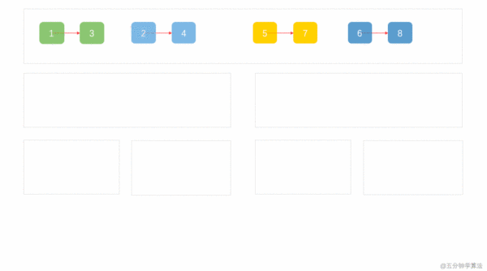

# 0023. 合并K个升序链表

## 题目地址（23. 合并 K 个排序链表）

<https://leetcode-cn.com/problems/merge-k-sorted-lists/>

## 题目描述

```
<pre class="calibre18">```

合并  k  个排序链表，返回合并后的排序链表。请分析和描述算法的复杂度。

示例:

输入:
[
  1->4->5,
  1->3->4,
  2->6
]
输出: 1->1->2->3->4->4->5->6

```
```

## 前置知识

- 链表
- 归并排序

## 公司

- 阿里
- 百度
- 腾讯
- 字节

## 思路

这道题目是合并 k 个已排序的链表，号称 leetcode 目前`最难`的链表题。 和之前我们解决的[88.merge-sorted-array](88.merge-sorted-array.html)很像。 他们有两点区别：

1. 这道题的数据结构是链表，那道是数组。这个其实不复杂，毕竟都是线性的数据结构。
2. 这道题需要合并 k 个元素，那道则只需要合并两个。这个是两题的关键差别，也是这道题难度为`hard`的原因。

因此我们可以看出，这道题目是`88.merge-sorted-array`的进阶版本。其实思路也有点像，我们来具体分析下第二条。 如果你熟悉合并排序的话，你会发现它就是`合并排序的一部分`。

具体我们可以来看一个动画



（动画来自 <https://zhuanlan.zhihu.com/p/61796021> ）

## 关键点解析

- 分治
- 归并排序(merge sort)

## 代码

代码支持 JavaScript， Python3

JavaScript Code：

```
<pre class="calibre18">```
<span class="hljs-title">/*
 * @lc app=leetcode id=23 lang=javascript
 *
 * [23] Merge k Sorted Lists
 *
 * https://leetcode.com/problems/merge-k-sorted-lists/description/
 *
 */</span>
<span class="hljs-function"><span class="hljs-keyword">function</span> <span class="hljs-title">mergeTwoLists</span>(<span class="hljs-params">l1, l2</span>) </span>{
  <span class="hljs-keyword">const</span> dummyHead = {};
  <span class="hljs-keyword">let</span> current = dummyHead;
  <span class="hljs-title">// l1: 1 -> 3 -> 5</span>
  <span class="hljs-title">// l2: 2 -> 4 -> 6</span>
  <span class="hljs-keyword">while</span> (l1 !== <span class="hljs-params">null</span> && l2 !== <span class="hljs-params">null</span>) {
    <span class="hljs-keyword">if</span> (l1.val < l2.val) {
      current.next = l1; <span class="hljs-title">// 把小的添加到结果链表</span>
      current = current.next; <span class="hljs-title">// 移动结果链表的指针</span>
      l1 = l1.next; <span class="hljs-title">// 移动小的那个链表的指针</span>
    } <span class="hljs-keyword">else</span> {
      current.next = l2;
      current = current.next;
      l2 = l2.next;
    }
  }

  <span class="hljs-keyword">if</span> (l1 === <span class="hljs-params">null</span>) {
    current.next = l2;
  } <span class="hljs-keyword">else</span> {
    current.next = l1;
  }
  <span class="hljs-keyword">return</span> dummyHead.next;
}
<span class="hljs-title">/**
 * Definition for singly-linked list.
 * function ListNode(val) {
 *     this.val = val;
 *     this.next = null;
 * }
 */</span>
<span class="hljs-title">/**
 * @param {ListNode[]} lists
 * @return {ListNode}
 */</span>
<span class="hljs-keyword">var</span> mergeKLists = <span class="hljs-function"><span class="hljs-keyword">function</span> (<span class="hljs-params">lists</span>) </span>{
  <span class="hljs-title">// 图参考： https://zhuanlan.zhihu.com/p/61796021</span>
  <span class="hljs-keyword">if</span> (lists.length === <span class="hljs-params">0</span>) <span class="hljs-keyword">return</span> <span class="hljs-params">null</span>;
  <span class="hljs-keyword">if</span> (lists.length === <span class="hljs-params">1</span>) <span class="hljs-keyword">return</span> lists[<span class="hljs-params">0</span>];
  <span class="hljs-keyword">if</span> (lists.length === <span class="hljs-params">2</span>) {
    <span class="hljs-keyword">return</span> mergeTwoLists(lists[<span class="hljs-params">0</span>], lists[<span class="hljs-params">1</span>]);
  }

  <span class="hljs-keyword">const</span> mid = lists.length >> <span class="hljs-params">1</span>;
  <span class="hljs-keyword">const</span> l1 = [];
  <span class="hljs-keyword">for</span> (<span class="hljs-keyword">let</span> i = <span class="hljs-params">0</span>; i < mid; i++) {
    l1[i] = lists[i];
  }

  <span class="hljs-keyword">const</span> l2 = [];
  <span class="hljs-keyword">for</span> (<span class="hljs-keyword">let</span> i = mid, j = <span class="hljs-params">0</span>; i < lists.length; i++, j++) {
    l2[j] = lists[i];
  }

  <span class="hljs-keyword">return</span> mergeTwoLists(mergeKLists(l1), mergeKLists(l2));
};

```
```

Python3 Code：

```
<pre class="calibre18">```
<span class="hljs-title"># Definition for singly-linked list.</span>
<span class="hljs-title"># class ListNode:</span>
<span class="hljs-title">#     def __init__(self, x):</span>
<span class="hljs-title">#         self.val = x</span>
<span class="hljs-title">#         self.next = None</span>

<span class="hljs-class"><span class="hljs-keyword">class</span> <span class="hljs-title">Solution</span>:</span>
    <span class="hljs-function"><span class="hljs-keyword">def</span> <span class="hljs-title">mergeKLists</span><span class="hljs-params">(self, lists: List[ListNode])</span> -> ListNode:</span>
        n = len(lists)

        <span class="hljs-title"># basic cases</span>
        <span class="hljs-keyword">if</span> lenth == <span class="hljs-params">0</span>: <span class="hljs-keyword">return</span> <span class="hljs-keyword">None</span>
        <span class="hljs-keyword">if</span> lenth == <span class="hljs-params">1</span>: <span class="hljs-keyword">return</span> lists[<span class="hljs-params">0</span>]
        <span class="hljs-keyword">if</span> lenth == <span class="hljs-params">2</span>: <span class="hljs-keyword">return</span> self.mergeTwoLists(lists[<span class="hljs-params">0</span>], lists[<span class="hljs-params">1</span>])

        <span class="hljs-title"># divide and conqure if not basic cases</span>
        mid = n // <span class="hljs-params">2</span>
        <span class="hljs-keyword">return</span> self.mergeTwoLists(self.mergeKLists(lists[:mid]), self.mergeKLists(lists[mid:n]))


    <span class="hljs-function"><span class="hljs-keyword">def</span> <span class="hljs-title">mergeTwoLists</span><span class="hljs-params">(self, l1: ListNode, l2: ListNode)</span> -> ListNode:</span>
        res = ListNode(<span class="hljs-params">0</span>)
        c1, c2, c3 = l1, l2, res
        <span class="hljs-keyword">while</span> c1 <span class="hljs-keyword">or</span> c2:
            <span class="hljs-keyword">if</span> c1 <span class="hljs-keyword">and</span> c2:
                <span class="hljs-keyword">if</span> c1.val < c2.val:
                    c3.next = ListNode(c1.val)
                    c1 = c1.next
                <span class="hljs-keyword">else</span>:
                    c3.next = ListNode(c2.val)
                    c2 = c2.next
                c3 = c3.next
            <span class="hljs-keyword">elif</span> c1:
                c3.next = c1
                <span class="hljs-keyword">break</span>
            <span class="hljs-keyword">else</span>:
                c3.next = c2
                <span class="hljs-keyword">break</span>

        <span class="hljs-keyword">return</span> res.next

```
```

**复杂度分析**

- 时间复杂度：O(kn∗logk)O(kn\*logk)O(kn∗logk)
- 空间复杂度：O(logk)O(logk)O(logk)

## 相关题目

- [88.merge-sorted-array](88.merge-sorted-array.html)

大家对此有何看法，欢迎给我留言，我有时间都会一一查看回答。更多算法套路可以访问我的 LeetCode 题解仓库：<https://github.com/azl397985856/leetcode> 。 目前已经 37K star 啦。 大家也可以关注我的公众号《力扣加加》带你啃下算法这块硬骨头。 