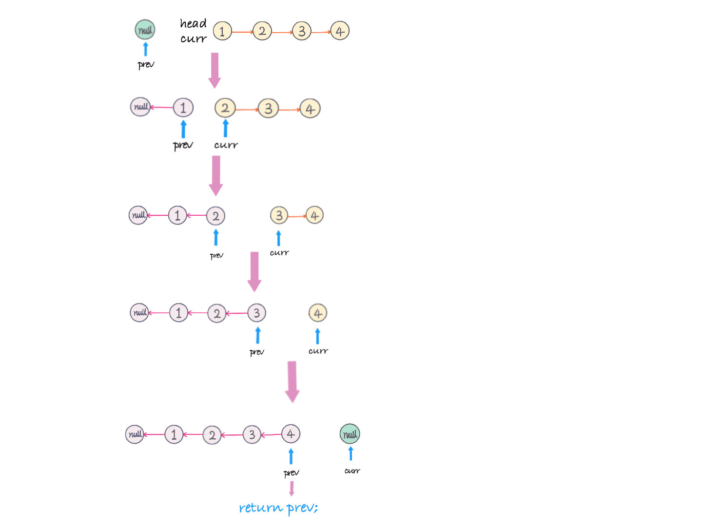
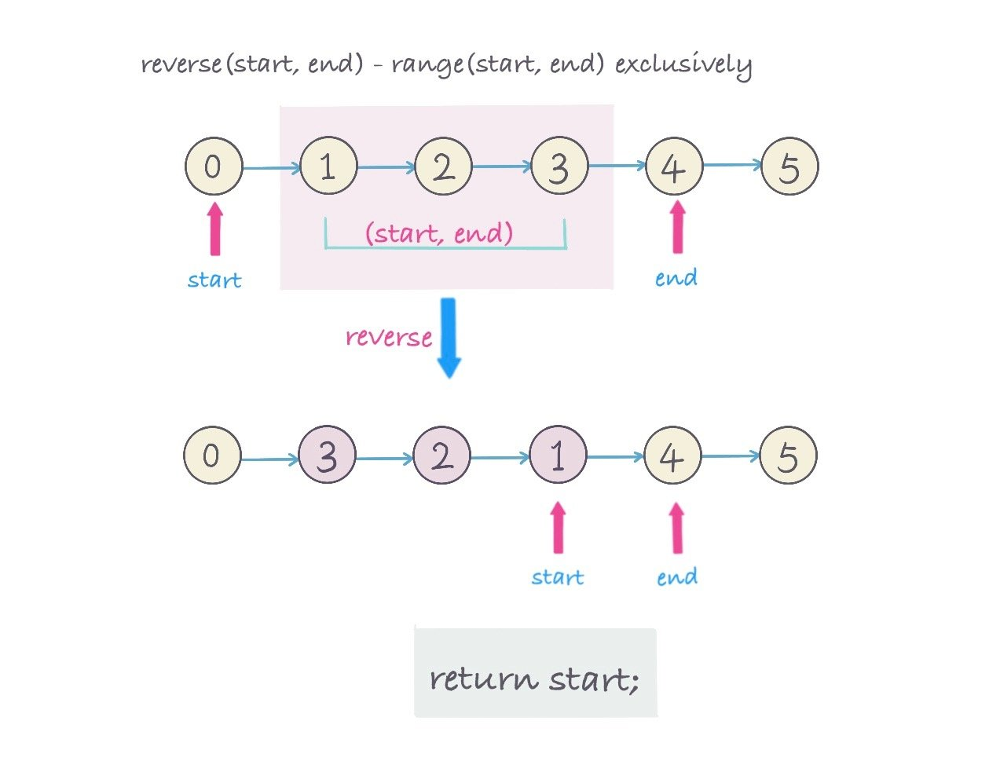
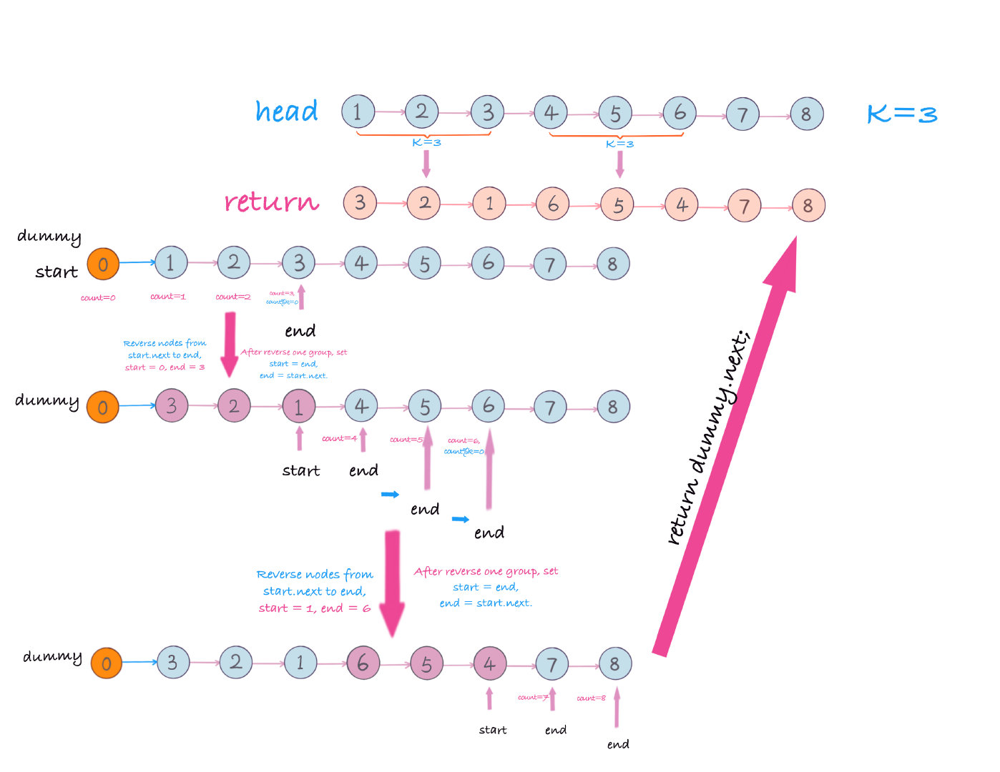

# 0025. K 个一组翻转链表

## 题目地址(25. K 个一组翻转链表)

<https://leetcode-cn.com/problems/reverse-nodes-in-k-group/>

## 题目描述

```
<pre class="calibre18">```
给你一个链表，每 k 个节点一组进行翻转，请你返回翻转后的链表。

k 是一个正整数，它的值小于或等于链表的长度。

如果节点总数不是 k 的整数倍，那么请将最后剩余的节点保持原有顺序。


示例：

给你这个链表：1->2->3->4->5

当 k = 2 时，应当返回: 2->1->4->3->5

当 k = 3 时，应当返回: 3->2->1->4->5


说明：

你的算法只能使用常数的额外空间。
你不能只是单纯的改变节点内部的值，而是需要实际进行节点交换。

```
```

## 前置知识

- 链表

## 公司

- 阿里
- 腾讯
- 百度
- 字节

## 思路

题意是以 `k` 个 nodes 为一组进行翻转，返回翻转后的`linked list`.

从左往右扫描一遍`linked list`，扫描过程中，以 k 为单位把数组分成若干段，对每一段进行翻转。给定首尾 nodes，如何对链表进行翻转。

链表的翻转过程，初始化一个为`null`的 `previous node（prev）`，然后遍历链表的同时，当前`node （curr）`的下一个（next）指向前一个`node（prev）`， 在改变当前 node 的指向之前，用一个临时变量记录当前 node 的下一个`node（curr.next)`. 即

```
<pre class="calibre18">```
ListNode temp = curr.next;
curr.next = prev;
prev = curr;
curr = temp;

```
```

举例如图：翻转整个链表 `1->2->3->4->null` -> `4->3->2->1->null`



这里是对每一组（`k个nodes`）进行翻转，

1. 先分组，用一个`count`变量记录当前节点的个数
2. 用一个`start` 变量记录当前分组的起始节点位置的前一个节点
3. 用一个`end`变量记录要翻转的最后一个节点位置
4. 翻转一组（`k个nodes`）即`(start, end) - start and end exclusively`。
5. 翻转后，`start`指向翻转后链表, 区间`（start，end）`中的最后一个节点, 返回`start` 节点。
6. 如果不需要翻转，`end` 就往后移动一个（`end=end.next`)，每一次移动，都要`count+1`.

如图所示 步骤 4 和 5： 翻转区间链表区间`（start， end）`



举例如图，`head=[1,2,3,4,5,6,7,8], k = 3`



> **NOTE**: 一般情况下对链表的操作，都有可能会引入一个新的`dummy node`，因为`head`有可能会改变。这里`head 从1->3`, `dummy (List(0))`保持不变。

#### 复杂度分析

- *时间复杂度:*`O(n) - n is number of Linked List`
- *空间复杂度:*`O(1)`

## 关键点分析

1. 创建一个 dummy node
2. 对链表以 k 为单位进行分组，记录每一组的起始和最后节点位置
3. 对每一组进行翻转，更换起始和最后的位置
4. 返回`dummy.next`.

## 代码 (`Java/Python3/javascript`)

*Java Code*

```
<pre class="calibre18">```
<span class="hljs-class"><span class="hljs-keyword">class</span> <span class="hljs-title">ReverseKGroupsLinkedList</span> </span>{
  <span class="hljs-function"><span class="hljs-keyword">public</span> ListNode <span class="hljs-title">reverseKGroup</span><span class="hljs-params">(ListNode head, <span class="hljs-keyword">int</span> k)</span> </span>{
      <span class="hljs-keyword">if</span> (head == <span class="hljs-keyword">null</span> || k == <span class="hljs-params">1</span>) {
        <span class="hljs-keyword">return</span> head;
      }
      ListNode dummy = <span class="hljs-keyword">new</span> ListNode(<span class="hljs-params">0</span>);
      dummy.next = head;

      ListNode start = dummy;
      ListNode end = head;
      <span class="hljs-keyword">int</span> count = <span class="hljs-params">0</span>;
      <span class="hljs-keyword">while</span> (end != <span class="hljs-keyword">null</span>) {
        count++;
        <span class="hljs-title">// group</span>
        <span class="hljs-keyword">if</span> (count % k == <span class="hljs-params">0</span>) {
          <span class="hljs-title">// reverse linked list (start, end]</span>
          start = reverse(start, end.next);
          end = start.next;
        } <span class="hljs-keyword">else</span> {
          end = end.next;
        }
      }
      <span class="hljs-keyword">return</span> dummy.next;
    }

    <span class="hljs-title">/**
     * reverse linked list from range (start, end), return last node.
     * for example:
     * 0->1->2->3->4->5->6->7->8
     * |           |
     * start       end
     *
     * After call start = reverse(start, end)
     *
     * 0->3->2->1->4->5->6->7->8
     *          |  |
     *       start end
     *       first
     *
     */</span>
    <span class="hljs-function"><span class="hljs-keyword">private</span> ListNode <span class="hljs-title">reverse</span><span class="hljs-params">(ListNode start, ListNode end)</span> </span>{
      ListNode curr = start.next;
      ListNode prev = start;
      ListNode first = curr;
      <span class="hljs-keyword">while</span> (curr != end){
        ListNode temp = curr.next;
        curr.next = prev;
        prev = curr;
        curr = temp;
      }
      start.next = prev;
      first.next = curr;
      <span class="hljs-keyword">return</span> first;
    }
}

```
```

*Python3 Cose*

```
<pre class="calibre18">```
<span class="hljs-class"><span class="hljs-keyword">class</span> <span class="hljs-title">Solution</span>:</span>
    <span class="hljs-function"><span class="hljs-keyword">def</span> <span class="hljs-title">reverseKGroup</span><span class="hljs-params">(self, head: ListNode, k: int)</span> -> ListNode:</span>
        <span class="hljs-keyword">if</span> head <span class="hljs-keyword">is</span> <span class="hljs-keyword">None</span> <span class="hljs-keyword">or</span> k < <span class="hljs-params">2</span>:
            <span class="hljs-keyword">return</span> head
        dummy = ListNode(<span class="hljs-params">0</span>)
        dummy.next = head
        start = dummy
        end = head
        count = <span class="hljs-params">0</span>
        <span class="hljs-keyword">while</span> end:
            count += <span class="hljs-params">1</span>
            <span class="hljs-keyword">if</span> count % k == <span class="hljs-params">0</span>:
                start = self.reverse(start, end.next)
                <span class="hljs-title"># end 调到下一个</span>
                end = start.next
            <span class="hljs-keyword">else</span>:
                end = end.next
        <span class="hljs-keyword">return</span> dummy.next
    <span class="hljs-title"># (start, end） 左右都开放</span>

    <span class="hljs-function"><span class="hljs-keyword">def</span> <span class="hljs-title">reverse</span><span class="hljs-params">(self, start, end)</span>:</span>
        prev, curr = start, start.next
        first = curr
        <span class="hljs-title"># 反转</span>
        <span class="hljs-keyword">while</span> curr != end:
            next = curr.next
            curr.next = prev
            prev = curr
            curr = next
        <span class="hljs-title"># 将反转后的链表添加到原链表中</span>
        start.next = prev
        first.next = end
        <span class="hljs-title"># 返回反转前的头， 也就是反转后的尾部</span>
        <span class="hljs-keyword">return</span> first

```
```

*javascript code*

```
<pre class="calibre18">```
<span class="hljs-title">/**
 * @param {ListNode} head
 * @param {number} k
 * @return {ListNode}
 */</span>
<span class="hljs-keyword">var</span> reverseKGroup = <span class="hljs-function"><span class="hljs-keyword">function</span> (<span class="hljs-params">head, k</span>) </span>{
  <span class="hljs-title">// 标兵</span>
  <span class="hljs-keyword">let</span> dummy = <span class="hljs-keyword">new</span> ListNode();
  dummy.next = head;
  <span class="hljs-keyword">let</span> [start, end] = [dummy, dummy.next];
  <span class="hljs-keyword">let</span> count = <span class="hljs-params">0</span>;
  <span class="hljs-keyword">while</span> (end) {
    count++;
    <span class="hljs-keyword">if</span> (count % k === <span class="hljs-params">0</span>) {
      start = reverseList(start, end.next);
      end = start.next;
    } <span class="hljs-keyword">else</span> {
      end = end.next;
    }
  }
  <span class="hljs-keyword">return</span> dummy.next;

  <span class="hljs-title">// 翻转stat -> end的链表</span>
  <span class="hljs-function"><span class="hljs-keyword">function</span> <span class="hljs-title">reverseList</span>(<span class="hljs-params">start, end</span>) </span>{
    <span class="hljs-keyword">let</span> [pre, cur] = [start, start.next];
    <span class="hljs-keyword">const</span> first = cur;
    <span class="hljs-keyword">while</span> (cur !== end) {
      <span class="hljs-keyword">let</span> next = cur.next;
      cur.next = pre;
      pre = cur;
      cur = next;
    }
    start.next = pre;
    first.next = cur;
    <span class="hljs-keyword">return</span> first;
  }
};

```
```

## 参考（References)

- [Leetcode Discussion (yellowstone)](https://leetcode.com/problems/reverse-nodes-in-k-group/discuss/11440/Non-recursive-Java-solution-and-idea)

## 扩展 1

- 要求从后往前以`k`个为一组进行翻转。**(字节跳动（ByteDance）面试题)**
  
  例子，`1->2->3->4->5->6->7->8, k = 3`,
  
  从后往前以`k=3`为一组，
  
  
  - `6->7->8` 为一组翻转为`8->7->6`，
  - `3->4->5`为一组翻转为`5->4->3`.
  - `1->2`只有 2 个 nodes 少于`k=3`个，不翻转。
  
  最后返回： `1->2->5->4->3->8->7->6`

这里的思路跟从前往后以`k`个为一组进行翻转类似，可以进行预处理：

1. 翻转链表
2. 对翻转后的链表进行从前往后以 k 为一组翻转。
3. 翻转步骤 2 中得到的链表。

例子：`1->2->3->4->5->6->7->8, k = 3`

1. 翻转链表得到：`8->7->6->5->4->3->2->1`
2. 以 k 为一组翻转： `6->7->8->3->4->5->2->1`
3. 翻转步骤#2 链表： `1->2->5->4->3->8->7->6`

## 扩展 2

如果这道题你按照 [92.reverse-linked-list-ii](92.reverse-linked-list-ii.html) 提到的 `p1, p2, p3, p4`（四点法） 的思路来思考的话会很清晰。

代码如下（Python）：

```
<pre class="calibre18">```

<span class="hljs-class"><span class="hljs-keyword">class</span> <span class="hljs-title">Solution</span>:</span>
    <span class="hljs-function"><span class="hljs-keyword">def</span> <span class="hljs-title">reverseKGroup</span><span class="hljs-params">(self, head: ListNode, k: int)</span> -> ListNode:</span>
        <span class="hljs-keyword">if</span> head <span class="hljs-keyword">is</span> <span class="hljs-keyword">None</span> <span class="hljs-keyword">or</span> k < <span class="hljs-params">2</span>:
            <span class="hljs-keyword">return</span> head
        dummy = ListNode(<span class="hljs-params">0</span>)
        dummy.next = head
        pre = dummy
        cur = head
        count = <span class="hljs-params">0</span>
        <span class="hljs-keyword">while</span> cur:
            count += <span class="hljs-params">1</span>
            <span class="hljs-keyword">if</span> count % k == <span class="hljs-params">0</span>:
                pre = self.reverse(pre, cur.next)
                <span class="hljs-title"># end 调到下一个位置</span>
                cur = pre.next
            <span class="hljs-keyword">else</span>:
                cur = cur.next
        <span class="hljs-keyword">return</span> dummy.next
    <span class="hljs-title"># (p1, p4） 左右都开放</span>

    <span class="hljs-function"><span class="hljs-keyword">def</span> <span class="hljs-title">reverse</span><span class="hljs-params">(self, p1, p4)</span>:</span>
        prev, curr = p1, p1.next
        p2 = curr
        <span class="hljs-title"># 反转</span>
        <span class="hljs-keyword">while</span> curr != p4:
            next = curr.next
            curr.next = prev
            prev = curr
            curr = next
        <span class="hljs-title"># 将反转后的链表添加到原链表中</span>
        <span class="hljs-title"># prev 相当于 p3</span>
        p1.next = prev
        p2.next = p4
        <span class="hljs-title"># 返回反转前的头， 也就是反转后的尾部</span>
        <span class="hljs-keyword">return</span> p2

<span class="hljs-title"># @lc code=end</span>

```
```

**复杂度分析**

- 时间复杂度：O(N)O(N)O(N)
- 空间复杂度：O(1)O(1)O(1)

## 相关题目

- [92.reverse-linked-list-ii](92.reverse-linked-list-ii.html)
- [206.reverse-linked-list](206.reverse-linked-list.html)

大家对此有何看法，欢迎给我留言，我有时间都会一一查看回答。更多算法套路可以访问我的 LeetCode 题解仓库：<https://github.com/azl397985856/leetcode> 。 目前已经 37K star 啦。 大家也可以关注我的公众号《力扣加加》带你啃下算法这块硬骨头。 