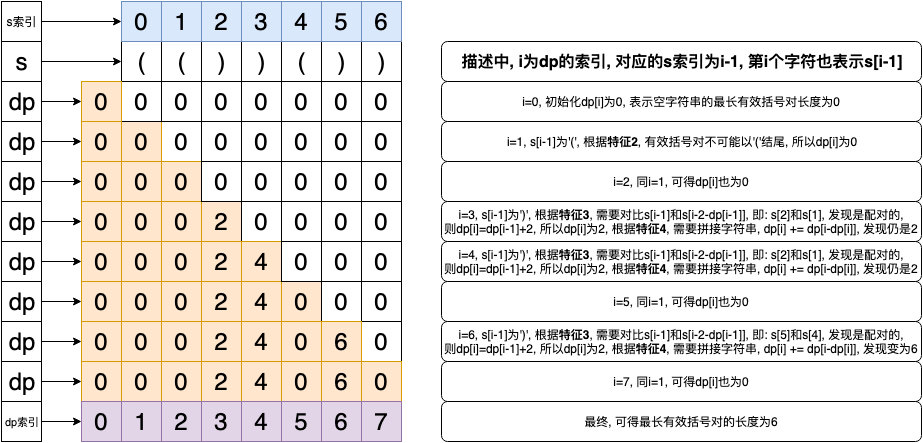

# 0032. 最长有效括号

## 题目地址(32. 最长有效括号)

<https://leetcode-cn.com/problems/longest-valid-parentheses/>

## 题目描述

```
<pre class="calibre18">```
给定一个只包含 '(' 和 ')' 的字符串，找出最长的包含有效括号的子串的长度。

示例 1:

输入: "(()"
输出: 2
解释: 最长有效括号子串为 "()"
示例 2:

输入: ")()())"
输出: 4
解释: 最长有效括号子串为 "()()"

```
```

## 前置知识

- 动态规划

## 暴力（超时）

## 公司

- 阿里
- 腾讯
- 百度
- 字节

### 思路

符合直觉的做法是：分别计算以 i 开头的 最长有效括号（i 从 0 到 n - 1·），从中取出最大的即可。

### 代码

代码支持： Python

```
<pre class="calibre18">```
<span class="hljs-class"><span class="hljs-keyword">class</span> <span class="hljs-title">Solution</span>:</span>
    <span class="hljs-function"><span class="hljs-keyword">def</span> <span class="hljs-title">longestValidParentheses</span><span class="hljs-params">(self, s: str)</span> -> int:</span>
        n = len(s)
        ans = <span class="hljs-params">0</span>

        <span class="hljs-function"><span class="hljs-keyword">def</span> <span class="hljs-title">validCnt</span><span class="hljs-params">(start)</span>:</span>
            <span class="hljs-title"># cnt 为 ) 的数量减去 ( 的数量</span>
            cnt = <span class="hljs-params">0</span>
            ans = <span class="hljs-params">0</span>
            <span class="hljs-keyword">for</span> i <span class="hljs-keyword">in</span> range(start, n):
                <span class="hljs-keyword">if</span> s[i] == <span class="hljs-string">'('</span>:
                    cnt += <span class="hljs-params">1</span>
                <span class="hljs-keyword">if</span> s[i] == <span class="hljs-string">')'</span>:
                    cnt -= <span class="hljs-params">1</span>
                <span class="hljs-keyword">if</span> cnt < <span class="hljs-params">0</span>:
                    <span class="hljs-keyword">return</span> i - start
                <span class="hljs-keyword">if</span> cnt == <span class="hljs-params">0</span>:
                    ans = max(ans, i - start + <span class="hljs-params">1</span>)
            <span class="hljs-keyword">return</span> ans
        <span class="hljs-keyword">for</span> i <span class="hljs-keyword">in</span> range(n):
            ans = max(ans, validCnt(i))

        <span class="hljs-keyword">return</span> ans

```
```

**复杂度分析**

- 时间复杂度：O(N2)O(N^2)O(N2)
- 空间复杂度：O(1)O(1)O(1)

## 栈

### 思路

主要思路和常规的括号解法一样，遇到'('入栈，遇到')'出栈，并计算两个括号之间的长度。 因为这个题存在非法括号对的情况且求是合法括号对的最大长度 所以有两个注意点是:

1. **栈中存的是符号的下标**
2. **当栈为空时且当前扫描到的符号是')'时，需要将这个符号入栈作为分割符**
3. 栈中初始化一个 -1，作为**分割符**

### 代码

- 语言支持: Python, javascript

javascript code:

```
<pre class="calibre18">```
<span class="hljs-title">// 用栈来解</span>
<span class="hljs-keyword">var</span> longestValidParentheses = <span class="hljs-function"><span class="hljs-keyword">function</span> (<span class="hljs-params">s</span>) </span>{
  <span class="hljs-keyword">let</span> stack = <span class="hljs-keyword">new</span> <span class="hljs-params">Array</span>();
  <span class="hljs-keyword">let</span> longest = <span class="hljs-params">0</span>;
  stack.push(<span class="hljs-params">-1</span>);
  <span class="hljs-keyword">for</span> (<span class="hljs-keyword">let</span> i = <span class="hljs-params">0</span>; i < s.length; i++) {
    <span class="hljs-keyword">if</span> (s[i] === <span class="hljs-string">"("</span>) {
      stack.push(i);
    } <span class="hljs-keyword">else</span> {
      stack.pop();
      <span class="hljs-keyword">if</span> (stack.length === <span class="hljs-params">0</span>) {
        stack.push(i);
      } <span class="hljs-keyword">else</span> {
        longest = <span class="hljs-params">Math</span>.max(longest, i - stack[stack.length - <span class="hljs-params">1</span>]);
      }
    }
  }
  <span class="hljs-keyword">return</span> longest;
};

```
```

Python Code:

```
<pre class="calibre18">```

<span class="hljs-class"><span class="hljs-keyword">class</span> <span class="hljs-title">Solution</span>:</span>
    <span class="hljs-function"><span class="hljs-keyword">def</span> <span class="hljs-title">longestValidParentheses</span><span class="hljs-params">(self, s: str)</span> -> int:</span>
        <span class="hljs-keyword">if</span> <span class="hljs-keyword">not</span> s:
            <span class="hljs-keyword">return</span> <span class="hljs-params">0</span>
        res = <span class="hljs-params">0</span>
        stack = [<span class="hljs-params">-1</span>]
        <span class="hljs-keyword">for</span> i <span class="hljs-keyword">in</span> range(len(s)):
            <span class="hljs-keyword">if</span> s[i] == <span class="hljs-string">"("</span>:
                stack.append(i)
            <span class="hljs-keyword">else</span>:
                stack.pop()
                <span class="hljs-keyword">if</span> <span class="hljs-keyword">not</span> stack:
                    stack.append(i)
                <span class="hljs-keyword">else</span>:
                    res = max(res, i - stack[<span class="hljs-params">-1</span>])
        <span class="hljs-keyword">return</span> res

```
```

**复杂度分析**

- 时间复杂度：O(N)O(N)O(N)
- 空间复杂度：O(N)O(N)O(N)

## O(1) 空间

### 思路

我们可以采用解法一中的计数方法。

- 从左到右遍历一次，并分别记录左右括号的数量 left 和 right。
- 如果 right > left ，说明截止上次可以匹配的点到当前点这一段无法匹配，重置 left 和 right 为 0
- 如果 right == left, 此时可以匹配，此时有效括号长度为 left + right，我们获得一个局部最优解。如果其比全局最优解大，我们更新全局最优解

值得注意的是，对形如 `(((()` 这样的，更新全局最优解的逻辑永远无法执行。一种方式是再从右往左遍历一次即可，具体看代码。

> 类似的思想有哨兵元素，虚拟节点。只不过本题无法采用这种方法。

### 代码

代码支持：Java，Python

```
<pre class="calibre18">```
<span class="hljs-keyword">public</span> <span class="hljs-class"><span class="hljs-keyword">class</span> <span class="hljs-title">Solution</span> </span>{
    <span class="hljs-function"><span class="hljs-keyword">public</span> <span class="hljs-keyword">int</span> <span class="hljs-title">longestValidParentheses</span><span class="hljs-params">(String s)</span> </span>{
        <span class="hljs-keyword">int</span> left = <span class="hljs-params">0</span>, right = <span class="hljs-params">0</span>, maxlength = <span class="hljs-params">0</span>;
        <span class="hljs-keyword">for</span> (<span class="hljs-keyword">int</span> i = <span class="hljs-params">0</span>; i < s.length(); i++) {
            <span class="hljs-keyword">if</span> (s.charAt(i) == <span class="hljs-string">'('</span>) {
                left++;
            } <span class="hljs-keyword">else</span> {
                right++;
            }
            <span class="hljs-keyword">if</span> (left == right) {
                maxlength = Math.max(maxlength, left + right);
            }
            <span class="hljs-keyword">if</span> (right > left) {
                left = right = <span class="hljs-params">0</span>;
            }
        }
        left = right = <span class="hljs-params">0</span>;
        <span class="hljs-keyword">for</span> (<span class="hljs-keyword">int</span> i = s.length() - <span class="hljs-params">1</span>; i >= <span class="hljs-params">0</span>; i--) {
            <span class="hljs-keyword">if</span> (s.charAt(i) == <span class="hljs-string">'('</span>) {
                left++;
            } <span class="hljs-keyword">else</span> {
                right++;
            }
            <span class="hljs-keyword">if</span> (left == right) {
                maxlength = Math.max(maxlength, left + right);
            }
            <span class="hljs-keyword">if</span> (left > right) {
                left = right = <span class="hljs-params">0</span>;
            }
        }
        <span class="hljs-keyword">return</span> maxlength;
    }
}

```
```

```
<pre class="calibre18">```
<span class="hljs-class"><span class="hljs-keyword">class</span> <span class="hljs-title">Solution</span>:</span>
    <span class="hljs-function"><span class="hljs-keyword">def</span> <span class="hljs-title">longestValidParentheses</span><span class="hljs-params">(self, s: str)</span> -> int:</span>
        ans = l = r = <span class="hljs-params">0</span>
        <span class="hljs-keyword">for</span> c <span class="hljs-keyword">in</span> s:
            <span class="hljs-keyword">if</span> c == <span class="hljs-string">'('</span>:
                l += <span class="hljs-params">1</span>
            <span class="hljs-keyword">else</span>:
                r += <span class="hljs-params">1</span>
            <span class="hljs-keyword">if</span> l == r:
                ans = max(ans, l + r)
            <span class="hljs-keyword">if</span> r > l:
                l = r = <span class="hljs-params">0</span>
        l = r = <span class="hljs-params">0</span>
        <span class="hljs-keyword">for</span> c <span class="hljs-keyword">in</span> s[::<span class="hljs-params">-1</span>]:
            <span class="hljs-keyword">if</span> c == <span class="hljs-string">'('</span>:
                l += <span class="hljs-params">1</span>
            <span class="hljs-keyword">else</span>:
                r += <span class="hljs-params">1</span>
            <span class="hljs-keyword">if</span> l == r:
                ans = max(ans, l + r)
            <span class="hljs-keyword">if</span> r < l:
                l = r = <span class="hljs-params">0</span>

        <span class="hljs-keyword">return</span> ans

```
```

## 动态规划

### 思路

所有的动态规划问题, 首先需要解决的就是如何寻找合适的子问题. 该题需要我们找到最长的有效括号对, 我们首先想到的就是定义**dp\[i\]为前 i 个字符串的最长有效括号对长度**, 但是随后我们会发现, 这样的定义, 我们无法找到 dp\[i\]和 dp\[i-1\]的任何关系. 所以, 我们需要重新找一个新的定义: 定义**dp\[i\]为以第 i 个字符结尾的最长有效括号对长度**. 然后, 我们通过下面这个例子找一下 dp\[i\]和 dp\[i-1\]之间的关系.

```
<pre class="calibre18">```
s = <span class="hljs-string">'(())())'</span>

```
```

从上面的例子我们可以观察出一下几点结论(**描述中 i 为图中的 dp 数组的下标, 对应 s 的下标应为 i-1, 第 i 个字符的 i 从 1 开始**).

1. base case: 空字符串的最长有效括号对长度肯定为 0, 即: dp\[0\] = 0;
2. s 的第**1**个字符结尾的最长有效括号对长度为 0, s 的第**2**个字符结尾的最长有效括号对长度也为 0, 这个时候我们可以得出结论: 最长有效括号对不可能以'('结尾, 即: dp\[1\] = d\[2\] = 0;
3. 当 i 等于 3 时, 我们可以看出 dp\[2\]=0, dp\[3\]=2, 因为第 2 个字符(**s\[1\]**)和第 3 个字符(**s\[2\]**)是配对的; 当 i 等于 4 时, 我们可以看出 dp\[3\]=2, dp\[4\]=4, 因为我们配对的是第 1 个字符(**s\[0\]**)和第 4 个字符(**s\[3\]**); 因此, 我们可以得出结论: 如果第**i**个字符和第**i-1-dp\[i-1\]**个字符是配对的, 则 dp\[i\] = dp\[i-1\] + 2, 其中: i-1-dp\[i-1\] >= 1, 因为第 0 个字符没有任何意义;
4. 根据第 3 条规则来计算的话, 我们发现 dp\[5\]=0, dp\[6\]=2, 但是显然, dp\[6\]应该为 6 才对, 但是我们发现可以将"(())"和"()"进行拼接, 即: dp\[i\] += dp\[i-dp\[i\]\], 即: dp\[6\] = 2 + dp\[6-2\] = 2 + dp\[4\] = 6

根据以上规则, 我们求解 dp 数组的结果为: \[0, 0, 0, 2, 4, 0, 6, 0\], 其中最长有效括号对的长度为 6. 以下为图解: 

### 代码

Python Code:

```
<pre class="calibre18">```
<span class="hljs-class"><span class="hljs-keyword">class</span> <span class="hljs-title">Solution</span>:</span>
    <span class="hljs-function"><span class="hljs-keyword">def</span> <span class="hljs-title">longestValidParentheses</span><span class="hljs-params">(self, s: str)</span> -> int:</span>
        mlen = <span class="hljs-params">0</span>
        slen = len(s)
        dp = [<span class="hljs-params">0</span>] * (slen + <span class="hljs-params">1</span>)
        <span class="hljs-keyword">for</span> i <span class="hljs-keyword">in</span> range(<span class="hljs-params">1</span>, len(s) + <span class="hljs-params">1</span>):
            <span class="hljs-title"># 有效的括号对不可能会以'('结尾的</span>
            <span class="hljs-keyword">if</span> s[i - <span class="hljs-params">1</span>] == <span class="hljs-string">'('</span>:
                <span class="hljs-keyword">continue</span>

            left_paren = i - <span class="hljs-params">2</span> - dp[i - <span class="hljs-params">1</span>]
            <span class="hljs-keyword">if</span> left_paren >= <span class="hljs-params">0</span> <span class="hljs-keyword">and</span> s[left_paren] == <span class="hljs-string">'('</span>:
                dp[i] = dp[i - <span class="hljs-params">1</span>] + <span class="hljs-params">2</span>

                <span class="hljs-title"># 拼接有效括号对</span>
                <span class="hljs-keyword">if</span> dp[i - dp[i]]:
                    dp[i] += dp[i - dp[i]]

                <span class="hljs-title"># 更新最大有效扩对长度</span>
                <span class="hljs-keyword">if</span> dp[i] > mlen:
                    mlen = dp[i]

        <span class="hljs-keyword">return</span> mlen

```
```

**复杂度分析**

- 时间复杂度：O(N)O(N)O(N)
- 空间复杂度：O(N)O(N)O(N)

### 关键点解析

1. 第 3 点特征, 需要检查的字符是 s\[i-1\]和 s\[i-2-dp\[i-1\]\], 根据定义可知: i-1 >= dp\[i-1\], 但是 i-2 不一定大于 dp\[i-1\], 因此, 需要检查越界;
2. 第 4 点特征最容易遗漏, 还有就是不需要检查越界, 因为根据定义可知: i >= dp\[i\], 所以 dp\[i-dp\[i\]\]的边界情况是 dp\[0\];

## 相关题目

- [20.valid-parentheses](20.valid-parentheses.html)

## 扩展

1. 如果判断的不仅仅只有'('和')', 还有'\[', '\]', '{'和'}', 该怎么办?
2. 如果输出的不是长度, 而是任意一个最长有效括号对的字符串, 该怎么办?

大家对此有何看法，欢迎给我留言，我有时间都会一一查看回答。更多算法套路可以访问我的 LeetCode 题解仓库：<https://github.com/azl397985856/leetcode> 。 目前已经 37K star 啦。 大家也可以关注我的公众号《力扣加加》带你啃下算法这块硬骨头。 