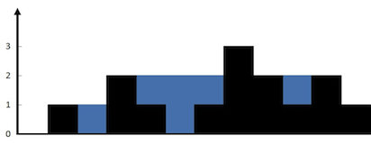

# 0042. 接雨水

## 题目地址(42. 接雨水)

<https://leetcode-cn.com/problems/trapping-rain-water/>

## 题目描述

```
<pre class="calibre18">```
给定 n 个非负整数表示每个宽度为 1 的柱子的高度图，计算按此排列的柱子，下雨之后能接多少雨水。

```
```



```
<pre class="calibre18">```
上面是由数组 [0,1,0,2,1,0,1,3,2,1,2,1] 表示的高度图，在这种情况下，可以接 6 个单位的雨水（蓝色部分表示雨水）。 感谢 Marcos 贡献此图。

示例:

输入: [0,1,0,2,1,0,1,3,2,1,2,1]
输出: 6

```
```

## 前置知识

- 空间换时间
- 双指针
- 单调栈

## 公司

- 阿里
- 腾讯
- 百度
- 字节

## 双数组

### 思路

这是一道雨水收集的问题， 难度为`hard`. 如图所示，让我们求下过雨之后最多可以积攒多少的水。

如果采用暴力求解的话，思路应该是 height 数组依次求和，然后相加。

伪代码:

```
<pre class="calibre18">```
<span class="hljs-keyword">for</span> (<span class="hljs-keyword">let</span> i = <span class="hljs-params">0</span>; i < height.length; i++) {
  area += (h[i] - height[i]) * <span class="hljs-params">1</span>; <span class="hljs-title">// h为下雨之后的水位</span>
}

```
```

问题转化为求 h，那么 h\[i\]又等于`左右两侧柱子的最大值中的较小值`，即 `h[i] = Math.min(左边柱子最大值, 右边柱子最大值)`

如上图那么 h 为 \[0, 1, 1, 2, 2, 2 ,2, 3, 2, 2, 2, 1\]

问题的关键在于求解`左边柱子最大值`和`右边柱子最大值`, 我们其实可以用两个数组来表示`leftMax`, `rightMax`， 以 leftMax 为例，leftMax\[i\]代表 i 的左侧柱子的最大值，因此我们维护两个数组即可。

### 关键点解析

- 建模 `h[i] = Math.min(左边柱子最大值, 右边柱子最大值)`(h 为下雨之后的水位)

### 代码

代码支持 JavaScript，Python3，C++:

JavaScript Code:

```
<pre class="calibre18">```
<span class="hljs-title">/*
 * @lc app=leetcode id=42 lang=javascript
 *
 * [42] Trapping Rain Water
 *
 */</span>
<span class="hljs-title">/**
 * @param {number[]} height
 * @return {number}
 */</span>
<span class="hljs-keyword">var</span> trap = <span class="hljs-function"><span class="hljs-keyword">function</span> (<span class="hljs-params">height</span>) </span>{
  <span class="hljs-keyword">let</span> max = <span class="hljs-params">0</span>;
  <span class="hljs-keyword">let</span> volume = <span class="hljs-params">0</span>;
  <span class="hljs-keyword">const</span> leftMax = [];
  <span class="hljs-keyword">const</span> rightMax = [];

  <span class="hljs-keyword">for</span> (<span class="hljs-keyword">let</span> i = <span class="hljs-params">0</span>; i < height.length; i++) {
    leftMax[i] = max = <span class="hljs-params">Math</span>.max(height[i], max);
  }

  max = <span class="hljs-params">0</span>;

  <span class="hljs-keyword">for</span> (<span class="hljs-keyword">let</span> i = height.length - <span class="hljs-params">1</span>; i >= <span class="hljs-params">0</span>; i--) {
    rightMax[i] = max = <span class="hljs-params">Math</span>.max(height[i], max);
  }

  <span class="hljs-keyword">for</span> (<span class="hljs-keyword">let</span> i = <span class="hljs-params">0</span>; i < height.length; i++) {
    volume = volume + <span class="hljs-params">Math</span>.min(leftMax[i], rightMax[i]) - height[i];
  }

  <span class="hljs-keyword">return</span> volume;
};

```
```

Python Code:

```
<pre class="calibre18">```
<span class="hljs-class"><span class="hljs-keyword">class</span> <span class="hljs-title">Solution</span>:</span>
    <span class="hljs-function"><span class="hljs-keyword">def</span> <span class="hljs-title">trap</span><span class="hljs-params">(self, heights: List[int])</span> -> int:</span>
        n = len(heights)
        l, r = [<span class="hljs-params">0</span>] * (n + <span class="hljs-params">1</span>), [<span class="hljs-params">0</span>] * (n + <span class="hljs-params">1</span>)
        ans = <span class="hljs-params">0</span>
        <span class="hljs-keyword">for</span> i <span class="hljs-keyword">in</span> range(<span class="hljs-params">1</span>, len(heights) + <span class="hljs-params">1</span>):
            l[i] = max(l[i - <span class="hljs-params">1</span>], heights[i - <span class="hljs-params">1</span>])
        <span class="hljs-keyword">for</span> i <span class="hljs-keyword">in</span> range(len(heights) - <span class="hljs-params">1</span>, <span class="hljs-params">0</span>, <span class="hljs-params">-1</span>):
            r[i] = max(r[i + <span class="hljs-params">1</span>], heights[i])
        <span class="hljs-keyword">for</span> i <span class="hljs-keyword">in</span> range(len(heights)):
            ans += max(<span class="hljs-params">0</span>, min(l[i + <span class="hljs-params">1</span>], r[i]) - heights[i])
        <span class="hljs-keyword">return</span> ans

```
```

C++ Code:

```
<pre class="calibre18">```
<span class="hljs-function"><span class="hljs-keyword">int</span> <span class="hljs-title">trap</span><span class="hljs-params">(<span class="hljs-params">vector</span><<span class="hljs-keyword">int</span>>& heights)</span>
</span>{
    <span class="hljs-keyword">if</span>(heights == null)
        <span class="hljs-keyword">return</span> <span class="hljs-params">0</span>;
    <span class="hljs-keyword">int</span> ans = <span class="hljs-params">0</span>;
    <span class="hljs-keyword">int</span> size = heights.size();
    <span class="hljs-params">vector</span><<span class="hljs-keyword">int</span>> left_max(size), right_max(size);
    left_max[<span class="hljs-params">0</span>] = heights[<span class="hljs-params">0</span>];
    <span class="hljs-keyword">for</span> (<span class="hljs-keyword">int</span> i = <span class="hljs-params">1</span>; i < size; i++) {
        left_max[i] = max(heights[i], left_max[i - <span class="hljs-params">1</span>]);
    }
    right_max[size - <span class="hljs-params">1</span>] = heights[size - <span class="hljs-params">1</span>];
    <span class="hljs-keyword">for</span> (<span class="hljs-keyword">int</span> i = size - <span class="hljs-params">2</span>; i >= <span class="hljs-params">0</span>; i--) {
        right_max[i] = max(heights[i], right_max[i + <span class="hljs-params">1</span>]);
    }
    <span class="hljs-keyword">for</span> (<span class="hljs-keyword">int</span> i = <span class="hljs-params">1</span>; i < size - <span class="hljs-params">1</span>; i++) {
        ans += min(left_max[i], right_max[i]) - heights[i];
    }
    <span class="hljs-keyword">return</span> ans;
}

```
```

**复杂度分析**

- 时间复杂度：O(N)O(N)O(N)
- 空间复杂度：O(N)O(N)O(N)

## 双指针

### 思路

上面代码比较好理解，但是需要额外的 N 的空间。从上面解法可以看出，我们实际上只关心左右两侧较小的那一个，并不需要两者都计算出来。具体来说：

- 如果 l\[i + 1\] < r\[i\] 那么 最终积水的高度由 i 的左侧最大值决定。
- 如果 l\[i + 1\] >= r\[i\] 那么 最终积水的高度由 i 的右侧最大值决定。

因此我们不必维护完整的两个数组，而是可以只进行一次遍历，同时维护左侧最大值和右侧最大值，使用常数变量完成即可。这是一个典型的双指针问题，

具体算法：

1. 维护两个指针 left 和 right，分别指向头尾。
2. 初始化左侧和右侧最高的高度都为 0。
3. 比较 height\[left\] 和 height\[right\]
  
  
  - 3.1 如果 height\[left\] < height\[right\]
      - 3.1.1 如果 height\[left\] >= left\_max， 则当前格子积水面积为(left\_max - height\[left\])
      - 3.1.2 否则无法积水，即积水面积为 0
  - 3.2 左指针右移一位
  - 3.3 如果 height\[left\] >= height\[right\]
      
      
      - 3.3.1 如果 height\[right\] >= right\_max， 则当前格子积水面积为(right\_max - height\[right\])
      - 3.3.2 否则无法积水，即积水面积为 0
  - 3.4 右指针左移一位

### 代码

代码支持 Python3，C++:

```
<pre class="calibre18">```
<span class="hljs-class"><span class="hljs-keyword">class</span> <span class="hljs-title">Solution</span>:</span>
    <span class="hljs-function"><span class="hljs-keyword">def</span> <span class="hljs-title">trap</span><span class="hljs-params">(self, heights: List[int])</span> -> int:</span>
        n = len(heights)
        l_max = r_max = <span class="hljs-params">0</span>
        l, r = <span class="hljs-params">0</span>, n - <span class="hljs-params">1</span>
        ans = <span class="hljs-params">0</span>
        <span class="hljs-keyword">while</span> l < r:
            <span class="hljs-keyword">if</span> heights[l] < heights[r]:
                <span class="hljs-keyword">if</span> heights[l] < l_max:
                    ans += l_max - heights[l]
                <span class="hljs-keyword">else</span>:
                    l_max = heights[l]
                l += <span class="hljs-params">1</span>
            <span class="hljs-keyword">else</span>:
                <span class="hljs-keyword">if</span> heights[r] < r_max:
                    ans += r_max - heights[r]
                <span class="hljs-keyword">else</span>:
                    r_max = heights[r]
                r -= <span class="hljs-params">1</span>
        <span class="hljs-keyword">return</span> ans

```
```

```
<pre class="calibre18">```

<span class="hljs-keyword">class</span> Solution {
<span class="hljs-keyword">public</span>:
    <span class="hljs-function"><span class="hljs-keyword">int</span> <span class="hljs-title">trap</span><span class="hljs-params">(<span class="hljs-params">vector</span><<span class="hljs-keyword">int</span>>& heights)</span>
</span>{
    <span class="hljs-keyword">int</span> left = <span class="hljs-params">0</span>, right = heights.size() - <span class="hljs-params">1</span>;
    <span class="hljs-keyword">int</span> ans = <span class="hljs-params">0</span>;
    <span class="hljs-keyword">int</span> left_max = <span class="hljs-params">0</span>, right_max = <span class="hljs-params">0</span>;
    <span class="hljs-keyword">while</span> (left < right) {
        <span class="hljs-keyword">if</span> (heights[left] < heights[right]) {
            heights[left] >= left_max ? (left_max = heights[left]) : ans += (left_max - heights[left]);
            ++left;
        }
        <span class="hljs-keyword">else</span> {
            heights[right] >= right_max ? (right_max = heights[right]) : ans += (right_max - heights[right]);
            --right;
        }
    }
    <span class="hljs-keyword">return</span> ans;
}

};

```
```

**复杂度分析**

- 时间复杂度：O(N)O(N)O(N)
- 空间复杂度：O(1)O(1)O(1)

## 相关题目

- [84.largest-rectangle-in-histogram](https://github.com/azl397985856/leetcode/blob/master/problems/84.largest-rectangle-in-histogram.md)

更多题解可以访问我的 LeetCode 题解仓库：<https://github.com/azl397985856/leetcode> 。 目前已经 37K star 啦。

关注公众号力扣加加，努力用清晰直白的语言还原解题思路，并且有大量图解，手把手教你识别套路，高效刷题。

