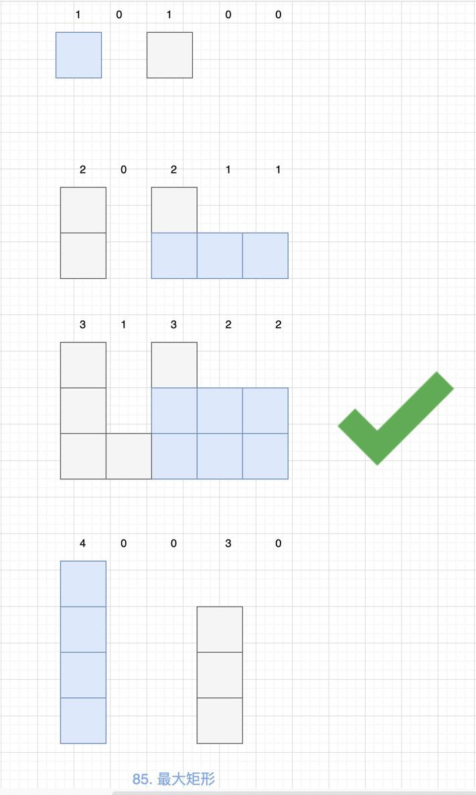

# 0085. 最大矩形

## 题目地址（85. 最大矩形）

<https://leetcode-cn.com/problems/maximal-rectangle/>

## 题目描述

给定一个仅包含 0 和 1 的二维二进制矩阵，找出只包含 1 的最大矩形，并返回其面积。

示例：

输入：

```
<pre class="calibre18">```
[
  ["1","0","1","0","0"],
  ["1","0","1","1","1"],
  ["1","1","1","1","1"],
  ["1","0","0","1","0"]
]

```
```

输出：6

## 前置知识

- 单调栈

## 公司

- 阿里
- 腾讯
- 百度
- 字节

## 思路

我在 [【84. 柱状图中最大的矩形】多种方法（Python3）](https://leetcode-cn.com/problems/largest-rectangle-in-histogram/solution/84-zhu-zhuang-tu-zhong-zui-da-de-ju-xing-duo-chong/ "【84. 柱状图中最大的矩形】多种方法（Python3）") 使用了多种方法来解决。 然而在这道题，我们仍然可以使用完全一样的思路去完成。 不熟悉的可以看下我的题解。本题解是基于那道题的题解来进行的。

拿题目给的例子来说：

```
<pre class="calibre18">```
[
  ["1","0","1","0","0"],
  ["1","0","1","1","1"],
  ["1","1","1","1","1"],
  ["1","0","0","1","0"]
]

```
```

我们逐行扫描得到 `84. 柱状图中最大的矩形` 中的 heights 数组：



这样我们就可以使用`84. 柱状图中最大的矩形` 中的解法来进行了，这里我们使用单调栈来解。

## 代码

```
<pre class="calibre18">```
<span class="hljs-class"><span class="hljs-keyword">class</span> <span class="hljs-title">Solution</span>:</span>
    <span class="hljs-function"><span class="hljs-keyword">def</span> <span class="hljs-title">largestRectangleArea</span><span class="hljs-params">(self, heights: List[int])</span> -> int:</span>
        n, heights, st, ans = len(heights), [<span class="hljs-params">0</span>] + heights + [<span class="hljs-params">0</span>], [], <span class="hljs-params">0</span>
        <span class="hljs-keyword">for</span> i <span class="hljs-keyword">in</span> range(n + <span class="hljs-params">2</span>):
            <span class="hljs-keyword">while</span> st <span class="hljs-keyword">and</span> heights[st[<span class="hljs-params">-1</span>]] > heights[i]:
                ans = max(ans, heights[st.pop(<span class="hljs-params">-1</span>)] * (i - st[<span class="hljs-params">-1</span>] - <span class="hljs-params">1</span>))
            st.append(i)

        <span class="hljs-keyword">return</span> ans
    <span class="hljs-function"><span class="hljs-keyword">def</span> <span class="hljs-title">maximalRectangle</span><span class="hljs-params">(self, matrix: List[List[str]])</span> -> int:</span>
        m = len(matrix)
        <span class="hljs-keyword">if</span> m == <span class="hljs-params">0</span>: <span class="hljs-keyword">return</span> <span class="hljs-params">0</span>
        n = len(matrix[<span class="hljs-params">0</span>])
        heights = [<span class="hljs-params">0</span>] * n
        ans = <span class="hljs-params">0</span>
        <span class="hljs-keyword">for</span> i <span class="hljs-keyword">in</span> range(m):
            <span class="hljs-keyword">for</span> j <span class="hljs-keyword">in</span> range(n):
                <span class="hljs-keyword">if</span> matrix[i][j] == <span class="hljs-string">"0"</span>:
                    heights[j] = <span class="hljs-params">0</span>
                <span class="hljs-keyword">else</span>:
                    heights[j] += <span class="hljs-params">1</span>
            ans = max(ans, self.largestRectangleArea(heights))
        <span class="hljs-keyword">return</span> ans

```
```

**复杂度分析**

- 时间复杂度：O(M∗N)O(M \* N)O(M∗N)
- 空间复杂度：O(N)O(N)O(N)

欢迎关注我的公众号《脑洞前端》获取更多更新鲜的 LeetCode 题解

