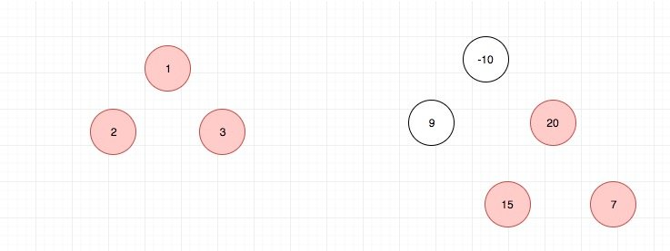

# 0124. 二叉树中的最大路径和

## 题目地址(124. 二叉树中的最大路径和)

<https://leetcode-cn.com/problems/binary-tree-maximum-path-sum/description/>

## 题目描述

```
<pre class="calibre18">```

给定一个非空二叉树，返回其最大路径和。

本题中，路径被定义为一条从树中任意节点出发，沿父节点-子节点连接，达到任意节点的序列。该路径至少包含一个节点，且不一定经过根节点。

示例 1：

输入：[1,2,3]

       1
      / \
     2   3

输出：6
示例 2：

输入：[-10,9,20,null,null,15,7]

   -10
   / \
  9  20
    /  \
   15   7

输出：42

```
```

## 前置知识

- 递归

## 公司

- 阿里
- 腾讯
- 百度
- 字节

## 思路

这道题目的 path 让我误解了，然后浪费了很多时间来解这道题 我觉得 leetcode 给的 demo 太少了，不足以让我理解 path 的概念 因此我这里自己画了一个图，来补充一下，帮助大家理解 path 的概念，不要像我一样理解错啦。

首先是官网给的两个例子：



接着是我自己画的一个例子：


如图红色的部分是最大路径上的节点。大家可以结合上面的 demo 来继续理解一下 path， 除非你理解了 path，否则不要往下看。

树的题目，基本都是考察递归思想的。因此我们需要思考如何去定义我们的递归函数，在这里我定义了一个递归函数，它的功能是，`返回以当前节点为根节点的MaxPath`

但是有两个条件:

1. 根节点必须选择
2. 左右子树只能选择一个

为什么要有这两个条件?

我的想法是原问题可以转化为：以每一个节点为根节点，分别求出 MaxPath，最后计算最大值，因此第一个条件需要满足.

对于第二个条件，由于递归函数子节点的返回值会被父节点使用，因此我们如果两个孩子都选择了就不符合 MaxPath 的定义了。实际上这道题，当遍历到某一个节点的时候，我们需要子节点的信息，然后同时结合自身的 val 来决定要不要选取左右子树以及选取的话要选哪一个， 因此这个过程本质上就是`后序遍历`

基本算法就是不断调用递归函数，然后在调用过程中不断计算和更新 MaxPath，最后在主函数中将 MaxPath 返回即可。

## 关键点解析

- 递归
- 理解题目中的 path 定义

## 代码

代码支持：JavaScript，Java，Python

- JavaScript

```
<pre class="calibre18">```
<span class="hljs-title">/*
 * @lc app=leetcode id=124 lang=javascript
 *
 * [124] Binary Tree Maximum Path Sum
 */</span>
<span class="hljs-title">/**
 * Definition for a binary tree node.
 * function TreeNode(val) {
 *     this.val = val;
 *     this.left = this.right = null;
 * }
 */</span>
<span class="hljs-function"><span class="hljs-keyword">function</span> <span class="hljs-title">helper</span>(<span class="hljs-params">node, payload</span>) </span>{
  <span class="hljs-keyword">if</span> (node === <span class="hljs-params">null</span>) <span class="hljs-keyword">return</span> <span class="hljs-params">0</span>;

  <span class="hljs-keyword">const</span> l = helper(node.left, payload);
  <span class="hljs-keyword">const</span> r = helper(node.right, payload);

  payload.max = <span class="hljs-params">Math</span>.max(
    node.val + <span class="hljs-params">Math</span>.max(<span class="hljs-params">0</span>, l) + <span class="hljs-params">Math</span>.max(<span class="hljs-params">0</span>, r),
    payload.max
  );

  <span class="hljs-keyword">return</span> node.val + <span class="hljs-params">Math</span>.max(l, r, <span class="hljs-params">0</span>);
}
<span class="hljs-title">/**
 * @param {TreeNode} root
 * @return {number}
 */</span>
<span class="hljs-keyword">var</span> maxPathSum = <span class="hljs-function"><span class="hljs-keyword">function</span> (<span class="hljs-params">root</span>) </span>{
  <span class="hljs-keyword">if</span> (root === <span class="hljs-params">null</span>) <span class="hljs-keyword">return</span> <span class="hljs-params">0</span>;
  <span class="hljs-keyword">const</span> payload = {
    max: root.val,
  };
  helper(root, payload);
  <span class="hljs-keyword">return</span> payload.max;
};

```
```

- Java

```
<pre class="calibre18">```
<span class="hljs-title">/**
 * Definition for a binary tree node.
 * public class TreeNode {
 *     int val;
 *     TreeNode left;
 *     TreeNode right;
 *     TreeNode(int x) { val = x; }
 * }
 */</span>
<span class="hljs-class"><span class="hljs-keyword">class</span> <span class="hljs-title">Solution</span> </span>{
  <span class="hljs-keyword">int</span> ans;
  <span class="hljs-function"><span class="hljs-keyword">public</span> <span class="hljs-keyword">int</span> <span class="hljs-title">maxPathSum</span><span class="hljs-params">(TreeNode root)</span> </span>{
    ans = Integer.MIN_VALUE;
    helper(root);   <span class="hljs-title">// recursion</span>
    <span class="hljs-keyword">return</span> ans;
  }

  <span class="hljs-function"><span class="hljs-keyword">public</span> <span class="hljs-keyword">int</span> <span class="hljs-title">helper</span><span class="hljs-params">(TreeNode root)</span> </span>{
    <span class="hljs-keyword">if</span> (root == <span class="hljs-keyword">null</span>) <span class="hljs-keyword">return</span> <span class="hljs-params">0</span>;
    <span class="hljs-keyword">int</span> leftMax = Math.max(<span class="hljs-params">0</span>, helper(root.left));     <span class="hljs-title">// find the max sub-path sum in left sub-tree</span>
    <span class="hljs-keyword">int</span> rightMax = Math.max(<span class="hljs-params">0</span>, helper(root.right));   <span class="hljs-title">// find the max sub-path sum in right sub-tree</span>
    ans = Math.max(ans, leftMax+rightMax+root.val);   <span class="hljs-title">// find the max path sum at current node</span>
    <span class="hljs-keyword">return</span> max(leftMax, rightMax) + root.val;         <span class="hljs-title">// according to the definition of path, the return value of current node can only be that the sum of current node value plus either left or right max path sum.</span>
  }
}

```
```

- Python

```
<pre class="calibre18">```

<span class="hljs-class"><span class="hljs-keyword">class</span> <span class="hljs-title">Solution</span>:</span>
    ans = float(<span class="hljs-string">'-inf'</span>)
    <span class="hljs-function"><span class="hljs-keyword">def</span> <span class="hljs-title">maxPathSum</span><span class="hljs-params">(self, root: TreeNode)</span> -> int:</span>
        <span class="hljs-function"><span class="hljs-keyword">def</span> <span class="hljs-title">helper</span><span class="hljs-params">(node)</span>:</span>
            <span class="hljs-keyword">if</span> <span class="hljs-keyword">not</span> node: <span class="hljs-keyword">return</span> <span class="hljs-params">0</span>
            l = helper(node.left)
            r = helper(node.right)
            self.ans = max(self.ans, max(l,<span class="hljs-params">0</span>) + max(r, <span class="hljs-params">0</span>) + node.val)
            <span class="hljs-keyword">return</span> max(l, r, <span class="hljs-params">0</span>) + node.val
        helper(root)
        <span class="hljs-keyword">return</span> self.ans

```
```

**复杂度分析**

- 时间复杂度：O(N)O(N)O(N)
- 空间复杂度：O(N)O(N)O(N)

## 相关题目

- [113.path-sum-ii](113.path-sum-ii.html)

大家对此有何看法，欢迎给我留言，我有时间都会一一查看回答。更多算法套路可以访问我的 LeetCode 题解仓库：<https://github.com/azl397985856/leetcode> 。 目前已经 37K star 啦。 大家也可以关注我的公众号《力扣加加》带你啃下算法这块硬骨头。 