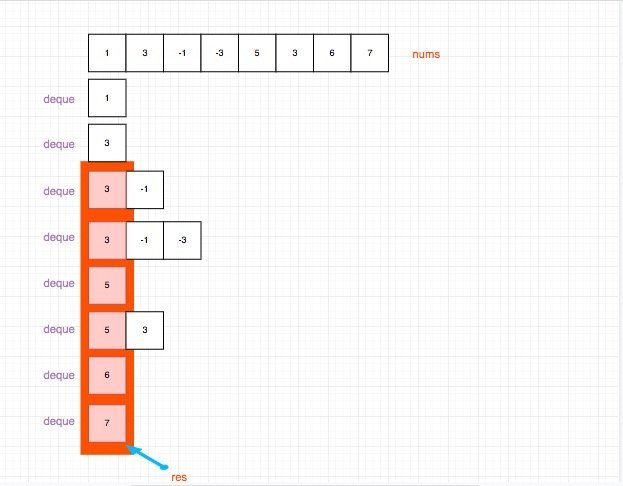

# 0239. 滑动窗口最大值

## 题目地址(239. 滑动窗口最大值)

<https://leetcode-cn.com/problems/sliding-window-maximum/>

## 题目描述

```
<pre class="calibre18">```
给定一个数组 nums，有一个大小为 k 的滑动窗口从数组的最左侧移动到数组的最右侧。你只可以看到在滑动窗口内的 k 个数字。滑动窗口每次只向右移动一位。

返回滑动窗口中的最大值。


进阶：

你能在线性时间复杂度内解决此题吗？


示例:

输入: nums = [1,3,-1,-3,5,3,6,7], 和 k = 3
输出: [3,3,5,5,6,7] 
解释: 

  滑动窗口的位置                最大值
---------------               -----
[1  3  -1] -3  5  3  6  7       3
 1 [3  -1  -3] 5  3  6  7       3
 1  3 [-1  -3  5] 3  6  7       5
 1  3  -1 [-3  5  3] 6  7       5
 1  3  -1  -3 [5  3  6] 7       6
 1  3  -1  -3  5 [3  6  7]      7


提示：

1 <= nums.length <= 10^5
-10^4 <= nums[i] <= 10^4
1 <= k <= nums.length

```
```

## 前置知识

- 队列
- 滑动窗口

## 公司

- 阿里
- 腾讯
- 百度
- 字节

## 思路

符合直觉的想法是直接遍历 nums, 然后然后用一个变量 slideWindow 去承载 k 个元素， 然后对 slideWindow 求最大值，这是可以的，时间复杂度是 O(n \* k).代码如下：

JavaScript:

```
<pre class="calibre18">```
<span class="hljs-keyword">var</span> maxSlidingWindow = <span class="hljs-function"><span class="hljs-keyword">function</span>(<span class="hljs-params">nums, k</span>) </span>{
  <span class="hljs-title">// bad 时间复杂度O(n * k)</span>
  <span class="hljs-keyword">if</span> (nums.length === <span class="hljs-params">0</span> || k === <span class="hljs-params">0</span>) <span class="hljs-keyword">return</span> [];
  <span class="hljs-keyword">let</span> slideWindow = [];
  <span class="hljs-keyword">const</span> ret = [];
  <span class="hljs-keyword">for</span> (<span class="hljs-keyword">let</span> i = <span class="hljs-params">0</span>; i < nums.length - k + <span class="hljs-params">1</span>; i++) {
    <span class="hljs-keyword">for</span> (<span class="hljs-keyword">let</span> j = <span class="hljs-params">0</span>; j < k; j++) {
      slideWindow.push(nums[i + j]);
    }
    ret.push(<span class="hljs-params">Math</span>.max(...slideWindow));
    slideWindow = [];
  }
  <span class="hljs-keyword">return</span> ret;
};

```
```

Python3:

```
<pre class="calibre18">```
<span class="hljs-class"><span class="hljs-keyword">class</span> <span class="hljs-title">Solution</span>:</span>
    <span class="hljs-function"><span class="hljs-keyword">def</span> <span class="hljs-title">maxSlidingWindow</span><span class="hljs-params">(self, nums: List[int], k: int)</span> -> List[int]:</span>
        <span class="hljs-keyword">if</span> k == <span class="hljs-params">0</span>: <span class="hljs-keyword">return</span> []
        res = []
        <span class="hljs-keyword">for</span> r <span class="hljs-keyword">in</span> range(k - <span class="hljs-params">1</span>, len(nums)):
            res.append(max(nums[r - k + <span class="hljs-params">1</span>:r + <span class="hljs-params">1</span>]))
        <span class="hljs-keyword">return</span> res

```
```

但是如果真的是这样，这道题也不会是 hard 吧？这道题有一个 follow up，要求你用线性的时间去完成。 我们可以用双端队列来完成，思路是用一个双端队列来保存`接下来的滑动窗口可能成为最大值的数`。具体做法：

- 入队列
- 移除失效元素，失效元素有两种
- 一种是已经超出窗口范围了，比如我遍历到第4个元素，k = 3，那么i = 0的元素就不应该出现在双端队列中了 具体就是`索引大于 i - k + 1的元素都应该被清除`
- 小于当前元素都没有利用价值了，具体就是`从后往前遍历（双端队列是一个递减队列）双端队列，如果小于当前元素就出队列`

如果你仔细观察的话，发现双端队列其实是一个递减的一个队列。因此队首的元素一定是最大的。用图来表示就是：



## 关键点解析

- 双端队列简化时间复杂度
- 滑动窗口

## 代码

JavaScript:

```
<pre class="calibre18">```
<span class="hljs-keyword">var</span> maxSlidingWindow = <span class="hljs-function"><span class="hljs-keyword">function</span>(<span class="hljs-params">nums, k</span>) </span>{
  <span class="hljs-title">// 双端队列优化时间复杂度, 时间复杂度O(n)</span>
  <span class="hljs-keyword">const</span> deque = []; <span class="hljs-title">// 存放在接下来的滑动窗口可能成为最大值的数</span>
  <span class="hljs-keyword">const</span> ret = [];
  <span class="hljs-keyword">for</span> (<span class="hljs-keyword">let</span> i = <span class="hljs-params">0</span>; i < nums.length; i++) {
    <span class="hljs-title">// 清空失效元素</span>
    <span class="hljs-keyword">while</span> (deque[<span class="hljs-params">0</span>] < i - k + <span class="hljs-params">1</span>) {
      deque.shift();
    }

    <span class="hljs-keyword">while</span> (nums[deque[deque.length - <span class="hljs-params">1</span>]] < nums[i]) {
      deque.pop();
    }

    deque.push(i);

    <span class="hljs-keyword">if</span> (i >= k - <span class="hljs-params">1</span>) {
      ret.push(nums[deque[<span class="hljs-params">0</span>]]);
    }
  }
  <span class="hljs-keyword">return</span> ret;
};

```
```

Python3:

```
<pre class="calibre18">```
<span class="hljs-class"><span class="hljs-keyword">class</span> <span class="hljs-title">Solution</span>:</span>
    <span class="hljs-function"><span class="hljs-keyword">def</span> <span class="hljs-title">maxSlidingWindow</span><span class="hljs-params">(self, nums: List[int], k: int)</span> -> List[int]:</span>
        deque, res, n = [], [], len(nums)
        <span class="hljs-keyword">for</span> i <span class="hljs-keyword">in</span> range(n):
            <span class="hljs-keyword">while</span> deque <span class="hljs-keyword">and</span> deque[<span class="hljs-params">0</span>] < i - k + <span class="hljs-params">1</span>:
                deque.pop(<span class="hljs-params">0</span>)
            <span class="hljs-keyword">while</span> deque <span class="hljs-keyword">and</span> nums[i] > nums[deque[<span class="hljs-params">-1</span>]]:
                deque.pop(<span class="hljs-params">-1</span>)
            deque.append(i)
            <span class="hljs-keyword">if</span> i >= k - <span class="hljs-params">1</span>: res.append(nums[deque[<span class="hljs-params">0</span>]])
        <span class="hljs-keyword">return</span> res

```
```

**复杂度分析**

- 时间复杂度：O(N)O(N)O(N)
- 空间复杂度：O(N)O(N)O(N)

## 扩展

### 为什么用双端队列

因为删除无效元素的时候，会清除队首的元素（索引太小了）或者队尾(元素太小了)的元素。 因此需要同时对队首和队尾进行操作，使用双端队列是一种合乎情理的做法。

大家对此有何看法，欢迎给我留言，我有时间都会一一查看回答。更多算法套路可以访问我的 LeetCode 题解仓库：<https://github.com/azl397985856/leetcode> 。 目前已经 37K star 啦。 大家也可以关注我的公众号《力扣加加》带你啃下算法这块硬骨头。 