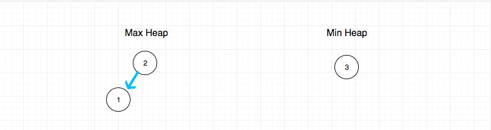

# 0295. 数据流的中位数

## 题目地址(295. 数据流的中位数)

<https://leetcode-cn.com/problems/find-median-from-data-stream/>

## 题目描述

```
<pre class="calibre18">```
中位数是有序列表中间的数。如果列表长度是偶数，中位数则是中间两个数的平均值。

例如，

[2,3,4] 的中位数是 3

[2,3] 的中位数是 (2 + 3) / 2 = 2.5

设计一个支持以下两种操作的数据结构：

void addNum(int num) - 从数据流中添加一个整数到数据结构中。
double findMedian() - 返回目前所有元素的中位数。
示例：

addNum(1)
addNum(2)
findMedian() -> 1.5
addNum(3) 
findMedian() -> 2
进阶:

如果数据流中所有整数都在 0 到 100 范围内，你将如何优化你的算法？
如果数据流中 99% 的整数都在 0 到 100 范围内，你将如何优化你的算法？

```
```

## 前置知识

- 堆
- 队列

## 公司

- 阿里
- 百度
- 字节

## 思路

这道题目是求动态数据的中位数，在 leetcode 难度为`hard`. 如果这道题是求静态数据的中位数，我们用数组去存储， 空间复杂度 O(1), 时间复杂度 O(1)

> 空间复杂度指的是除了存储数据之外额外开辟的用于计算等任务的内存空间

代码也比较简单

```
<pre class="calibre18">```
<span class="hljs-function"><span class="hljs-keyword">function</span> <span class="hljs-title">findMedian</span>(<span class="hljs-params">a</span>) </span>{
  <span class="hljs-keyword">return</span> a.length % <span class="hljs-params">2</span> === <span class="hljs-params">0</span>
    ? (a[a.length >> <span class="hljs-params">1</span>] + a[a.length >> (<span class="hljs-params">1</span> + <span class="hljs-params">1</span>)]) / <span class="hljs-params">2</span>
    : a[a.length >> <span class="hljs-params">1</span>];
}

```
```

但是题目要求是动态数据， 那么是否可以每次添加数据的时候，都去排一次序呢？ 假如我们每次插入都用`快速排序`进行排序的话，那么时间复杂度是 O(nlogn) + O(1)

> O(nlogn) 是排序的时间复杂度 O(1)是查询中位数的时间复杂度

如果你用这种思路进行的话， 恐怕 leetcode 会超时。

那么如何优化呢？ 答案是使用堆， Java， C++等语言都有`优先级队列`中这种数据结构， 优先级队列本质上就是一个堆。 关于堆和优先级队列的关系，我会放在《数据结构和算法》部分讲解。这里不赘述

如果借助堆这种数据结构， 就可以轻易实现了。

具体的做法是，建立两个堆，这两个堆需要满足:

1. 大顶堆元素都比小顶堆小（由于堆的特点其实只要比较堆顶即可）
2. 大顶堆元素不小于小顶堆，且最多比小顶堆多一个元素

满足上面两个条件的话，如果想要找到中位数，就比较简单了

- 如果两个堆数量相等（本质是总数为偶数）, 就两个堆顶元素的平均数
- 如果两个堆数量不相等（本质是总数为奇数）， 就取大顶堆的堆顶元素

比如对于\[1,2,3\] 求中位数：



再比如对于\[1,2,3, 4\] 求中位数：


## 关键点解析

- 用两个堆（一个大顶堆，一个小顶堆）来简化时间复杂度
- 用优先级队列简化操作

> JavaScript 不像 Java， C++等语言都有`优先级队列`中这种数据结构， 因此大家可以使用社区的实现 个人认为没有非要纠结于优先级队列怎么实现， 至少这道题不是考这个的 优先级队列的实现个人认为已经超过了这道题想考察的范畴
> 
> ## 代码

如果不使用现成的`优先级队列`这种数据结构，代码可能是这样的：

```
<pre class="calibre18">```
<span class="hljs-title">/**
 * initialize your data structure here.
 */</span>
<span class="hljs-keyword">var</span> MedianFinder = <span class="hljs-function"><span class="hljs-keyword">function</span>(<span class="hljs-params"></span>) </span>{
  <span class="hljs-keyword">this</span>.maxHeap = [];
  <span class="hljs-keyword">this</span>.minHeap = [];
};

<span class="hljs-function"><span class="hljs-keyword">function</span> <span class="hljs-title">minHeapify</span>(<span class="hljs-params"></span>) </span>{
  <span class="hljs-keyword">this</span>.minHeap.unshift(<span class="hljs-params">null</span>);
  <span class="hljs-keyword">const</span> a = <span class="hljs-keyword">this</span>.minHeap;

  <span class="hljs-title">// 为了方便大家理解，这里选用了粗暴的实现</span>
  <span class="hljs-title">// 时间复杂度为O(n)</span>
  <span class="hljs-title">// 其实可以降到O(logn)， 具体细节我不想在这里讲解和实现</span>
  <span class="hljs-keyword">for</span> (<span class="hljs-keyword">let</span> i = a.length - <span class="hljs-params">1</span>; i >> <span class="hljs-params">1</span> > <span class="hljs-params">0</span>; i--) {
    <span class="hljs-title">// 自下往上堆化</span>
    <span class="hljs-keyword">if</span> (a[i] < a[i >> <span class="hljs-params">1</span>]) { <span class="hljs-title">// 如果子元素更小，则交换位置</span>
      <span class="hljs-keyword">const</span> temp = a[i];
      <span class="hljs-keyword">this</span>.minHeap[i] = a[i >> <span class="hljs-params">1</span>];
      <span class="hljs-keyword">this</span>.minHeap[i >> <span class="hljs-params">1</span>] = temp;
    }
  }
  <span class="hljs-keyword">this</span>.minHeap.shift(<span class="hljs-params">null</span>);
}

<span class="hljs-function"><span class="hljs-keyword">function</span> <span class="hljs-title">maxHeapify</span>(<span class="hljs-params"></span>) </span>{
  <span class="hljs-keyword">this</span>.maxHeap.unshift(<span class="hljs-params">null</span>);
  <span class="hljs-keyword">const</span> a = <span class="hljs-keyword">this</span>.maxHeap;

  <span class="hljs-title">// 为了方便大家理解，这里选用了粗暴的实现</span>
  <span class="hljs-title">// 时间复杂度为O(n)</span>
  <span class="hljs-title">// 其实可以降到O(logn)， 具体细节我不想在这里讲解和实现</span>
  <span class="hljs-keyword">for</span> (<span class="hljs-keyword">let</span> i = a.length - <span class="hljs-params">1</span>; i >> <span class="hljs-params">1</span> > <span class="hljs-params">0</span>; i--) {
    <span class="hljs-title">// 自下往上堆化</span>
    <span class="hljs-keyword">if</span> (a[i] > a[i >> <span class="hljs-params">1</span>]) { <span class="hljs-title">// 如果子元素更大，则交换位置</span>
      <span class="hljs-keyword">const</span> temp = a[i];
      <span class="hljs-keyword">this</span>.maxHeap[i] = a[i >> <span class="hljs-params">1</span>];
      <span class="hljs-keyword">this</span>.maxHeap[i >> <span class="hljs-params">1</span>] = temp;
    }
  }
  <span class="hljs-keyword">this</span>.maxHeap.shift(<span class="hljs-params">null</span>);
}

<span class="hljs-title">/**
 * @param {number} num
 * @return {void}
 */</span>
MedianFinder.prototype.addNum = <span class="hljs-function"><span class="hljs-keyword">function</span>(<span class="hljs-params">num</span>) </span>{
  <span class="hljs-title">// 为了大家容易理解，这部分代码写的比较冗余</span>

  <span class="hljs-title">// 插入</span>
  <span class="hljs-keyword">if</span> (num >= (<span class="hljs-keyword">this</span>.minHeap[<span class="hljs-params">0</span>] || <span class="hljs-params">Number</span>.MIN_VALUE)) {
    <span class="hljs-keyword">this</span>.minHeap.push(num);
  } <span class="hljs-keyword">else</span> {
    <span class="hljs-keyword">this</span>.maxHeap.push(num);
  }
  <span class="hljs-title">// 调整两个堆的节点数量平衡</span>
  <span class="hljs-title">// 使得大顶堆的数量最多大于小顶堆一个， 且一定不小于小顶堆数量</span>
  <span class="hljs-keyword">if</span> (<span class="hljs-keyword">this</span>.maxHeap.length > <span class="hljs-keyword">this</span>.minHeap.length + <span class="hljs-params">1</span>) {
    <span class="hljs-title">// 大顶堆的堆顶元素移动到小顶堆</span>
    <span class="hljs-keyword">this</span>.minHeap.push(<span class="hljs-keyword">this</span>.maxHeap.shift());
  }

  <span class="hljs-keyword">if</span> (<span class="hljs-keyword">this</span>.minHeap.length > <span class="hljs-keyword">this</span>.maxHeap.length) {
    <span class="hljs-title">// 小顶堆的堆顶元素移动到大顶堆</span>
    <span class="hljs-keyword">this</span>.maxHeap.push(<span class="hljs-keyword">this</span>.minHeap.shift());
  }

  <span class="hljs-title">// 调整堆顶元素</span>
  <span class="hljs-keyword">if</span> (<span class="hljs-keyword">this</span>.maxHeap[<span class="hljs-params">0</span>] > <span class="hljs-keyword">this</span>.minHeap[<span class="hljs-params">0</span>]) {
    <span class="hljs-keyword">const</span> temp = <span class="hljs-keyword">this</span>.maxHeap[<span class="hljs-params">0</span>];
    <span class="hljs-keyword">this</span>.maxHeap[<span class="hljs-params">0</span>] = <span class="hljs-keyword">this</span>.minHeap[<span class="hljs-params">0</span>];
    <span class="hljs-keyword">this</span>.minHeap[<span class="hljs-params">0</span>] = temp;
  }

  <span class="hljs-title">// 堆化</span>
  maxHeapify.call(<span class="hljs-keyword">this</span>);
  minHeapify.call(<span class="hljs-keyword">this</span>);
};

<span class="hljs-title">/**
 * @return {number}
 */</span>
MedianFinder.prototype.findMedian = <span class="hljs-function"><span class="hljs-keyword">function</span>(<span class="hljs-params"></span>) </span>{
  <span class="hljs-keyword">if</span> ((<span class="hljs-keyword">this</span>.maxHeap.length + <span class="hljs-keyword">this</span>.minHeap.length) % <span class="hljs-params">2</span> === <span class="hljs-params">0</span>) {
    <span class="hljs-keyword">return</span> (<span class="hljs-keyword">this</span>.minHeap[<span class="hljs-params">0</span>] + <span class="hljs-keyword">this</span>.maxHeap[<span class="hljs-params">0</span>]) / <span class="hljs-params">2</span>;
  } <span class="hljs-keyword">else</span> {
    <span class="hljs-keyword">return</span> <span class="hljs-keyword">this</span>.maxHeap[<span class="hljs-params">0</span>];
  }
};

<span class="hljs-title">/**
 * Your MedianFinder object will be instantiated and called as such:
 * var obj = new MedianFinder()
 * obj.addNum(num)
 * var param_2 = obj.findMedian()
 */</span>

```
```

其中`minHeapify` 和 `maxHeapify` 的过程都有一个hack操作，就是：

```
<pre class="calibre18">```

<span class="hljs-keyword">this</span>.heap.unshift(<span class="hljs-params">null</span>);
<span class="hljs-title">// ....</span>
<span class="hljs-keyword">this</span>.heap.shift(<span class="hljs-params">null</span>);

```
```

其实就是为了存储的数据从1开始，这样方便计算。 即对于下标为i的元素， `i >> 1` 一定是父节点的下标。


> 这是因为我用满二叉树来存储的堆

这个实现比较繁琐，下面介绍一种优雅的方式，假设JS和Java和C++等语言一样有`PriorityQueue`这种数据结构，那么我们实现就比较简单了。

代码：

> 关于PriorityQueue的实现，感兴趣的可以看下 <https://github.com/janogonzalez/priorityqueuejs>

```
<pre class="calibre18">```
<span class="hljs-keyword">var</span> MedianFinder = <span class="hljs-function"><span class="hljs-keyword">function</span>(<span class="hljs-params"></span>) </span>{
  <span class="hljs-keyword">this</span>.maxHeap = <span class="hljs-keyword">new</span> PriorityQueue((a, b) => a - b);
  <span class="hljs-keyword">this</span>.minHeap = <span class="hljs-keyword">new</span> PriorityQueue((a, b) => b - a);
};

<span class="hljs-title">/**
 * @param {number} num
 * @return {void}
 */</span>
MedianFinder.prototype.addNum = <span class="hljs-function"><span class="hljs-keyword">function</span>(<span class="hljs-params">num</span>) </span>{
    <span class="hljs-title">// 我们的目标就是建立两个堆，一个大顶堆，一个小顶堆</span>
    <span class="hljs-title">// 结合中位数的特点</span>
    <span class="hljs-title">// 这两个堆需要满足:</span>
    <span class="hljs-title">// 1. 大顶堆元素都比小顶堆小（由于堆的特点其实只要比较堆顶即可）</span>
    <span class="hljs-title">// 2. 大顶堆元素不小于小顶堆，且最多比小顶堆多一个元素</span>

    <span class="hljs-title">// 满足上面两个条件的话，如果想要找到中位数，就比较简单了</span>
    <span class="hljs-title">// 如果两个堆数量相等（本质是总数为偶数）, 就两个堆顶元素的平均数</span>
    <span class="hljs-title">// 如果两个堆数量不相等（本质是总数为奇数）， 就取大顶堆的堆顶元素</span>

    <span class="hljs-title">// 问题如果保证满足上述两个特点</span>

    <span class="hljs-title">// 1. 保证第一点</span>
    <span class="hljs-keyword">this</span>.maxHeap.enq(num);
    <span class="hljs-title">// 由于小顶堆的所有数都来自大顶堆的堆顶元素（最大值）</span>
    <span class="hljs-title">// 因此可以保证第一点</span>
    <span class="hljs-keyword">this</span>.minHeap.enq(<span class="hljs-keyword">this</span>.maxHeap.deq());

    <span class="hljs-title">// 2. 保证第二点</span>
    <span class="hljs-keyword">if</span> (<span class="hljs-keyword">this</span>.maxHeap.size() < <span class="hljs-keyword">this</span>.minHeap.size()){
        <span class="hljs-keyword">this</span>.maxHeap.enq(<span class="hljs-keyword">this</span>.minHeap.deq());
    }
};

<span class="hljs-title">/**
 * @return {number}
 */</span>
MedianFinder.prototype.findMedian = <span class="hljs-function"><span class="hljs-keyword">function</span>(<span class="hljs-params"></span>) </span>{
    <span class="hljs-keyword">if</span> (<span class="hljs-keyword">this</span>.maxHeap.size() == <span class="hljs-keyword">this</span>.minHeap.size()) <span class="hljs-keyword">return</span> (<span class="hljs-keyword">this</span>.maxHeap.peek() + <span class="hljs-keyword">this</span>.minHeap.peek()) /  <span class="hljs-params">2.0</span>;
    <span class="hljs-keyword">else</span> <span class="hljs-keyword">return</span> <span class="hljs-keyword">this</span>.maxHeap.peek();
};

<span class="hljs-title">/**
 * Your MedianFinder object will be instantiated and called as such:
 * var obj = new MedianFinder()
 * obj.addNum(num)
 * var param_2 = obj.findMedian()
 */</span>

```
```