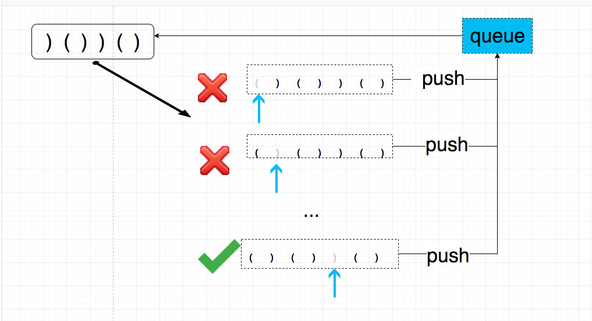

# 0301. 删除无效的括号

## 题目地址(301. 删除无效的括号)

<https://leetcode-cn.com/problems/remove-invalid-parentheses/>

## 题目描述

```
<pre class="calibre18">```
删除最小数量的无效括号，使得输入的字符串有效，返回所有可能的结果。

说明: 输入可能包含了除 ( 和 ) 以外的字符。

示例 1:

输入: "()())()"
输出: ["()()()", "(())()"]
示例 2:

输入: "(a)())()"
输出: ["(a)()()", "(a())()"]
示例 3:

输入: ")("
输出: [""]

```
```

## 前置知识

- BFS
- 队列

## 公司

- 阿里
- 腾讯
- 百度
- 字节

## 思路

我们的思路是先写一个函数用来判断给定字符串是否是有效的。 然后再写一个函数，这个函数 依次删除第i个字符，判断是否有效，有效则添加进最终的返回数组。

这样的话实现的功能就是， 删除`一个` 小括号使之有效的所有可能。因此只需要递归调用`依次删除第i个字符`的功能就可以了。

而且由于题目要求是要删除最少的小括号，因此我们的思路是使用广度优先遍历，而不是深度有限的遍历。



> 没有动图，请脑补

## 关键点解析

- 广度优先遍历
- 使用队列简化操作
- 使用一个visited的mapper， 来避免遍历同样的字符串

## 代码

```
<pre class="calibre18">```
<span class="hljs-title">/*
 * @lc app=leetcode id=301 lang=javascript
 *
 * [301] Remove Invalid Parentheses
 *
 * https://leetcode.com/problems/remove-invalid-parentheses/description/
 *
 * algorithms
 * Hard (38.52%)
 * Total Accepted:    114.3K
 * Total Submissions: 295.4K
 * Testcase Example:  '"()())()"'
 *
 * Remove the minimum number of invalid parentheses in order to make the input
 * string valid. Return all possible results.
 *
 * Note: The input string may contain letters other than the parentheses ( and
 * ).
 *
 * Example 1:
 *
 *
 * Input: "()())()"
 * Output: ["()()()", "(())()"]
 *
 *
 * Example 2:
 *
 *
 * Input: "(a)())()"
 * Output: ["(a)()()", "(a())()"]
 *
 *
 * Example 3:
 *
 *
 * Input: ")("
 * Output: [""]
 *
 */</span>
<span class="hljs-keyword">var</span> isValid = <span class="hljs-function"><span class="hljs-keyword">function</span>(<span class="hljs-params">s</span>) </span>{
  <span class="hljs-keyword">let</span> openParenthes = <span class="hljs-params">0</span>;
  <span class="hljs-keyword">for</span>(<span class="hljs-keyword">let</span> i = <span class="hljs-params">0</span>; i < s.length; i++) {
    <span class="hljs-keyword">if</span> (s[i] === <span class="hljs-string">'('</span>) {
      openParenthes++;
    } <span class="hljs-keyword">else</span> <span class="hljs-keyword">if</span> (s[i] === <span class="hljs-string">')'</span>) {
      <span class="hljs-keyword">if</span> (openParenthes === <span class="hljs-params">0</span>) <span class="hljs-keyword">return</span> <span class="hljs-params">false</span>;
      openParenthes--;
    }
  }
  <span class="hljs-keyword">return</span> openParenthes === <span class="hljs-params">0</span>;
};
<span class="hljs-title">/**
 * @param {string} s
 * @return {string[]}
 */</span>
<span class="hljs-keyword">var</span> removeInvalidParentheses = <span class="hljs-function"><span class="hljs-keyword">function</span>(<span class="hljs-params">s</span>) </span>{
  <span class="hljs-keyword">if</span> (!s || s.length === <span class="hljs-params">0</span>) <span class="hljs-keyword">return</span> [<span class="hljs-string">""</span>];
  <span class="hljs-keyword">const</span> ret = [];
  <span class="hljs-keyword">const</span> queue = [s];
  <span class="hljs-keyword">const</span> visited = {};
  <span class="hljs-keyword">let</span> current = <span class="hljs-params">null</span>;
  <span class="hljs-keyword">let</span> removedParentheses = <span class="hljs-params">0</span>; <span class="hljs-title">// 只记录最小改动</span>

  <span class="hljs-keyword">while</span> ((current = queue.shift())) {
    <span class="hljs-keyword">let</span> hit = isValid(current);
    <span class="hljs-keyword">if</span> (hit) {
      <span class="hljs-keyword">if</span> (!removedParentheses) {
       removedParentheses =  s.length - current.length
      }
      <span class="hljs-keyword">if</span> (s.length - current.length > removedParentheses) <span class="hljs-keyword">return</span> ret.length === <span class="hljs-params">0</span> ? [<span class="hljs-string">""</span>] : ret;;
      ret.unshift(current);
      <span class="hljs-keyword">continue</span>;
    }
    <span class="hljs-keyword">for</span> (<span class="hljs-keyword">let</span> i = <span class="hljs-params">0</span>; i < current.length; i++) {
      <span class="hljs-keyword">if</span> (current[i] !== <span class="hljs-string">')'</span> && current[i] !== <span class="hljs-string">'('</span>) <span class="hljs-keyword">continue</span>;
      <span class="hljs-keyword">const</span> subString = current.slice(<span class="hljs-params">0</span>, i).concat(current.slice(i + <span class="hljs-params">1</span>));
      <span class="hljs-keyword">if</span> (visited[subString]) <span class="hljs-keyword">continue</span>;
      visited[subString] = <span class="hljs-params">true</span>;
      queue.push(subString);
    }
  }

  <span class="hljs-keyword">return</span> ret.length === <span class="hljs-params">0</span> ? [<span class="hljs-string">""</span>] : ret;
};

```
```

## 扩展

相似问题:

[validParentheses](validParentheses.md)