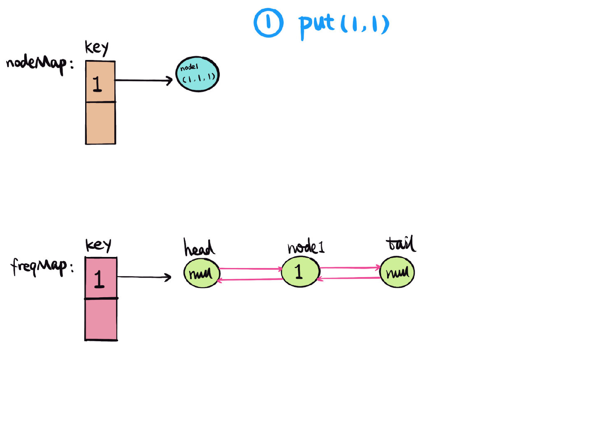
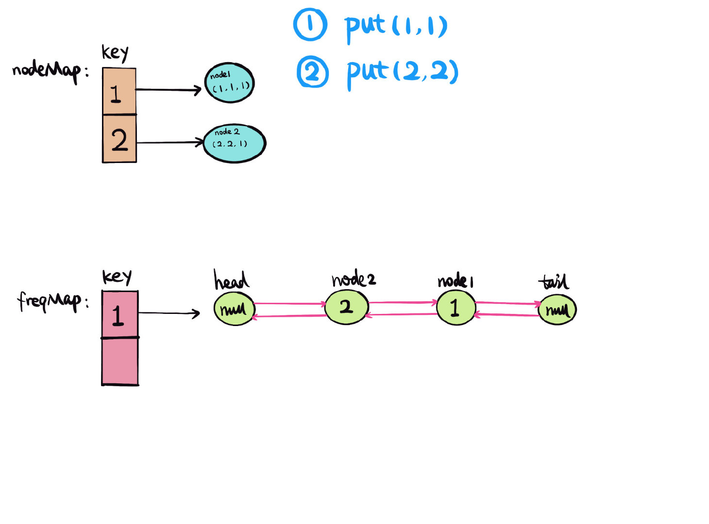
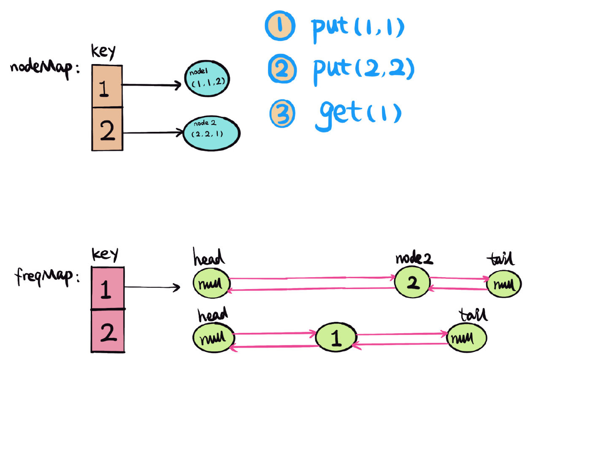
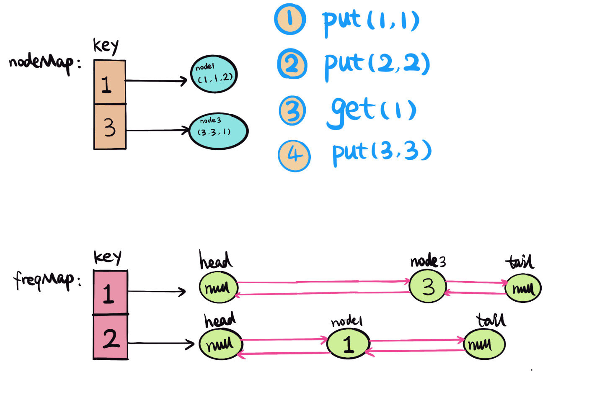
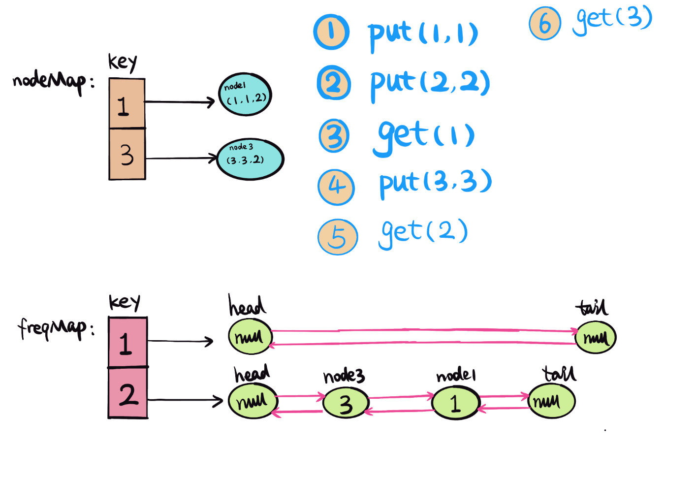
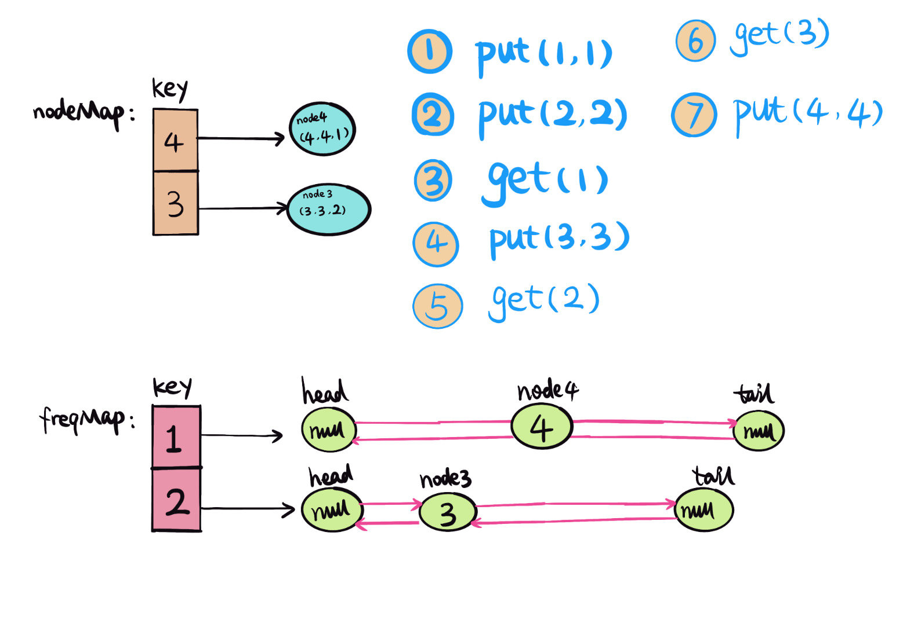
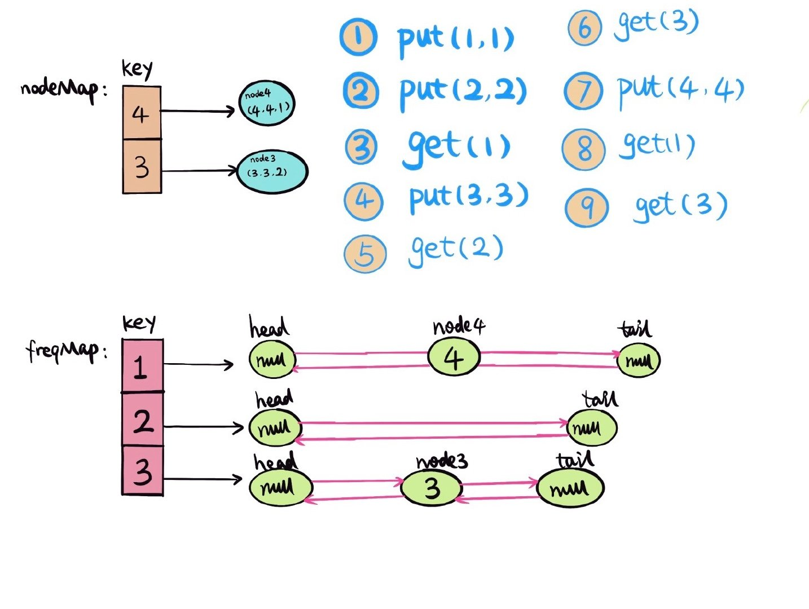
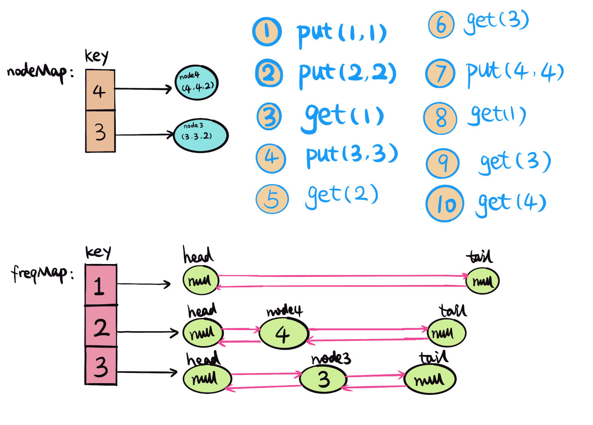

# 0460. LFU缓存

## 题目地址(460. LFU缓存)

<https://leetcode-cn.com/problems/lfu-cache/>

## 题目描述

```
<pre class="calibre18">```
请你为 最不经常使用（LFU）缓存算法设计并实现数据结构。它应该支持以下操作：get 和 put。

get(key) - 如果键存在于缓存中，则获取键的值（总是正数），否则返回 -1。
put(key, value) - 如果键已存在，则变更其值；如果键不存在，请插入键值对。当缓存达到其容量时，则应该在插入新项之前，使最不经常使用的项无效。在此问题中，当存在平局（即两个或更多个键具有相同使用频率）时，应该去除最久未使用的键。
「项的使用次数」就是自插入该项以来对其调用 get 和 put 函数的次数之和。使用次数会在对应项被移除后置为 0 。


进阶：
你是否可以在 O(1) 时间复杂度内执行两项操作？


示例：

LFUCache cache = new LFUCache( 2 /* capacity (缓存容量) */ );

cache.put(1, 1);
cache.put(2, 2);
cache.get(1);       // 返回 1
cache.put(3, 3);    // 去除 key 2
cache.get(2);       // 返回 -1 (未找到key 2)
cache.get(3);       // 返回 3
cache.put(4, 4);    // 去除 key 1
cache.get(1);       // 返回 -1 (未找到 key 1)
cache.get(3);       // 返回 3
cache.get(4);       // 返回 4

```
```

## 前置知识

- 链表
- HashMap

## 公司

- 阿里
- 腾讯
- 百度
- 字节

## 思路

`本题已被收录到我的新书中，敬请期待～`

[LFU（Least frequently used)](https://www.wikiwand.com/en/Least_frequently_used) 但内存容量满的情况下，有新的数据进来，需要更多空间的时候，就需要删除被访问频率最少的元素。

举个例子，比如说 cache 容量是 3，按顺序依次放入 `1，2，1，2，1，3`， cache 已存满 3 个元素 (1，2，3)， 这时如果想放入一个新的元素 4 的时候，就需要腾出一个元素空间。 用 LFU，这里就淘汰 3， 因为 3 的次数只出现依次， 1 和 2 出现的次数都比 3 多。

题中 `get` 和 `put` 都是 `O(1)`的时间复杂度，那么删除和增加都是`O(1)`，可以想到用双链表，和`HashMap`，用一个`HashMap, nodeMap,` 保存当前`key`，和 `node{key, value, frequent}`的映射。 这样`get(key)`的操作就是`O(1)`. 如果要删除一个元素，那么就需要另一个`HashMap，freqMap，`保存元素出现次数`（frequent）`和双链表`（DoublyLinkedlist）` 映射， 这里双链表存的是 frequent 相同的元素。每次`get`或`put`的时候，`frequent+1`，然后把`node`插入到双链表的`head node, head.next=node`每次删除`freqent`最小的双链表的`tail node, tail.prev`。

用给的例子举例说明：

```
<pre class="calibre18">```
 1. put(1, 1), 
    - 首先查找 nodeMap 中有没有 key=1 对应的 value，
        没有就新建 node(key, value, freq) -> node1(1, 1, 1), 插入 nodeMap，{[1, node1]}
    - 查找 freqMap 中有没有 freq=1 对应的 value，
        没有就新建 doublylinkedlist(head, tail), 把 node1 插入 doublylinkedlist head->next = node1.
    如下图，

```
```



```
<pre class="calibre18">```
 2. put(2, 2), 
    - 首先查找 nodeMap 中有没有 key=2 对应的 value，
        没有就新建 node(key, value, freq) -> node2(2, 2, 1), 插入 nodeMap，{[1, node1], [2, node2]}
    - 查找 freqMap 中有没有 freq=1 对应的 value，
        没有就新建 doublylinkedlist(head, tail), 把 node2 插入 doublylinkedlist head->next = node2.
    如下图，

```
```



```
<pre class="calibre18">```
 3. get(1), 
    - 首先查找 nodeMap 中有没有 key=1 对应的 value，nodeMap:{[1, node1], [2, node2]},
        找到 node1，把 node1 freq+1 -> node1(1,1,2)
    - 更新 freqMap，删除 freq=1，node1
    - 更新 freqMap，插入 freq=2，node1
    如下图，

```
```



```
<pre class="calibre18">```
 4. put(3, 3), 
    - 判断 cache 的 capacity，已满，需要淘汰使用次数最少的元素，找到最小的 freq=1，删除双链表 tail node.prev 
        如果 tailnode.prev != null, 删除。然后从 nodeMap 中删除对应的 key。
    - 首先查找 nodeMap 中有没有 key=3 对应的 value，
        没有就新建 node(key, value, freq) -> node3(3, 3, 1), 插入 nodeMap，{[1, node1], [3, node3]}
    - 查找 freqMap 中有没有 freq=1 对应的 value，
        没有就新建 doublylinkedlist(head, tail), 把 node3 插入 doublylinkedlist head->next = node3.
    如下图，

```
```



```
<pre class="calibre18">```
 5. get(2) 
    - 查找 nodeMap，如果没有对应的 key 的 value，返回 -1。

 6. get(3)
    - 首先查找 nodeMap 中有没有 key=3 对应的 value，nodeMap:{[1, node1], [3, node3]},
        找到 node3，把 node3 freq+1 -> node3(3,3,2)
    - 更新 freqMap，删除 freq=1，node3
    - 更新 freqMap，插入 freq=2，node3
    如下图，

```
```



```
<pre class="calibre18">```
 7. put(4, 4), 
    - 判断 cache 的 capacity，已满，需要淘汰使用次数最少的元素，找到最小的 freq=1，删除双链表 tail node.prev 
        如果 tailnode.prev != null, 删除。然后从 nodeMap 中删除对应的 key。
    - 首先查找 nodeMap 中有没有 key=4 对应的 value，
        没有就新建 node(key, value, freq) -> node4(4, 4, 1), 插入 nodeMap，{[4, node4], [3, node3]}
    - 查找 freqMap 中有没有 freq=1 对应的 value，
        没有就新建 doublylinkedlist(head, tail), 把 node4 插入 doublylinkedlist head->next = node4.
    如下图，

```
```



```
<pre class="calibre18">```
 8. get(1) 
    - 查找 nodeMap，如果没有对应的 key 的 value，返回 -1。

 9. get(3)
    - 首先查找 nodeMap 中有没有 key=3 对应的 value，nodeMap:{[4, node4], [3, node3]},
        找到 node3，把 node3 freq+1 -> node3(3,3,3)
    - 更新 freqMap，删除 freq=2，node3
    - 更新 freqMap，插入 freq=3，node3
    如下图，

```
```



```
<pre class="calibre18">```
 10. get(4)
    - 首先查找 nodeMap 中有没有 key=4 对应的 value，nodeMap:{[4, node4], [3, node3]},
        找到 node4，把 node4 freq+1 -> node4(4,4,2)
    - 更新 freqMap，删除 freq=1，node4
    - 更新 freqMap，插入 freq=2，node4
    如下图，

```
```



## 关键点分析

用两个`Map`分别保存 `nodeMap {key, node}` 和 `freqMap{frequent, DoublyLinkedList}`。 实现`get` 和 `put`操作都是`O(1)`的时间复杂度。

可以用 Java 自带的一些数据结构，比如 HashLinkedHashSet，这样就不需要自己自建 Node，DoublelyLinkedList。 可以很大程度的缩减代码量。

## 代码（Java code）

```
<pre class="calibre18">```
<span class="hljs-keyword">public</span> <span class="hljs-class"><span class="hljs-keyword">class</span> <span class="hljs-title">LC460LFUCache</span> </span>{
  <span class="hljs-class"><span class="hljs-keyword">class</span> <span class="hljs-title">Node</span> </span>{
    <span class="hljs-keyword">int</span> key, val, freq;
    Node prev, next;

    Node(<span class="hljs-keyword">int</span> key, <span class="hljs-keyword">int</span> val) {
      <span class="hljs-keyword">this</span>.key = key;
      <span class="hljs-keyword">this</span>.val = val;
      freq = <span class="hljs-params">1</span>;
    }
  }

  <span class="hljs-class"><span class="hljs-keyword">class</span> <span class="hljs-title">DoubleLinkedList</span> </span>{
    <span class="hljs-keyword">private</span> Node head;
    <span class="hljs-keyword">private</span> Node tail;
    <span class="hljs-keyword">private</span> <span class="hljs-keyword">int</span> size;

    DoubleLinkedList() {
      head = <span class="hljs-keyword">new</span> Node(<span class="hljs-params">0</span>, <span class="hljs-params">0</span>);
      tail = <span class="hljs-keyword">new</span> Node(<span class="hljs-params">0</span>, <span class="hljs-params">0</span>);
      head.next = tail;
      tail.prev = head;
    }

    <span class="hljs-function"><span class="hljs-keyword">void</span> <span class="hljs-title">add</span><span class="hljs-params">(Node node)</span> </span>{
      head.next.prev = node;
      node.next = head.next;
      node.prev = head;
      head.next = node;
      size++;
    }

    <span class="hljs-function"><span class="hljs-keyword">void</span> <span class="hljs-title">remove</span><span class="hljs-params">(Node node)</span> </span>{
      node.prev.next = node.next;
      node.next.prev = node.prev;
      size--;
    }

    <span class="hljs-title">// always remove last node if last node exists</span>
    <span class="hljs-function">Node <span class="hljs-title">removeLast</span><span class="hljs-params">()</span> </span>{
      <span class="hljs-keyword">if</span> (size > <span class="hljs-params">0</span>) {
        Node node = tail.prev;
        remove(node);
        <span class="hljs-keyword">return</span> node;
      } <span class="hljs-keyword">else</span> <span class="hljs-keyword">return</span> <span class="hljs-keyword">null</span>;
    }
  }

  <span class="hljs-title">// cache capacity</span>
  <span class="hljs-keyword">private</span> <span class="hljs-keyword">int</span> capacity;
  <span class="hljs-title">// min frequent</span>
  <span class="hljs-keyword">private</span> <span class="hljs-keyword">int</span> minFreq;
  Map<Integer, Node> nodeMap;
  Map<Integer, DoubleLinkedList> freqMap;
  <span class="hljs-function"><span class="hljs-keyword">public</span> <span class="hljs-title">LC460LFUCache</span><span class="hljs-params">(<span class="hljs-keyword">int</span> capacity)</span> </span>{
    <span class="hljs-keyword">this</span>.minFreq = <span class="hljs-params">0</span>;
    <span class="hljs-keyword">this</span>.capacity = capacity;
    nodeMap = <span class="hljs-keyword">new</span> HashMap<>();
    freqMap = <span class="hljs-keyword">new</span> HashMap<>();
  }

  <span class="hljs-function"><span class="hljs-keyword">public</span> <span class="hljs-keyword">int</span> <span class="hljs-title">get</span><span class="hljs-params">(<span class="hljs-keyword">int</span> key)</span> </span>{
    Node node = nodeMap.get(key);
    <span class="hljs-keyword">if</span> (node == <span class="hljs-keyword">null</span>) <span class="hljs-keyword">return</span> -<span class="hljs-params">1</span>;
    update(node);
    <span class="hljs-keyword">return</span> node.val;
  }

  <span class="hljs-function"><span class="hljs-keyword">public</span> <span class="hljs-keyword">void</span> <span class="hljs-title">put</span><span class="hljs-params">(<span class="hljs-keyword">int</span> key, <span class="hljs-keyword">int</span> value)</span> </span>{
    <span class="hljs-keyword">if</span> (capacity == <span class="hljs-params">0</span>) <span class="hljs-keyword">return</span>;
    Node node;
    <span class="hljs-keyword">if</span> (nodeMap.containsKey(key)) {
      node = nodeMap.get(key);
      node.val = value;
      update(node);
    } <span class="hljs-keyword">else</span> {
      node = <span class="hljs-keyword">new</span> Node(key, value);
      nodeMap.put(key, node);
      <span class="hljs-keyword">if</span> (nodeMap.size() == capacity) {
        DoubleLinkedList lastList = freqMap.get(minFreq);
        nodeMap.remove(lastList.removeLast().key);
      }
      minFreq = <span class="hljs-params">1</span>;
      DoubleLinkedList newList = freqMap.getOrDefault(node.freq, <span class="hljs-keyword">new</span> DoubleLinkedList());
      newList.add(node);
      freqMap.put(node.freq, newList);
    }
  }

  <span class="hljs-function"><span class="hljs-keyword">private</span> <span class="hljs-keyword">void</span> <span class="hljs-title">update</span><span class="hljs-params">(Node node)</span> </span>{
    DoubleLinkedList oldList = freqMap.get(node.freq);
    oldList.remove(node);
    <span class="hljs-keyword">if</span> (node.freq == minFreq && oldList.size == <span class="hljs-params">0</span>) minFreq++;
    node.freq++;
    DoubleLinkedList newList = freqMap.getOrDefault(node.freq, <span class="hljs-keyword">new</span> DoubleLinkedList());
    newList.add(node);
    freqMap.put(node.freq, newList);
  }
 }

```
```

## 参考（References）

1. [LFU(Least frequently used) Cache](https://www.wikiwand.com/en/Least_frequently_used)
2. [Leetcode discussion mylzsd](https://leetcode.com/problems/lfu-cache/discuss/94547/Java-O(1)-Solution-Using-Two-HashMap-and-One-DoubleLinkedList)
3. [Leetcode discussion aaaeeeo](https://leetcode.com/problems/lfu-cache/discuss/94547/Java-O(1)-Solution-Using-Two-HashMap-and-One-DoubleLinkedList)