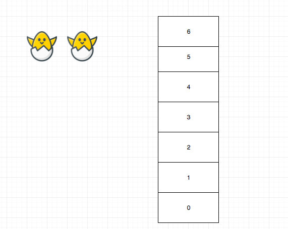
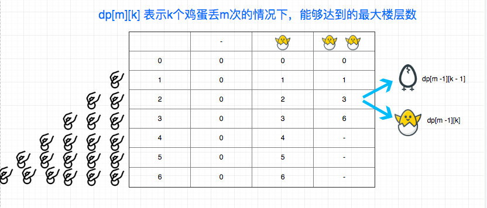

# 0887. 鸡蛋掉落

## 题目地址()887. 鸡蛋掉落

<https://leetcode-cn.com/problems/super-egg-drop/>

## 题目描述

```
<pre class="calibre18">```
你将获得 K 个鸡蛋，并可以使用一栋从 1 到 N  共有 N 层楼的建筑。

每个蛋的功能都是一样的，如果一个蛋碎了，你就不能再把它掉下去。

你知道存在楼层 F ，满足 0 <= F <= N 任何从高于 F 的楼层落下的鸡蛋都会碎，从 F 楼层或比它低的楼层落下的鸡蛋都不会破。

每次移动，你可以取一个鸡蛋（如果你有完整的鸡蛋）并把它从任一楼层 X 扔下（满足 1 <= X <= N）。

你的目标是确切地知道 F 的值是多少。

无论 F 的初始值如何，你确定 F 的值的最小移动次数是多少？


示例 1：

输入：K = 1, N = 2
输出：2
解释：
鸡蛋从 1 楼掉落。如果它碎了，我们肯定知道 F = 0 。
否则，鸡蛋从 2 楼掉落。如果它碎了，我们肯定知道 F = 1 。
如果它没碎，那么我们肯定知道 F = 2 。
因此，在最坏的情况下我们需要移动 2 次以确定 F 是多少。
示例 2：

输入：K = 2, N = 6
输出：3
示例 3：

输入：K = 3, N = 14
输出：4


提示：

1 <= K <= 100
1 <= N <= 10000

```
```

## 前置知识

- 动态规划

## 思路

> 本题已经重制，重制版更清晰 [《丢鸡蛋问题》重制版来袭～](https://lucifer.ren/blog/2020/06/08/887.super-egg-drop/)

这是一道典型的动态规划题目，但是又和一般的动态规划不一样。

拿题目给的例子为例，两个鸡蛋，六层楼，我们最少扔几次？



一个符合直觉的做法是，建立 dp\[i\]\[j\], 代表 i 个鸡蛋，j 层楼最少扔几次，然后我们取 dp\[K\]\[n\]即可。

代码大概这样的：

```
<pre class="calibre18">```
<span class="hljs-keyword">const</span> dp = <span class="hljs-params">Array</span>(K + <span class="hljs-params">1</span>);
dp[<span class="hljs-params">0</span>] = <span class="hljs-params">Array</span>(N + <span class="hljs-params">1</span>).fill(<span class="hljs-params">0</span>);
<span class="hljs-keyword">for</span> (<span class="hljs-keyword">let</span> i = <span class="hljs-params">1</span>; i < K + <span class="hljs-params">1</span>; i++) {
  dp[i] = [<span class="hljs-params">0</span>];
  <span class="hljs-keyword">for</span> (<span class="hljs-keyword">let</span> j = <span class="hljs-params">1</span>; j < N + <span class="hljs-params">1</span>; j++) {
    <span class="hljs-title">// 只有一个鸡蛋</span>
    <span class="hljs-keyword">if</span> (i === <span class="hljs-params">1</span>) {
      dp[i][j] = j;
      <span class="hljs-keyword">continue</span>;
    }
    <span class="hljs-title">// 只有一层楼</span>
    <span class="hljs-keyword">if</span> (j === <span class="hljs-params">1</span>) {
      dp[i][j] = <span class="hljs-params">1</span>;
      <span class="hljs-keyword">continue</span>;
    }

    <span class="hljs-title">// 每一层我们都模拟一遍</span>
    <span class="hljs-keyword">const</span> all = [];
    <span class="hljs-keyword">for</span> (<span class="hljs-keyword">let</span> k = <span class="hljs-params">1</span>; k < j + <span class="hljs-params">1</span>; k++) {
      <span class="hljs-keyword">const</span> brokenCount = dp[i - <span class="hljs-params">1</span>][k - <span class="hljs-params">1</span>]; <span class="hljs-title">// 如果碎了</span>
      <span class="hljs-keyword">const</span> notBrokenCount = dp[i][j - k]; <span class="hljs-title">// 如果没碎</span>
      all.push(<span class="hljs-params">Math</span>.max(brokenCount, notBrokenCount)); <span class="hljs-title">// 最坏的可能</span>
    }
    dp[i][j] = <span class="hljs-params">Math</span>.min(...all) + <span class="hljs-params">1</span>; <span class="hljs-title">// 最坏的集合中我们取最好的情况</span>
  }
}

<span class="hljs-keyword">return</span> dp[K][N];

```
```

果不其然，当我提交的时候，超时了。 这个的时复杂度是很高的，可以看到，我们内层暴力的求解所有可能，然后 取最好的，这个过程非常耗时，大概是 O(N^2 \* K).

然后我看了一位 leetcode[网友](https://leetcode.com/lee215/)的回答, 他的想法是`dp[M][K]means that, given K eggs and M moves，what is the maximum number of floor that we can check.`

我们按照他的思路重新建模：



可以看到右下角的部分根本就不需要计算，从而节省很多时间

## 关键点解析

- dp 建模思路要发生变化, 即 `dp[M][K]means that, given K eggs and M moves，what is the maximum number of floor that we can check.`

## 代码

```
<pre class="calibre18">```
<span class="hljs-title">/**
 * @param {number} K
 * @param {number} N
 * @return {number}
 */</span>
<span class="hljs-keyword">var</span> superEggDrop = <span class="hljs-function"><span class="hljs-keyword">function</span> (<span class="hljs-params">K, N</span>) </span>{
  <span class="hljs-title">// 不选择dp[K][M]的原因是dp[M][K]可以简化操作</span>
  <span class="hljs-keyword">const</span> dp = <span class="hljs-params">Array</span>(N + <span class="hljs-params">1</span>)
    .fill(<span class="hljs-params">0</span>)
    .map((_) => <span class="hljs-params">Array</span>(K + <span class="hljs-params">1</span>).fill(<span class="hljs-params">0</span>));

  <span class="hljs-keyword">let</span> m = <span class="hljs-params">0</span>;
  <span class="hljs-keyword">while</span> (dp[m][K] < N) {
    m++;
    <span class="hljs-keyword">for</span> (<span class="hljs-keyword">let</span> k = <span class="hljs-params">1</span>; k <= K; ++k) dp[m][k] = dp[m - <span class="hljs-params">1</span>][k - <span class="hljs-params">1</span>] + <span class="hljs-params">1</span> + dp[m - <span class="hljs-params">1</span>][k];
  }
  <span class="hljs-keyword">return</span> m;
};

```
```