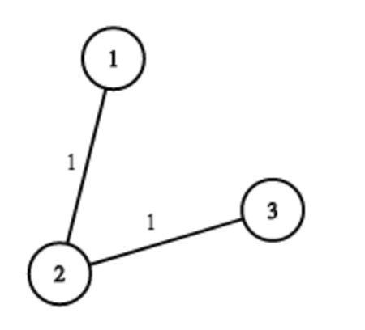
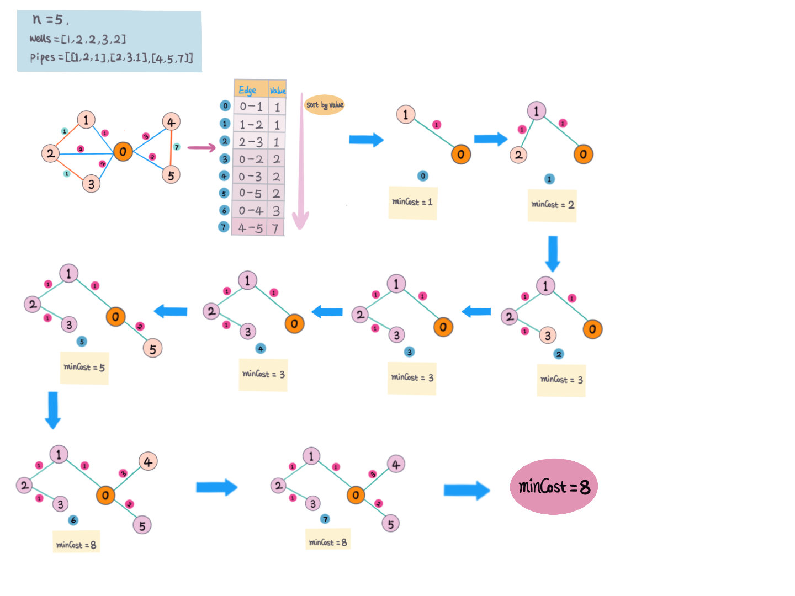

# 1168. 水资源分配优化

## 题目地址(1168. 水资源分配优化)

<https://leetcode.com/problems/optimize-water-distribution-in-a-village/>

## 题目描述

```
<pre class="calibre18">```
村庄内有n户人家，我们可以通过挖井或者建造水管向每家供水。

对于每户人家i，我们可以通过花费 wells[i] 直接在其房内挖水井，或者通过水管连接到其他的水井。每两户住户间铺设水管的费用通过 pipes 数组表示。 pipes[i] = [house1, house2, cost] 表示住户1到住户2间铺设水管的费用为cost。

请求出所有住户都能通水的最小花费。

示例1：


输入: n = 3, wells = [1,2,2], pipes = [[1,2,1],[2,3,1]]
输出: 3
解释: 
The image shows the costs of connecting houses using pipes.
The best strategy is to build a well in the first house with cost 1 and connect the other houses to it with cost 2 so the total cost is 3.
提示：

1 <= n <= 10000
wells.length == n
0 <= wells[i] <= 10^5
1 <= pipes.length <= 10000
1 <= pipes[i][0], pipes[i][1] <= n
0 <= pipes[i][2] <= 10^5
pipes[i][0] != pipes[i][1]

```
```

## 前置知识

- 图
- 最小生成树

## 公司

- 暂无

## 思路



题意，在每个城市打井需要一定的花费，也可以用其他城市的井水，城市之间建立连接管道需要一定的花费，怎么样安排可以花费最少的前灌溉所有城市。

这是一道连通所有点的最短路径/最小生成树问题，把城市看成图中的点，管道连接城市看成是连接两个点之间的边。这里打井的花费是直接在点上，而且并不是所有 点之间都有边连接，为了方便，我们可以假想一个点`（root）0`，这里自身点的花费可以与 `0` 连接，花费可以是 `0-i` 之间的花费。这样我们就可以构建一个连通图包含所有的点和边。 那在一个连通图中求最短路径/最小生成树的问题.

参考延伸阅读中，维基百科针对这类题给出的几种解法。

解题步骤：

1. 创建 `POJO EdgeCost(node1, node2, cost) - 节点1 和 节点2 连接边的花费`。
2. 假想一个`root` 点 `0`，构建图
3. 连通所有节点和 `0`，`[0,i] - i 是节点 [1,n]`，`0-1` 是节点 `0` 和 `1` 的边，边的值是节点 `i` 上打井的花费 `wells[i]`;
4. 把打井花费和城市连接点转换成图的节点和边。
5. 对图的边的值排序（从小到大）
6. 遍历图的边，判断两个节点有没有连通 （`Union-Find`），
  - 已连通就跳过，继续访问下一条边
  - 没有连通，记录花费，连通节点
7. 若所有节点已连通，求得的最小路径即为最小花费，返回
8. 对于每次`union`, 节点数 `n-1`, 如果 `n==0` 说明所有节点都已连通，可以提前退出，不需要继续访问剩余的边。

> 这里用加权Union-Find 判断两个节点是否连通，和连通未连通的节点。

举例：`n = 5, wells=[1,2,2,3,2], pipes=[[1,2,1],[2,3,1],[4,5,7]]`

如图：



从图中可以看到，最后所有的节点都是连通的。

**复杂度分析**

- 时间复杂度: `O(ElogE) - E 是图的边的个数`
- 空间复杂度: `O(E)`

> 一个图最多有 `n(n-1)/2 - n 是图中节点个数` 条边 （完全连通图）

## 关键点分析

1. 构建图，得出所有边
2. 对所有边排序
3. 遍历所有的边（从小到大）
4. 对于每条边，检查是否已经连通，若没有连通，加上边上的值，连通两个节点。若已连通，跳过。

## 代码 (`Java/Python3`)

*Java code*

```
<pre class="calibre18">```
  <span class="hljs-class"><span class="hljs-keyword">class</span> <span class="hljs-title">OptimizeWaterDistribution</span> </span>{
    <span class="hljs-function"><span class="hljs-keyword">public</span> <span class="hljs-keyword">int</span> <span class="hljs-title">minCostToSupplyWater</span><span class="hljs-params">(<span class="hljs-keyword">int</span> n, <span class="hljs-keyword">int</span>[] wells, <span class="hljs-keyword">int</span>[][] pipes)</span> </span>{
      List<EdgeCost> costs = <span class="hljs-keyword">new</span> ArrayList<>();
      <span class="hljs-keyword">for</span> (<span class="hljs-keyword">int</span> i = <span class="hljs-params">1</span>; i <= n; i++) {
        costs.add(<span class="hljs-keyword">new</span> EdgeCost(<span class="hljs-params">0</span>, i, wells[i - <span class="hljs-params">1</span>]));
      }
      <span class="hljs-keyword">for</span> (<span class="hljs-keyword">int</span>[] p : pipes) {
        costs.add(<span class="hljs-keyword">new</span> EdgeCost(p[<span class="hljs-params">0</span>], p[<span class="hljs-params">1</span>], p[<span class="hljs-params">2</span>]));
      }
      Collections.sort(costs);
      <span class="hljs-keyword">int</span> minCosts = <span class="hljs-params">0</span>;
      UnionFind uf = <span class="hljs-keyword">new</span> UnionFind(n);
      <span class="hljs-keyword">for</span> (EdgeCost edge : costs) {
        <span class="hljs-keyword">int</span> rootX = uf.find(edge.node1);
        <span class="hljs-keyword">int</span> rootY = uf.find(edge.node2);
        <span class="hljs-keyword">if</span> (rootX == rootY) <span class="hljs-keyword">continue</span>;
        minCosts += edge.cost;
        uf.union(edge.node1, edge.node2);
        <span class="hljs-title">// for each union, we connnect one node</span>
        n--;
        <span class="hljs-title">// if all nodes already connected, terminate early</span>
        <span class="hljs-keyword">if</span> (n == <span class="hljs-params">0</span>) {
          <span class="hljs-keyword">return</span> minCosts;
        }
      }
      <span class="hljs-keyword">return</span> minCosts;
    }

    <span class="hljs-class"><span class="hljs-keyword">class</span> <span class="hljs-title">EdgeCost</span> <span class="hljs-keyword">implements</span> <span class="hljs-title">Comparable</span><<span class="hljs-title">EdgeCost</span>> </span>{
      <span class="hljs-keyword">int</span> node1;
      <span class="hljs-keyword">int</span> node2;
      <span class="hljs-keyword">int</span> cost;
      <span class="hljs-function"><span class="hljs-keyword">public</span> <span class="hljs-title">EdgeCost</span><span class="hljs-params">(<span class="hljs-keyword">int</span> node1, <span class="hljs-keyword">int</span> node2, <span class="hljs-keyword">int</span> cost)</span> </span>{
        <span class="hljs-keyword">this</span>.node1 = node1;
        <span class="hljs-keyword">this</span>.node2 = node2;
        <span class="hljs-keyword">this</span>.cost = cost;
      }

      <span class="hljs-params">@Override</span>
      <span class="hljs-function"><span class="hljs-keyword">public</span> <span class="hljs-keyword">int</span> <span class="hljs-title">compareTo</span><span class="hljs-params">(EdgeCost o)</span> </span>{
        <span class="hljs-keyword">return</span> <span class="hljs-keyword">this</span>.cost - o.cost;
      }
    }

    <span class="hljs-class"><span class="hljs-keyword">class</span> <span class="hljs-title">UnionFind</span> </span>{
      <span class="hljs-keyword">int</span>[] parent;
      <span class="hljs-keyword">int</span>[] rank;
      <span class="hljs-function"><span class="hljs-keyword">public</span> <span class="hljs-title">UnionFind</span><span class="hljs-params">(<span class="hljs-keyword">int</span> n)</span> </span>{
        parent = <span class="hljs-keyword">new</span> <span class="hljs-keyword">int</span>[n + <span class="hljs-params">1</span>];
        <span class="hljs-keyword">for</span> (<span class="hljs-keyword">int</span> i = <span class="hljs-params">0</span>; i <= n; i++) {
          parent[i] = i;
        }
        rank = <span class="hljs-keyword">new</span> <span class="hljs-keyword">int</span>[n + <span class="hljs-params">1</span>];
      }
      <span class="hljs-function"><span class="hljs-keyword">public</span> <span class="hljs-keyword">int</span> <span class="hljs-title">find</span><span class="hljs-params">(<span class="hljs-keyword">int</span> x)</span> </span>{
        <span class="hljs-keyword">return</span> x == parent[x] ? x : find(parent[x]);
      }
      <span class="hljs-function"><span class="hljs-keyword">public</span> <span class="hljs-keyword">void</span> <span class="hljs-title">union</span><span class="hljs-params">(<span class="hljs-keyword">int</span> x, <span class="hljs-keyword">int</span> y)</span> </span>{
        <span class="hljs-keyword">int</span> px = find(x);
        <span class="hljs-keyword">int</span> py = find(y);
        <span class="hljs-keyword">if</span> (px == py) <span class="hljs-keyword">return</span>;
        <span class="hljs-keyword">if</span> (rank[px] >= rank[py]) {
          parent[py] = px;
          rank[px] += rank[py];
        } <span class="hljs-keyword">else</span> {
          parent[px] = py;
          rank[py] += rank[px];
        }
      }
    }
  }

```
```

*Pythong3 code*

```
<pre class="calibre18">```
<span class="hljs-class"><span class="hljs-keyword">class</span> <span class="hljs-title">Solution</span>:</span>
    <span class="hljs-function"><span class="hljs-keyword">def</span> <span class="hljs-title">minCostToSupplyWater</span><span class="hljs-params">(self, n: int, wells: List[int], pipes: List[List[int]])</span> -> int:</span>
        union_find = {i: i <span class="hljs-keyword">for</span> i <span class="hljs-keyword">in</span> range(n + <span class="hljs-params">1</span>)}

        <span class="hljs-function"><span class="hljs-keyword">def</span> <span class="hljs-title">find</span><span class="hljs-params">(x)</span>:</span>
            <span class="hljs-keyword">return</span> x <span class="hljs-keyword">if</span> x == union_find[x] <span class="hljs-keyword">else</span> find(union_find[x])

        <span class="hljs-function"><span class="hljs-keyword">def</span> <span class="hljs-title">union</span><span class="hljs-params">(x, y)</span>:</span>
            px = find(x)
            py = find(y)
            union_find[px] = py

        graph_wells = [[cost, <span class="hljs-params">0</span>, i] <span class="hljs-keyword">for</span> i, cost <span class="hljs-keyword">in</span> enumerate(wells, <span class="hljs-params">1</span>)]
        graph_pipes = [[cost, i, j] <span class="hljs-keyword">for</span> i, j, cost <span class="hljs-keyword">in</span> pipes]
        min_costs = <span class="hljs-params">0</span>
        <span class="hljs-keyword">for</span> cost, x, y <span class="hljs-keyword">in</span> sorted(graph_wells + graph_pipes):
            <span class="hljs-keyword">if</span> find(x) == find(y):
                <span class="hljs-keyword">continue</span>
            union(x, y)
            min_costs += cost
            n -= <span class="hljs-params">1</span>
            <span class="hljs-keyword">if</span> n == <span class="hljs-params">0</span>:
                <span class="hljs-keyword">return</span> min_costs

```
```

## 延伸阅读

1. [最短路径问题](https://www.wikiwand.com/zh-hans/%E6%9C%80%E7%9F%AD%E8%B7%AF%E9%97%AE%E9%A2%98)
2. [Dijkstra算法](https://www.wikiwand.com/zh-hans/%E6%88%B4%E5%85%8B%E6%96%AF%E7%89%B9%E6%8B%89%E7%AE%97%E6%B3%95)
3. [Floyd-Warshall算法](https://www.wikiwand.com/zh-hans/Floyd-Warshall%E7%AE%97%E6%B3%95)
4. [Bellman-Ford算法](https://www.wikiwand.com/zh-hans/%E8%B4%9D%E5%B0%94%E6%9B%BC-%E7%A6%8F%E7%89%B9%E7%AE%97%E6%B3%95)
5. [Kruskal算法](https://www.wikiwand.com/zh-hans/%E5%85%8B%E9%B2%81%E6%96%AF%E5%85%8B%E5%B0%94%E6%BC%94%E7%AE%97%E6%B3%95)
6. [Prim's 算法](https://www.wikiwand.com/zh-hans/%E6%99%AE%E6%9E%97%E5%A7%86%E7%AE%97%E6%B3%95)
7. [最小生成树](https://www.wikiwand.com/zh/%E6%9C%80%E5%B0%8F%E7%94%9F%E6%88%90%E6%A0%91)