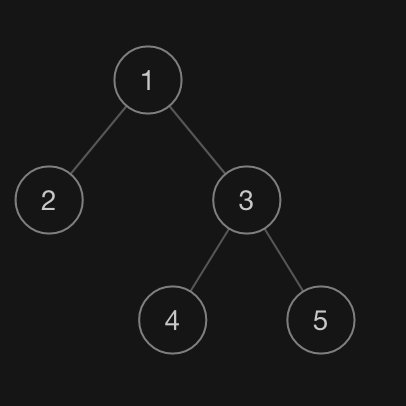
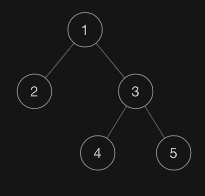
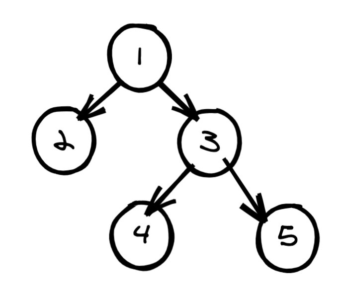
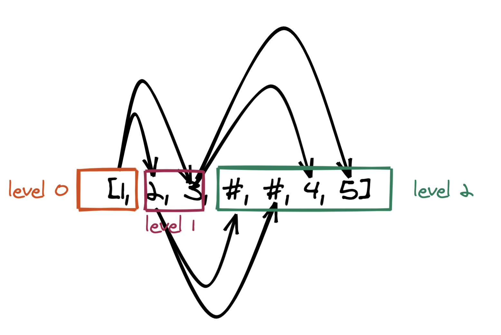
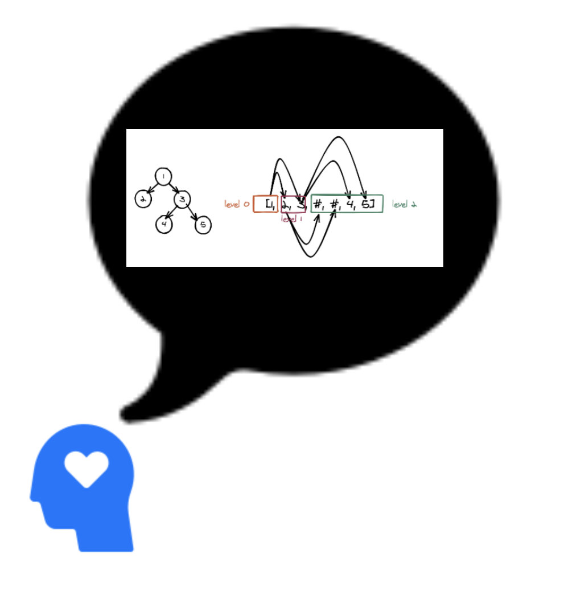

# 一文带你看懂二叉树的序列化

# 文带你看懂二叉树的序列化

我们先来看下什么是序列化，以下定义来自维基百科：

> 序列化（serialization）在计算机科学的数据处理中，是指将数据结构或对象状态转换成可取用格式（例如存成文件，存于缓冲，或经由网络中发送），以留待后续在相同或另一台计算机环境中，能恢复原先状态的过程。依照序列化格式重新获取字节的结果时，可以利用它来产生与原始对象相同语义的副本。对于许多对象，像是使用大量引用的复杂对象，这种序列化重建的过程并不容易。面向对象中的对象序列化，并不概括之前原始对象所关系的函数。这种过程也称为对象编组（marshalling）。从一系列字节提取数据结构的反向操作，是反序列化（也称为解编组、deserialization、unmarshalling）。

可见，序列化和反序列化在计算机科学中的应用还是非常广泛的。就拿 LeetCode 平台来说，其允许用户输入形如：

```
<pre class="calibre18">```
[1,2,3,null,null,4,5]

```
```

这样的数据结构来描述一颗树：



(\[1,2,3,null,null,4,5\] 对应的二叉树)

其实序列化和反序列化只是一个概念，不是一种具体的算法，而是很多的算法。并且针对不同的数据结构，算法也会不一样。本文主要讲述的是二叉树的序列化和反序列化。看完本文之后，你就可以放心大胆地去 AC 以下两道题：

- [449. 序列化和反序列化二叉搜索树(中等)](https://leetcode-cn.com/problems/serialize-and-deserialize-bst/)
- [297. 二叉树的序列化与反序列化(困难)](https://leetcode-cn.com/problems/serialize-and-deserialize-binary-tree/)

## 前置知识

阅读本文之前，需要你对树的遍历以及 BFS 和 DFS 比较熟悉。如果你还不熟悉，推荐阅读一下相关文章之后再来看。或者我这边也写了一个总结性的文章[二叉树的遍历](https://github.com/azl397985856/leetcode/blob/master/thinkings/binary-tree-traversal.md)，你也可以看看。

## 前言

我们知道：二叉树的深度优先遍历，根据访问根节点的顺序不同，可以将其分为`前序遍历`，`中序遍历`, `后序遍历`。即如果先访问根节点就是前序遍历，最后访问根节点就是后续遍历，其它则是中序遍历。而左右节点的相对顺序是不会变的，一定是先左后右。

> 当然也可以设定为先右后左。

并且知道了三种遍历结果中的任意两种即可还原出原有的树结构。这不就是序列化和反序列化么？如果对这个比较陌生的同学建议看看我之前写的[《构造二叉树系列》](https://lucifer.ren/blog/2020/02/08/%E6%9E%84%E9%80%A0%E4%BA%8C%E5%8F%89%E6%A0%91%E4%B8%93%E9%A2%98/)

有了这样一个前提之后算法就自然而然了。即先对二叉树进行两次不同的遍历，不妨假设按照前序和中序进行两次遍历。然后将两次遍历结果序列化，比如将两次遍历结果以逗号“,” join 成一个字符串。 之后将字符串反序列即可，比如将其以逗号“,” split 成一个数组。

序列化：

```
<pre class="calibre18">```
<span class="hljs-class"><span class="hljs-keyword">class</span> <span class="hljs-title">Solution</span>:</span>
    <span class="hljs-function"><span class="hljs-keyword">def</span> <span class="hljs-title">preorder</span><span class="hljs-params">(self, root: TreeNode)</span>:</span>
        <span class="hljs-keyword">if</span> <span class="hljs-keyword">not</span> root: <span class="hljs-keyword">return</span> []
        <span class="hljs-keyword">return</span> [str(root.val)] +self. preorder(root.left) + self.preorder(root.right)
    <span class="hljs-function"><span class="hljs-keyword">def</span> <span class="hljs-title">inorder</span><span class="hljs-params">(self, root: TreeNode)</span>:</span>
        <span class="hljs-keyword">if</span> <span class="hljs-keyword">not</span> root: <span class="hljs-keyword">return</span> []
        <span class="hljs-keyword">return</span>  self.inorder(root.left) + [str(root.val)] + self.inorder(root.right)
    <span class="hljs-function"><span class="hljs-keyword">def</span> <span class="hljs-title">serialize</span><span class="hljs-params">(self, root)</span>:</span>
        ans = <span class="hljs-string">''</span>
        ans += <span class="hljs-string">','</span>.join(self.preorder(root))
        ans += <span class="hljs-string">''</span>
        ans += <span class="hljs-string">','</span>.join(self.inorder(root))

        <span class="hljs-keyword">return</span> ans

```
```

反序列化：

这里我直接用了力扣 `105. 从前序与中序遍历序列构造二叉树` 的解法，一行代码都不改。

```
<pre class="calibre18">```
<span class="hljs-class"><span class="hljs-keyword">class</span> <span class="hljs-title">Solution</span>:</span>
    <span class="hljs-function"><span class="hljs-keyword">def</span> <span class="hljs-title">deserialize</span><span class="hljs-params">(self, data: str)</span>:</span>
        preorder, inorder = data.split(<span class="hljs-string">''</span>)
        <span class="hljs-keyword">if</span> <span class="hljs-keyword">not</span> preorder: <span class="hljs-keyword">return</span> <span class="hljs-keyword">None</span>
        <span class="hljs-keyword">return</span> self.buildTree(preorder.split(<span class="hljs-string">','</span>), inorder.split(<span class="hljs-string">','</span>))

    <span class="hljs-function"><span class="hljs-keyword">def</span> <span class="hljs-title">buildTree</span><span class="hljs-params">(self, preorder: List[int], inorder: List[int])</span> -> TreeNode:</span>
        <span class="hljs-title"># 实际上inorder 和 preorder 一定是同时为空的，因此你无论判断哪个都行</span>
        <span class="hljs-keyword">if</span> <span class="hljs-keyword">not</span> preorder:
            <span class="hljs-keyword">return</span> <span class="hljs-keyword">None</span>
        root = TreeNode(preorder[<span class="hljs-params">0</span>])

        i = inorder.index(root.val)
        root.left = self.buildTree(preorder[<span class="hljs-params">1</span>:i + <span class="hljs-params">1</span>], inorder[:i])
        root.right = self.buildTree(preorder[i + <span class="hljs-params">1</span>:], inorder[i+<span class="hljs-params">1</span>:])

        <span class="hljs-keyword">return</span> root

```
```

实际上这个算法是不一定成立的，原因在于树的节点可能存在重复元素。也就是说我前面说的`知道了三种遍历结果中的任意两种即可还原出原有的树结构`是不对的，严格来说应该是**如果树中不存在重复的元素，那么知道了三种遍历结果中的任意两种即可还原出原有的树结构**。

聪明的你应该发现了，上面我的代码用了 `i = inorder.index(root.val)`，如果存在重复元素，那么得到的索引 i 就可能不是准确的。但是，如果题目限定了没有重复元素则可以用这种算法。但是现实中不出现重复元素不太现实，因此需要考虑其他方法。那究竟是什么样的方法呢? 接下来进入正题。

## DFS

### 序列化

我们来模仿一下力扣的记法。 比如：`[1,2,3,null,null,4,5]`(本质上是 BFS 层次遍历)，对应的树如下：

> 选择这种记法，而不是 DFS 的记法的原因是看起来比较直观



序列化的代码非常简单， 我们只需要在普通的遍历基础上，增加对空节点的输出即可（普通的遍历是不处理空节点的）。

比如我们都树进行一次前序遍历的同时增加空节点的处理。选择前序遍历的原因是容易知道根节点的位置，并且代码好写，不信你可以试试。

因此序列化就仅仅是普通的 DFS 而已，直接给大家看看代码。

Python 代码：

```
<pre class="calibre18">```
<span class="hljs-class"><span class="hljs-keyword">class</span> <span class="hljs-title">Codec</span>:</span>
    <span class="hljs-function"><span class="hljs-keyword">def</span> <span class="hljs-title">serialize_dfs</span><span class="hljs-params">(self, root, ans)</span>:</span>
        <span class="hljs-title"># 空节点也需要序列化，否则无法唯一确定一棵树，后不赘述。</span>
        <span class="hljs-keyword">if</span> <span class="hljs-keyword">not</span> root: <span class="hljs-keyword">return</span> ans + <span class="hljs-string">'#,'</span>
        <span class="hljs-title"># 节点之间通过逗号（,）分割</span>
        ans += str(root.val) + <span class="hljs-string">','</span>
        ans = self.serialize_dfs(root.left, ans)
        ans = self.serialize_dfs(root.right, ans)
        <span class="hljs-keyword">return</span> ans
    <span class="hljs-function"><span class="hljs-keyword">def</span> <span class="hljs-title">serialize</span><span class="hljs-params">(self, root)</span>:</span>
        <span class="hljs-title"># 由于最后会添加一个额外的逗号，因此需要去除最后一个字符，后不赘述。</span>
        <span class="hljs-keyword">return</span> self.serialize_dfs(root, <span class="hljs-string">''</span>)[:<span class="hljs-params">-1</span>]

```
```

Java 代码：

```
<pre class="calibre18">```
<span class="hljs-keyword">public</span> <span class="hljs-class"><span class="hljs-keyword">class</span> <span class="hljs-title">Codec</span> </span>{
    <span class="hljs-function"><span class="hljs-keyword">public</span> String <span class="hljs-title">serialize_dfs</span><span class="hljs-params">(TreeNode root, String str)</span> </span>{
        <span class="hljs-keyword">if</span> (root == <span class="hljs-keyword">null</span>) {
            str += <span class="hljs-string">"None,"</span>;
        } <span class="hljs-keyword">else</span> {
            str += str.valueOf(root.val) + <span class="hljs-string">","</span>;
            str = serialize_dfs(root.left, str);
            str = serialize_dfs(root.right, str);
        }
        <span class="hljs-keyword">return</span> str;
    }

    <span class="hljs-function"><span class="hljs-keyword">public</span> String <span class="hljs-title">serialize</span><span class="hljs-params">(TreeNode root)</span> </span>{
        <span class="hljs-keyword">return</span> serialize_dfs(root, <span class="hljs-string">""</span>);
    }
}

```
```

`[1,2,3,null,null,4,5]` 会被处理为`1,2,#,#,3,4,#,#,5,#,#`

我们先看一个短视频：


（动画来自力扣）

### 反序列化

反序列化的第一步就是将其展开。以上面的例子来说，则会变成数组：`[1,2,#,#,3,4,#,#,5,#,#]`，然后我们同样执行一次前序遍历，每次处理一个元素，重建即可。由于我们采用的前序遍历，因此第一个是根元素，下一个是其左子节点，下下一个是其右子节点。

Python 代码：

```
<pre class="calibre18">```
    <span class="hljs-function"><span class="hljs-keyword">def</span> <span class="hljs-title">deserialize_dfs</span><span class="hljs-params">(self, nodes)</span>:</span>
        <span class="hljs-keyword">if</span> nodes:
            <span class="hljs-keyword">if</span> nodes[<span class="hljs-params">0</span>] == <span class="hljs-string">'#'</span>:
                nodes.pop(<span class="hljs-params">0</span>)
                <span class="hljs-keyword">return</span> <span class="hljs-keyword">None</span>
            root = TreeNode(nodes.pop(<span class="hljs-params">0</span>))
            root.left = self.deserialize_dfs(nodes)
            root.right = self.deserialize_dfs(nodes)
            <span class="hljs-keyword">return</span> root
        <span class="hljs-keyword">return</span> <span class="hljs-keyword">None</span>

    <span class="hljs-function"><span class="hljs-keyword">def</span> <span class="hljs-title">deserialize</span><span class="hljs-params">(self, data: str)</span>:</span>
        nodes = data.split(<span class="hljs-string">','</span>)
        <span class="hljs-keyword">return</span> self.deserialize_dfs(nodes)

```
```

Java 代码：

```
<pre class="calibre18">```
    <span class="hljs-function"><span class="hljs-keyword">public</span> TreeNode <span class="hljs-title">deserialize_dfs</span><span class="hljs-params">(List<String> l)</span> </span>{
        <span class="hljs-keyword">if</span> (l.get(<span class="hljs-params">0</span>).equals(<span class="hljs-string">"None"</span>)) {
            l.remove(<span class="hljs-params">0</span>);
            <span class="hljs-keyword">return</span> <span class="hljs-keyword">null</span>;
        }

        TreeNode root = <span class="hljs-keyword">new</span> TreeNode(Integer.valueOf(l.get(<span class="hljs-params">0</span>)));
        l.remove(<span class="hljs-params">0</span>);
        root.left = deserialize_dfs(l);
        root.right = deserialize_dfs(l);

        <span class="hljs-keyword">return</span> root;
    }

    <span class="hljs-function"><span class="hljs-keyword">public</span> TreeNode <span class="hljs-title">deserialize</span><span class="hljs-params">(String data)</span> </span>{
        String[] data_array = data.split(<span class="hljs-string">","</span>);
        List<String> data_list = <span class="hljs-keyword">new</span> LinkedList<String>(Arrays.asList(data_array));
        <span class="hljs-keyword">return</span> deserialize_dfs(data_list);
    }

```
```

**复杂度分析**

- 时间复杂度：每个节点都会被处理一次，因此时间复杂度为 O(N)O(N)O(N)，其中 NNN 为节点的总数。
- 空间复杂度：空间复杂度取决于栈深度，因此空间复杂度为 O(h)O(h)O(h)，其中 hhh 为树的深度。

## BFS

### 序列化

实际上我们也可以使用 BFS 的方式来表示一棵树。在这一点上其实就和力扣的记法是一致的了。

我们知道层次遍历的时候实际上是有层次的。只不过有的题目需要你记录每一个节点的层次信息，有些则不需要。

这其实就是一个朴实无华的 BFS，唯一不同则是增加了空节点。

Python 代码：

```
<pre class="calibre18">```

<span class="hljs-class"><span class="hljs-keyword">class</span> <span class="hljs-title">Codec</span>:</span>
    <span class="hljs-function"><span class="hljs-keyword">def</span> <span class="hljs-title">serialize</span><span class="hljs-params">(self, root)</span>:</span>
        ans = <span class="hljs-string">''</span>
        queue = [root]
        <span class="hljs-keyword">while</span> queue:
            node = queue.pop(<span class="hljs-params">0</span>)
            <span class="hljs-keyword">if</span> node:
                ans += str(node.val) + <span class="hljs-string">','</span>
                queue.append(node.left)
                queue.append(node.right)
            <span class="hljs-keyword">else</span>:
                ans += <span class="hljs-string">'#,'</span>
        <span class="hljs-keyword">return</span> ans[:<span class="hljs-params">-1</span>]

```
```

### 反序列化

如图有这样一棵树：



那么其层次遍历为 \[1,2,3,#,#, 4, 5\]。我们根据此层次遍历的结果来看下如何还原二叉树，如下是我画的一个示意图：



容易看出：

- level x 的节点一定指向 level x + 1 的节点，如何找到 level + 1 呢？ 这很容易通过层次遍历来做到。
- 对于给的的 level x，从左到右依次对应 level x + 1 的节点，即第 1 个节点的左右子节点对应下一层的第 1 个和第 2 个节点，第 2 个节点的左右子节点对应下一层的第 3 个和第 4 个节点。。。
- 接上，其实如果你仔细观察的话，实际上 level x 和 level x + 1 的判断是无需特别判断的。我们可以把思路逆转过来：`即第 1 个节点的左右子节点对应第 1 个和第 2 个节点，第 2 个节点的左右子节点对应第 3 个和第 4 个节点。。。`（注意，没了下一层三个字）

因此我们的思路也是同样的 BFS，并依次连接左右节点。

Python 代码：

```
<pre class="calibre18">```

    <span class="hljs-function"><span class="hljs-keyword">def</span> <span class="hljs-title">deserialize</span><span class="hljs-params">(self, data: str)</span>:</span>
        <span class="hljs-keyword">if</span> data == <span class="hljs-string">'#'</span>: <span class="hljs-keyword">return</span> <span class="hljs-keyword">None</span>
        <span class="hljs-title"># 数据准备</span>
        nodes = data.split(<span class="hljs-string">','</span>)
        <span class="hljs-keyword">if</span> <span class="hljs-keyword">not</span> nodes: <span class="hljs-keyword">return</span> <span class="hljs-keyword">None</span>
        <span class="hljs-title"># BFS</span>
        root = TreeNode(nodes[<span class="hljs-params">0</span>])
        queue = [root]
        <span class="hljs-title"># 已经有 root 了，因此从 1 开始</span>
        i = <span class="hljs-params">1</span>

        <span class="hljs-keyword">while</span> i < len(nodes) - <span class="hljs-params">1</span>:
            node = queue.pop(<span class="hljs-params">0</span>)
            <span class="hljs-title">#</span>
            lv = nodes[i]
            rv = nodes[i + <span class="hljs-params">1</span>]
            i += <span class="hljs-params">2</span>
            <span class="hljs-title"># 对于给的的 level x，从左到右依次对应 level x + 1 的节点</span>
            <span class="hljs-title"># node 是 level x 的节点，l 和 r 则是 level x + 1 的节点</span>
            <span class="hljs-keyword">if</span> lv != <span class="hljs-string">'#'</span>:
                l = TreeNode(lv)
                node.left = l
                queue.append(l)

            <span class="hljs-keyword">if</span> rv != <span class="hljs-string">'#'</span>:
                r = TreeNode(rv)
                node.right = r
                queue.append(r)
        <span class="hljs-keyword">return</span> root

```
```

**复杂度分析**

- 时间复杂度：每个节点都会被处理一次，因此时间复杂度为 O(N)O(N)O(N)，其中 NNN 为节点的总数。
- 空间复杂度：O(N)O(N)O(N)，其中 NNN 为节点的总数。

## 总结

除了这种方法还有很多方案， 比如括号表示法。 关于这个可以参考力扣[606. 根据二叉树创建字符串](https://leetcode-cn.com/problems/construct-string-from-binary-tree/)，这里就不再赘述了。

本文从 BFS 和 DFS 角度来思考如何序列化和反序列化一棵树。 如果用 BFS 来序列化，那么相应地也需要 BFS 来反序列化。如果用 DFS 来序列化，那么就需要用 DFS 来反序列化。

我们从马后炮的角度来说，实际上对于序列化来说，BFS 和 DFS 都比较常规。对于反序列化，大家可以像我这样举个例子，画一个图。可以先在纸上，电脑上，如果你熟悉了之后，也可以画在脑子里。



（Like This）

更多题解可以访问我的 LeetCode 题解仓库：<https://github.com/azl397985856/leetcode> 。 目前已经 37K star 啦。

关注公众号力扣加加，努力用清晰直白的语言还原解题思路，并且有大量图解，手把手教你识别套路，高效刷题。