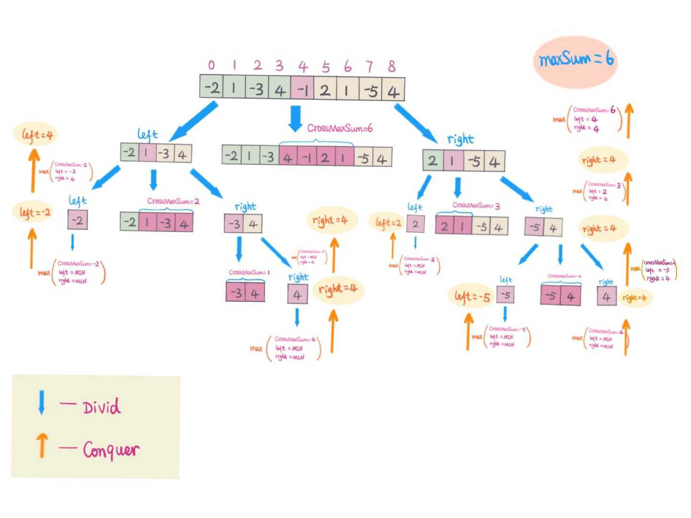
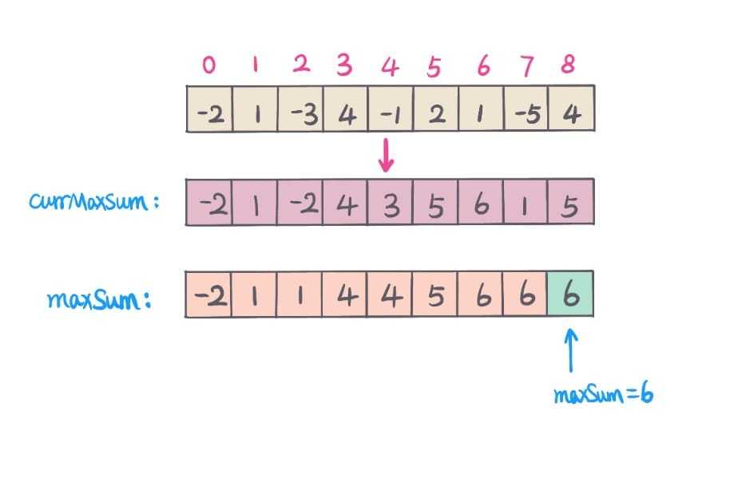

# 一文看懂《最大子序列和问题》

# 一文看懂《最大子序列和问题》

最大子序列和是一道经典的算法题， leetcode 也有原题《53.maximum-sum-subarray》，今天我们就来彻底攻克它。

## 题目描述

求取数组中最大连续子序列和，例如给定数组为 A = \[1， 3， -2， 4， -5\]， 则最大连续子序列和为 6，即 1 + 3 +（-2）+ 4 = 6。 去

首先我们来明确一下题意。

- 题目说的子数组是连续的
- 题目只需要求和，不需要返回子数组的具体位置。
- 数组中的元素是整数，但是可能是正数，负数和 0。
- 子序列的最小长度为 1。

比如：

- 对于数组 \[1, -2, 3, 5, -3, 2\], 应该返回 3 + 5 = 8
- 对于数组 \[0, -2, 3, 5, -1, 2\], 应该返回 3 + 5 + -1 + 2 = 9
- 对于数组 \[-9, -2, -3, -5, -3\], 应该返回 -2

## 解法一 - 暴力法（超时法）

一般情况下，先从暴力解分析，然后再进行一步步的优化。

### 思路

我们来试下最直接的方法，就是计算所有的子序列的和，然后取出最大值。 记 Sum\[i,....,j\]为数组 A 中第 i 个元素到第 j 个元素的和，其中 0 <= i <= j < n， 遍历所有可能的 Sum\[i,....,j\] 即可。

我们去枚举以 0,1,2...n-1 开头的所有子序列即可， 对于每一个开头的子序列，我们都去枚举从当前开始到 n-1 的所有情况。

这种做法的时间复杂度为 O(N^2), 空间复杂度为 O(1)。

### 代码

JavaScript:

```
<pre class="calibre18">```
<span class="hljs-function"><span class="hljs-keyword">function</span> <span class="hljs-title">LSS</span>(<span class="hljs-params">list</span>) </span>{
  <span class="hljs-keyword">const</span> len = list.length;
  <span class="hljs-keyword">let</span> max = -<span class="hljs-params">Number</span>.MAX_VALUE;
  <span class="hljs-keyword">let</span> sum = <span class="hljs-params">0</span>;
  <span class="hljs-keyword">for</span> (<span class="hljs-keyword">let</span> i = <span class="hljs-params">0</span>; i < len; i++) {
    sum = <span class="hljs-params">0</span>;
    <span class="hljs-keyword">for</span> (<span class="hljs-keyword">let</span> j = i; j < len; j++) {
      sum += list[j];
      <span class="hljs-keyword">if</span> (sum > max) {
        max = sum;
      }
    }
  }

  <span class="hljs-keyword">return</span> max;
}

```
```

Java：

```
<pre class="calibre18">```
<span class="hljs-class"><span class="hljs-keyword">class</span> <span class="hljs-title">MaximumSubarrayPrefixSum</span> </span>{
  <span class="hljs-function"><span class="hljs-keyword">public</span> <span class="hljs-keyword">int</span> <span class="hljs-title">maxSubArray</span><span class="hljs-params">(<span class="hljs-keyword">int</span>[] nums)</span> </span>{
      <span class="hljs-keyword">int</span> len = nums.length;
      <span class="hljs-keyword">int</span> maxSum = Integer.MIN_VALUE;
      <span class="hljs-keyword">int</span> sum = <span class="hljs-params">0</span>;
      <span class="hljs-keyword">for</span> (<span class="hljs-keyword">int</span> i = <span class="hljs-params">0</span>; i < len; i++) {
        sum = <span class="hljs-params">0</span>;
        <span class="hljs-keyword">for</span> (<span class="hljs-keyword">int</span> j = i; j < len; j++) {
          sum += nums[j];
          maxSum = Math.max(maxSum, sum);
        }
      }
      <span class="hljs-keyword">return</span> maxSum;
  }
}

```
```

Python 3:

```
<pre class="calibre18">```
<span class="hljs-keyword">import</span> sys
<span class="hljs-class"><span class="hljs-keyword">class</span> <span class="hljs-title">Solution</span>:</span>
    <span class="hljs-function"><span class="hljs-keyword">def</span> <span class="hljs-title">maxSubArray</span><span class="hljs-params">(self, nums: List[int])</span> -> int:</span>
        n = len(nums)
        maxSum = -sys.maxsize
        sum = <span class="hljs-params">0</span>
        <span class="hljs-keyword">for</span> i <span class="hljs-keyword">in</span> range(n):
            sum = <span class="hljs-params">0</span>
            <span class="hljs-keyword">for</span> j <span class="hljs-keyword">in</span> range(i, n):
                sum += nums[j]
                maxSum = max(maxSum, sum)

        <span class="hljs-keyword">return</span> maxSum

```
```

空间复杂度非常理想，但是时间复杂度有点高。怎么优化呢？我们来看下下一个解法。

## 解法二 - 分治法

### 思路

我们来分析一下这个问题， 我们先把数组平均分成左右两部分。

此时有三种情况：

- 最大子序列全部在数组左部分
- 最大子序列全部在数组右部分
- 最大子序列横跨左右数组

对于前两种情况，我们相当于将原问题转化为了规模更小的同样问题。

对于第三种情况，由于已知循环的起点（即中点），我们只需要进行一次循环，分别找出 左边和右边的最大子序列即可。

所以一个思路就是我们每次都对数组分成左右两部分，然后分别计算上面三种情况的最大子序列和， 取出最大的即可。

举例说明，如下图：

(by [snowan](https://github.com/snowan))

这种做法的时间复杂度为 O(N\*logN), 空间复杂度为 O(1)。

### 代码

JavaScript:

```
<pre class="calibre18">```
<span class="hljs-function"><span class="hljs-keyword">function</span> <span class="hljs-title">helper</span>(<span class="hljs-params">list, m, n</span>) </span>{
  <span class="hljs-keyword">if</span> (m === n) <span class="hljs-keyword">return</span> list[m];
  <span class="hljs-keyword">let</span> sum = <span class="hljs-params">0</span>;
  <span class="hljs-keyword">let</span> lmax = -<span class="hljs-params">Number</span>.MAX_VALUE;
  <span class="hljs-keyword">let</span> rmax = -<span class="hljs-params">Number</span>.MAX_VALUE;
  <span class="hljs-keyword">const</span> mid = ((n - m) >> <span class="hljs-params">1</span>) + m;
  <span class="hljs-keyword">const</span> l = helper(list, m, mid);
  <span class="hljs-keyword">const</span> r = helper(list, mid + <span class="hljs-params">1</span>, n);
  <span class="hljs-keyword">for</span> (<span class="hljs-keyword">let</span> i = mid; i >= m; i--) {
    sum += list[i];
    <span class="hljs-keyword">if</span> (sum > lmax) lmax = sum;
  }

  sum = <span class="hljs-params">0</span>;

  <span class="hljs-keyword">for</span> (<span class="hljs-keyword">let</span> i = mid + <span class="hljs-params">1</span>; i <= n; i++) {
    sum += list[i];
    <span class="hljs-keyword">if</span> (sum > rmax) rmax = sum;
  }

  <span class="hljs-keyword">return</span> <span class="hljs-params">Math</span>.max(l, r, lmax + rmax);
}

<span class="hljs-function"><span class="hljs-keyword">function</span> <span class="hljs-title">LSS</span>(<span class="hljs-params">list</span>) </span>{
  <span class="hljs-keyword">return</span> helper(list, <span class="hljs-params">0</span>, list.length - <span class="hljs-params">1</span>);
}

```
```

Java:

```
<pre class="calibre18">```
<span class="hljs-class"><span class="hljs-keyword">class</span> <span class="hljs-title">MaximumSubarrayDivideConquer</span> </span>{
  <span class="hljs-function"><span class="hljs-keyword">public</span> <span class="hljs-keyword">int</span> <span class="hljs-title">maxSubArrayDividConquer</span><span class="hljs-params">(<span class="hljs-keyword">int</span>[] nums)</span> </span>{
      <span class="hljs-keyword">if</span> (nums == <span class="hljs-keyword">null</span> || nums.length == <span class="hljs-params">0</span>) <span class="hljs-keyword">return</span> <span class="hljs-params">0</span>;
      <span class="hljs-keyword">return</span> helper(nums, <span class="hljs-params">0</span>, nums.length - <span class="hljs-params">1</span>);
    }
    <span class="hljs-function"><span class="hljs-keyword">private</span> <span class="hljs-keyword">int</span> <span class="hljs-title">helper</span><span class="hljs-params">(<span class="hljs-keyword">int</span>[] nums, <span class="hljs-keyword">int</span> l, <span class="hljs-keyword">int</span> r)</span> </span>{
      <span class="hljs-keyword">if</span> (l > r) <span class="hljs-keyword">return</span> Integer.MIN_VALUE;
      <span class="hljs-keyword">int</span> mid = (l + r) >>> <span class="hljs-params">1</span>;
      <span class="hljs-keyword">int</span> left = helper(nums, l, mid - <span class="hljs-params">1</span>);
      <span class="hljs-keyword">int</span> right = helper(nums, mid + <span class="hljs-params">1</span>, r);
      <span class="hljs-keyword">int</span> leftMaxSum = <span class="hljs-params">0</span>;
      <span class="hljs-keyword">int</span> sum = <span class="hljs-params">0</span>;
      <span class="hljs-title">// left surfix maxSum start from index mid - 1 to l</span>
      <span class="hljs-keyword">for</span> (<span class="hljs-keyword">int</span> i = mid - <span class="hljs-params">1</span>; i >= l; i--) {
        sum += nums[i];
        leftMaxSum = Math.max(leftMaxSum, sum);
      }
      <span class="hljs-keyword">int</span> rightMaxSum = <span class="hljs-params">0</span>;
      sum = <span class="hljs-params">0</span>;
      <span class="hljs-title">// right prefix maxSum start from index mid + 1 to r</span>
      <span class="hljs-keyword">for</span> (<span class="hljs-keyword">int</span> i = mid + <span class="hljs-params">1</span>; i <= r; i++) {
        sum += nums[i];
        rightMaxSum = Math.max(sum, rightMaxSum);
      }
      <span class="hljs-title">// max(left, right, crossSum)</span>
      <span class="hljs-keyword">return</span> Math.max(leftMaxSum + rightMaxSum + nums[mid], Math.max(left, right));
    }
}

```
```

Python 3 :

```
<pre class="calibre18">```
<span class="hljs-keyword">import</span> sys
<span class="hljs-class"><span class="hljs-keyword">class</span> <span class="hljs-title">Solution</span>:</span>
    <span class="hljs-function"><span class="hljs-keyword">def</span> <span class="hljs-title">maxSubArray</span><span class="hljs-params">(self, nums: List[int])</span> -> int:</span>
        <span class="hljs-keyword">return</span> self.helper(nums, <span class="hljs-params">0</span>, len(nums) - <span class="hljs-params">1</span>)
    <span class="hljs-function"><span class="hljs-keyword">def</span> <span class="hljs-title">helper</span><span class="hljs-params">(self, nums, l, r)</span>:</span>
        <span class="hljs-keyword">if</span> l > r:
            <span class="hljs-keyword">return</span> -sys.maxsize
        mid = (l + r) // <span class="hljs-params">2</span>
        left = self.helper(nums, l, mid - <span class="hljs-params">1</span>)
        right = self.helper(nums, mid + <span class="hljs-params">1</span>, r)
        left_suffix_max_sum = right_prefix_max_sum = <span class="hljs-params">0</span>
        sum = <span class="hljs-params">0</span>
        <span class="hljs-keyword">for</span> i <span class="hljs-keyword">in</span> reversed(range(l, mid)):
            sum += nums[i]
            left_suffix_max_sum = max(left_suffix_max_sum, sum)
        sum = <span class="hljs-params">0</span>
        <span class="hljs-keyword">for</span> i <span class="hljs-keyword">in</span> range(mid + <span class="hljs-params">1</span>, r + <span class="hljs-params">1</span>):
            sum += nums[i]
            right_prefix_max_sum = max(right_prefix_max_sum, sum)
        cross_max_sum = left_suffix_max_sum + right_prefix_max_sum + nums[mid]
        <span class="hljs-keyword">return</span> max(cross_max_sum, left, right)

```
```

## 解法三 - 动态规划

### 思路

我们来思考一下这个问题， 看能不能将其拆解为规模更小的同样问题，并且能找出 递推关系。

我们不妨假设问题 Q(list, i) 表示 list 中以索引 i 结尾的情况下最大子序列和， 那么原问题就转化为 Q(list, i), 其中 i = 0,1,2...n-1 中的最大值。

我们继续来看下递归关系，即 Q(list, i)和 Q(list, i - 1)的关系， 即如何根据 Q(list, i - 1) 推导出 Q(list, i)。

如果已知 Q(list, i - 1)， 我们可以将问题分为两种情况，即以索引为 i 的元素终止， 或者只有一个索引为 i 的元素。

- 如果以索引为 i 的元素终止， 那么就是 Q(list, i - 1) + list\[i\]
- 如果只有一个索引为 i 的元素，那么就是 list\[i\]

分析到这里，递推关系就很明朗了，即`Q(list, i) = Math.max(0, Q(list, i - 1)) + list[i]`

举例说明，如下图：

(by [snowan](https://github.com/snowan))

这种算法的时间复杂度 O(N), 空间复杂度为 O(1)

### 代码

JavaScript:

```
<pre class="calibre18">```
<span class="hljs-function"><span class="hljs-keyword">function</span> <span class="hljs-title">LSS</span>(<span class="hljs-params">list</span>) </span>{
  <span class="hljs-keyword">const</span> len = list.length;
  <span class="hljs-keyword">let</span> max = list[<span class="hljs-params">0</span>];
  <span class="hljs-keyword">for</span> (<span class="hljs-keyword">let</span> i = <span class="hljs-params">1</span>; i < len; i++) {
    list[i] = <span class="hljs-params">Math</span>.max(<span class="hljs-params">0</span>, list[i - <span class="hljs-params">1</span>]) + list[i];
    <span class="hljs-keyword">if</span> (list[i] > max) max = list[i];
  }

  <span class="hljs-keyword">return</span> max;
}

```
```

Java:

```
<pre class="calibre18">```
<span class="hljs-class"><span class="hljs-keyword">class</span> <span class="hljs-title">MaximumSubarrayDP</span> </span>{
  <span class="hljs-function"><span class="hljs-keyword">public</span> <span class="hljs-keyword">int</span> <span class="hljs-title">maxSubArray</span><span class="hljs-params">(<span class="hljs-keyword">int</span>[] nums)</span> </span>{
     <span class="hljs-keyword">int</span> currMaxSum = nums[<span class="hljs-params">0</span>];
     <span class="hljs-keyword">int</span> maxSum = nums[<span class="hljs-params">0</span>];
     <span class="hljs-keyword">for</span> (<span class="hljs-keyword">int</span> i = <span class="hljs-params">1</span>; i < nums.length; i++) {
       currMaxSum = Math.max(currMaxSum + nums[i], nums[i]);
       maxSum = Math.max(maxSum, currMaxSum);
     }
     <span class="hljs-keyword">return</span> maxSum;
  }
}

```
```

Python 3:

```
<pre class="calibre18">```
<span class="hljs-class"><span class="hljs-keyword">class</span> <span class="hljs-title">Solution</span>:</span>
    <span class="hljs-function"><span class="hljs-keyword">def</span> <span class="hljs-title">maxSubArray</span><span class="hljs-params">(self, nums: List[int])</span> -> int:</span>
        n = len(nums)
        max_sum_ending_curr_index = max_sum = nums[<span class="hljs-params">0</span>]
        <span class="hljs-keyword">for</span> i <span class="hljs-keyword">in</span> range(<span class="hljs-params">1</span>, n):
            max_sum_ending_curr_index = max(max_sum_ending_curr_index + nums[i], nums[i])
            max_sum = max(max_sum_ending_curr_index, max_sum)

        <span class="hljs-keyword">return</span> max_sum

```
```

## 解法四 - 数学分析

### 思路

我们来通过数学分析来看一下这个题目。

我们定义函数 S(i) ，它的功能是计算以 0（包括 0）开始加到 i（包括 i）的值。

那么 S(j) - S(i - 1) 就等于 从 i 开始（包括 i）加到 j（包括 j）的值。

我们进一步分析，实际上我们只需要遍历一次计算出所有的 S(i), 其中 i 等于 0,1,2....,n-1。 然后我们再减去之前的 S(k),其中 k 等于 0，1，i - 1，中的最小值即可。 因此我们需要 用一个变量来维护这个最小值，还需要一个变量维护最大值。

这种算法的时间复杂度 O(N), 空间复杂度为 O(1)。

其实很多题目，都有这样的思想， 比如之前的《每日一题 - 电梯问题》。

### 代码

JavaScript:

```
<pre class="calibre18">```
<span class="hljs-function"><span class="hljs-keyword">function</span> <span class="hljs-title">LSS</span>(<span class="hljs-params">list</span>) </span>{
  <span class="hljs-keyword">const</span> len = list.length;
  <span class="hljs-keyword">let</span> max = list[<span class="hljs-params">0</span>];
  <span class="hljs-keyword">let</span> min = <span class="hljs-params">0</span>;
  <span class="hljs-keyword">let</span> sum = <span class="hljs-params">0</span>;
  <span class="hljs-keyword">for</span> (<span class="hljs-keyword">let</span> i = <span class="hljs-params">0</span>; i < len; i++) {
    sum += list[i];
    <span class="hljs-keyword">if</span> (sum - min > max) max = sum - min;
    <span class="hljs-keyword">if</span> (sum < min) {
      min = sum;
    }
  }

  <span class="hljs-keyword">return</span> max;
}

```
```

Java:

```
<pre class="calibre18">```
<span class="hljs-class"><span class="hljs-keyword">class</span> <span class="hljs-title">MaxSumSubarray</span> </span>{
  <span class="hljs-function"><span class="hljs-keyword">public</span> <span class="hljs-keyword">int</span> <span class="hljs-title">maxSubArray3</span><span class="hljs-params">(<span class="hljs-keyword">int</span>[] nums)</span> </span>{
      <span class="hljs-keyword">int</span> maxSum = nums[<span class="hljs-params">0</span>];
      <span class="hljs-keyword">int</span> sum = <span class="hljs-params">0</span>;
      <span class="hljs-keyword">int</span> minSum = <span class="hljs-params">0</span>;
      <span class="hljs-keyword">for</span> (<span class="hljs-keyword">int</span> num : nums) {
        <span class="hljs-title">// prefix Sum</span>
        sum += num;
        <span class="hljs-title">// update maxSum</span>
        maxSum = Math.max(maxSum, sum - minSum);
        <span class="hljs-title">// update minSum</span>
        minSum = Math.min(minSum, sum);
      }
      <span class="hljs-keyword">return</span> maxSum;
  }
}

```
```

Python 3:

```
<pre class="calibre18">```
<span class="hljs-class"><span class="hljs-keyword">class</span> <span class="hljs-title">Solution</span>:</span>
    <span class="hljs-function"><span class="hljs-keyword">def</span> <span class="hljs-title">maxSubArray</span><span class="hljs-params">(self, nums: List[int])</span> -> int:</span>
        n = len(nums)
        maxSum = nums[<span class="hljs-params">0</span>]
        minSum = sum = <span class="hljs-params">0</span>
        <span class="hljs-keyword">for</span> i <span class="hljs-keyword">in</span> range(n):
            sum += nums[i]
            maxSum = max(maxSum, sum - minSum)
            minSum = min(minSum, sum)

        <span class="hljs-keyword">return</span> maxSum

```
```

## 总结

我们使用四种方法解决了`《最大子序列和问题》`, 并详细分析了各个解法的思路以及复杂度，相信下次你碰到相同或者类似的问题 的时候也能够发散思维，做到`一题多解，多题一解`。

实际上，我们只是求出了最大的和，如果题目进一步要求出最大子序列和的子序列呢？ 如果要题目允许不连续呢？ 我们又该如何思考和变通？如何将数组改成二维，求解最大矩阵和怎么计算？ 这些问题留给读者自己来思考。