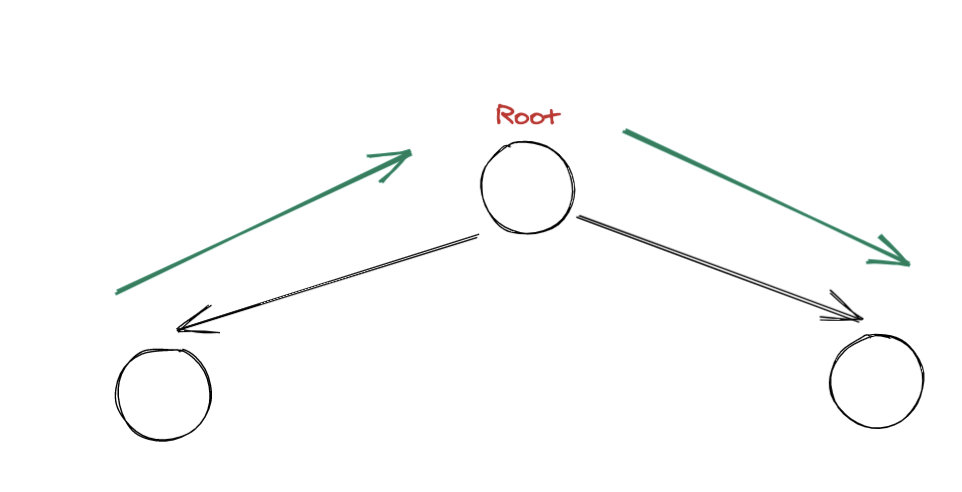
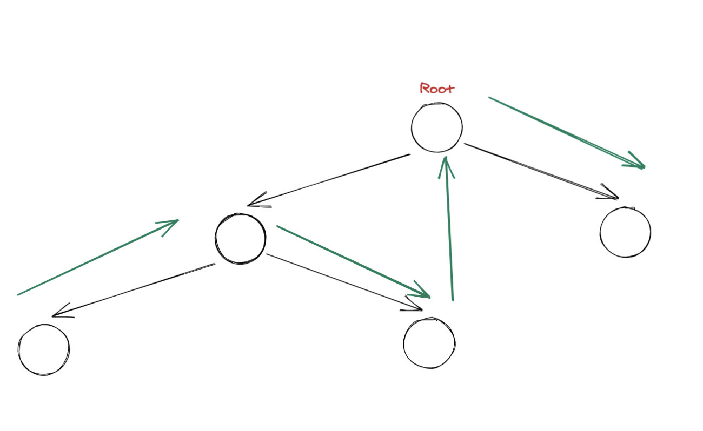

# 面试题 17.12. BiNode

# 题目地址（面试题 17.12. BiNode）

<https://leetcode-cn.com/problems/binode-lcci/>

## 题目描述

```
<pre class="calibre18">```
二叉树数据结构TreeNode可用来表示单向链表（其中left置空，right为下一个链表节点）。实现一个方法，把二叉搜索树转换为单向链表，要求依然符合二叉搜索树的性质，转换操作应是原址的，也就是在原始的二叉搜索树上直接修改。

返回转换后的单向链表的头节点。

注意：本题相对原题稍作改动


示例：

输入： [4,2,5,1,3,null,6,0]
输出： [0,null,1,null,2,null,3,null,4,null,5,null,6]
提示：

节点数量不会超过 100000。

```
```

## 前置知识

- 二叉查找树
- 递归
- [二叉树的遍历](binary-tree-traversal.html)

## 公司

- 暂无

## 思路

实际上这就是一个考察二叉树遍历 + 二叉查找树性质的题目。需要注意的是指针操作，这一点和链表反转系列题目是一样的。

首先我们要知道一个性质： 对于一个二叉查找树来说，其中序遍历结果是一个有序数组。 而题目要求你输出的恰好就是有序数组（虽然没有明说， 不过从测试用例也可以看出）。

因此一个思路就是中序遍历， 边遍历边改变指针即可。 这里有两个注意点:

1. 指针操作小心死循环
2. 你需要返回的是最左下角的节点，而不是题目给的 root

对于第一个问题， 其实只要注意操作指针的顺序即可。对于第二个问题，我用了一个黑科技，让代码看起来简洁又高效。如果不懂的话， 你也可以换个朴素的写法。

让我们进入正题。

其中绿色是我们要增加的连线，而黑色是是原本的连线。



我们再来看一个复杂一点的：



实际上，不管多么复杂。 我们只需要进行一次**中序遍历**，同时记录前驱节点。然后操作修改前驱节点和当前节点的指针即可，整个过程就好像是链表反转。

核心代码（假设 pre 我们已经正确计算出了）：

```
<pre class="calibre18">```
cur.left = <span class="hljs-keyword">None</span>
pre.right = cur
pre = cur

```
```

剩下的就是如何计算 pre，这个也不难，直接看代码：

```
<pre class="calibre18">```
self.pre = <span class="hljs-keyword">None</span>
<span class="hljs-function"><span class="hljs-keyword">def</span> <span class="hljs-title">dfs</span><span class="hljs-params">(root)</span>:</span>
    dfs(root.left)
    <span class="hljs-title"># 上面的指针改变逻辑写到这里</span>
    self.pre = root
    dfs(root.right)

```
```

问题得以解决。

这里还有最后一个问题就是返回值，题目要返回的实际上是最左下角的值。而我用了一个黑科技的方法（注意看注释）:

```
<pre class="calibre18">```
self.pre = self.ans = TreeNode(<span class="hljs-params">-1</span>)
<span class="hljs-function"><span class="hljs-keyword">def</span> <span class="hljs-title">dfs</span><span class="hljs-params">(root)</span>:</span>
   <span class="hljs-keyword">if</span> <span class="hljs-keyword">not</span> root: <span class="hljs-keyword">return</span>
   dfs(root.left)
   root.left = <span class="hljs-keyword">None</span>
   self.pre.right = root
   <span class="hljs-title"># 当第一次执行到下面这一行代码，恰好是在最左下角， 这个时候 self.pre = root 就切断了 self.pre 和 self.ans 的联系</span>
   <span class="hljs-title"># 之后 self.pre 的变化都不会体现到 self.ans 上。</span>
   <span class="hljs-title"># 直观上来说就是 self.ans 在遍历到最左下角的时候下车了</span>
   <span class="hljs-title"># 因此最后返回 self.ans 即可</span>
   self.pre = root
   dfs(root.right)
dfs(root)
<span class="hljs-keyword">return</span> self.ans.right

```
```

## 关键点

- 指针操作
- 返回值的处理

## 代码

```
<pre class="calibre18">```
<span class="hljs-class"><span class="hljs-keyword">class</span> <span class="hljs-title">Solution</span>:</span>
    <span class="hljs-function"><span class="hljs-keyword">def</span> <span class="hljs-title">convertBiNode</span><span class="hljs-params">(self, root)</span>:</span>
        self.pre = self.ans = TreeNode(<span class="hljs-params">-1</span>)
        <span class="hljs-function"><span class="hljs-keyword">def</span> <span class="hljs-title">dfs</span><span class="hljs-params">(root)</span>:</span>
            <span class="hljs-keyword">if</span> <span class="hljs-keyword">not</span> root: <span class="hljs-keyword">return</span>
            dfs(root.left)
            root.left = <span class="hljs-keyword">None</span>
            self.pre.right = root
            self.pre = root
            dfs(root.right)
        dfs(root)
        <span class="hljs-keyword">return</span> self.ans.right

```
```

**复杂度分析**

- 时间复杂度：O(N)O(N)O(N)，其中 N 为树的节点总数。
- 空间复杂度：O(h)O(h)O(h)，其中 h 为树的高度。

## 相关题目

- [206.reverse-linked-list](206.reverse-linked-list.html)
- [92.reverse-linked-list-ii](92.reverse-linked-list-ii.html)
- [25.reverse-nodes-in-k-groups-cn](25.reverse-nodes-in-k-groups-cn.md)

大家也可以关注我的公众号《力扣加加》获取更多更新鲜的 LeetCode 题解

