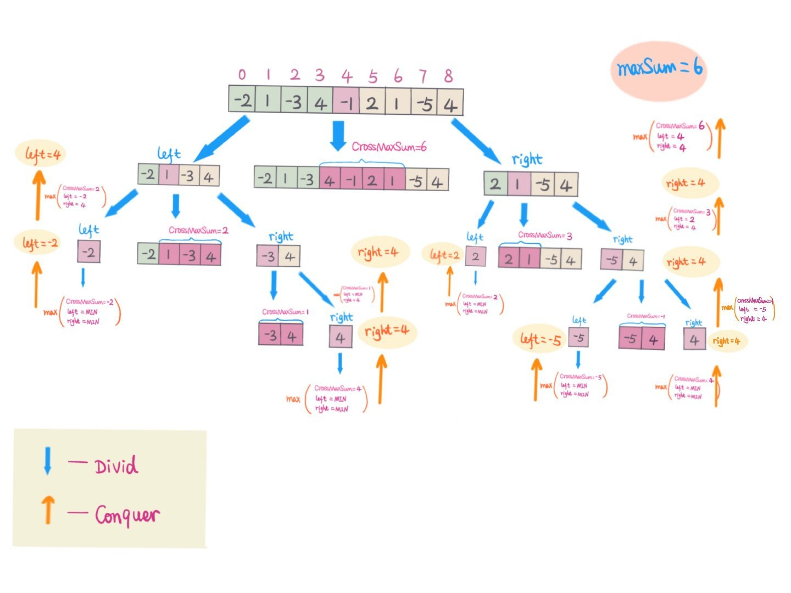
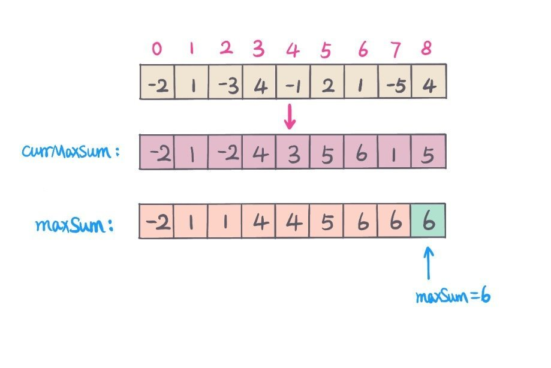

# 0053. 最大子序和

## 题目地址(53. 最大子序和)

<https://leetcode-cn.com/problems/maximum-subarray/>

## 题目描述

```
<pre class="calibre18">```
给定一个整数数组 nums ，找到一个具有最大和的连续子数组（子数组最少包含一个元素），返回其最大和。

示例:

输入: [-2,1,-3,4,-1,2,1,-5,4]
输出: 6
解释: 连续子数组 [4,-1,2,1] 的和最大，为 6。
进阶:

如果你已经实现复杂度为 O(n) 的解法，尝试使用更为精妙的分治法求解。

```
```

## 前置知识

- [滑动窗口](https://github.com/azl397985856/leetcode/blob/master/thinkings/slide-window.md)
- [动态规划](https://github.com/azl397985856/leetcode/blob/master/thinkings/dynamic-programming.md)

## 公司

- 阿里
- 百度
- 字节
- 腾讯
- bloomberg
- linkedin
- microsoft

## 公司

- 阿里、百度、字节、腾讯

## 思路

这道题求解连续最大子序列和，以下从时间复杂度角度分析不同的解题思路。

#### 解法一 - 暴力解 （暴力出奇迹， 噢耶！）

一般情况下，先从暴力解分析，然后再进行一步步的优化。

**原始暴力解：**（超时）

求子序列和，那么我们要知道子序列的首尾位置，然后计算首尾之间的序列和。用 2 个 for 循环可以枚举所有子序列的首尾位置。 然后用一个 for 循环求解序列和。这里时间复杂度太高，`O(n^3)`.

**复杂度分析**

- 时间复杂度：O(N3)O(N ^ 3)O(N3), 其中 N 是数组长度
- 空间复杂度：O(1)O(1)O(1)

#### 解法二 - 前缀和 + 暴力解

**优化暴力解：** (震惊，居然 AC 了）

在暴力解的基础上，用前缀和我们可以优化到暴力解`O(n^2)`, 这里以空间换时间。 这里可以使用原数组表示`prefixSum`, 省空间。

求序列和可以用前缀和（`prefixSum`) 来优化，给定子序列的首尾位置`（l, r),`那么序列和 `subarraySum=prefixSum[r] - prefixSum[l - 1];`用一个全局变量`maxSum`, 比较每次求解的子序列和，`maxSum = max(maxSum, subarraySum)`.

**复杂度分析**

- 时间复杂度：O(N2)O(N ^ 2)O(N2), 其中 N 是数组长度
- 空间复杂度：O(N)O(N)O(N)

> 如果用更改原数组表示前缀和数组，空间复杂度降为`O(1)`

但是时间复杂度还是太高，还能不能更优化。答案是可以，前缀和还可以优化到`O(n)`.

#### 解法三 - 优化前缀和 - from [**@lucifer**](https://github.com/azl397985856)

我们定义函数`S(i)` ，它的功能是计算以 `0（包括 0）`开始加到 `i（包括 i）`的值。

那么 `S(j) - S(i - 1)` 就等于 从 `i` 开始（包括 i）加到 `j`（包括 j）的值。

我们进一步分析，实际上我们只需要遍历一次计算出所有的 `S(i)`, 其中 `i = 0,1,2....,n-1。`然后我们再减去之前的`S(k)`,其中 `k = 0，1，i - 1`，中的最小值即可。 因此我们需要 用一个变量来维护这个最小值，还需要一个变量维护最大值。

**复杂度分析**

- 时间复杂度：O(N)O(N)O(N), 其中 N 是数组长度
- 空间复杂度：O(1)O(1)O(1)

#### 解法四 - [分治法](https://www.wikiwand.com/zh-hans/%E5%88%86%E6%B2%BB%E6%B3%95)

我们把数组`nums`以中间位置（`m`)分为左（`left`)右(`right`)两部分. 那么有， `left = nums[0]...nums[m - 1]` 和 `right = nums[m + 1]...nums[n-1]`

最大子序列和的位置有以下三种情况：

1. 考虑中间元素`nums[m]`, 跨越左右两部分，这里从中间元素开始，往左求出后缀最大，往右求出前缀最大, 保持连续性。
2. 不考虑中间元素，最大子序列和出现在左半部分，递归求解左边部分最大子序列和
3. 不考虑中间元素，最大子序列和出现在右半部分，递归求解右边部分最大子序列和

分别求出三种情况下最大子序列和，三者中最大值即为最大子序列和。

举例说明，如下图： 

**复杂度分析**

- 时间复杂度：O(NlogN)O(NlogN)O(NlogN), 其中 N 是数组长度
- 空间复杂度：O(logN)O(logN)O(logN)

#### 解法五 - [动态规划](https://www.wikiwand.com/zh-hans/%E5%8A%A8%E6%80%81%E8%A7%84%E5%88%92)

动态规划的难点在于找到状态转移方程，

`dp[i] - 表示到当前位置 i 的最大子序列和`

状态转移方程为： `dp[i] = max(dp[i - 1] + nums[i], nums[i])`

初始化：`dp[0] = nums[0]`

从状态转移方程中，我们只关注前一个状态的值，所以不需要开一个数组记录位置所有子序列和，只需要两个变量，

`currMaxSum - 累计最大和到当前位置i`

`maxSum - 全局最大子序列和`:

- `currMaxSum = max(currMaxSum + nums[i], nums[i])`
- `maxSum = max(currMaxSum, maxSum)`

如图： 

**复杂度分析**

- 时间复杂度：O(N)O(N)O(N), 其中 N 是数组长度
- 空间复杂度：O(1)O(1)O(1)

## 关键点分析

1. 暴力解，列举所有组合子序列首尾位置的组合，求解最大的子序列和, 优化可以预先处理，得到前缀和
2. 分治法，每次从中间位置把数组分为左右中三部分， 分别求出左右中（这里中是包括中间元素的子序列）最大和。对左右分别深度递归，三者中最大值即为当前最大子序列和。
3. 动态规划，找到状态转移方程，求到当前位置最大和。

## 代码 (`Java/Python3/Javascript`)

#### 解法二 - 前缀和 + 暴力

*Java code*

```
<pre class="calibre18">```
<span class="hljs-class"><span class="hljs-keyword">class</span> <span class="hljs-title">MaximumSubarrayPrefixSum</span> </span>{
  <span class="hljs-function"><span class="hljs-keyword">public</span> <span class="hljs-keyword">int</span> <span class="hljs-title">maxSubArray</span><span class="hljs-params">(<span class="hljs-keyword">int</span>[] nums)</span> </span>{
      <span class="hljs-keyword">int</span> len = nums.length;
      <span class="hljs-keyword">int</span> maxSum = Integer.MIN_VALUE;
      <span class="hljs-keyword">int</span> sum = <span class="hljs-params">0</span>;
      <span class="hljs-keyword">for</span> (<span class="hljs-keyword">int</span> i = <span class="hljs-params">0</span>; i < len; i++) {
        sum = <span class="hljs-params">0</span>;
        <span class="hljs-keyword">for</span> (<span class="hljs-keyword">int</span> j = i; j < len; j++) {
          sum += nums[j];
          maxSum = Math.max(maxSum, sum);
        }
      }
      <span class="hljs-keyword">return</span> maxSum;
  }
}

```
```

*Python3 code*`(TLE)`

```
<pre class="calibre18">```
<span class="hljs-keyword">import</span> sys
<span class="hljs-class"><span class="hljs-keyword">class</span> <span class="hljs-title">Solution</span>:</span>
    <span class="hljs-function"><span class="hljs-keyword">def</span> <span class="hljs-title">maxSubArray</span><span class="hljs-params">(self, nums: List[int])</span> -> int:</span>
        n = len(nums)
        maxSum = -sys.maxsize
        sum = <span class="hljs-params">0</span>
        <span class="hljs-keyword">for</span> i <span class="hljs-keyword">in</span> range(n):
            sum = <span class="hljs-params">0</span>
            <span class="hljs-keyword">for</span> j <span class="hljs-keyword">in</span> range(i, n):
                sum += nums[j]
                maxSum = max(maxSum, sum)

        <span class="hljs-keyword">return</span> maxSum

```
```

*Javascript code* from [**@lucifer**](https://github.com/azl397985856)

```
<pre class="calibre18">```
<span class="hljs-function"><span class="hljs-keyword">function</span> <span class="hljs-title">LSS</span>(<span class="hljs-params">list</span>) </span>{
  <span class="hljs-keyword">const</span> len = list.length;
  <span class="hljs-keyword">let</span> max = -<span class="hljs-params">Number</span>.MAX_VALUE;
  <span class="hljs-keyword">let</span> sum = <span class="hljs-params">0</span>;
  <span class="hljs-keyword">for</span> (<span class="hljs-keyword">let</span> i = <span class="hljs-params">0</span>; i < len; i++) {
    sum = <span class="hljs-params">0</span>;
    <span class="hljs-keyword">for</span> (<span class="hljs-keyword">let</span> j = i; j < len; j++) {
      sum += list[j];
      <span class="hljs-keyword">if</span> (sum > max) {
        max = sum;
      }
    }
  }

  <span class="hljs-keyword">return</span> max;
}

```
```

#### 解法三 - 优化前缀和

*Java code*

```
<pre class="calibre18">```
<span class="hljs-class"><span class="hljs-keyword">class</span> <span class="hljs-title">MaxSumSubarray</span> </span>{
  <span class="hljs-function"><span class="hljs-keyword">public</span> <span class="hljs-keyword">int</span> <span class="hljs-title">maxSubArray3</span><span class="hljs-params">(<span class="hljs-keyword">int</span>[] nums)</span> </span>{
      <span class="hljs-keyword">int</span> maxSum = nums[<span class="hljs-params">0</span>];
      <span class="hljs-keyword">int</span> sum = <span class="hljs-params">0</span>;
      <span class="hljs-keyword">int</span> minSum = <span class="hljs-params">0</span>;
      <span class="hljs-keyword">for</span> (<span class="hljs-keyword">int</span> num : nums) {
        <span class="hljs-title">// prefix Sum</span>
        sum += num;
        <span class="hljs-title">// update maxSum</span>
        maxSum = Math.max(maxSum, sum - minSum);
        <span class="hljs-title">// update minSum</span>
        minSum = Math.min(minSum, sum);
      }
      <span class="hljs-keyword">return</span> maxSum;
  }
}

```
```

*Python3 code*

```
<pre class="calibre18">```
<span class="hljs-class"><span class="hljs-keyword">class</span> <span class="hljs-title">Solution</span>:</span>
    <span class="hljs-function"><span class="hljs-keyword">def</span> <span class="hljs-title">maxSubArray</span><span class="hljs-params">(self, nums: List[int])</span> -> int:</span>
        n = len(nums)
        maxSum = nums[<span class="hljs-params">0</span>]
        minSum = sum = <span class="hljs-params">0</span>
        <span class="hljs-keyword">for</span> i <span class="hljs-keyword">in</span> range(n):
            sum += nums[i]
            maxSum = max(maxSum, sum - minSum)
            minSum = min(minSum, sum)

        <span class="hljs-keyword">return</span> maxSum

```
```

*Javascript code* from [**@lucifer**](https://github.com/azl397985856)

```
<pre class="calibre18">```
<span class="hljs-function"><span class="hljs-keyword">function</span> <span class="hljs-title">LSS</span>(<span class="hljs-params">list</span>) </span>{
  <span class="hljs-keyword">const</span> len = list.length;
  <span class="hljs-keyword">let</span> max = list[<span class="hljs-params">0</span>];
  <span class="hljs-keyword">let</span> min = <span class="hljs-params">0</span>;
  <span class="hljs-keyword">let</span> sum = <span class="hljs-params">0</span>;
  <span class="hljs-keyword">for</span> (<span class="hljs-keyword">let</span> i = <span class="hljs-params">0</span>; i < len; i++) {
    sum += list[i];
    <span class="hljs-keyword">if</span> (sum - min > max) max = sum - min;
    <span class="hljs-keyword">if</span> (sum < min) {
      min = sum;
    }
  }

  <span class="hljs-keyword">return</span> max;
}

```
```

#### 解法四 - 分治法

*Java code*

```
<pre class="calibre18">```
<span class="hljs-class"><span class="hljs-keyword">class</span> <span class="hljs-title">MaximumSubarrayDivideConquer</span> </span>{
  <span class="hljs-function"><span class="hljs-keyword">public</span> <span class="hljs-keyword">int</span> <span class="hljs-title">maxSubArrayDividConquer</span><span class="hljs-params">(<span class="hljs-keyword">int</span>[] nums)</span> </span>{
      <span class="hljs-keyword">if</span> (nums == <span class="hljs-keyword">null</span> || nums.length == <span class="hljs-params">0</span>) <span class="hljs-keyword">return</span> <span class="hljs-params">0</span>;
      <span class="hljs-keyword">return</span> helper(nums, <span class="hljs-params">0</span>, nums.length - <span class="hljs-params">1</span>);
    }
    <span class="hljs-function"><span class="hljs-keyword">private</span> <span class="hljs-keyword">int</span> <span class="hljs-title">helper</span><span class="hljs-params">(<span class="hljs-keyword">int</span>[] nums, <span class="hljs-keyword">int</span> l, <span class="hljs-keyword">int</span> r)</span> </span>{
      <span class="hljs-keyword">if</span> (l > r) <span class="hljs-keyword">return</span> Integer.MIN_VALUE;
      <span class="hljs-keyword">int</span> mid = (l + r) >>> <span class="hljs-params">1</span>;
      <span class="hljs-keyword">int</span> left = helper(nums, l, mid - <span class="hljs-params">1</span>);
      <span class="hljs-keyword">int</span> right = helper(nums, mid + <span class="hljs-params">1</span>, r);
      <span class="hljs-keyword">int</span> leftMaxSum = <span class="hljs-params">0</span>;
      <span class="hljs-keyword">int</span> sum = <span class="hljs-params">0</span>;
      <span class="hljs-title">// left surfix maxSum start from index mid - 1 to l</span>
      <span class="hljs-keyword">for</span> (<span class="hljs-keyword">int</span> i = mid - <span class="hljs-params">1</span>; i >= l; i--) {
        sum += nums[i];
        leftMaxSum = Math.max(leftMaxSum, sum);
      }
      <span class="hljs-keyword">int</span> rightMaxSum = <span class="hljs-params">0</span>;
      sum = <span class="hljs-params">0</span>;
      <span class="hljs-title">// right prefix maxSum start from index mid + 1 to r</span>
      <span class="hljs-keyword">for</span> (<span class="hljs-keyword">int</span> i = mid + <span class="hljs-params">1</span>; i <= r; i++) {
        sum += nums[i];
        rightMaxSum = Math.max(sum, rightMaxSum);
      }
      <span class="hljs-title">// max(left, right, crossSum)</span>
      <span class="hljs-keyword">return</span> Math.max(leftMaxSum + rightMaxSum + nums[mid], Math.max(left, right));
    }
}

```
```

*Python3 code*

```
<pre class="calibre18">```
<span class="hljs-keyword">import</span> sys
<span class="hljs-class"><span class="hljs-keyword">class</span> <span class="hljs-title">Solution</span>:</span>
    <span class="hljs-function"><span class="hljs-keyword">def</span> <span class="hljs-title">maxSubArray</span><span class="hljs-params">(self, nums: List[int])</span> -> int:</span>
        <span class="hljs-keyword">return</span> self.helper(nums, <span class="hljs-params">0</span>, len(nums) - <span class="hljs-params">1</span>)
    <span class="hljs-function"><span class="hljs-keyword">def</span> <span class="hljs-title">helper</span><span class="hljs-params">(self, nums, l, r)</span>:</span>
        <span class="hljs-keyword">if</span> l > r:
            <span class="hljs-keyword">return</span> -sys.maxsize
        mid = (l + r) // <span class="hljs-params">2</span>
        left = self.helper(nums, l, mid - <span class="hljs-params">1</span>)
        right = self.helper(nums, mid + <span class="hljs-params">1</span>, r)
        left_suffix_max_sum = right_prefix_max_sum = <span class="hljs-params">0</span>
        sum = <span class="hljs-params">0</span>
        <span class="hljs-keyword">for</span> i <span class="hljs-keyword">in</span> reversed(range(l, mid)):
            sum += nums[i]
            left_suffix_max_sum = max(left_suffix_max_sum, sum)
        sum = <span class="hljs-params">0</span>
        <span class="hljs-keyword">for</span> i <span class="hljs-keyword">in</span> range(mid + <span class="hljs-params">1</span>, r + <span class="hljs-params">1</span>):
            sum += nums[i]
            right_prefix_max_sum = max(right_prefix_max_sum, sum)
        cross_max_sum = left_suffix_max_sum + right_prefix_max_sum + nums[mid]
        <span class="hljs-keyword">return</span> max(cross_max_sum, left, right)

```
```

*Javascript code* from [**@lucifer**](https://github.com/azl397985856)

```
<pre class="calibre18">```
<span class="hljs-function"><span class="hljs-keyword">function</span> <span class="hljs-title">helper</span>(<span class="hljs-params">list, m, n</span>) </span>{
  <span class="hljs-keyword">if</span> (m === n) <span class="hljs-keyword">return</span> list[m];
  <span class="hljs-keyword">let</span> sum = <span class="hljs-params">0</span>;
  <span class="hljs-keyword">let</span> lmax = -<span class="hljs-params">Number</span>.MAX_VALUE;
  <span class="hljs-keyword">let</span> rmax = -<span class="hljs-params">Number</span>.MAX_VALUE;
  <span class="hljs-keyword">const</span> mid = ((n - m) >> <span class="hljs-params">1</span>) + m;
  <span class="hljs-keyword">const</span> l = helper(list, m, mid);
  <span class="hljs-keyword">const</span> r = helper(list, mid + <span class="hljs-params">1</span>, n);
  <span class="hljs-keyword">for</span> (<span class="hljs-keyword">let</span> i = mid; i >= m; i--) {
    sum += list[i];
    <span class="hljs-keyword">if</span> (sum > lmax) lmax = sum;
  }

  sum = <span class="hljs-params">0</span>;

  <span class="hljs-keyword">for</span> (<span class="hljs-keyword">let</span> i = mid + <span class="hljs-params">1</span>; i <= n; i++) {
    sum += list[i];
    <span class="hljs-keyword">if</span> (sum > rmax) rmax = sum;
  }

  <span class="hljs-keyword">return</span> <span class="hljs-params">Math</span>.max(l, r, lmax + rmax);
}

<span class="hljs-function"><span class="hljs-keyword">function</span> <span class="hljs-title">LSS</span>(<span class="hljs-params">list</span>) </span>{
  <span class="hljs-keyword">return</span> helper(list, <span class="hljs-params">0</span>, list.length - <span class="hljs-params">1</span>);
}

```
```

#### 解法五 - 动态规划

*Java code*

```
<pre class="calibre18">```
<span class="hljs-class"><span class="hljs-keyword">class</span> <span class="hljs-title">MaximumSubarrayDP</span> </span>{
  <span class="hljs-function"><span class="hljs-keyword">public</span> <span class="hljs-keyword">int</span> <span class="hljs-title">maxSubArray</span><span class="hljs-params">(<span class="hljs-keyword">int</span>[] nums)</span> </span>{
     <span class="hljs-keyword">int</span> currMaxSum = nums[<span class="hljs-params">0</span>];
     <span class="hljs-keyword">int</span> maxSum = nums[<span class="hljs-params">0</span>];
     <span class="hljs-keyword">for</span> (<span class="hljs-keyword">int</span> i = <span class="hljs-params">1</span>; i < nums.length; i++) {
       currMaxSum = Math.max(currMaxSum + nums[i], nums[i]);
       maxSum = Math.max(maxSum, currMaxSum);
     }
     <span class="hljs-keyword">return</span> maxSum;
  }
}

```
```

*Python3 code*

```
<pre class="calibre18">```
<span class="hljs-class"><span class="hljs-keyword">class</span> <span class="hljs-title">Solution</span>:</span>
    <span class="hljs-function"><span class="hljs-keyword">def</span> <span class="hljs-title">maxSubArray</span><span class="hljs-params">(self, nums: List[int])</span> -> int:</span>
        n = len(nums)
        max_sum_ending_curr_index = max_sum = nums[<span class="hljs-params">0</span>]
        <span class="hljs-keyword">for</span> i <span class="hljs-keyword">in</span> range(<span class="hljs-params">1</span>, n):
            max_sum_ending_curr_index = max(max_sum_ending_curr_index + nums[i], nums[i])
            max_sum = max(max_sum_ending_curr_index, max_sum)

        <span class="hljs-keyword">return</span> max_sum

```
```

*Javascript code* from [**@lucifer**](https://github.com/azl397985856)

```
<pre class="calibre18">```
<span class="hljs-function"><span class="hljs-keyword">function</span> <span class="hljs-title">LSS</span>(<span class="hljs-params">list</span>) </span>{
  <span class="hljs-keyword">const</span> len = list.length;
  <span class="hljs-keyword">let</span> max = list[<span class="hljs-params">0</span>];
  <span class="hljs-keyword">for</span> (<span class="hljs-keyword">let</span> i = <span class="hljs-params">1</span>; i < len; i++) {
    list[i] = <span class="hljs-params">Math</span>.max(<span class="hljs-params">0</span>, list[i - <span class="hljs-params">1</span>]) + list[i];
    <span class="hljs-keyword">if</span> (list[i] > max) max = list[i];
  }

  <span class="hljs-keyword">return</span> max;
}

```
```

## 扩展

- 如果数组是二维数组，求最大子数组的和？
- 如果要求最大子序列的乘积？

## 相似题

- [Maximum Product Subarray](https://leetcode.com/problems/maximum-product-subarray/)
- [Longest Turbulent Subarray](https://leetcode.com/problems/longest-turbulent-subarray/)

大家对此有何看法，欢迎给我留言，我有时间都会一一查看回答。更多算法套路可以访问我的 LeetCode 题解仓库：<https://github.com/azl397985856/leetcode> 。 目前已经 37K star 啦。 大家也可以关注我的公众号《力扣加加》带你啃下算法这块硬骨头。

